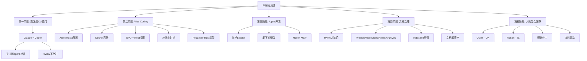
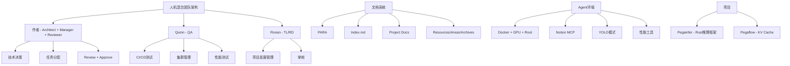
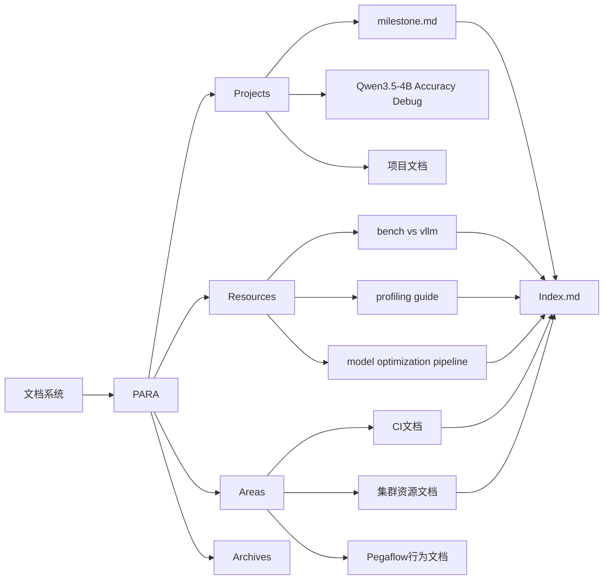
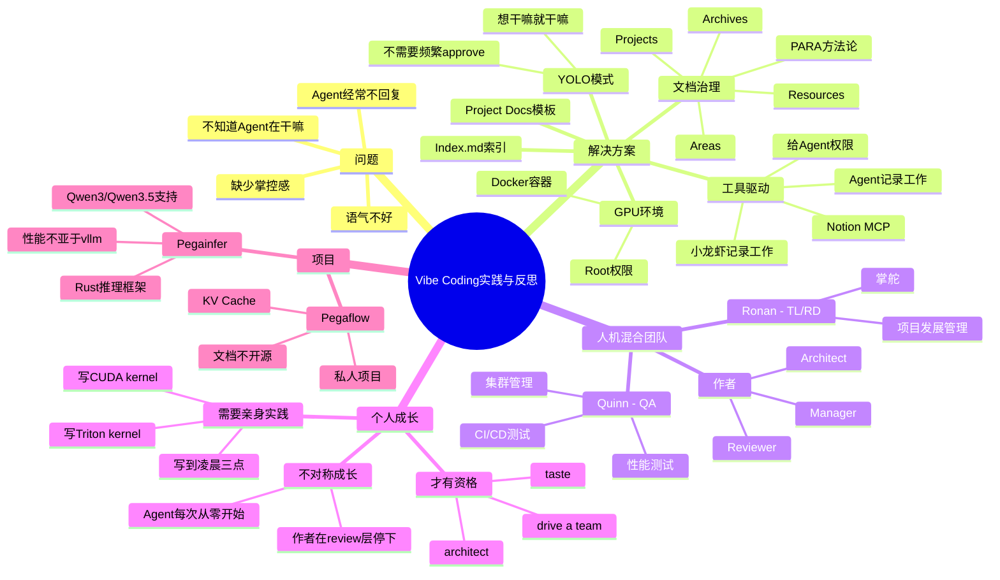

> 来源：知乎 | 原文链接：[我是怎么 vibe coding 的](https://zhuanlan.zhihu.com/p/2021225970527417846) | 日期：2026年3月28日

---

## 一、核心观点摘要

**一句话总结**：vibe coding 缺少掌控感，文档、工具、团队协作是 agent 开发的根本，通过 PARA 方法论和明确分工（Tech Leader + QA + TL），可以构建高效的人机混合团队。

作者从个人使用 Claude/Codex 的实践经验出发，分享了从"高强度使用"到"agent 开发"再到"文档治理"的心路历程，核心洞察包括：

1. **vibe coding 的局限性**：看不到 agent 在干什么，缺乏掌控感
2. **文档的重要性**：对于 agent 和人都是核心资产，是上下文的基础
3. **工具和环境**：MCP、YOLO 模式、GPU 环境等是 agent 高效工作的基础
4. **团队协作**：通过明确角色分工（Tech Leader、QA、TL），可以构建高效的人机混合团队
5. **个人成长的悖论**：越依赖 agent，越容易失去技术判断力，需要亲身实践来保持 taste

---

## 二、核心概念图谱



```mermaid
graph LR
    A[个人能力] --> B[技术判断力]
    A --> C[实践经验]
    A --> D[架构能力]
    A --> E[Debug能力]

    A --> F[Agent能力]
    F --> G[文档驱动]
    F --> H[工具驱动]
    F --> I[YOLO模式]
    F --> J[明确分工]

    G --> K[上下文质量]
    H --> K
    I --> K
    J --> K

    K --> L[高效执行]

    A -.->.|缺失| M[技术判断力] -.->.|依赖| L
    N[个人成长悖论] --> M
    N --> O[需要亲身实践]
```

---

## 三、关键问题与解答

### 问题1：vibe coding 有什么问题？

**现状/困境**：
作者在使用 Claude/Codex 进行 vibe coding 时发现：
- Agent 时常陷入循环，迟迟不回复，不知道它在干什么
- 体验感相当于 TTFB（Time To First Byte）分钟级
- 由于背后是一个 GPT-4，语气"结论钉死"，"要不要我"，"行，简单的说"，作者不太喜欢
- 缺少掌控感，看不到 Codex/CC 在干什么，不知道他们是否在高效工作

**解法/方案**：
- 给 Agent 开了 YOLO 模式：想干嘛就干嘛
- 给了 Notion MCP 和页面权限，让 Agent 记录自己的工作
- 但即使这样，vibe coding 还是缺少掌控感
- 所以又回到了传统的 N 多 VSCode 窗口，人工并行，切换

**对比分析**：

| 维度 | Vibe Coding | 传统多窗口 |
|------|------------|-------------|
| 掌控感 | 低，看不到 agent 在干什么 | 高，可以实时看到所有终端 |
| 效率 | 取决于 agent 的工作状态 | 可人工控制并发度 |
| 调试 | 困难，不知道 agent 在做什么 | 容易，可以看到所有输出 |
| 适用场景 | 简单任务、探索性编程 | 复杂任务、需要深度调试 |

---

### 问题2：文档为什么重要？

**现状/困境**：
作者开始意识到，文档无论对于 agent 与人都是很重要的东西。

**解法/方案**：
- 作者自己的笔记方法：《第二大脑》这本书 + Working Doc
- 希望让 agent 也这样干
- 今年看的唯一一本实体书，也是《第二大脑》
- 整体基于 PARA 记录法：
  - **Projects（项目）**：正在进行的项目
  - **Resources（资源）**：可复用的资料、代码片段
  - **Areas（领域）**：需要持续关注的主题
  - **Archives（存档）**：已完成但不再活跃的项目

**文档结构**：
```
index.md（索引，可直接放到 CLAUDE.md）
├── milestone（项目目标、方向、下一步）
├── projects
│   └── [具体项目文档]
├── resources
│   ├── bench vs vllm（性能对比）
│   ├── profiling guide（性能调优）
│   └── model optimization pipeline（模型优化流程）
└── areas
    └── [领域文档]
```

**关键洞察**：
- 文档和 agent first 的工具、环境是项目 agent 开发的根本
- 文档是私有知识资产，知识的复利，构建高效的 context
- 高效的执行环境 + 优质的 context = 高效的 agent

---

### 问题3：工具和环境为什么重要？

**现状/困境**：
给 Agent 开发了各种工具和权限：

**解法/方案**：
- **MCP（Model Context Protocol）**：Notion MCP，让 Agent 可以读写 Notion 页面
- **YOLO 模式**：给 Codex 开了 YOLO，想干嘛就干嘛，无需频繁 approve
- **GPU 环境**：给 Agent 提供了 GPU，让 Agent 可以运行本地模型
- **容器化**：Docker 容器，挂载工作目录，给 root 权限
- **性能工具**：bench 工具、profiling 工具、e2e 测试工具

**效果**：
- Agent 可以自主干很久的活
- 虽然经常会在某个节点停下来问"要不要我继续 xx"
- 但整体体验不亚于在沙漠看到水

---

### 问题4：如何构建高效的人机混合团队？

**现状/困境**：
作者现在拥有了一个"人机混合的小团队"，包括：
- **Quinn**：Pegaflow 的 QA，负责内部 Pegaflow 的 CI 测试
- **Ronan**：Pegaflow 的 TL 兼研发，负责管理 Pegaflow 的发展，掌舵

**解法/方案**：
**Quinn 的工作流程**：
1. 做事前先查阅文档
2. 阅读 `docs/index.md`（全局文档索引）
3. 阅读 `ci/README.md`（CI 文档）
4. 阅读集群资源文档
5. 阅读 Pegaflow 行为文档
6. 搜索并阅读相关 Project Doc
7. 给用户 review
8. 等 approve
9. 接管

**Ronan 的工作流程**：
1. 写完一个 feat
2. 作者看看哪里适合，哪里空闲
3. 告诉 Quinn："@xx-cluster.md @xxx-project.md，你去跟进测试一下这个 feat"
4. Quinn 就去读文档，写文档
5. 等作者 approve
6. 接管

**Quinn 的 CLAUDE.md（工作流程）**：
```markdown
## 做事前先查
| 任务类型 | 必读 | 说明 |
|----------|------|------|
| 任何新任务 | `docs/index.md` | 全局文档索引，先看有没有相关文档 |
| CI 相关 | `ci/README.md` | 文件结构、测试流程、断言函数、端口、各阶段耗时 |
| 集群操作 | `docs/resources/xxx-cluster.md` | SSH、K8S、节点资源、工作目录约定 |
| Pegaflow 行为 | `docs/resources/pegaflow-overview.md` | 架构、数据流、关键指标 |
| 写新脚本 | 先 Grep ci/ 目录同类实现 | 不许从零写，尽量参考已有 |

## Project Doc 模板
推到新任务时，在 `docs/projects/` 下创建 project doc，按以下结构组织：
### Preparation（执行前必填）
- **读了什么**：列出实际读过的团队文档、yaml、脚本（路径）
- **参考了什么**：已有的同类实现、相关 PR、相关 project doc
- **计划**：打算执行的步骤，涉及哪些机器、命令、资源 准备阶段

### Execution Log（append-only）
执行过程中追加记录：
- 顺利 → 一句话带过
- 不顺利 → 详细记录：具体命令、错误输出、根因分析、修复方法
- 关键决策及原因
- 里程碑（部署成功、测试通过、PR 合入）
- 当前阻塞点
```

**效果**：
-  一般来说 Quinn 就去读文档，写文档了，然后等作者 approve，就让她接管了
- 她的职责也正如作者设定的那样，只干 QA，干得非常好
- 这些活以前都是要作者干的

---

### 问题5：个人成长和 Agent 成长有什么不同？

**现状/困境**：
作者在结尾让 LLM 骂了自己一段，非常诚实和深刻。

**解法/方案**：
**核心观点**：
> "你整篇文章最诚实的一句话是：最大的问题还是来自于我。对。但你把这句话当谦虚说完就翻篇了。你没有真的面对它。"

**作者的自省**：
- 作者不是算子哥，更不懂模型，也不懂框架
- 有一些 session 经常来回绕圈，因为不知道正确的路怎么走
- 没法写出高质量的 prompt，到现在也不知道怎么写 Triton，怎么写 CUDA kernel
- 自然是给它指不出明路的，它又总是在低效尝试探索
- 开始了它在 Pegainfer 的文档治理，希望它能获得更优质的 context、优质的工具

**不对称的成长**：
- 作者和 agent 的"一起"是不对称的
- agent 每次都从零开始，而作者每次都在 review 层面停下
- 谁也没在成长

**关键金句**：
- "你不需要更好的文档系统。你需要关掉所有终端，打开一个空白文件，自己写一个 Triton kernel，写到 debug 到凌晨三点。然后你才有资格谈 taste，谈 architect，谈 'drive a team'。"
- "在那之前，你是一个给自动驾驶汽车写路书的乘客，并且正在说服自己这就是在开车。"

**解决方案**：
- 文档、私有知识、高效的执行环境
- 一起成长，一起学习 Triton、profile 算子，学习线性注意力等

---

## 四、技术架构





---

## 五、对比分析

### 个人使用 vs Agent 开发 vs 人机混合团队

| 维度 | 个人使用 Claude/Codex | Agent 开发（Vibe Coding） | 人机混合团队 |
|------|---------------------|------------------------|-------------|
| 角色定位 | 乘客，给 agent 写路书 | 乘客，仍然在写路书 | Architect + Manager + Reviewer |
| 掌控感 | 低，看不到 agent 在干什么 | 低，缺少掌控感 | 高，可以 review、分配、掌舵 |
| 效率 | 取决于 agent 状态 | 取决于 agent 状态 | 可人工控制并发度 |
| 文档 | 个人笔记，Working Doc | Agent 自己记录，但零散 | 系统化：PARA + Project Docs |
| 适用场景 | 简单任务、探索 | 探索、原型 | 生产项目、复杂协作 |

### 不同阶段的演进

| 阶段 | 特点 | 工具/方法 | 问题 |
|------|------|----------|------|
| 第一阶段：高强度CLI使用 | Claude + Codex，和 agent 对话，review 不及时 | CLI | review 不及时 |
| 第二阶段：Vibe Coding | Xiaolongxia 部署，Docker 容器，GPU + Root，地铁讨论 | Pegainfer（Rust） | 缺少掌控感 |
| 第三阶段：Agent 开发 | Tech Leader，Notion MCP，YOLO 模式 | Codex + Claude | Agent 不回复，不知道在干嘛 |
| 第四阶段：文档治理 | PARA 方法论，Index.md，Project Docs | Notion + 文档 | - |
| 第五阶段：人机混合团队 | 明确分工：Quinn（QA）、Ronan（TL） | 文档驱动 | - |

---

## 六、数据与生态

### 项目信息
- **Pegainfer**：开源的 Rust 推理框架，支持 Qwen3/Qwen3.5，性能不亚于 vllm
- **Pegaflow**：KV Cache 项目，Pegaflow、vllm、lm eval 文档不开源（私人项目）

### 团队配置
- **Quinn**：QA，负责内部 Pegaflow 的 CI 测试
- **Ronan**：TL 兼研发，负责管理 Pegaflow 的发展

### 文档统计
- Pegainfer 文档：milestone、性能优化、项目文档
- Pegaflow 文档：CI、集群资源、Pegaflow 行为
- 覆盖：CI pipeline、测试机器、集群操作、开发要求

---

## 七、行业趋势与预测

### AI 编程范式的演进

从作者的实践经验可以看出，AI 编程正在从：
- **Vibe Coding** → **Agent 开发** → **人机混合团队**

核心转变是：
- 从"让 agent 写代码"到"给 agent 提供文档、工具、环境"
- 从"个人使用 agent"到"构建 agent 团队"
- 从"agent 从零开始"到"agent 复用私有知识"

### 未来的发展方向

1. **文档即资产**：
   - 文档是私有知识资产，知识的复利
   - 高效的 context 依赖于优质的文档

2. **工具驱动**：
   - MCP、YOLO、GPU 环境等是 agent 高效工作的基础
   - 给 agent 足够的权限和工具，让它自主工作

3. **明确分工**：
   - QA、TL、Architect 的角色分工
   - 文档驱动的工作流程

4. **个人成长 vs Agent 成长**：
   - 越依赖 agent，越容易失去技术判断力
   - 需要亲身实践来保持 taste
   - 关闭终端，亲自写代码，才能真正成长

---

## 八、思维导图



---

## 九、关键金句摘录

1. **vibe coding 的困境**：但这样 vibe coding，总感觉缺少掌控感，我看不到 codex,cc 在干嘛，我不知道他们是否在高效工作。

2. **文档的重要性**：所以我开始进行转变，我开始让它做 Pegainfer 的 Tech Leader，让它升官，去给底下的研发（也就是 codex）派活（gpt push gpt）。

3. **Agent 的问题**：事情的转变也发生在和它 vibe coding Pegainfer 上，它时常会陷入一些循环，迟迟不回复我，我也不知道它在干嘛，体验感相当于 TTFB 分钟级。

4. **文档即资产**：文档，私有知识即资产，知识的复利，构建高效的 context，高效的执行环境。

5. **PARA 方法论**：整体基于 PARA 记录法，也就是 projects, resources, areas, archives，这几个分类是最好的吗？我觉得也未必，我也在思考，不过目前是这样。

6. **人机混合团队**：我基本上避免让它写 UT，想起 Vercel CTO 的那句话："Write tests. Not too many. Mostly integration."

7. **文档驱动**：然后一般来说她就去读文档，写文档了，然后等我 approve，我扫一遍大概没什么问题，就让她接管了。

8. **职责明确**：她的职责也正如我设定的那样，只干 QA，干得非常好。因为这些活以前都是要我干的。

9. **成长的不对称**：你和 agent 的"一起"是不对称的。它每次都从零开始，而你每次都在 review 层面停下。你们谁也没在成长。

10. **个人成长的要求**：你不需要更好的文档系统。你需要关掉所有终端，打开一个空白文件，自己写一个 Triton kernel，写到 debug 到凌晨三点。然后你才有资格谈 taste，谈 architect，谈 "drive a team"。

11. **诚实自省**：你整篇文章最诚实的一句话是：最大的问题还是来自于我。对。

12. **路书 vs 开车**：在那之前，你是一个给自动驾驶汽车写路书的乘客，并且正在说服自己这就是在开车。

---

## 十、总结与洞察

### 1. Vibe Coding 的局限性和掌控感的缺失

文章开篇就提出了 vibe coding 的核心问题：缺少掌控感。作者在使用 Claude/Codex 进行 vibe coding 时发现：

- Agent 时常陷入循环，迟迟不回复
- 不知道 agent 在干什么，不知道它是否在高效工作
- 体验感相当于 TTFB 分钟级
- 虽然给了 agent YOLO 模式、Notion MCP、GPU 环境，但仍然缺少掌控感

**启示**：vibe coding 适合简单任务和探索，但对于复杂项目和生产环境，需要更多的掌控力和可见性。

---

### 2. 文档是 agent 和人共同的核心资产

作者的一个重要转变是开始重视文档。作者的笔记方法是基于《第二大脑》这本书 + Working Doc。

**PARA 方法论**：
- **Projects（项目）**：正在进行的项目
- **Resources（资源）**：可复用的资料、代码片段
- **Areas（领域）**：需要持续关注的主题
- **Archives（存档）**：已完成但不再活跃的项目

**文档结构**：
- `index.md`（索引，可直接放到 `CLAUDE.md`）
- `milestone.md`（项目目标、方向、下一步）
- `projects/`（具体项目文档）
- `resources/`（性能对比、性能调优、模型优化）
- `areas/`（CI、集群资源、Pegaflow 行为）

**启示**：文档是私有知识资产，知识的复利，构建高效的 context。文档驱动的工作流程是 agent 高效工作的基础。

---

### 3. 工具和环境是 agent 高效工作的基础

作者给 agent 开发了各种工具和权限：

**工具列表**：
- **MCP（Model Context Protocol）**：Notion MCP，让 agent 可以读写 Notion 页面
- **YOLO 模式**：给 Codex 开了 YOLO，想干嘛就干嘛
- **GPU 环境**：Docker 容器，挂载工作目录，给 root 权限
- **性能工具**：bench 工具、profiling 工具、e2e 测试工具

**效果**：
- Agent 可以自主干很久的活
- 虽然还是会在某个节点停下来问"要不要我继续 xx"
- 但整体体验不亚于在沙漠看到水

**启示**：给 agent 足够的权限和工具，让它自主工作。高效的执行环境 + 优质的 context = 高效的 agent。

---

### 4. 人机混合团队的构建实践

作者现在拥有了一个"人机混合的小团队"，包括：
- **Quinn**：QA，负责内部 Pegaflow 的 CI 测试
- **Ronan**：TL 兼研发，负责管理 Pegaflow 的发展，掌舵

**工作流程**：
1. 作者写完一个 feat
2. 作者看看哪里适合，哪里空闲
3. 告诉 Quinn："@xx-cluster.md @xxx-project.md，你去跟进测试一下这个 feat"
4. Quinn 就去读文档，写文档
5. 等作者 approve
6. 接管

**效果**：
- 这些活以前都是要作者干的
- 她的职责也正如作者设定的那样，只干 QA，干得非常好
- 作者非常满意

**启示**：通过明确分工（QA、TL、Architect），可以构建高效的人机混合团队。文档驱动的工作流程是关键。

---

### 5. 个人成长和 Agent 成长的不对称性

这是文章最深刻的部分。作者在结尾让 LLM 骂了自己一段，非常诚实和深刻。

**核心观点**：
> "你整篇文章最诚实的一句话是：最大的问题还是来自于我。对。但你把这句话当谦虚说完就翻篇了。你没有真的面对它。"

**不对称的成长**：
- 作者不是算子哥，更不懂模型，也不懂框架
- 有一些 session 经常来回绕圈，因为不知道正确的路怎么走
- 没法写出高质量的 prompt，到现在也不知道怎么写 Triton，怎么写 CUDA kernel
- 自然是给它指不出明路的，它又总是在低效尝试探索

**成长的要求**：
- 你不需要更好的文档系统
- 你需要关掉所有终端，打开一个空白文件
- 自己写一个 Triton kernel，写到 debug 到凌晨三点
- 然后你才有资格谈 taste，谈 architect，谈 "drive a team"

**启示**：越依赖 agent，越容易失去技术判断力，需要亲身实践来保持 taste。作者和 agent 的"一起"是不对称的，agent 每次都从零开始，而作者每次都在 review 层面停下，谁也没在成长。

---

### 6. 从"乘客"到"司机"的转变

文章有一个非常精彩的比喻：

> "在那之前，你是一个给自动驾驶汽车写路书的乘客，并且正在说服自己这就是在开车。"

这个比喻揭示了 vibe coding 的本质：
- 如果你的技术判断力不足以 review agent 的输出
- 那你就是在给 agent 写路书，而不是在开车
- 只有当你能自己写代码、自己 debug 到凌晨三点，你才有资格谈 taste、谈 architect、谈 "drive a team"

**启示**：不要把 vibe coding 当成自己在开车，除非你真的能自己写代码、自己 debug。

---

### 7. 文档、工具、团队协作的三角关系

文章揭示了 agent 开发的三个核心支柱：

1. **文档**：私有知识资产，知识的复利，构建高效的 context
2. **工具和环境**：MCP、YOLO、GPU、Docker、性能工具等
3. **团队协作**：明确分工（QA、TL、Architect），文档驱动的工作流程

这三个支柱共同构成了 agent 高效工作的基础：

**启示**：agent 开发不仅仅是给 agent 一个 prompt，更重要的是构建完整的文档体系、工具体系和团队协作体系。

---

### 8. PARA 方法论的实践

作者基于《第二大脑》这本书 + Working Doc，采用了 PARA 记录法：

**Projects（项目）**：正在进行的项目
- milestone：项目的 goal, direction, what good looks like, next action
- 具体项目文档：精度优化、性能优化等

**Resources（资源）**：可复用的资料、代码片段
- bench vs vllm：性能对比
- profiling guide：性能调优指南
- model optimization pipeline：模型优化流程

**Areas（领域）**：需要持续关注的主题
- CI 相关
- 集群操作
- Pegaflow 行为

**Archives（存档）**：已完成但不再活跃的项目

**启示**：PARA 方法论为 agent 提供了清晰的文档结构和查找路径，有助于构建高效的 context。

---

## 附录：核心概念解释

### Vibe Coding
- **定义**：一种 AI 编程方式，通过自然语言描述需求，让 agent 生成代码
- **特点**：缺少掌控感，看不到 agent 在干什么
- **局限性**：适合简单任务和探索，不适合复杂项目和生产环境

### PARA 方法论
- **定义**：一种文档组织方法，将文档分为 Projects（项目）、Resources（资源）、Areas（领域）、Archives（存档）四类
- **Projects**：正在进行的项目
- **Resources**：可复用的资料、代码片段
- **Areas**：需要持续关注的主题
- **Archives**：已完成但不再活跃的项目
- **作用**：构建高效的文档查找路径，为 agent 提供优质的 context

### MCP（Model Context Protocol）
- **定义**：一种让 agent 可以读写外部系统的协议
- **作用**：扩展 agent 的上下文访问能力
- **示例**：Notion MCP，让 agent 可以读写 Notion 页面

### YOLO 模式
- **定义**：给 agent 开放的权限，想干嘛就干嘛，不需要频繁 approve
- **作用**：提高 agent 的自主性和效率
- **风险**：需要确保工具和环境的无害性

### 人机混合团队
- **定义**：人和 agent 共同工作的团队，明确分工
- **角色**：Architect + Manager + Reviewer（人）、QA（agent）、TL（agent）
- **工作流程**：文档驱动，明确任务分配和验收标准
