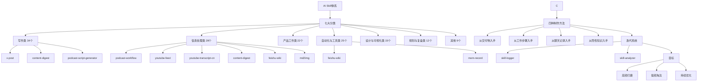
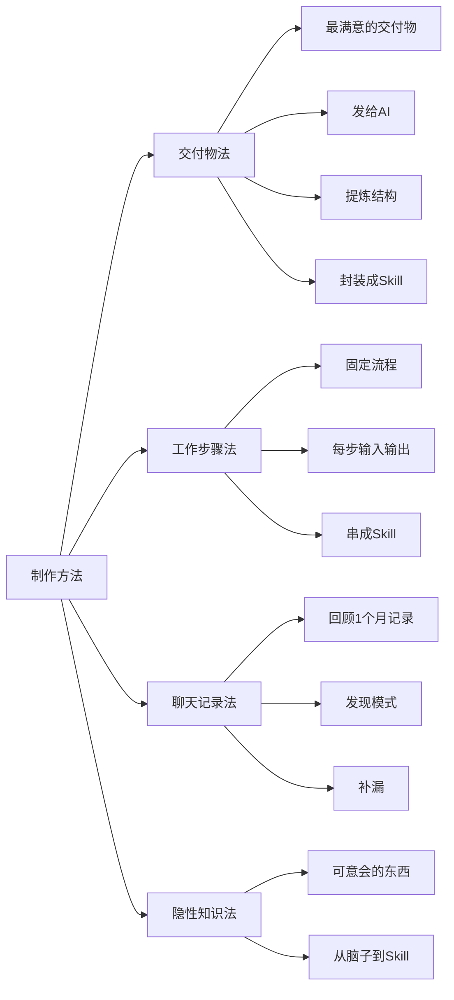
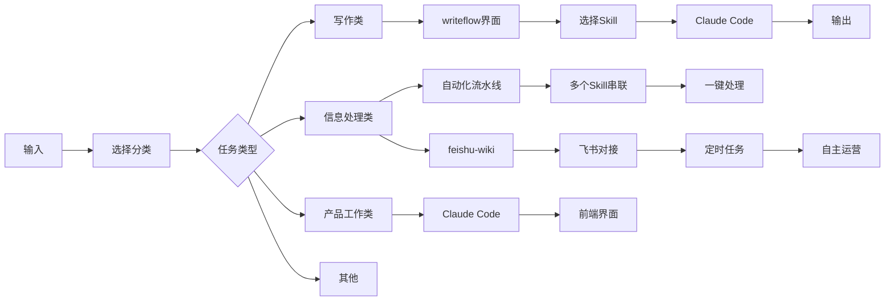
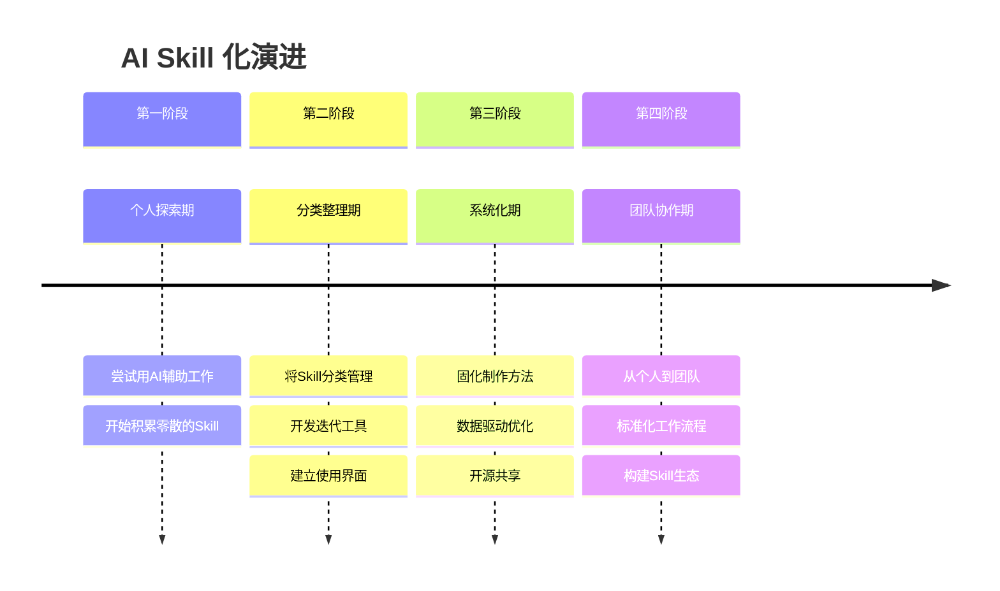
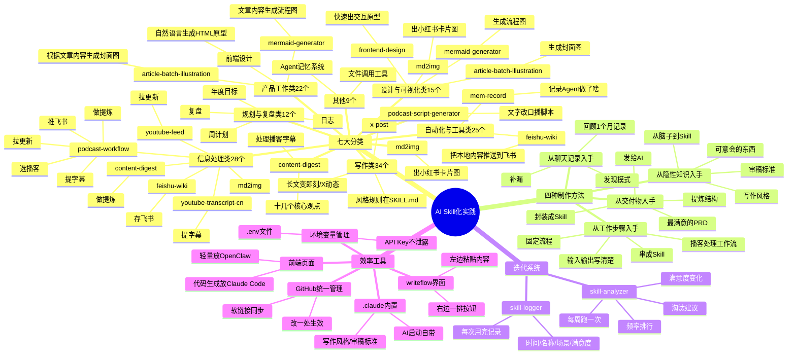

> 来源：知乎 | 原文链接：[花一天时间把工作 Skill 化，才是享受 AI 复利的开始](https://zhuanlan.zhihu.com/p/2020651711962853405) | 日期：2026年3月27日

---

## 一、核心观点摘要

**一句话总结**：将工作流程拆解为独立的 AI Skills，通过分类管理、持续迭代、日志记录和分析工具，构建可复用的 AI 能力单元，是享受 AI 复利的关键。

作者"空格的键盘"花了一天时间，把自己用 AI 做过的所有 145 个 Skills 梳理了一遍，分为七大类：
1. 写作类（34 个）
2. 信息处理类（28 个）
3. 产品工作类（22 个）
4. 自动化与工具类（25 个）
5. 设计与可视化类（15 个）
6. 规划与复盘类（12 个）
7. 其他（9 个）

**核心洞察**：
- 这 145 个 Skill 就是作者的"AI 时间日志"
- 从创造它们的动机和使用频率，反映他在哪些环节用 AI、用了多少、效果怎么样
- Skill 化的最终目的：时间在它眼中越"无限"，Agent 越多，能力复利越大
- 四个制作 Skill 的方法：从交付物入手、从工作步骤入手、从聊天记录入手、从隐性知识入手

---

## 二、核心概念图谱





---

## 三、关键问题与解答

### 问题1：如何制作第一个 Skill？

**现状/困境**：
很多人想做 Skill，但不知道从哪里开始。

**解法/方案**：
作者总结了四种方法：

| 方法 | 特点 | 适用场景 | 示例 |
|------|------|---------|------|
| **从交付物入手** | 找一份最满意的交付物，发给 AI 提炼结构、语气、必填字段，封装成 Skill | 已有可重复使用的输出 | PRD、周报、分析报告 |
| **从工作步骤入手** | 固定流程，每步的输入输出写清楚，串成 Skill | 步骤固定、可重复 | 播客处理工作流 |
| **从聊天记录入手** | 回顾 1 个月的聊天记录，发现模式，补漏 | 重复出现的任务 | 换标题、审稿标准 |
| **从隐性知识入手** | "可意会的东西"，从脑子搬到 Skill | 经验、规范、标准 | 写作风格、审稿标准 |

**核心原则**：
- 不要从零写 Skill，先有可重复的输出或流程
- 最满意的三份交付物，比一百份普通的强
- Skill 的根源是每个人 context 决定的，显性知识可以做成通用的，隐性知识只能靠自己来挖掘

---

### 问题2：如何管理和分类 145 个 Skills？

**现状/困境**：
145 个 Skill 太多，如果只是堆在那里，很快就会忘记用哪些。

**解法/方案**：
作者按功能分类为七大类：

| 分类 | 数量 | 核心功能 | 典型 Skill |
|------|------|---------|-----------|
| **写作类** | 34 | 把长文扔进去，出来即刻/X 动态 | x-post、content-digest、podcast-script-generator、md2img |
| **信息处理类** | 28 | 播客、推文、Newsletter 太多，不处理就堆着 | podcast-workflow、youtube-feed、youtube-transcript-cn、content-digest、feishu-wiki、md2img |
| **产品工作类** | 22 | 一句话等几分钟就行 | 前端设计、Mermaid 生成、文章封面图 |
| **自动化与工具类** | 25 | 把本地内容推送到飞书、实现云端协同 | feishu-wiki、mem-record |
| **设计与可视化类** | 15 | HTML/React 快速出交互原型 | frontend-design、mermaid-generator、article-batch-illustration |
| **规划与复盘类** | 12 | 年度目标、周计划、日志、复盘 | start-my-day |
| **其他** | 9 | Agent 的记忆系统、文件调用工具等 | - |

**启示**：
- 写作类最多，因为自媒体是每天的事
- 信息处理和自动化结合，可以构建完整的内容产品化流水线
- 明确分类有助于快速找到合适的 Skill

---

### 问题3：如何迭代和优化 Skills？

**现状/困境**：
Skill 不是做一次就完了，需要持续迭代和优化。

**解法/方案**：
作者开发了两个工具：

**1. skill-logger**：每次用完一个 Skill，自动追加一行日志
```bash
# 记录：时间、名称、场景、满意度
```

**2. skill-analyzer**：每周跑一次，读日志文件，输出：
- 频率排行
- 满意度变化
- 两周没用过的 Skill 清单

**迭代策略**：
- 高频的继续打磨
- 低频的考虑淘汰或合并
- 关注"高频用但低满意度"的 Skill

**启示**：
- 日志记录是迭代的依据
- 数据驱动优化比感觉更可靠
- Skill 的管理需要和员工对齐一样：哪些升职、哪些优化、哪些淘汰

---

### 问题4：如何提高 Skills 的使用效率？

**现状/困境**：
145 个 Skill，不用命令行敲名字太麻烦，而且经常记不住该用哪个。

**解法/方案**：
作者开发了多种效率工具：

**1. 内置到 .claude 里**：
```markdown
# 写作风格、审稿标准这种每次都要的，直接写在 .claude 里
# AI 启动就自带，不需要手动调用
```

**2. 写作 Skill 做了个界面**：
- 左边粘贴原始内容，右边一排按钮
- "公众号文章""即刻动态""小红书文案""播客脚本""标题优化"
- 点一下，后台调用 Claude Code 对应的 Skill
- 30 多个 Skill 变成 30 多个按钮

**3. 前端页面**：
- 轻量级的（信息总结、快速改写）放在 OpenClaw 或手机端
- 代码生成、图片生成、原型制作这些要看效果做调整的，在 Claude Code 里跑

**4. GitHub 统一管理**：
- 所有 Skill 放在一个 GitHub 仓库
- 软链接挂到各个工具的 Skill 目录
- `ln -s ~/github/my-skills/x-post ~/.claude/skills/x-post`
- 改一处，所有地方生效

**5. 环境变量管理 API Key**：
- 统一用环境变量管理
- `os.environ['YOUTUBE_API_KEY']`
- Key 存在 `.env` 文件里，`.gitignore` 排除掉
- Skill 开源时只说"把 Key 填进 `.env`"，不用担心泄露

**启示**：
- Skill 的数量多，需要界面化或快捷方式
- 统一管理可以降低维护成本
- 环境变量可以解决敏感信息的管理问题

---

### 问题5：如何从个人使用到团队协作？

**现状/困境**：
Skills 可以个人使用，但如何扩展到团队协作？

**解法/方案**：
作者没有详细展开，但提到了几个方向：

**1. 开源共享**：
- 所有 Skill 已经开源
- 欢迎直接拿去用：`http://github.com/zephyrwang6/obsidian/tree/main/.claude/skills`
- 可以作为团队的基础能力库

**2. 持续分享**：
- 作者持续在专栏分享 AI 产品的思考与实践
- 适合团队学习和借鉴

**3. 工作流程标准化**：
- Skill 不仅是个人效率工具，也可以成为团队的工作流程标准
- 比如写作风格、审稿标准可以成为团队规范

**启示**：
- 开源分享可以让 Skill 的价值最大化
- 个人能力可以扩展为团队资产

---

## 四、技术架构

```mermaid
graph TB
    A[Skill体系架构] --> B[技能层]
    A --> C[管理层]
    A --> D[工具层]
    A --> E[平台层]
    
    B --> B1[写作类 34个]
    B --> B2[信息处理类 28个]
    B --> B3[产品工作类 22个]
    B --> B4[自动化与工具类 25个]
    B --> B5[设计与可视化类 15个]
    B --> B6[规划与复盘类 12个]
    B --> B7[其他 9个]
    
    C --> C1[skill-logger]
    C --> C2[skill-analyzer]
    C --> C3[频率分析]
    C --> C4[满意度分析]
    C --> C5[淘汰建议]
    
    D --> D1[writeflow界面]
    D --> D2[GitHub统一管理]
    D --> D3[环境变量管理]
    D --> D4[软链接同步]
    
    E --> E1[.claude内置]
    E --> E2[Claude Code]
    E --> E3[OpenClaw/手机端]
    E --> E4[飞书/Notion等外部平台]
    
    B1 --> F[x-post]
    B1 --> F2[content-digest]
    B1 --> F3[podcast-script-generator]
    
    B2 --> F4[podcast-workflow]
    B2 --> F5[youtube-feed]
    B2 --> F6[youtube-transcript-cn]
    
    B3 --> F7[frontend-design]
    B3 --> F8[mermaid-generator]
    
    B4 --> F9[feishu-wiki]
    B4 --> F10[mem-record]
```





---

## 五、对比分析

### 四种制作方法对比

| 方法 | 优点 | 缺点 | 适用场景 |
|------|------|------|---------|
| 从交付物入手 | 最直接，基于已有成功案例 | 需要有满意的交付物 | PRD、周报、分析报告 |
| 从工作步骤入手 | 适合固定流程 | 需要流程明确 | 播客处理、内容生产流水线 |
| 从聊天记录入手 | 发现隐性模式，补漏 | 需要时间回顾 | 重复出现的任务 |
| 从隐性知识入手 | 把经验显性化 | 需要准确识别 | 写作风格、审稿标准、团队规范 |

### Skill 使用效率工具对比

| 工具类型 | 优点 | 缺点 | 适用场景 |
|---------|------|------|---------|
| .claude 内置 | 自动启动，无需手动调用 | 只适合高频 Skill | 写作风格、审稿标准 |
| writeflow 界面 | 图形化，一键调用 | 需要维护界面 | 写作类 30+ 个 Skill |
| GitHub 统一管理 | 改一处所有地方生效 | 需要设置软链接 | 多工具、多平台 |
| 环境变量管理 | 敏感信息不泄露 | 需要统一配置 | API Key 管理 |

---

## 六、数据与生态

### Skill 数量统计
- **总数量**：145 个
- **写作类**：34 个（最多）
- **信息处理类**：28 个
- **产品工作类**：22 个
- **自动化与工具类**：25 个
- **设计与可视化类**：15 个
- **规划与复盘类**：12 个
- **其他**：9 个

### 生态整合
- **Obsidian**：笔记 + Skill 管理
- **Claude Code**：主要代码生成和调试平台
- **OpenClaw/手机**：轻量级任务
- **飞书**：内容存储和协作
- **Notion**：知识库和页面访问
- **YouTube**：视频内容
- **GitHub**：代码和 Skill 开源

### 开源项目
- **Skills 仓库**：`http://github.com/zephyrwang6/obsidian/tree/main/.claude/skills`
- **skill-logger**：`https://github.com/zephyrwang6/myskill/tree/main/skill-logger`
- **skill-analyzer**：`https://github.com/zephyrwang6/myskill/tree/main/skill-analyzer`

---

## 七、行业趋势与预测

### AI Skill 化的演进



### 未来的发展方向

1. **Skill 平台化**：
   - 从零散的脚本到统一的管理平台
   - 可视化界面、一键部署
   - 跨工具、跨平台集成

2. **知识库驱动**：
   - Skill 基于知识库生成
   - 动态更新、智能推荐
   - 与团队知识体系集成

3. **自动化流水线**：
   - 多个 Skill 串联成完整流水线
   - 定时任务、自主运营
   - 最小化人工干预

4. **数据驱动优化**：
   - 使用日志数据分析 Skill 使用情况
   - 智能推荐优化建议
   - 自动识别低效 Skill

---

## 八、思维导图



---

## 九、关键金句摘录

1. **Skill 的本质**：这 145 个 Skill 就是我的"AI 时间日志"。从创造它们的动机和使用频率，反应了我在哪些环节用 AI、用了多少、效果怎么样。

2. **制作方法的核心**：Skill 的根源是每个人 context 决定的，显性知识可以做成通用的，隐性知识只能靠自己来挖掘。

3. **迭代的重要性**：高频的继续打磨，低频的考虑淘汰或合并。关注"高频用但低满意度"的 Skill。

4. **效率工具的价值**：30 多个 Skill 变成 30 多个按钮，不用记名字。

5. **统一管理的优势**：改一处，所有地方生效。软链接同步不同工具的 Skill 目录。

6. **环境变量的安全性**：把你的 Key 填进 `.env`。Git 开源时不用担心泄露。

7. **Skill 的长远价值**：每一个 Skill，都是你给未来的自己存下的一笔利息。Skill 越多，复利越厚，终有一天，你会发现时间不再是你的约束。

8. **自动化的境界**：判断标准：连续用了 20 次不需要手动改输出，就可以自动化。

9. **团队协作的延伸**：这些活以前都是要作者干的。她的职责也正如作者设定的那样，只干 QA，干得非常好。

10. **个人成长的要求**：你不需要更好的文档系统。你需要关掉所有终端，打开一个空白文件，自己写一个 Triton kernel，写到 debug 到凌晨三点。然后你才有资格谈 taste，谈 architect，谈 "drive a team"。

---

## 十、总结与洞察

### 1. Skill 化是 AI 复利的基础

作者的核心观点是：将工作流程拆解为独立的 AI Skills，通过分类管理、持续迭代、日志记录和分析工具，构建可复用的 AI 能力单元。

**关键洞察**：
- Skills 是私有知识资产，知识的复利
- 高效的执行环境 + 优质的 context = 高效的 Agent
- Agent 靠并行能力来突破时间限制
- Skill 越多，能力复利越大，时间在它眼中就越"无限"

**启示**：不要把 AI 当成聊天机器人，而是把它当成你的员工或外包团队。Skill 就是工作流程和知识资产。

---

### 2. 四种制作方法的互补性

作者总结了四种制作方法：从交付物、从工作步骤、从聊天记录、从隐性知识。

**关键洞察**：
- 不同的方法适用于不同的场景
- 最满意的三份交付物，比一百份普通的强
- 聊天记录是发现隐性模式的好方法
- 隐性知识只能靠自己来挖掘

**启示**：制作 Skill 不应该从零开始，而应该从已有的成功案例或流程中提炼。显性知识容易 Skill 化，隐性知识需要个人的持续实践和反思。

---

### 3. 分类管理的重要性

145 个 Skills 被分为七大类，每一类都有明确的功能定位。

**关键洞察**：
- 写作类最多（34 个），说明自媒体是作者的主要工作
- 信息处理类和自动化类结合（53 个），构成了完整的内容产品化流水线
- 明确分类有助于快速找到合适的 Skill

**启示**：Skill 的数量多，需要分类管理。分类应该基于功能而非技术，这样更容易找到和使用。

---

### 4. 迭代优化的数据驱动方法

作者开发了 skill-logger 和 skill-analyzer 两个工具来实现数据驱动的迭代。

**关键洞察**：
- 日志记录是迭代的依据
- 数据驱动优化比感觉更可靠
- 关注"高频用但低满意度"的 Skill

**启示**：Skill 的管理需要和员工对齐一样：哪些升职、哪些优化、哪些淘汰。数据驱动的方法比感觉更客观、更可靠。

---

### 5. 效率工具的界面化

作者开发了 writeflow 界面、GitHub 统一管理、环境变量管理等多种效率工具。

**关键洞察**：
- 30 多个 Skill 变成 30 多个按钮
- 改一处，所有地方生效
- 敏感信息不泄露

**启示**：Skill 的数量多，需要界面化或快捷方式。统一管理可以降低维护成本。环境变量管理可以解决敏感信息的管理问题。

---

### 6. 从个人使用到团队协作

作者将所有 Skills 开源，允许团队直接使用。

**关键洞察**：
- 开源共享可以让 Skill 的价值最大化
- 个人能力可以扩展为团队资产
- Skill 不仅是个人效率工具，也可以成为团队的工作流程标准

**启示**：Skill 化不应该只停留在个人层面，而应该扩展到团队协作。开源和标准化是扩展的关键。

---

### 7. Skill 的长远价值

作者强调：每一个 Skill，都是你给未来的自己存下的一笔利息。Skill 越多，复利越厚。

**关键洞察**：
- Skill 是知识的复利
- 时间在 Agent 眼中越"无限"
- 个人成长和 Agent 成长是不对称的

**启示**：不要把 AI 当成聊天机器人，而是把它当成你的员工或外包团队。Skill 就是工作流程和知识资产。持续投资 Skill，就是在投资未来的效率。

---

### 8. 个人成长 vs Agent 成长的不对称性

这是文章最深刻的部分。作者引用了另一个文章的观点。

**关键洞察**：
- 作者不是算子哥，更不懂模型，也不懂框架
- 一些 session 经常来回绕圈，因为不知道正确的路怎么走
- 没法写出高质量的 prompt

**核心观点**：
> 你整篇文章最诚实的一句话是：最大的问题还是来自于我。对。但你把这句话当谦虚说完就翻篇了。你没有真的面对它。

**启示**：
- 越依赖 Agent，越容易失去技术判断力
- 需要亲身实践来保持 taste
- 你和 Agent 的"一起"是不对称的
- 它每次都从零开始，而你每次都在 review 层面停下
- 谁也没在成长

---

## 附录：核心概念解释

### Skill
- **定义**：AI 能力单元，将某个工作流程或知识封装成可复用的形式
- **作用**：提高效率、减少重复、保证质量
- **分类**：写作类、信息处理类、产品工作类、自动化与工具类、设计与可视化类、规划与复盘类

### Skill-Logger
- **定义**：日志记录工具，每次用完一个 Skill，自动追加一行日志
- **记录内容**：时间、名称、场景、满意度
- **作用**：为迭代提供数据依据

### Skill-Analyzer
- **定义**：分析工具，每周跑一次，读日志文件并输出分析
- **输出内容**：频率排行、满意度变化、两周没用过的 Skill 清单
- **作用**：数据驱动的优化建议

### Writeflow
- **定义**：写作类 Skill 的本地 Web 界面
- **功能**：左边粘贴原始内容，右边一排按钮（公众号文章、即刻动态、小红书文案、播客脚本、标题优化）
- **作用**：界面化调用 30 多个写作 Skill

### 环境变量管理
- **定义**：使用环境变量管理 API Key 的方法
- **做法**：Key 存在 `.env` 文件里，`.gitignore` 排除掉
- **作用**：敏感信息不泄露，便于开源分享
