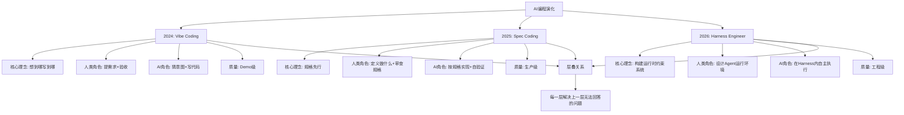
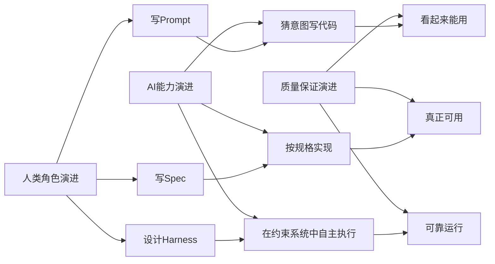
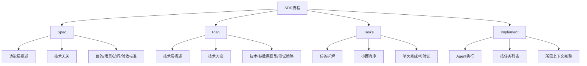
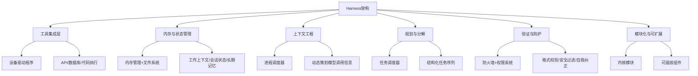
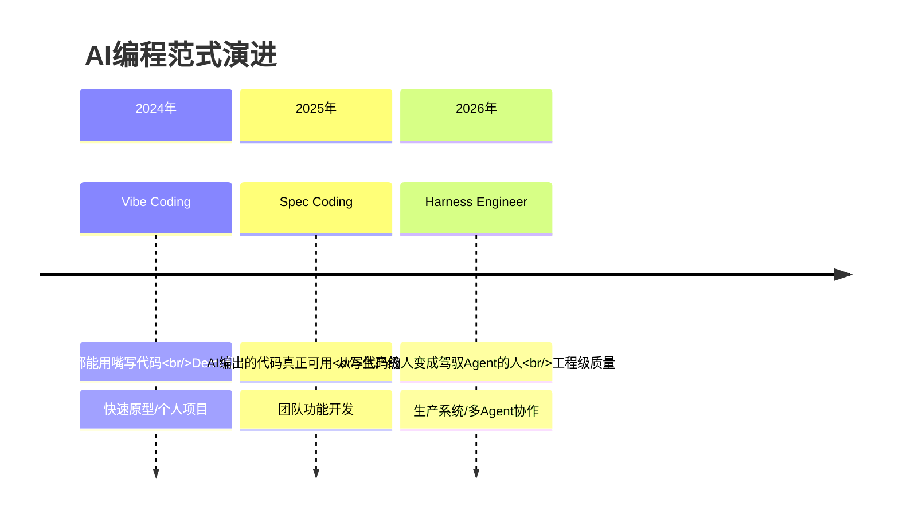
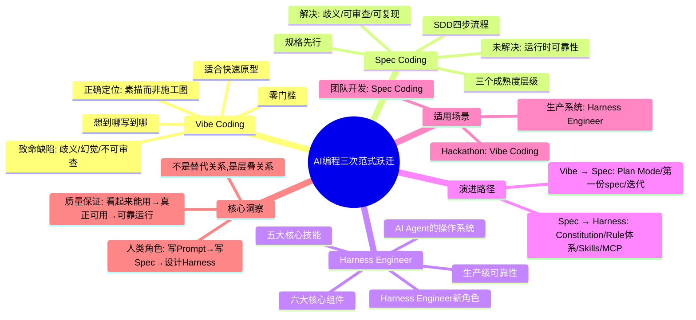

> 来源：知乎 | 原文链接：[从 Vibe Coding 到 Spec Coding 再到 Harness Engineer：AI 编程的三次范式跃迁](https://www.zhihu.com/question/2016648624256340425/answer/2018446438896522524) | 日期：2026年3月20日

---

## 一、核心观点摘要

**一句话总结**：2024年Vibe Coding让"人人都能用嘴写代码"；2025年Spec Coding让"AI编出的代码真正可用"；2026年Harness Engineer让"人类从写代码的人变成驾驭Agent的人"。三次范式跃迁，不是工具升级，而是人机协作关系的根本重构。

AI编程的演化链上，每一次跃迁都在回答同一个问题的不同层面：人类和AI之间，谁负责什么？

- **Vibe Coding**：人类提需求+验收，AI猜意图+写代码 → Demo级质量
- **Spec Coding**：人类定义"做什么"+审查规格，AI按规格实现+自验证 → 生产级质量
- **Harness Engineer**：人类设计Agent运行环境，AI在Harness内自主执行 → 工程级质量

这不是替代关系——它是层叠关系。Spec Coding不会消灭Vibe Coding（快速原型仍然需要它），Harness Engineer也不会消灭Spec Coding（规格仍然是核心输入）。每一层都解决了上一层无法回答的问题。

---

## 二、核心概念图谱





---

## 三、关键问题与解答

### 问题1：什么是Vibe Coding？

**现状/困境**：
2024年初，Andrej Karpathy提出Vibe Coding概念：你不写代码，你用自然语言描述你想要的东西，AI帮你生成代码。你甚至不需要看懂代码——只要结果"感觉对了"，就继续往下走。

核心工作流极其简单：
```
描述需求 → AI生成代码 → 看效果 → 不满意就再描述 → 循环
```

**解法/方案**：
这种方式的魅力在于零门槛。一个不会编程的产品经理，可以在30分钟内让AI搭出一个看起来像模像样的Web应用。

**致命缺陷**：
但"看起来能用"和"真正能用"之间，隔着一道深渊。歧义是最大的敌人。当你说"加一个用户管理功能"，AI需要自己猜测：
- "用户"是内部管理员还是终端用户？
- "管理"是CRUD还是包含权限体系？
- 密码用什么加密？Session还是JWT？
- 删除是软删除还是硬删除？

这些"沉默的决策"，AI每一个都在替你做。有些猜对了，有些猜错了。系统越复杂，猜错的概率越高，修复的成本也越高。

**典型问题**：
- 范围蔓延：没有明确边界，AI容易过度实现或遗漏关键点
- 幻觉（Hallucination）：AI编造不存在的API、错误的用法
- 不可审查：没有spec和plan，团队无法在实现前对齐预期
- 不可复现：换一个prompt措辞，得到完全不同的实现
- 技术债指数级增长：每一轮"看起来能用"的修补都在累积隐患

**正确定位**：
Vibe Coding的最佳场景是：
- 快速验证一个想法是否可行（Proof of Concept）
- 一次性脚本、数据处理、临时工具
- 学习新框架时的探索性编程
- 个人项目、Hackathon、Demo展示

一句话总结：**Vibe Coding是AI编程的"素描"，不是"施工图"**。

---

### 问题2：为什么行业集体转向Spec？

**现状/困境**：
2025年，一个共识浮出水面：AI Coding Agent效果不好，往往不是因为模型太弱，而是因为指令含糊不清。

**解法/方案**：
证据无处不在：
- GitHub开源了Spec Kit（7.7万星），把spec → plan → task → implement结构化
- OpenAI的Symphony架构要求每个issue绑定SPEC.md作为契约
- Anthropic在Claude Code里内置了Plan Mode——本质就是轻量版spec
- AWS推出了Kiro，以spec为核心驱动Agent开发

整个生态不约而同地收敛到同一个结论：**在写代码之前，先把"做什么"定义清楚**。

---

### 问题3：什么是Spec Driven Development（SDD）？

**现状/困境**：
SDD不是一个工具，而是一种方法论。

**解法/方案**：
核心分为四步：
```
Specify（定义做什么）→ Plan（规划怎么做）→ Tasks（拆解任务）→ Implement（逐个实现）
```

**第一步：Spec —— 只写"做什么"，不写"怎么做"**
Spec是功能层描述，刻意保持技术无关。一份好的spec用非技术语言写清：功能目的、使用场景、需求边界、验收标准。

**第二步：Plan —— 注入开发者的专业判断**
Plan是技术层：告诉Agent如何把spec落地。

**第三步：Tasks —— 分而治之**
把Plan拆成小而有序的任务，每个任务满足：可在一次Agent Session中完成、产出可验证的变更并附带测试。

**第四步：Implement —— Agent逐个执行**
Agent按任务列表顺序实现。此时它拿到了所需的一切上下文，不需要再猜。

---

### 问题4：Spec Coding的三个成熟度层级是什么？

**现状/困境**：
大多数团队从L1起步就能获得显著收益。

**解法/方案**：

| 层级 | 名称 | 特点 |
|------|------|------|
| L1 | Spec-First | 先写spec再编码，功能完成后spec归档 |
| L2 | Spec-Anchored | Spec与代码共存于仓库，随代码持续演化 |
| L3 | Spec-as-Source | Spec成为主工件，改spec即改系统 |

L3是更前沿的方向——spec成为"可执行的规格说明"。

---

### 问题5：Spec Coding解决了什么，没解决什么？

**解决的问题**：
- 歧义问题——Agent不需要再猜
- 可审查性——团队可在实现前对齐预期
- 可复现性——相同spec产出一致结果
- 质量底线——验收标准就是测试用例

**没解决的问题**：
- Agent运行时的故障恢复
- 多Agent协作的编排与状态管理
- 上下文窗口的动态管理
- 安全防护与人工审批流程
- 跨会话的记忆持久化

换句话说，**Spec Coding解决了"告诉Agent做什么"的问题，但没有解决"Agent如何可靠地运行"的问题**。这正是Harness Engineer登场的理由。

---

### 问题6：什么是Harness？

**现状/困境**：
2026年，一个新术语在AI工程领域迅速升温：Harness。OpenAI和Anthropic正式采用了这个术语。Martin Fowler撰文阐述。arXiv上出现了形式化定义。

**解法/方案**：
Harness不是Agent。它是管理Agent如何运行的软件系统。

Philipp Schmid用了一个精妙的计算机类比：

| 计算机概念 | AI Agent对应 |
|-----------|------------|
| CPU（原始处理能力） | LLM（模型推理能力） |
| RAM（有限工作记忆） | 上下文窗口 |
| 操作系统 | Harness |
| 应用程序 | Agent |

**Harness就是Agent的操作系统**——管理上下文、初始化序列、标准工具驱动程序。Agent是运行在其上的应用程序。

---

### 问题7：Harness的六大核心组件是什么？

**现状/困境**：
 Harness由六大核心组件构成。

**解法/方案**：

| 组件 | 职责 | 类比 |
|------|------|------|
| 工具集成层 | 通过标准协议连接外部API、数据库、代码执行环境 | 设备驱动程序 |
| 内存与状态管理 | 多层记忆——工作上下文、会话状态、长期记忆 | 内存管理+文件系统 |
| 上下文工程 | 动态策划每次模型调用中出现的信息 | 进程调度器 |
| 规划与分解 | 引导模型通过结构化任务序列推进 | 任务调度器 |
| 验证与防护 | 格式校验、安全过滤、自我纠正循环 | 防火墙+权限系统 |
| 模块化与可扩展 | 可独立启用、禁用或替换的可插拔组件 | 内核模块 |

---

### 问题8：真实世界中的Harness有哪些？

**现状/困境**：
这不是理论——Harness已经在生产环境中运行。

**解法/方案**：
- **Claude Code**就是一个Harness：读代码库、管理文件系统、编排子Agent、跨会话记忆、安全防护。开发者专注任务，Harness管其余一切。
- **OpenAI Codex**团队构建超大规模代码库时以Harness为主要接口——上下文工程、架构约束、定期清理Agent是核心实践。
- **Cursor的Rules、Skills、MCP工具链**——本质上就是一套轻量级Harness：通过`.cursor/rules/`定义行为约束，通过Skills注入领域知识，通过MCP打通外部工具。

---

### 问题9：什么是Harness Engineer？

**现状/困境**：
当AI Agent承担了越来越多的编码工作，一个新的职业角色自然浮现——Harness Engineer。

**解法/方案**：
Harness Engineer不是传统意义上的程序员，也不是纯粹的产品经理。他们的核心技能是：

**1. 上下文工程（Context Engineering）**
不再是写一个静态prompt，而是设计动态的信息策划系统：什么信息在什么时候进入Agent的上下文窗口，什么信息该被剪裁掉，什么信息需要持久化到长期记忆。

**2. 约束设计（Constraint Design）**
为Agent设定清晰的行为边界：哪些操作可以自主执行，哪些需要人工审批，遇到歧义时的降级策略是什么，错误恢复的重试逻辑如何设计。

**3. 工具编排（Tool Orchestration）**
决定Agent可以使用哪些工具、以什么顺序使用、工具之间的数据如何流转。这包括MCP协议配置、自定义工具链搭建、子Agent委派策略。

**4. 规格治理（Spec Governance）**
维护从constitution → spec → plan → tasks的完整规格体系，确保规格与代码的一致性，建立规格的版本化和演化机制。

**5. 质量闭环（Quality Loop）**
设计验证链——不只是最终测试，而是在Agent执行的每一步都嵌入验证点：代码生成后的静态检查、API契约的一致性校验、安全扫描、性能基线对比。

---

### 问题10：如何从Vibe Coding迁移到Spec Coding？

**现状/困境**：
如果你今天还停留在Vibe Coding阶段，最小启动路径是什么？

**解法/方案**：
- 先用Plan Mode：在Cursor或Claude Code中养成"先plan后写"的习惯——这就是轻量版SDD
- 写第一份spec：挑一个中等复杂度的功能，按spec → plan → tasks → implement走一遍
- 工具辅助：用Spec Kit（`specify init . --ai cursor-agent`）生成完整的spec目录结构
- 迭代：第一份spec一定是粗糙的，但修正一份spec远比修正一坨乱码容易

---

### 问题11：如何从Spec Coding迁移到Harness Engineer？

**现状/困境**：
当你的Spec Coding流程稳定后，如何开始构建Harness？

**解法/方案**：
- Constitution先行：为项目建立"宪法"——质量标准、测试要求、安全底线、架构原则
- Rule体系：用`.cursor/rules/`或`CLAUDE.md`定义Agent行为约束
- Skills注入：把团队的领域知识封装成可复用的Skills
- MCP打通：通过MCP协议连接团队的内部工具、API、数据库
- 验证链路：在每个关键节点嵌入自动化验证——不是事后补测试，而是构建在流程中

---

## 四、技术架构





---

## 五、对比分析

### Vibe Coding vs Spec Coding vs Harness Engineer

| 维度 | Vibe Coding | Spec Coding | Harness Engineer |
|------|-------------|-------------|-----------------|
| 核心理念 | 想到哪写到哪，氛围感驱动 | 规格先行，结构化驱动 | 构建运行时约束系统 |
| 人类角色 | 提需求+验收 | 定义"做什么"+审查规格 | 设计Agent运行环境 |
| AI角色 | 猜意图+写代码 | 按规格实现+自验证 | 在Harness内自主执行 |
| 产出质量 | Demo级 | 生产级 | 工程级 |
| 关键问题 | 歧义、幻觉、不可审查 | Agent运行时可靠性 | 系统级约束和编排 |
| 适用场景 | 快速原型、个人项目 | 团队功能开发 | 生产系统、多Agent协作 |

### Spec Coding的三个成熟度层级

| 层级 | 名称 | 特点 |
|------|------|------|
| L1 | Spec-First | 先写spec再编码，功能完成后spec归档 |
| L2 | Spec-Anchored | Spec与代码共存于仓库，随代码持续演化 |
| L3 | Spec-as-Source | Spec成为主工件，改spec即改系统 |

### 不同阶段的适用场景

| 场景 | 推荐阶段 | 理由 |
|------|---------|------|
| Hackathon/Demo | Vibe Coding | 速度优先，不需要长期维护 |
| 个人工具/一次性脚本 | Vibe Coding | 复杂度低，歧义有限 |
| 团队功能开发 | Spec Coding | 需要对齐预期，需要可审查 |
| 多模块/跨域改造 | Spec Coding | 歧义多、影响面大 |
| 生产系统持续演进 | Harness Engineer | 需要Agent运行时的可靠性保障 |
| 多Agent协作 | Harness Engineer | 需要编排、状态管理、故障恢复 |

---

## 六、数据与生态

### 行业共识证据
- **GitHub Spec Kit**：7.7万星，官方SDD工具包
- **OpenAI Symphony架构**：每个issue绑定SPEC.md作为契约
- **Anthropic Claude Code**：内置Plan Mode（轻量版spec）
- **AWS Kiro**：以spec为核心驱动Agent开发

### Harness生产案例
- **Claude Code**：读代码库、管理文件系统、编排子Agent、跨会话记忆、安全防护
- **OpenAI Codex**：超大规模代码库构建，上下文工程、架构约束、定期清理Agent
- **Cursor**：Rules、Skills、MCP工具链——轻量级Harness实践

---

## 七、行业趋势与预测

### AI编程范式演进时间线



### 人类角色的演进
- **Vibe Coding时代**：人写prompt，AI写代码
- **Spec Coding时代**：人写spec，AI按spec实现
- **Harness Engineer时代**：人设计运行环境，AI在环境中自主运作

### 未来展望
再往前看，可能的下一步是**Harness-as-Code**：Harness本身也由AI根据高层意图自动生成和优化。到那时，人类的核心价值将进一步收缩到最本质的东西——定义"为什么要做"和"什么不能做"。

但无论技术如何演化，一个根本规律不会变：**系统的质量上限，永远取决于人类表达意图的精确程度**。从Vibe Coding到Spec Coding到Harness Engineer，本质上都是在提升这个精确度——只是维度从"描述功能"扩展到了"设计系统"。

---

## 八、思维导图



---

## 九、关键金句摘录

1. **范式跃迁**：2024年，Vibe Coding让人人都能"用嘴写代码"；2025年，Spec Coding让AI编出的代码真正可用；2026年，Harness Engineer让人类从"写代码的人"变成"驾驭Agent的人"。

2. **核心问题**：在AI编程的演化链上，每一次跃迁都在回答同一个问题的不同层面：人类和AI之间，谁负责什么？

3. **层叠关系**：这不是替代关系——它是层叠关系。每一层都解决了上一层无法回答的问题。

4. **Vibe Coding定位**：一句话总结：Vibe Coding是AI编程的"素描"，不是"施工图"。

5. **行业共识**：整个生态不约而同地收敛到同一个结论：在写代码之前，先把"做什么"定义清楚。

6. **SDD精髓**：把功能描述和技术实现分离，可以显著降低LLM的不确定性。Spec不仅是文档——它就是测试计划，Agent可据此验证实现。

7. **Harness定义**：Harness就是Agent的操作系统——管理上下文、初始化序列、标准工具驱动程序。Agent是运行在其上的应用程序。

8. **Framework分裂**：Framework层不是在消失，而是在分裂：智能进模型，基础设施进Harness。这意味着团队的核心问题从"该用哪个Framework？"变成了"我们的Harness长什么样？"

9. **质量规律**：但无论技术如何演化，一个根本规律不会变：系统的质量上限，永远取决于人类表达意图的精确程度。

10. **演进本质**：从Vibe Coding到Spec Coding到Harness Engineer，本质上都是在提升这个精确度——只是维度从"描述功能"扩展到了"设计系统"。

---

## 十、总结与洞察

### 1. 范式跃迁的本质：人机协作关系的重构

这篇文章最核心的洞察是：AI编程的三次范式跃迁，不是工具升级，而是人机协作关系的根本重构。

- **Vibe Coding**：人提模糊需求，AI猜意图 → 充满不确定性
- **Spec Coding**：人定义规格，AI按规格实现 → 消除歧义
- **Harness Engineer**：人设计约束系统，AI在系统中自主运行 → 保证可靠性

这三种方式不是替代关系，而是层叠关系。每一层都解决了上一层无法回答的问题：Spec Coding不会消灭Vibe Coding（快速原型仍然需要它），Harness Engineer也不会消灭Spec Coding（规格仍然是核心输入）。

**启示**：AI编程的进步不是简单地让AI"更聪明"，而是通过架构和约束，让AI的行为更可控、更可靠。

---

### 2. 规格化的价值：从"描述"到"定义"

从Vibe Coding到Spec Coding的转变，揭示了规格化的巨大价值：

- **消除歧义**：Spec用明确的验收标准替代了模糊的自然语言描述，AI不需要再猜
- **可审查性**：团队可以在实现前对齐预期，避免了"看起来能用"但"不是我要的东西"
- **可复现性**：相同spec产出一致结果，不再依赖prompt的措辞
- **质量底线**：验收标准就是测试用例，Agent可以据此自验证

关键洞察是：**把功能描述和技术实现分离，可以显著降低LLM的不确定性**。Spec不仅是文档——它就是测试计划，Agent可据此验证实现。

**启示**：在AI时代，规格化文档的价值不是"给人看"，而是"给AI理解"。好的spec就是AI的施工图。

---

### 3. Harness的革命性：AI Agent的操作系统

从Spec Coding到Harness Engineer的转变，引入了一个革命性概念：Harness作为AI Agent的操作系统。

Philipp Schmid的精妙类比揭示了这一点：
- CPU（原始处理能力）→ LLM（模型推理能力）
- RAM（有限工作记忆）→ 上下文窗口
- 操作系统 → **Harness**
- 应用程序 → Agent

**Harness的核心价值**：
- **管理上下文**：动态策划每次模型调用中出现的信息
- **状态管理**：多层记忆——工作上下文、会话状态、长期记忆
- **工具编排**：通过标准协议连接外部API、数据库、代码执行环境
- **验证与防护**：格式校验、安全过滤、自我纠正循环

这解决了一个根本问题：Spec Coding解决了"告诉Agent做什么"，但没有解决"Agent如何可靠地运行"。

**启示**：Harness是AI时代的"基础设施"。就像传统软件开发需要操作系统一样，AI Agent开发也需要Harness这样的运行时环境。

---

### 4. Harness Engineer：AI时代的新工种

这篇文章提出了一个新职业角色——Harness Engineer。这不是传统意义上的程序员，也不是纯粹的产品经理，而是一个全新的工种。

**Harness Engineer的五大核心技能**：
1. **上下文工程**：设计动态的信息策划系统
2. **约束设计**：为Agent设定清晰的行为边界
3. **工具编排**：决定Agent可以使用哪些工具、如何使用
4. **规格治理**：维护从constitution → spec → plan → tasks的完整规格体系
5. **质量闭环**：设计验证链，在每一步都嵌入验证点

这个角色的出现标志着AI编程的成熟度提升：从"让AI写代码"到"让AI可靠地运行代码"。

**启示**：AI时代不会消灭工程师，但会重构工程师的技能树。未来的工程师更需要设计系统和约束的能力，而不是写代码的能力。

---

### 5. Framework的分裂：智能进模型，基础设施进Harness

文章揭示了一个重要趋势：模型正在吸收传统多Agent Framework约80%的能力（Agent定义、消息路由、任务生命周期）。

剩下的20%——持久性、确定性重放、成本控制、可观察性、错误恢复——正是Harness提供的。

这意味着**Framework层不是在消失，而是在分裂：智能进模型，基础设施进Harness**。

团队的核心问题从"该用哪个Framework？"变成了"我们的Harness长什么样？"

**启示**：不要在Framework选择上投入过多精力。真正的竞争力在于构建适合自己团队的Harness，让AI Agent在正确的约束下可靠运行。

---

### 6. 质量保证的演进：从"测试"到"验证链"

从Vibe Coding到Harness Engineer，质量保证的范式也在演进：

- **Vibe Coding**：事后测试 → "看起来能用"就可以
- **Spec Coding**：基于验收标准的测试 → Spec就是测试计划
- **Harness Engineer**：嵌入验证链 → 在每一步都嵌入验证点

Harness的质量闭环不只是最终测试，而是在Agent执行的每一步都嵌入验证点：
- 代码生成后的静态检查
- API契约的一致性校验
- 安全扫描
- 性能基线对比

这标志着从"事后质量保证"到"过程质量保证"的转变。

**启示**：在AI时代，质量保证不是事后的补充，而是必须嵌入到整个流程中。

---

### 7. 人类角色的演进：从"执行者"到"设计者"

三次范式跃迁揭示了人类角色的演进轨迹：

- **Vibe Coding时代**：人写prompt，AI写代码 → 人是需求的执行者
- **Spec Coding时代**：人写spec，AI按spec实现 → 人是规格的设计者
- **Harness Engineer时代**：人设计运行环境，AI在环境中自主运作 → 人是系统的设计者

人类的价值从"如何做"上移到了"为什么要做"和"什么不能做"。

**启示**：AI时代，人类的竞争力不是"如何做"，而是"为什么要做"和"设计什么"。写代码的能力会贬值，但设计系统和约束的能力会升值。

---

### 8. 适用场景的边界选择

文章明确指出了不同阶段的适用场景：

| 场景 | 推荐阶段 | 理由 |
|------|---------|------|
| Hackathon/Demo | Vibe Coding | 速度优先，不需要长期维护 |
| 个人工具/一次性脚本 | Vibe Coding | 复杂度低，歧义有限 |
| 团队功能开发 | Spec Coding | 需要对齐预期，需要可审查 |
| 多模块/跨域改造 | Spec Coding | 歧义多、影响面大 |
| 生产系统持续演进 | Harness Engineer | 需要Agent运行时的可靠性保障 |
| 多Agent协作 | Harness Engineer | 需要编排、状态管理、故障恢复 |

**启示**：方法论不是万能的。要根据场景选择合适的阶段。Hackathon用Vibe Coding是正确的选择，生产系统用Harness Engineer也是正确的选择。

---

### 9. 质量上限的终极规律

文章总结了一个根本规律：**系统的质量上限，永远取决于人类表达意图的精确程度**。

从Vibe Coding到Spec Coding到Harness Engineer，本质上都是在提升这个精确度——只是维度从"描述功能"扩展到了"设计系统"。

这个规律揭示了AI编程的本质：AI是执行者，人类是设计者。AI的质量永远受限于人类设计的质量。

**启示**：投资AI编程的核心不是投资更强大的模型，而是投资更好的规格、更好的约束、更好的Harness设计。这才是质量提升的根本。

---

### 10. 实践路径：从哪里开始？

对于想要实践的开发者，文章提供了清晰的路径：

**从Vibe Coding到Spec Coding**：
- 先用Plan Mode：养成"先plan后写"的习惯
- 写第一份spec：挑一个中等复杂度的功能，完整走一遍
- 工具辅助：用Spec Kit生成完整的spec目录结构
- 迭代：第一份spec一定是粗糙的，但修正一份spec远比修正一坨乱码容易

**从Spec Coding到Harness Engineer**：
- Constitution先行：建立"宪法"——质量标准、测试要求、安全底线、架构原则
- Rule体系：定义Agent行为约束
- Skills注入：封装团队的领域知识
- MCP打通：连接内部工具、API、数据库
- 验证链路：在每个关键节点嵌入自动化验证

**启示**：工程化实践要找到"最小可行路径"。Vibe Coding → Spec Coding → Harness Engineer，每一步都有独立价值，可以逐步推进。

---

## 附录：核心概念解释

### Vibe Coding

- **定义**：由Andrej Karpathy在2024年初提出的一种编程方式：用自然语言描述想要的东西，AI生成代码，只要结果"感觉对了"就继续往下走
- **核心理念**：想到哪写到哪，氛围感驱动
- **关键问题**：歧义是最大的敌人，AI需要自己猜测大量"沉默的决策"
- **适用场景**：快速原型、个人工具、Hackathon、Demo
- **定位**：AI编程的"素描"，不是"施工图"

---

### Spec Coding

- **定义**：规格先行、结构化驱动的AI编程方式，在写代码之前先定义清楚"做什么"
- **核心理念**：规格先行，结构化驱动
- **SDD流程**：Specify（定义做什么）→ Plan（规划怎么做）→ Tasks（拆解任务）→ Implement（逐个实现）
- **成熟度层级**：L1 Spec-First → L2 Spec-Anchored → L3 Spec-as-Source
- **价值**：消除歧义、可审查、可复现、质量底线
- **未解决的问题**：Agent运行时的故障恢复、多Agent协作的编排与状态管理、上下文窗口的动态管理、安全防护、跨会话的记忆持久化

---

### Harness

- **定义**：管理Agent如何运行的软件系统，是AI Agent的操作系统
- **核心功能**：管理上下文、初始化序列、标准工具驱动程序
- **六大组件**：工具集成层、内存与状态管理、上下文工程、规划与分解、验证与防护、模块化与可扩展
- **类比**：计算机概念与AI Agent的对应关系：CPU→LLM、RAM→上下文窗口、操作系统→Harness、应用程序→Agent
- **真实案例**：Claude Code、OpenAI Codex、Cursor的Rules/Skills/MCP工具链

---

### Harness Engineer

- **定义**：当AI Agent承担了越来越多的编码工作，浮现的一个新职业角色——专门设计和维护Harness的工程师
- **五大核心技能**：
  1. 上下文工程：设计动态的信息策划系统
  2. 约束设计：为Agent设定清晰的行为边界
  3. 工具编排：决定Agent可以使用哪些工具、如何使用
  4. 规格治理：维护从constitution → spec → plan → tasks的完整规格体系
  5. 质量闭环：设计验证链，在每一步都嵌入验证点
- **角色定位**：不是传统意义上的程序员，也不是纯粹的产品经理，而是AI时代的新工种

---

### Spec Driven Development（SDD）

- **定义**：一种AI编程方法论，核心是"在写代码之前，先把做什么定义清楚"
- **核心流程**：
  1. **Spec**：功能层描述，只写"做什么"，不写"怎么做"
  2. **Plan**：技术层描述，注入开发者的专业判断
  3. **Tasks**：把Plan拆成小而有序的任务
  4. **Implement**：Agent按任务列表顺序实现
- **关键洞察**：把功能描述和技术实现分离，可以显著降低LLM的不确定性
- **工具支持**：GitHub Spec Kit、OpenAI Symphony、Anthropic Plan Mode、AWS Kiro
