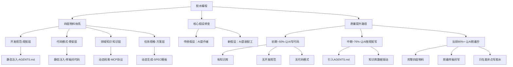
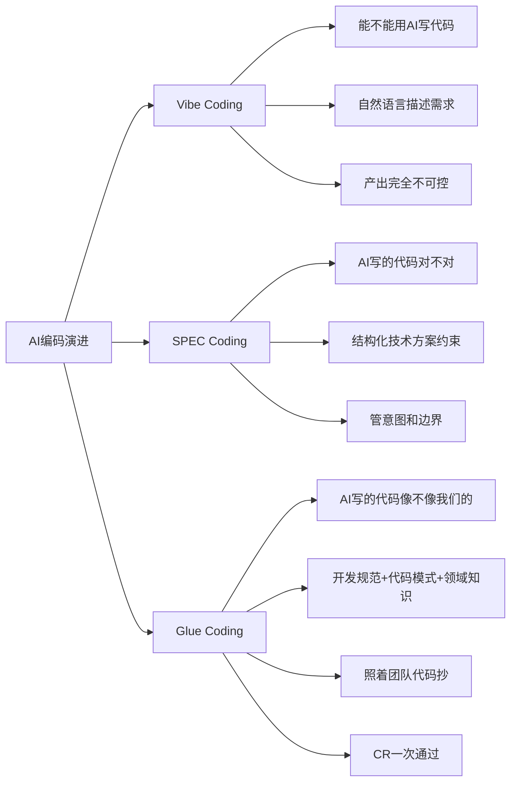
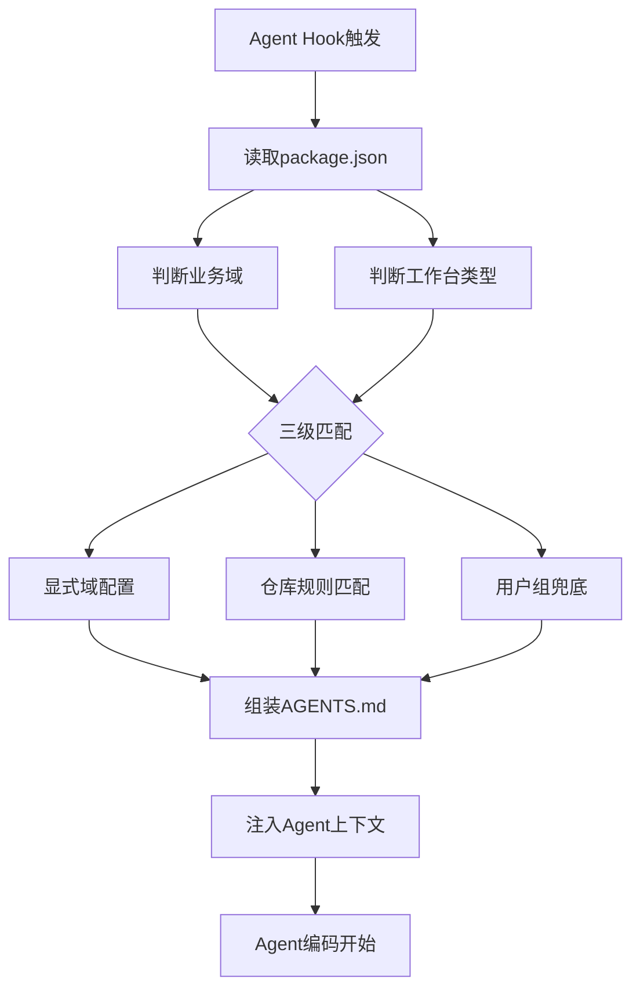
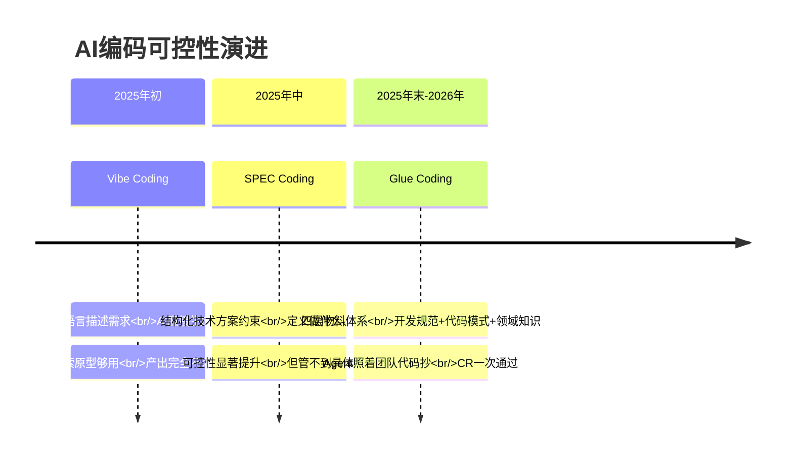
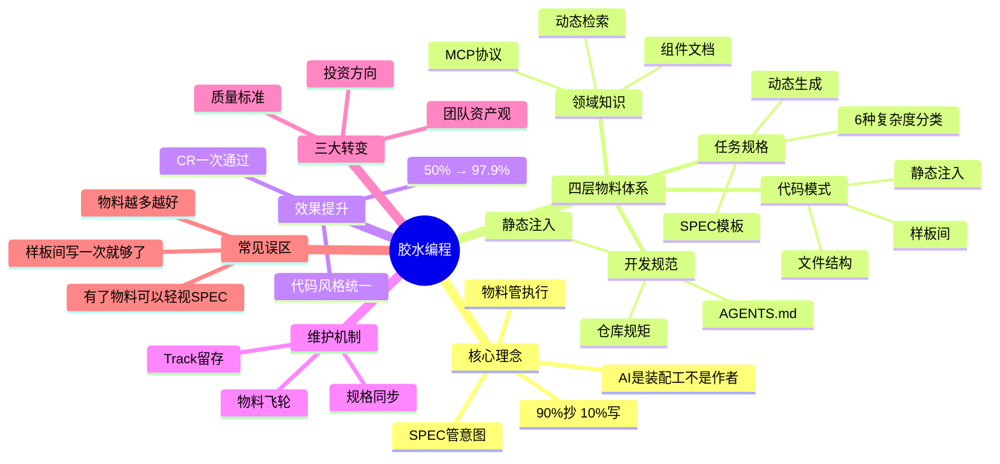

> 来源：大淘宝技术 | 原文链接：[97.9%采纳率，胶水编程：业务需求出码最佳实践](https://mp.weixin.qq.com/s/G3aKbzdGUyD2h1aVjvbr2g) | 日期：2026年3月27日

---

## 一、核心观点摘要

**一句话总结**：与其优化SPEC让AI写代码，不如直接给它好的代码来抄——通过四层物料体系（开发规范、代码模式、领域知识、任务规格）让AI在90%的代码上"照着抄"，只在10%的差异点写"胶水代码"，实现97.9%的代码采纳率。

天猫团队在大型电商平台的试点业务域中，经过半年实践，将AI代码采纳率从50%提升到97.9%。核心转变是从"让AI写代码"到"让AI抄代码"，通过构建四层物料体系，让AI不再是零创作，而是基于团队已有的开发规范、代码模式、领域知识进行组装式编码。这种方法特别适合中后台业务，这类业务90%的代码（列表页、表单页、详情页、导入导出）都有现成的样板可参照，AI只需要在业务差异点写最少量的"胶水代码"。

胶水编程的核心理念是：**SPEC管意图，物料管执行，两者叠加才是完整的可控编码**。这一实践证明了在特定高匹配度场景下，AI不仅能大幅减少人工编码工作量，还能保持极高的代码可用性与一致性，是业务需求快速交付的高效路径。

---

## 二、核心概念图谱





---

## 三、关键问题与解答

### 问题1：为什么传统AI编码的采纳率只有50%？

**现状/困境**：
半年前的试点业务域，AI写出来的代码不可控：组件乱用、规范不守、已知的坑反复踩。核心问题不是AI写不出代码，而是写出来的代码无法直接合入生产仓库。

**解法/方案**：
- 认知转变：**别让AI写代码，让它抄代码**
- 把团队已有的开发规范、代码模式、领域知识喂给Agent，让它组装而非创作
- SPEC管意图，物料管执行——两者叠加才是完整的可控编码

**对比分析**：

| 维度 | 传统AI编码 | 胶水编程 |
|------|-----------|---------|
| 核心假设 | AI是作者 | AI是装配工 |
| 工作方式 | 从零创作 | 参照+组装 |
| 代码风格 | 随机 | 统一 |
| 采纳率 | 50% | 97.9% |
| CR通过率 | 低 | 一次通过 |

---

### 问题2：为什么90%抄、10%写更有效？

**现状/困境**：
中后台业务有一个显著特征：绝大部分需求以CRUD为基础——列表页、表单页、详情页、导入导出，场景高度相似。这意味着团队代码库中天然存在大量可复用的模板化代码。

**解法/方案**：
- 90%的代码本来就有现成的参照，让AI从零写是浪费它的能力
- 大语言模型的核心训练目标是根据已有信息预测下一个token——它在有参照物时表现显著优于无参照物时
- 胶水编程顺应AI的能力结构：能抄不写，能连不造，能复用不原创

**底层直觉**：
- 当你给AI一份已有代码作为参照，它能精准地拟合出风格一致的新实现
- 团队积累的已有项目代码、组件库、编码规范、历史经验，就是"轮子"
- Agent的工作不是从零创作，而是从内部物料中组装出新的交付，只在业务差异点写最少量的"胶水代码"

---

### 问题3：为什么需要比SPEC/SDD更具体的方案？

**现状/困境**：
AI编码的可控性需要逐步递进，每一步都比上一步更具体、更可控。

**解法/方案**：

| 阶段 | 解决的问题 | 控制程度 |
|------|-----------|---------|
| Vibe Coding | 能不能用AI写代码 | 探索原型够用，产出完全不可控 |
| SPEC Coding | AI写的代码对不对 | 用结构化方案约束行为，管意图和边界 |
| Glue Coding | AI写的代码像不像我们的 | 在SPEC基础上给Agent开发规范、代码模式、领域知识 |

**三者关系**：
- Vibe让AI能写代码
- SPEC让AI写对代码
- Glue让AI写出"你的"代码

企业中后台要的恰恰是最后这一步——不只是能跑，还必须像团队自己写的一样，能合入、能CR通过。

---

### 问题4：如何构建四层物料体系？

**现状/困境**：
胶水编程不是口号，需要一套具体的物料体系来支撑。Agent写代码时，背后有四个彼此独立的决策：
- 做什么（意图）
- 什么不能做（约束）
- 代码长什么样（结构）
- 有什么要注意的（经验）

**解法/方案**：

| 物料层 | 核心问题 | 加载方式 | 触发时机 |
|--------|---------|---------|---------|
| 开发规范 | 这个仓库的规矩是什么？ | 静态注入 | 打开仓库时自动加载 |
| 代码模式 | 有没有类似的代码可以抄？ | 静态注入 | 打开仓库时自动加载 |
| 领域知识 | 该用什么组件？有什么约束？ | 动态检索 | 编码过程中按需触发 |
| 任务规格 | 这次具体做什么？ | 动态生成 | 每次需求启动时生成 |

**加载机制**：
- 前两层（开发规范、代码模式）是"始终在场"的背景知识——Agent每轮对话都能看到
- 后两层（领域知识、任务规格）在编码过程中按需介入
- 静态注入物料确保关键规则始终在场，避免依赖AI的主动调用（Vercel评测显示56%场景中AI根本不会主动调用文档工具）

---

### 问题5：开发规范如何做到业务域定制化？

**现状/困境**：
同一个业务域，工作台A用的是`@internal/builder-carbon` + `@internal/admin-components`，工作台B用的是`@internal/builder-sop` + 完全不同的组件体系；同一个工作台，业务域A的请求走`hostMap.ts`，业务域B的请求走`createFetch`。

**解法/方案**：
- 开发规范由两个视角交叉决定：
  - **业务视角**（20+域）：决定业务概念、接口规范、组件用法差异
  - **技术视角**（5种工作台）：决定底层框架和组件库选型

- 通过云端域配置系统（agentDomainConfig），将技术视角和业务视角的规则管理搬到线上
- 配置跟着仓库走，不跟人走

**自动识别技术实现**：
- Agent Hooks：开发者打开仓库代码时，系统触发hook，读取仓库的package.json、构建配置等信息
- 自动判断它属于哪个业务域、哪个工作台类型
- 通过三级匹配优先级（显式域配置 → 仓库规则匹配 → 用户组兜底）组装出对应的AGENTS.md并注入Agent
- 整个过程对开发者透明——打开仓库就自动生效

**业界差异**：
- Cursor Rules的glob匹配、AGENTS.md标准的目录层级、Copilot Instructions的路径级指令，作用域都是基于文件路径的物理目录匹配
- 胶水编程做的是业务语义级的自动路由——系统理解"业务域E"在"工作台A"上需要的规范，不同于"业务域A"在"工作台B"上的规范

---

### 问题6：领域知识为什么不只是"踩坑经验集"？

**现状/困境**：
一个常见的误解是，领域知识等于"踩坑经验集"。

**解法/方案**：
- 真正的大头是**内部组件文档**——模型从公开训练数据中已经学会了Ant Design、React等公开库的用法，但对企业内部的私有组件完全无知
- 判断一条知识是否属于领域知识层的标准：**模型能从公开资料获取吗？**
  - `@internal/admin-components`的ProTable怎么用？→ 不能 → 核心知识
  - 接口地址必须以/开头否则被网关拦截？→ 不能 → 核心知识
  - React useState怎么用？→ 能 → 不需要放进知识库

**内部知识分类**：
- 物料文档（组件API、用法示例）：占日常消费的60-70%
- 经验知识（踩坑记录、技术决策）：占20-30%
- 开发规范（按域的编码规范）：占5-10%

**效果数据**：
- 按"调用率 × 采纳率"定位低效知识条目
- 被频繁召回但采纳率只有20%~30%的条目逐一优化
- 知识库关联采纳率从18%提升到35%，近翻倍

---

### 问题7：为什么样板间（代码模式）比规则描述更有效？

**现状/困境**：
开发规范能写"用useProTableRequest"这一条规则，但没法描述formProps怎么传给SearchForm、tableProps怎么传给OrderTable、PageContainer里怎么嵌套。

**解法/方案**：
- 代码模式是胶水编程的核心——给AI看一份500行的标准列表页，比写50条规则有效得多
- 代码模式是从团队已有项目中提炼出的可复制代码骨架——不是文档，不是规则描述，是一套实际的、可运行的代码文件
- 开发规范 = 装修手册（"客厅应该朝南，用暖色调"）——告诉Agent规矩是什么
- 代码模式 = 样板间（"进去看看客厅长什么样"）——给Agent看代码实际长什么样

**真实案例对比**：
同样开发一个订单列表页，组件和请求方式都用对了（知识库 + 开发规范已生效），但没有样板间时：
- ❌ Without样板间：功能正确，CR打回
- 状态管理：手写useState，团队习惯用useProTableRequest一行搞定
- 筛选表单：内联在页面文件里，团队习惯拆到独立的Form.tsx
- 表格列定义：内联在页面文件里，团队习惯拆到独立的Table.tsx

有了样板间：
- ✅ With样板间：CR直接通过
- 只做组合，逻辑分散到各文件（与样板间结构一致）
- formProps怎么传给SearchForm、tableProps怎么传给OrderTable → 样板间定义
- 列定义、操作栏、分页 → 都在Table.tsx里

**设计：两层继承**：
- 第一层：架构组统一维护5个工作台级样板间（默认兜底）
- 第二层：域前端负责人可选fork扩展
- 核心优势：Day 1覆盖率 = 100%

**业界验证**：
- Anthropic的CLAUDE.md最佳实践明确指出，LLM是in-context learner，它通过查看已有代码来理解规范，而不是通过阅读抽象的规则描述
- Agiflow开源的scaffold-mcp将上下文拆分为Scaffold + Architect + Rules，架构合规率从40%提升到92%

---

### 问题8：任务规格如何做到按需分类？

**现状/困境**：
中后台需求虽然千变万化，但复杂度的来源是可枚举的：交互表达、数据逻辑、后端对接、业务规则、异常处理。不同复杂度需要不同的描述工具。

**解法/方案**：
基于认知，没有做"一个万能模板"，而是按需求的主要复杂度特征拆分成6种SPEC模板：

| 模板 | 核心复杂度 | 特有描述工具 | 典型场景 |
|------|-----------|-------------|---------|
| SPEC-基础模板 | 标准交互 | 页面布局图、基础流程图 | 常规增删改查页面 |
| SPEC-表单联动 | 字段间依赖 | 联动规则表、联动流程图 | 选了类型后子类型选项变化 |
| SPEC-多弹窗 | 多入口多操作 | 弹窗对比表、各弹窗结构图 | 列表操作列有多种不同弹窗 |
| SPEC-状态流转 | 状态机+权限 | 状态机图、操作权限表 | 审批流、订单状态管理 |
| SPEC-复杂校验 | 校验和计算 | 校验规则表、计算规则表 | 跨字段校验、价格自动计算 |
| SPEC-复杂列表 | 非标列表交互 | 列表类型选择、特有交互说明 | 树形结构、行内编辑、拖拽排序 |

**价值**：
- 消除了方案质量的波动
- 一个有5种弹窗的商品诊断需求，对话轮次从50+轮降至15-20轮
- 模板要求开发者把弹窗对比表填清楚了，Agent不再需要反复追问

**胶水编程视角下的任务规格**：
- 任务规格管的是"这次做什么"（意图侧）
- 开发规范 + 领域知识 + 代码模式管的是"怎么做、用什么做、参照什么做"（执行侧）
- 两者正交互补——任务规格越清晰，Agent越知道做什么；物料越完善，Agent做出来的越可控

---

## 四、技术架构

```mermaid
graph TD
    A[开发者需求：订单列表页] --> B[/spec命令]

    B --> C{选择SPEC模板}
    C --> C1[基础模板]
    C --> C2[表单联动]
    C --> C3[多弹窗]
    C --> C4[状态流转]
    C --> C5[复杂校验]
    C --> C6[复杂列表]

    C --> D[生成spec.md]

    D --> E[Agent开始编码]

    subgraph 四层物料注入
        F[开发规范<br/>静态注入]
        G[代码模式<br/>静态注入]
        H[领域知识<br/>动态检索]
        I[任务规格<br/>动态生成]
    end

    F --> F1[AGENTS.md<br/>云端配置]
    G --> G1[样板间代码<br/>两层继承]
    H --> H1[MCP协议<br/>knowledge Server]
    I --> I1[SPEC模板<br/>按复杂度分类]

    F1 --> J[约束：依赖、请求、组件]
    G1 --> K[骨架：文件结构、组件层级]
    H1 --> L[知识：物料文档、踩坑经验]
    I1 --> M[意图：做什么、怎么做]

    J --> N[最终产出]
    K --> N
    L --> N
    M --> N

    N --> O[90%样板间<br/>10%胶水代码]
```



---

## 五、对比分析

### Vibe Coding vs SPEC Coding vs Glue Coding

| 维度 | Vibe Coding | SPEC Coding | Glue Coding |
|------|-------------|-------------|-------------|
| 核心问题 | 能不能用AI写代码 | AI写的代码对不对 | AI写的代码像不像我们的 |
| 输入 | 自然语言描述需求 | 结构化技术方案 | SPEC + 四层物料 |
| 控制程度 | 完全不可控 | 意图和边界受控 | 完全可控 |
| 代码风格 | 随机 | 可能不一致 | 统一 |
| CR通过率 | 低 | 中等 | 一次通过 |
| 适用场景 | 探索原型 | 有技术约束的需求 | 中后台业务需求 |

### 胶水编程 vs 传统AI编码

| 维度 | 传统AI编码 | 胶水编程 |
|------|-----------|---------|
| 核心假设 | AI是作者 | AI是装配工 |
| 工作方式 | 从零创作 | 参照+组装 |
| 代码来源 | AI生成 | 90%样板间 + 10%胶水 |
| 代码风格 | 随机 | 团队统一 |
| 采纳率 | 50% | 97.9% |
| 维护重点 | Prompt工程 | 物料体系建设 |

### 四层物料对比

| 物料层 | 核心问题 | 加载方式 | 触发时机 | 维护成本 |
|--------|---------|---------|---------|---------|
| 开发规范 | 仓库规矩是什么 | 静态注入 | 打开仓库时 | 低 |
| 代码模式 | 有什么代码可以抄 | 静态注入 | 打开仓库时 | 中 |
| 领域知识 | 组件怎么用、有什么坑 | 动态检索 | 按需调用 | 低 |
| 任务规格 | 这次具体做什么 | 动态生成 | 需求启动时 | 低 |

---

## 六、数据与生态

### 采纳率提升数据

| 阶段 | 采纳率 | 特点 | 物料体系 |
|------|--------|------|---------|
| 初期 | ~50% | 有知识库，无开发规范、无代码模式 | 部分物料 |
| 中期 | ~76% | 引入AGENTS.md + 知识库数据驱动 | 扩充物料 |
| 当前 | 90%+ | 完整四层物料体系 | 完整物料 |
| 试点域 | 97.9% | 最佳实践效果 | 优化物料 |

### 知识库数据

- 物料文档（组件API、用法示例）：60-70%
- 经验知识（踩坑记录、技术决策）：20-30%
- 开发规范（按域的编码规范）：5-10%
- 经验知识积累：167条
- 审核通过率：93.4%
- 覆盖仓库：30个
- 关联采纳率提升：18% → 35%（近翻倍）

### 业务规模

- 试点业务域：大型电商平台全栈化试点业务域
- 业务域数量：20+域
- 工作台类型：5种
- 使用AI编码的主力：近200名后端工程师
- 接入时间：从2小时降到30秒

---

## 七、行业趋势与预测

### AI编码的可控性演进



### 胶水编程的三大转变

1. **投资方向变了**
   - 核心投资不再是prompt工程或等待更强的模型
   - 而是建设内部物料体系（让单次交付可控）和需求规格的持久化管理（让长期迭代可控）

2. **质量标准变了**
   - 好的AI编码不是"生成了多少代码"
   - 而是"原创了多少代码"
   - 在可标准化的部分，原创越少，说明物料体系越完善，产出越可控

3. **团队资产观变了**
   - 已有项目代码是可复用的样板间资产
   - 已完成的需求规格是后续需求的决策上下文
   - 每一次交付都在积累物料和上下文，形成复利效应

### 胶水编程的押注方向

- 投资的不是脚手架，而是知识资产
- 加载物料的工程机制会变——今天是AGENTS.md静态注入，明天可能是模型原生支持长期记忆
- 但团队的代码模式、领域知识、开发规范不会因为模型升级而过时
- 代码可以随时推翻重来，但你用来判断代码好不好的标准得有人维护

**总结**：模型会换代，脚手架会扔掉，但团队知识只会越积越厚。90%抄，10%写。这才是AI编码真正的护城河。

---

## 八、思维导图



---

## 九、关键金句摘录

1. **核心理念**：别让AI写代码，让它抄代码。SPEC管意图，物料管执行，两者叠加才是完整的可控编码。

2. **核心假设**：与其优化SPEC让AI写得更好，不如直接给它好的东西来抄。

3. **能力结构**：大语言模型的核心训练目标是根据已有信息预测下一个token——这使得它在有参照物时表现显著优于无参照物时。

4. **工作方式**：能抄不写，能连不造，能复用不原创。团队积累的已有项目代码、组件库、编码规范、历史经验，就是我们的"轮子"。

5. **胶水定义**：Agent的工作不是从零创作，而是从内部物料中组装出新的交付，只在业务差异点写最少量的"胶水代码"——90%抄，10%写，胶水只在缝隙处。

6. **演进关系**：Vibe让AI能写代码，SPEC让AI写对代码，Glue让AI写出"你的"代码。

7. **知识价值**：一个精准的300 token上下文，往往胜过一个混杂的113,000 token上下文。

8. **开发规范**：开发规范定义的是不可逾越的约束，而非可选的建议。

9. **样板间价值**：代码模式是胶水编程的核心——给AI看一份500行的标准列表页，比写50条规则有效得多。

10. **物料体系**：四层物料的效果不是简单相加，而是组合放大。

11. **物料飞轮**：每次需求交付都在为物料体系补充新内容——踩过的坑沉淀为领域知识，好的实现提炼为代码模式，发现的规范缺失补充到开发规范。

12. **知识资产**：我们投资的不是脚手架，而是知识资产。模型会换代，脚手架会扔掉，但团队知识只会越积越厚。

13. **护城河**：90%抄，10%写。这才是AI编码真正的护城河。

---

## 十、总结与洞察

### 1. 范式转变：从"生成"到"组装"

这篇文章最核心的洞察是AI编码的底层假设发生了根本性转变。传统假设把AI当作作者：给它足够好的需求描述，它就能写出好代码。胶水编程的假设把AI当作装配工：它不应该"写"代码，而应该"抄+改"代码。

这种转变基于一个简单而深刻的认知：大语言模型的核心训练目标是根据已有信息预测下一个token，这意味着它在有参照物时表现显著优于无参照物时。中后台业务的特性（90%是CRUD，场景高度相似）天然契合这一能力结构。

**启示**：与其花大量精力优化prompt让AI"写好代码"，不如花精力建设物料体系让AI"有东西可抄"。这才是真正顺应AI能力结构的做法。

---

### 2. 物料体系的分层哲学

四层物料体系的设计非常精妙，每层都解决一个独立的问题：

- **开发规范**解决"什么不能做"——不可逾越的约束
- **代码模式**解决"代码长什么样"——完整的代码骨架
- **领域知识**解决"有什么要注意"——内部组件和踩坑经验
- **任务规格**解决"做什么"——具体需求的技术方案

这四层不是简单叠加，而是互补：任务规格管意图，其他三层管执行。每一层缺失都会导致特定类型的错误：缺开发规范可能用错依赖，缺代码模式结构混乱，缺领域知识踩内部组件的坑，缺任务规格做的不是产品要求的功能。

**启示**：AI编码的可控性需要分层治理，每一层都要到位。缺一不可，多一不必。

---

### 3. 物料加载的时机艺术

物料体系的另一个精妙之处是加载时机的区分：静态注入 vs 动态检索。

- 开发规范、代码模式：静态注入，始终在场
- 领域知识、任务规格：动态检索，按需调用

这背后的认知是：关键规则必须始终在场，不能依赖AI的主动调用（Vercel评测显示56%场景中AI根本不会主动调用文档工具）。但一次性全塞进去也不行——"一个精准的300 token上下文，往往胜过一个混杂的113,000 token上下文"。

**启示**：物料的加载方式比物料本身更重要。静态的全程在场，动态的按需召回——本质上是在用最少的token传递最高密度的信号。

---

### 4. 样板间 vs 规则描述的胜负

这篇文章用真实案例清晰展示了为什么样板间比规则描述更有效：

- 同样的订单列表页，组件和请求方式都用对了（知识库 + 开发规范已生效）
- 但没有样板间时：手写useState，筛选表单内联在页面文件，表格列定义内联在页面文件
- 有了样板间：useProTableRequest一行搞定，表单拆到独立Form.tsx，表格拆到独立Table.tsx

关键洞察是：开发规范能写"用useProTableRequest"这一条规则，但没法描述formProps怎么传给SearchForm、tableProps怎么传给OrderTable、PageContainer里怎么嵌套。这些微观组合模式，只有看一份完整的代码才能传递。

**启示**：代码是最高密度的规范文档。给AI看代码，比给AI看规则有效得多。

---

### 5. 物料飞轮：复利效应的工程实现

胶水编程最精彩的部分是"物料飞轮"——每次需求交付都在为物料体系补充新内容：

- 踩过的坑 → 沉淀为领域知识（已实现自动化：信号检测 → LLM提取 → 质量评分≥4自动通过）
- 好的实现 → 提炼为代码模式（域负责人判断）
- 发现的规范缺失 → 补充到开发规范

这意味着用得越多，物料越丰富，Agent产出越可控。这是一个正循环，复利效应明显。

**启示**：工程化不仅仅是当前的效率，更是未来的资产积累。每一次交付都在为下一次更高效的交付铺路。

---

### 6. Track + 规格同步：上下文延续的务实方案

针对"上下文断裂"问题（AI缺乏全局上下文只会无脑复制和局部修补），这篇文章提出了一个非常务实的方案：

- **Track留存**：每个需求在.ai/tracks/目录下留一份spec.md
- **规格同步**：手动触发、AI辅助、人确认——读取spec.md，对比git diff，AI识别差异后生成更新建议

在完全自动化双向同步被证明可行之前，这是成本最低的务实选择。相比Google Conductor（强制规划但完全手动）、AWS Kiro（单向同步）、Tessl（完全从spec生成），Track + Skill同步选择了务实的中间路线。

**启示**：工程化的关键不是追求完美的理论方案，而是找到成本最低的务实选择。

---

### 7. 三个常见误区的警示

文章总结了三个常见误区，值得每个实践者警惕：

1. **物料越多越好**：早期往知识库里灌了大量内容，结果Agent召回了不相关的知识，干扰了编码质量。通过"调用率 × 采纳率"的四象限分析，清理低效知识条目后，关联采纳率从18%提升到35%。

2. **样板间写一次就够了**：代码模式需要随着团队架构升级同步更新，否则Agent会继续按旧模式生成代码。好消息是：团队每天都在写新页面，好的实现顺手提炼为样板间，维护成本并不高。

3. **有了物料就可以轻视SPEC**：恰恰相反。物料解决"怎么做"，SPEC解决"做什么"。见过有同学在物料体系完善后草草写个SPEC就直接编码——Agent确实写出了风格统一的代码，但做的不是产品要求的功能。

**启示**：物料的精准度比数量重要，代码模式需要持续维护，SPEC和物料缺一不可。

---

### 8. 押注方向：知识资产 vs 脚手架

这篇文章最深刻的洞察是对"押注方向"的判断：

- **不是押注脚手架**：任何为模型行为搭的工程脚手架，都有隐形的保质期——几个月后新一代模型可能原生就能做到，还比你实现得更干净。这跟传统软件工程追求复用、追求框架撑三年的直觉完全相反。

- **而是押注知识资产**：代码可以随时推翻重来，但你用来判断代码好不好的标准得有人维护。团队的代码模式、领域知识、开发规范不会因为模型升级而过时。

**启示**：在快速迭代的AI时代，值得长期投资的不是技术实现（会过时），而是知识资产（会积累）。

---

### 9. 实践启示：从哪里开始？

对于想要实践的团队，这篇文章提供了清晰的路径：

1. **Day 1**：从开发规范开始（AGENTS.md静态注入）——成本低、见效快
2. **Week 1-2**：建设领域知识（内部组件文档）——每天都会用到
3. **Month 1**：提炼代码模式（样板间）——回报最大，但需要时间积累
4. **Month 2+**：完善任务规格（SPEC模板）——让每个需求的技术方案标准化

关键是从第一天就能看到效果，而不是一次性投入巨大。四层物料可以逐步建设，每一步都有独立价值。

**启示**：工程化实践要找到"最小可行路径"，从第一天就能看到效果，然后持续迭代。

---

### 10. 适用场景的边界思考

这篇文章的成功案例是中后台业务（90%是CRUD，场景高度相似）。对于其他场景，胶水编程的效果可能不同：

- **高度重复性业务**（中后台、表单、列表）：胶水编程效果显著
- **创新性需求**（新功能、新产品）：可能需要更多"写"而非"抄"
- **复杂业务逻辑**：物料体系无法完全覆盖，仍需AI的理解能力

**启示**：方法论不是万能的，要理解其适用场景的边界。胶水编程在中后台业务上效果显著，但不等于所有场景都适用。

---

## 附录：核心概念解释

### 胶水编程

- **定义**：一种AI编码方法论，主张AI不应该"写"代码，而应该"抄+改"代码。通过四层物料体系（开发规范、代码模式、领域知识、任务规格）让AI在90%的代码上"照着抄"，只在10%的差异点写"胶水代码"。
- **核心假设**：大语言模型的核心训练目标是根据已有信息预测下一个token，它在有参照物时表现显著优于无参照物时。
- **关键原则**：能抄不写，能连不造，能复用不原创。90%抄，10%写。

---

### 四层物料体系

- **定义**：胶水编程的核心支撑体系，由四层独立的物料组成：
  1. **开发规范**：仓库级别的编码约束，通过AGENTS.md文件交付，是写代码的底线
  2. **代码模式**：从团队已有项目中提炼出的可复制代码骨架，是实际的、可运行的代码文件
  3. **领域知识**：内部组件文档、踩坑经验、业务规则等私有知识，通过MCP协议按需检索
  4. **任务规格**：具体需求的技术方案，通过SPEC/Plan文件交付，定义做什么、怎么做、验收标准

- **加载方式**：前两层（开发规范、代码模式）静态注入，后两层（领域知识、任务规格）动态检索
- **核心价值**：SPEC管意图，物料管执行，两者叠加才是完整的可控编码

---

### AGENTS.md

- **定义**：开发规范的交付文件，包含仓库级别的编码约束（物料依赖、请求规范、组件规范、页面结构等）
- **加载方式**：云端配置 → 自动生成AGENTS.md → 注入system prompt → 打开仓库时自动加载
- **技术实现**：Agent Hooks自动识别仓库的业务域和工作台类型，通过三级匹配优先级组装对应的AGENTS.md

---

### 样板间

- **定义**：从团队已有项目中提炼出的可复制代码骨架，不是文档，不是规则描述，是一套实际的、可运行的代码文件
- **设计**：两层继承——第一层架构组统一维护5个工作台级样板间，第二层域前端负责人可选fork扩展
- **核心价值**：给AI看一份500行的标准列表页，比写50条规则有效得多

---

### SPEC模板

- **定义**：按需求的主要复杂度特征拆分的6种技术方案模板：基础模板、表单联动、多弹窗、状态流转、复杂校验、复杂列表
- **核心价值**：消除了方案质量的波动，让Agent更容易理解需求，减少对话轮次
- **使用方式**：开发者通过/spec命令选择模板，填写后生成spec.md作为初始上下文

---

### Track

- **定义**：每个需求在.ai/tracks/目录下留下的持久化记录，包含spec.md（技术方案）和meta.json（元数据）
- **核心价值**：让任务规格归档但不遗忘，后续AI编码同一模块时自动读取历史Track中的spec.md，理解之前的设计决策
- **规格同步**：手动触发、AI辅助、人确认——读取spec.md，对比git diff，AI识别差异后生成更新建议

---

### MCP协议

- **定义**：Model Context Protocol，用于Agent按需检索领域知识的技术协议
- **使用方式**：Agent在编码过程中遇到问题时主动调用knowledge Server，按需检索相关知识点
- **覆盖范围**：物料文档（60-70%）、经验知识（20-30%）、开发规范（5-10%）

---

### 采纳率

- **定义**：以周期内所有CR合并上线的代码总行数为分母，其中由AI生成的行数为分子，按行级加权统计（不按迭代平均，避免大小迭代失真）
- **提升路径**：初期~50%（有知识库，无开发规范、无代码模式）→ 中期~76%（引入AGENTS.md + 知识库数据驱动）→ 当前90%+（完整四层物料体系）
- **最佳效果**：某大型电商平台全栈化试点业务域达到97.9%
