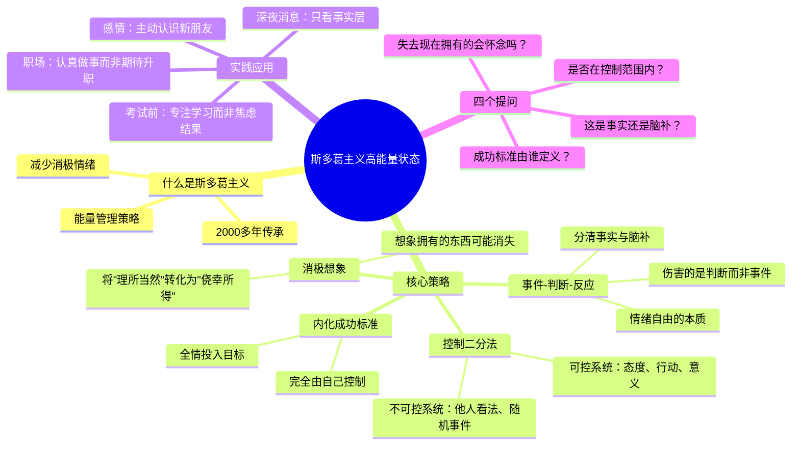

> **来源**：知乎 · 花花花破禅
>
> **原文链接**：[怎样使自己处于高能量状态？](https://www.zhihu.com/question/331006661/answer/2005767636349388236)
>
> **收藏日期**：2026年3月29日

---

### 内容摘要

本文分享了作者通过学习和践行斯多葛主义，从低能量状态转向高能量状态的亲身经历。文章详细介绍了斯多葛哲学的四个核心能量管理策略：控制二分法（区分可控与不可控）、消极想象（珍惜当下拥有）、事件-判断-反应（改变对事实的判断）、内化成功标准（掌控自己的评价体系）。

---

### 思维导图

---

## 原文内容

通过学习和践行斯多葛主义，可以彻底重塑你的一生。

聊一聊我的亲身经历。

作为一个从小就高敏感、易内耗的人，在过往很长一段时间，我都处于一种极易被负面情绪裹挟的低能量状态。

直到几年前，我开始接触斯多葛主义。

这套传承了2000多年的哲学思想，如今却被许多顶级的企业家、投资人、畅销书作家不断学习和践行。

甚至被应用到了心理咨询领域。

因为好奇，我开始研究斯多葛哲学。

几年后，它重塑了我的思维方式、生活方式，乃至人生状态。

让我往后的每一年都过得充实、快乐而精彩。

这篇文章，我将斯多葛哲学传承2000多年的精华思想和实用策略分享给你，当做2026年送给你最好的新年礼物~

全文2000多字干货，建议先点赞或收藏一波，避免以后找不到了。

## 什么是斯多葛主义？

斯多葛主义是古希腊罗马时期的一个哲学流派，公元前3世纪，哲学家芝诺在雅典的"彩绘门廊"（斯多亚）讲学，由此得名。

后经塞涅卡等人发展，成为一套完整的生活训练体系。

引用畅销书作家塔勒布在《反脆弱》里的总结："斯多葛主义者将恐惧转化为谨慎，将痛苦转化为信息，将错误转化为启示，将欲望转变为事业。"

斯多葛主义认为，高能量不是打鸡血式的亢奋，而是向内止损——通过减少不必要的消极情绪，让精力用在刀刃上。

你可以将斯多葛主义简单理解为一套能量管理策略——

帮助我们减少不必要的消极情绪，放大积极情绪，从而收获一种更稳定、更快乐的能量状态。

而在这种能量状态下，我们可以更快更好地完成目标，从而实现想要的生活。

那么，斯多葛主义具体有哪些能量管理策略？

我来为你逐一拆解，学会一个，受益终身。

## 1、控制二分法

斯多葛主义最核心的智慧，是认清世界有两套运行系统：可控系统和不可控系统。

可控系统：我的态度、我的行动、我赋予事情的意义。

不可控系统：别人的看法、随机的事件、已经发生的过去。

很多人活得累，就是因为把注意力浪费在不可控系统上。

同事在背后怎么议论我？明年大环境会不会好起来？公司下个月会不会裁员？

……

这些事，你在乎，但控制不了。

反而越在乎，越焦虑，越睡不着。

而斯多葛主义告诉我们，把注意力放在可控系统上。

考试前，你控制不了最终分数，但能控制今天是否翻开书本、专注学习一小时还是刷三小时短视频。

职场中，你控制不了老板何时给你升职加薪，但能控制自己是敷衍交差还是把手头的活认真做好；周末是彻底躺平，还是抽一点时间精进自己的能力。

感情上，你控制不了缘分何时降临，但能控制是否走出家门认识新朋友，是否坚持减肥健身让自己状态更好。

因此，下一次当你又开始胡思乱想时，先问自己一句："这件事，是属于可控系统，还是不可控系统？我可以通过行动来改变这件事的走向吗？"

如果不能，就把它关进"不可控"的小黑屋，转身去做一件你能掌控的小事：

比如收拾屋子、做十个俯卧撑、认真读完一页书。

你会很快感到能量回到了身体里。

## 2、消极想象

斯多葛有个反直觉的训练：想象你现在拥有的东西可能消失。

这不是悲观，而是把"理所当然"转化为"侥幸所得"。

星云奖科幻小说《小蘑菇》里有句话：活着并不是我们应得的，活着是恩赐。

当你抱怨父母催婚、客户难搞、高铁上孩子吵闹时，试着想象：

如果父母不再关心你的任何事，或者已经离开，你是否会怀念他们的唠叨？

如果突然失业，长时间找不到工作，你是否会觉得客户难搞一点其实不算什么？

如果根本买不到回家的票，你是否会觉得只要能坐上高铁，邻座吵闹一点也没什么？

这种思维方式让我们懂得：我们抱怨的日常，可能是别人求而不得的生活，无比珍贵。

## 3、事件-判断-反应

斯多葛学派还有一个核心观点：伤害我们的不是事件本身，而是我们对事件的判断。

心理学家维克多·弗兰克尔说过："在刺激和反应之间存在一个空间。在这个空间里，我们有能力选择自己的反应。通过反应，我们会看到自己的成长和自由。"

我想起大学时的暑假，我在北京某景区游玩，遇到过一位大爷。

当时景区的闸门坏了，门口挤得像沙丁鱼罐头，所有人都在骂骂咧咧，刷手机的表情都像要吃人。

唯独那位大爷，摇着蒲扇哼着小曲，额头有汗但嘴角带笑。

有人问他咋这么淡定。

他说："机器坏了、天气热是事实，但烦不烦躁是个人选择，我选不烦。"

现在看来，这位大爷深谙斯多葛哲学的精髓——

我们无法改变已经发生的事实，但可以通过改变对事实的判断，来改变心态和行动。

另一方面，人类的大脑有个毛病：太爱"脑补"。

原始社会，灌木丛晃动，原始人会脑补成豹子来了，转身逃跑，能救命。

但是现在，过度脑补只会加重焦虑。

比如，晚上11点，客户发来微信："方案再优化一下。"

你的第一反应是愤怒：他是不是故意找茬？这他喵的都几点了？他太不尊重人了！

但停下来，把这个"判断"拿掉，剩下的"事实"是什么？

只是：一个人发了七个字。仅此而已。

你不知道他是刚哄完孩子睡觉，还是刚被老板骂完，还是明早要汇报。

但你给自己编了个剧本叫《他在羞辱我》，然后被这个剧本伤到。

我现在收到深夜消息，会做一道剥离题：

把"事实"写下来：对方发了修改意见。

把"我脑补的内容"划掉：他针对我、他不尊重我。

然后只看事实层，回一句"好的，明早处理"，放下手机，该干嘛干嘛。

情绪自由的本质，是分清"发生了什么"和"我以为发生了什么"。

## 4、内化成功标准

斯多葛主义认为，人必须有一个完全由自己控制的成功标准，否则，就是把命运的方向盘交给别人。

一个朋友做自媒体，经常焦虑。

他很认真地写脚本、拍素材，数据平平，但别人穿着短裙扭一扭，火了。

他问我：是不是我不适合干这个？

我问他：你认为好的内容是什么？

他说：爆款。

我说：爆款由谁控制？算法、热点、用户当天的心情。

你把"我做得怎么样"的衡量标准，放在不可控的因素里，注定了你很难快乐，也很难持续。

我建议他换一个目标：不再追求爆款，而是追求每一个视频都足够用心，并保证看过的人有所收获。

让成功的标准内化，我们才能全情投入地奔赴目标。

就像跑步，如果你的目标是"跑赢所有人"，那你永远会焦虑，因为总有人比你快，但如果你的目标是"今天比昨天多跑一公里"，那么每一次迈步，都是胜利。

## 写在最后

斯多葛主义不是让你躺平，而是让你清醒。

它不是消极避世的哲学，而是强者的生存策略。

它最想教会我们一个道理：真正的力量，不在于征服外界，而在于掌控内心。

2026年已经开始了，这一年，你会遇到堵车、会遇到难搞的客户、会收到烦人的工作消息、会经历努力没有回报的时刻。

在这些时刻，请回想一遍斯多葛的四个提问：

1、这件事，在我的控制范围内吗？

2、如果失去现在拥有的，我会难过和怀念吗？

3、这是事实，还是我的脑补？

4、我的成功标准，由谁定义？

把心中的那团火，用在自己能够点亮的地方，你自然就有了能量。

新的一年，愿我们都能成为那种"机器坏了，依然能哼着小曲"的人~

不是因为没有烦恼，而是因为我们知道：

烦心事是事实，快乐是选择，而我，选快乐 。

共勉。

-END

今天的分享就到这里，希望给你力量，希望你能喜欢。

码字不易，求一个赞~

那么，下一篇回答再见咯~

---

**作者**：花花花破禅

**发布于**：2026年2月13日 22:17

**赞同**：728

**收藏**：1789
