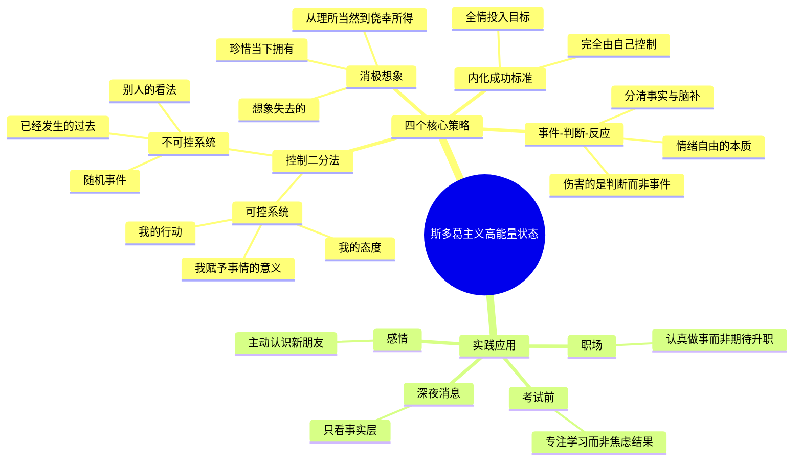

> **来源**：知乎 · 问答
> **原文链接**：[怎样使自己处于高能量状态？](https://www.zhihu.com/question/1909292008981368908/answer/2020498101450879710)
> **收藏日期**：2026年3月29日

---

### 内容摘要

本文介绍了通过斯多葛哲学提升能量状态的四个实用策略：控制二分法（区分可控与不可控）、消极想象（珍惜当下拥有）、事件-判断-反应（改变对事实的判断）、内化成功标准（掌控自己的评价体系）。

---

### 思维导图

---

## 原文内容

关注
推荐
热榜
专栏
圈子
付费咨询
知学堂
直答
消息
私信
创作中心

---

**作者**：花花花破禅

---

## 怎样使自己处于高能量状态？

但还有个高频需求是，如何让龙虾去搜到高质量的信息源。

比如说去知乎搜一下今天热搜榜，顺便把微博热搜给你扫一眼，再去B站看看有没有龙虾相关的新视频。

这三个动作，三个平台，对一个人来说可能要折腾几分钟。

但是交给龙虾呢？给你的答案大概是这样的：

当前环境无法直接获取知乎热搜榜的API数据（需要登录验证）

其它两个平台也基本差不多的反馈，那些平台的门，根本不给普通用户开。

你要正经走API这条路，先去申请开发者账号，等审核，就算审过了，接口有限制，有频次，有付费墙。

这条路，从一开始就不是给普通人修的。但上周我发现了另一条路。不走API，不申请资质，不需要任何官方授权。

一个叫OpenCLI的项目，用了一个出乎意料的方式把这道门给绕过去了。

OpenCLI

什么是OpenCLI？一句话说清楚。

它绕过API的方式，说出来其实特别简单，它直接连接你电脑上已经打开的Chrome浏览器，复用你浏览器里已经登录好的会话状态。

翻译成人话：你在浏览器里登了知乎，OpenCLI就直接借用这个登录状态去操作，不需要申请任何资质，不需要任何开发者权限，密码也不会存在任何地方。

你自己能登录的平台，它就能帮你操作。就这么一回事。

https://github.com/jackwener/opencli

还有个更绝的，另一个大神joeseesun在OpenCLI基础上专门做了个技能包，直接把这些命令全部封装进了龙虾里。

你连终端都不需要自己打开，在龙虾的聊天窗口里直接发命令就行了。

https://github.com/joeseesun/opencli-skill

装完一看，支持44个平时常用的平台，244个命令。

这么多的命令，让我帮大家捋一捋。

我让龙虾按照命令分类，给我分了这几大类，咱们来逐类体验一下。

一秒接管多平台

我让龙虾按照命令分类，给我分了这几大类，咱们来逐类体验一下。

1、热门/排行类

这是最直接解决我痛点的功能。你不需要逐个打开平台，一行命令搞定。

知乎热榜：opencli zhihu hot

B站热门视频：opencli bilibili hot

微博热搜：opencli weibo hot

Twitter热门话题：opencli twitter trending

Reddit热帖：opencli reddit hot

你想想这是什么概念？以前我每天早上逐个平台刷热点，现在几秒钟就能全部拿到。

2、搜索类

以前你在多个平台搜同一个关键词，得打开一个，搜一下，再打开另一个，再搜一下。现在你可以在龙虾里直接叫它：

B站搜索龙虾：opencli bilibili search --keyword "关键词"

知乎搜索内容：opencli zhihu search --keyword "关键词"

小红书搜笔记：opencli xiaohongshu search --keyword "关键词"

Reddit搜帖子：opencli reddit search --query "关键词"

我用B站搜了一下龙虾，哗啦啦出来一堆结果，标题、作者、播放量、链接全有，清清楚楚，比自己打开B站搜还快。

3、读取/浏览类

不只是热榜，你的社交媒体首页也能用命令调取。

小红书首页推荐：opencli xiaohongshu feed

B站关注动态：opencli bilibili feed

Twitter首页时间线：opencli twitter timeline

你不用打开小红书，一句话，你的小红书推荐流就送到你面前了。

4、发布/写操作类

这里开始有点逐渐离谱，不仅能读，它还能发。

你可以直接在龙虾里发X，命令是：opencli twitter post --text "内容"

没问题，发布成功，在X上能看到。

还能回复推文、点赞、收藏、关注取关、删推。全部命令化，一句话搞定。

除了这些，我还发现了一个更有意思的，

BOSS直聘批量打招呼：opencli boss batchgreet。

对，批量。

以后找工作，先让龙虾帮你批量打完招呼，你再坐在那里等HR来找你聊。

5、下载类

我下载了一个B站视频试试，直接发opencli bilibili download BV号。

注意，这里不需要视频完整网址，就那个BV开头的ID码就行。

等一会就下载好了，149.5MB，分辨率还不低，1080P，完整下到本地。

到文件夹里看一下，也能正常播放。

6、桌面应用控制类

比如控制

ChatGPT桌面版：问问题、发消息、新建对话，控制

Codex桌面版：对话、历史、切换模型、导出等等。

甚至还能控制微信、飞书。

我立马兴冲冲的试了微信和ChatGPT的桌面控制，结果被泼了一盆凉水。

只支持macOS系统，不支持Windows。真是逼我换苹果笔记本嘛。

之后再说。

先这些吧，上面这些展示的例子都只是冰山一角，想想看，在龙虾上就能玩转这么多平台，实现这么多操作，大家有空一定要好好玩玩。

安装须知

安装的话也非常简单，需要确保以下条件：

1.你的龙虾必须是部署在本地电脑的，不能是云端的。

确定龙虾已经在本地部署后，然后给龙虾发指令：

安装

https://github.com/joeseesun/opencli-skill

龙虾会自动帮你做安全审查、下载、安装全流程。

2.但只装这个Skill还不够，还需要装一个叫opencli Browser Bridge的浏览器扩展。

这个让龙虾帮你下载就行，然后你手动安装一下，搞定很快的。

这个扩展相当于OpenCLI和Chrome浏览器之间的桥梁，这样就可以直接用你已经登录好的账号在平台上操作。

3.所以，还有一个必须条件是，想让OpenCLI在哪些平台上操作，就必须先在这些平台上登录好账号。OpenCLI需要控制你的Chrome浏览器来复用你的登录状态。

对了，如果你的默认浏览器不是Chrome，那一定要和龙虾说一下。

那问题来了，这样会有风险吗？放心，OpenCLI只是借用账号的登录状态，不会把你的账号密码导出。

就相当于你输入账号密码后钥匙就留在门上，OpenCLI只是借用了那把钥匙去开门，开完门钥匙还在那里，它也不会带走。

结语

以前是互联网平台们设计了各种路径，让人类用户按照希望的方式去消费内容，打开App，滚动刷新，无限下拉，它们算计好了你的每一秒注意力。

现在你在用OpenCLI，你是在用命令去调取信息，而不是坐在那里等平台把信息推给你。主动权转移了，哪怕只是一点点。

当然，我也不想把这个吹得天花乱坠。它现在还有一些局限，部分命令在Windows上跑不了，桌面应用控制这块macOS独占。

但是你要问我用着爽不爽？真的爽。

一行命令知道今天全网在讨论什么，一行命令下载想要的视频，一行命令在多个平台搜同一个关键词，一行命令把内容发出去。

就在龙虾的聊天窗口里，一句话就能解决。

那就是从一开始就搭建能同时被人类和AI使用的产品，这已经是大势所趋了。

---

## 附录

### 作者信息

**作者**：花花花破禅
**知乎ID**：@花花花破禅
**文章ID**：2020498101450879710
**回答数**：271
**文章数**：646
**关注者**：82,603

---

### 相关话题

- 斯多葛主义
- 能量管理
- 心态调整
- 个人成长
- 心理学
