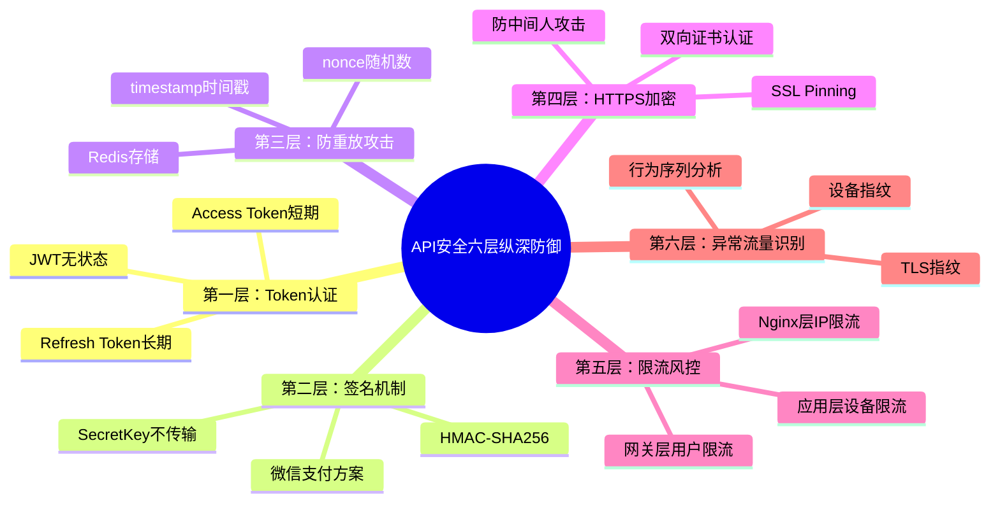

> **来源**：知乎
>
> **原文链接**：[如何防止自己网站的接口被别人用postman调用?](https://www.zhihu.com/question/1909292008981368908/answer/2020498101450879710?share_code=AmJTRVs0vdDc&utm_psn=2021586791594038949)
>
> **收藏日期**：2026年3月30日

---

### 内容摘要

本文以谍战片的安全体系为比喻,详细介绍了API安全的六层纵深防御策略。作者从Token认证、签名机制、防重放攻击、HTTPS加密、限流风控到异常流量识别,逐层拆解了如何构建完整的API安全防护体系。文章指出API安全的核心在于让攻击成本远高于收益,而非追求绝对安全的幻觉。

---

### 思维导图



---

## 原文内容

# 如何防止自己网站的接口被别人用Postman调用？

我写 iOS 写了快十年，最近两年日常跟各种后端接口打交道，自己也用 Claude Code [1] 搭过几个小项目的后端服务。关于 API 安全这件事，我最深的体感就一句话：防不住，但能让对方觉得不值得。

其实吧，你仔细想想就明白了，HTTP 协议 [2] 天生就是开放的，你的接口只要对浏览器或 APP 公开，理论上就一定能被模拟调用。直白的回答：能做的只有限制，不存在绝对阻止。真正的安全策略是什么呢？说白了就是让攻击者的成本远高于收益。你把防线叠到五层六层，对方光逆向你的签名算法就要花一周，他大概率会掉头去找更软的柿子。

这个思路和谍战片的逻辑完全一样。你看《碟中谍》里 IMF 的安全体系，阿汤哥接任务要声纹加虹膜加面部三重认证（Token 认证），特工之间有独特的接头暗号说错一个字就暴露（请求签名），任务指令阅后即焚过期作废（时间戳防重放），CIA 总部那个经典的激光走廊你拿到密码也进不去（SSL Pinning），一旦发现行迹可疑立刻切断联系（限流加风控）。没有哪一层是不可突破的，但全部叠在一起，攻击成本就会指数级上升。

下面我就按这个谍战片的安全体系，逐层拆解。每层解决什么问题，怎么实现，短板在哪，说清楚。

## 第一层：身份验证，你是谁（Token 认证）

这是最基础的一层，也是很多人唯一做了的一层。原理很简单，用户登录后服务端发一个 Token [3]（令牌），后续所有请求都带着这个 Token。没 Token 就拒绝，Token 过期了就重新登录。推荐方案是 Access Token + Refresh Token 双令牌机制，这也是 OAuth 2.1 规范 [4] 推荐的做法。


为什么要两个 Token？说白了就是安全和体验永远是矛盾的。Access Token 有效期设得短（15 分钟），即使泄露影响也有限。Refresh Token 有效期设得长（7 天），用户不用频繁登录。这就像你的门禁卡每天都要刷新，但员工工牌一年一换。JWT [5] 的无状态特性使它在分布式系统中特别好用，服务端不用存 Session，通过签名就能验证令牌有效性。

但 Token 认证有个致命问题。Postman 可以直接把 Token 贴到 Header 里发请求，就像你偷了阿汤哥的工牌，保安也会放你进去。所以光有 Token 远远不够，还需要让服务端能判断「这个请求有没有被动过手脚」。

## 第二层：接头暗号，请求没被篡改（签名机制）

签名机制是大厂开放平台的标配，微信支付 [6]、支付宝开放平台 [7]、阿里云 API 签名 [8] 全都在用这套方案。

原理是这样的：客户端把所有参数排个序拼成一串，加上一个只有你和服务端知道的密钥（SecretKey），一起丢进哈希函数算出一个签名值。服务端用同样的规则算一遍，对得上就放行，对不上就拦截。核心安全点在于 SecretKey 永远不在网络上传输，就像特工接头暗号，双方提前约定好，不可能在电话里喊出来。


拿微信支付 V2 的签名流程 [6] 举例，参数按 ASCII 码排序，用 `key=value&` 格式拼接，末尾追加商户密钥，然后做 HMAC-SHA256 [7] 哈希。V3 版本更狠，直接上了 SHA256withRSA 非对称加密签名，连对称密钥泄露的风险都堵死了。

倒是签名机制有个短板得提前说清楚，在 Web 前端场景下 SecretKey 必须存在 JS 代码里，对方 F12 打开就能慢慢扒。这是前端安全的阿喀琉斯之踵，后面单独讲怎么缓解。

但现在还有一个更紧迫的问题：攻击者如果原封不动地重发一个合法请求呢？签名验证照样通过，因为那个签名本身就是合法的。

## 第三层：消息自毁，这是一次性的（时间戳 + 随机数防重放）

这就是重放攻击 [10] 的问题。攻击者不需要知道你的密钥，他只需要抓到一个完整的请求原样重发就行了。解决方案是在每个请求中加入 timestamp（时间戳） 和 nonce（随机字符串），两者同时参与签名计算。服务端要验三个条件：timestamp 与当前时间差不超过 60 秒，nonce 未在 Redis [11] 中出现过，sign 签名校验通过。


这三者的互补关系很精妙。timestamp 限制了 nonce 的存储量，只需要在 Redis 里保存 60 秒内的记录不会无限膨胀。nonce 覆盖了 timestamp 60 秒窗口期内的重放风险，同一个请求即使在 60 秒内重发也会被拦截。sign 确保 timestamp 和 nonce 本身不会被篡改，三者形成闭环。这就是化工里经典的控制变量法的思路，每一层只解决一个特定问题，互相补位形成完整覆盖。

到这里，Token + Sign + Timestamp + Nonce 这套组合拳打出来，已经能挡住 90% 以上的非授权调用了。知乎上不少答主管这叫「四件套」，也是实战中被验证最多的成熟方案。但这一切都有一个前提，通信过程不能被窃听。

## 第四层：加密通道，窃听无效（HTTPS + SSL Pinning）

如果攻击者能抓到你的请求内容，他就能慢慢分析你的签名规则。所以 HTTPS [12] 是底线，不是加分项。2026 年了，如果你的 API 还在用 HTTP 明文传输，什么安全方案都白搭。Let's Encrypt [13] 免费证书，没有任何不用的理由。

其实吧，HTTPS 也不是万能的。在 APP 端，攻击者可以用 Charles [14] 或 Fiddler [15] 做中间人代理，安装自签名证书后照样能抓包。这时候就需要 SSL Pinning（证书锁定）[16]，在 APP 里预置服务端证书的公钥哈希，只认这一把钥匙，其他证书一律拒绝。iOS 端用 URLSession 的 `didReceive challenge` 回调就能实现，Android 端 OkHttp 的 CertificatePinner [17] 一行代码搞定。

```javascript
// iOS端 SSL Pinning 伪代码
func urlSession(_ session: URLSession, didReceive challenge: URLAuthenticationChallenge) {
  let serverCert = challenge.protectionSpace.serverTrust
  let pinnedCertHash = "sha256/AAAAAAAAAAAAAAAAAAAAA="
  if serverCert.publicKeyHash == pinnedCertHash {
    completionHandler(.useCredential, credential)
  } else {
    completionHandler(.cancelAuthenticationChallenge, nil)
  }
}
```

但 SSL Pinning 也能被绕过，攻击者用 Frida [18] 或 Xposed [19] Hook 掉验证逻辑就行。看雪安全社区的分析 [20] 显示，像 WhatsApp、Bank of America 这类 APP 同时实现了 SSL Pinning + Root/越狱检测 + 反调试检测 + 代码混淆 + APK/IPA 签名校验五种安全控制，代表了移动端安全的天花板。对于大多数项目来说做到 SSL Pinning + 代码混淆就已经超过 80% 的竞品了。

说到这里，四层防线拆解完了，都是解决「能不能调」的问题。但还有一个问题：就算对方破解了你所有的签名逻辑，你怎么保证系统不被压垮？

## 第五层：巡逻守卫，别来太勤（限流与风控）

限流解决的是「调多快」的问题。就像电影里保险库外面的巡逻守卫，你偷到了密码，但每 30 秒就有人经过，你根本没时间从容搬东西。推荐三层限流：Nginx 层用 limit_req_zone [21] 做 IP 维度（100 次/分钟），网关层用 Spring Cloud Gateway [22] + Redis 实现令牌桶算法按用户 ID 和接口维度限流，应用层用 Guava RateLimiter [23]（单机）或 Redisson RRateLimiter [24]（分布式）做设备维度限流。超限返回 HTTP 429 Too Many Requests，别返回 200 假装什么都没发生，这只会让攻击者以为自己没被发现。

换句话说，限流是防 DDoS [25] 和批量薅数据的最后一道物理屏障。OWASP API Security Top 10（2023 版）[26] 把「不受限的资源消耗（Unrestricted Resource Consumption）」列为第四大风险，Akamai 的研究报告 [27] 也指出 2023 年全球 29% 的 Web 攻击直接针对 API 接口，这个比例还在逐年上升。2024 年的数据更夸张，CSDN 上一篇综合分析 [28] 引用的数据显示 API 月均攻击量达到 483 亿次，同比增长 162%。不设限流的 API 在今天的互联网环境里基本等于裸奔。

但限流只能解决「量」的问题，解决不了「质」的问题。一个聪明的攻击者完全可以把请求频率控制在你的限流阈值以下，每分钟只发 50 个请求，慢慢薅你的数据。这种「低频精准攻击」对限流来说完全隐形，你需要的是能识别「这个请求虽然合法但行为很怪」的能力。

## 第六层：行为画像，你的举止出卖了你（异常流量识别）

前五层都是在验「请求本身对不对」，第六层要解决的问题更高级：请求本身完全合法，但使用方式不正常。

举个例子，一个用户注册后 3 秒内就开始连续调用新闻列表接口，每次请求都是翻页到最后一页，而且完全不调用新闻详情接口。这个行为在前五层看来完全合法，Token 有效、签名正确、时间戳没过期、频率也在阈值内。但任何一个正常用户都不会这么操作，这明显是爬虫在批量抓取标题数据。

异常流量识别的核心思路是建立正常用户的行为基线，然后找出偏离基线的异常请求。说白了就是给每个用户（或设备）画一幅画像，看看谁「长得不像正常人」。


具体到实现层面，异常流量识别主要靠三个技术手段。

第一是设备指纹 [29]。通过采集设备的硬件属性（型号、分辨率、处理器）、系统属性（版本、语言、是否 Root/越狱）和网络属性（WiFi 信息、运营商），用特定算法生成一个全局唯一的设备 ID。顶象科技的设备指纹方案 [29] 号称识别率达到 99.99971%，响应速度低于 15ms。这意味着即使攻击者更换 IP、切换账号，只要用的是同一台设备，你就能把他的所有行为串联起来。设备指纹还能直接识别模拟器、多开、Root、群控等异常环境，这些恰恰是自动化攻击工具最依赖的运行条件。

第二是 TLS 指纹 [30]。每个客户端（浏览器、APP、curl、Python requests）在建立 TLS 连接时发送的 ClientHello 报文参数都不一样，包括支持的加密套件列表、扩展字段、椭圆曲线参数等。JA3 [31] 算法把这些参数拼接后做 MD5 哈希，就得到了一个 TLS 指纹。一个声称自己是 Chrome 浏览器的请求，如果 TLS 指纹跟真实 Chrome 对不上，那就大概率是爬虫工具伪装的。这个方案的精妙之处在于它工作在传输层，应用层怎么伪造 Header 都没用。

第三是行为序列分析。记录每个用户/设备的 API 调用序列，用机器学习 [32] 建立正常行为基线。正常用户的行为是有「节奏感」的，会有浏览、停留、返回、跳转这些多样化操作，间隔时间也有随机性。爬虫的行为模式则高度规律，API 调用路径单一，间隔时间均匀，没有「犹豫」和「回头看」。同盾科技 [33] 和数美科技 [34] 这些国内风控厂商都提供了基于行为序列的 AI 风控模型，能识别群控账号、一致行为团伙等高级攻击模式。

其实吧对于题主这种中小型项目，不需要上这么重的方案。最务实的做法是在服务端记录完整的 API 调用日志（请求来源、参数摘要、响应状态、调用时间），配置几条基础的告警规则：同一 Token 短时间内从多个 IP 调用、同一设备短时间内注册多个账号、某个接口的调用量突然飙升超过基线 3 倍以上。这些规则用 ELK Stack [35] 或者 Grafana + Prometheus [36] 就能实现，成本不高但效果很好。关键是你得有这个意识：安全事件不怕发生，怕的是发生了你不知道。

到这里，六层防线全部铺开了。但回到题主的问题，你是做 Web 端的，而 Web 前端恰恰是整套方案里最薄弱的环节。

## Web 前端的阿喀琉斯之踵

上面讲的方案在 APP 端都能很好地落地，但 Web 前端是个例外，因为前端代码对用户完全透明。你的签名密钥写在 JS 里，不管你怎么混淆，对方打开 DevTools [37] 就能慢慢扒。这就像你在公开场合跟同事对暗号，旁边有人拿着录音笔。


对于这个问题，我的建议是把签名逻辑编译为 WebAssembly [38]。WASM 是二进制格式，逆向难度比 JS 高一个量级，配合 javascript-obfuscator [39] 的控制流平坦化和字符串加密，能把攻击者的逆向成本从「几个小时」拉到「几天甚至几周」。虽然不能从根本上杜绝密钥泄露（前端代码终归是在用户设备上运行的），但回到我们的核心原则，安全的目标是让攻击成本高到不值得，WASM 在这个维度上已经足够好了。

知乎上关于前端 JS 安全对抗的讨论也验证了这个思路。知乎自身的登录接口就用了重度混淆的 JS 加密方案，GitHub 上几乎所有模拟登录项目都已经失效了。在前端安全这个战场上，混淆做得够深就能筛掉绝大多数攻击者，剩下那些有能力逆向 WASM 的人，你用什么方案都挡不住。

倒是还有一种更极端的企业级方案值得一提：远程浏览器隔离（Remote Browser Isolation）[40]，也叫云渲染方案。你可以把它理解为「给网页套了一层云电脑」。用户打开的网页其实只是一个 HTML5 Canvas [41] 画布，真实的网页渲染、数据请求、业务逻辑全部在服务器端的隔离沙箱里执行，服务端把渲染好的像素流通过 WebSocket [42] 推送到前端 Canvas 上，前端只负责把用户的点击、滚动、键盘输入等事件透传回服务器。


这个方案从根本上消灭了前端代码暴露的问题，因为用户浏览器里压根就没有业务代码，连 HTML DOM 结构都没有，只有一张不断刷新的「图片」。攻击者打开 F12 看到的就是一个 Canvas 元素和一个 WebSocket 连接，里面传的是像素数据，毫无业务语义。Zscaler [43]、Cloudflare Browser Isolation [44]、Palo Alto Networks [45] 这些安全巨头都有成熟的 RBI 产品，Gartner 2025 年的 PAM 魔力象限 [46] 里也把 RBI 列为关键能力之一。

但这个方案的代价也很明显。第一是延迟，所有交互都要经过服务端渲染再回传像素流，用户能明显感觉到操作不跟手，尤其是滚动和输入场景。第二是成本，服务端要为每个用户维持一个独立的浏览器沙箱实例，计算资源消耗巨大。第三是兼容性，复杂的前端交互（拖拽、动画、视频播放）在像素流模式下体验会打折扣。所以这个方案目前主要用在金融交易系统、军工内网、政务敏感系统这类安全等级极高但交互复杂度相对可控的场景。对于题主「新闻列表接口」这种场景，WASM 混淆加上前面的六层防线已经绰绰有余，RBI 属于杀鸡用了核弹。

## 那些看起来有用但其实不太行的方案

说完正经方案，也得提一下几个常见的「安慰剂」。**CORS（跨域资源共享）**只有浏览器遵守，Postman [47] 和 curl 完全无视，这是浏览器安全策略不是 API 安全方案。Referer/Origin 检查一行代码就能伪造，防君子不防小人。IP 白名单适合服务间调用，用户 IP 千变万化根本不适用于面向用户的 API。User-Agent 检查跟 Referer 一样想伪造就伪造。这些方案可以作为辅助手段加上去，但别指望它们能挡住真正有意图的攻击者。

其实吧你去看 OWASP API Security Top 10 [26] 就会发现，排名第一的威胁是对象级授权失效（BOLA），Salt Security 的报告 [48] 指出这类漏洞占了所有 API 攻击的 40%。排第二的是认证缺陷，排第三的是对象属性级授权失效。换句话说，业界最头疼的 API 安全问题根本不在于「接口地址被人知道了」，而在于认证和授权本身的逻辑漏洞。即便签名和加密做到极致，一个权限校验的疏漏就足以让整个防线崩溃。

## 实战方案：给题主的建议

回到你「新闻列表接口」这个具体场景，我按项目规模给两套方案。

**中小型项目（1-2 人周落地）**应聚焦三个必做项：全站 HTTPS 用 Let's Encrypt [13] 免费证书，JWT [5] Token 认证用 Redis [11] 存储 Access Token 2 小时过期，请求签名用 `sign = HMAC-SHA256(secretKey, key1=value1&key2=value2&nonce=xxx&timestamp=xxx)` 这个公式。在此基础上加 Nginx 层 IP 限流（100 次/分钟）和关键接口验证码就已经能覆盖绝大多数威胁场景了。

大型或金融级项目需要构建完整的六层纵深防御。传输层做 HTTPS + TLS 1.3 [49] + SSL Pinning + 双向证书认证，网关层上 API Gateway [50] + WAF [51] + DDoS 清洗 + IP 信誉库，认证授权层走 OAuth 2.0 [52] + JWT-RSA256 + mTLS 服务间通信，数据完整性层做 HMAC-SHA256 签名 + timestamp + nonce + AES-RSA 混合加密，异常识别层上设备指纹 + TLS 指纹 + 行为序列分析，业务安全层配风控规则引擎 + 蜜罐接口 + 全链路审计日志。微信支付 V3 的签名方案 [6]（SHA256withRSA + 商户 API 证书 + nonce_str + timestamp）就是可以直接参考的行业标杆实现。


这张四象限图一目了然。右上角是企业级方案成本高但安全也高，左上角是性价比最高的区域，HMAC 签名加 Timestamp/Nonce 加限流这几个方案就落在这里。左下角的 CORS 检查和 Referer 检查成本虽低但安全效果也低，聊胜于无。

## 安全的本质是成本博弈

最后拉高一层说说我对 API 安全这件事的理解。

2024 年全球数据泄露规模达到 122.7TB，奇安信的年度报告 [53] 显示泄露数据条数同比增长 354.3%，达到 471.6 亿条。2025 年 FreeBuf 的分析 [54] 指出 API 安全已经成为安全团队的首要任务，OWASP [55]、NIST [56]、Gartner [57] 等机构的标准框架都在往 API 全生命周期防护的方向收敛。绿盟科技 2025 年的云上安全报告 [58] 则揭示了全球 48 起典型泄露事件中 AI 相关事件就占了 21 起，DeepSeek 因为 ClickHouse 数据库未设访问控制导致百万行聊天记录泄露 [58] 就是一个典型案例。这些数据说明一个事实：API 安全不是锦上添花，是生死攸关的基础设施。

但安全的本质从来不是技术问题。说白了就是一个经济学问题，让攻击者觉得「算了，不值得」。Token 保证请求者是谁，签名保证请求没被动过，限流保证系统不被压垮，三者缺一不可。就像《碟中谍》里的安全体系，单独拿出任何一层都有办法突破，但全部叠在一起，你防的根本不是 Postman 这个工具，你防的是 Postman 背后的人不知道你的 Token、算不出你的签名、发不出合法的时间戳。

与其追求绝对安全的幻觉，不如把精力花在监控和响应上。持续监控 API 调用日志，配置异常行为告警，定期审计权限策略。安全是持续博弈，不是一次性工程。

## 参考

- [1] Claude Code 官方文档：https://docs.anthropic.com/en/docs/claude-code/overview
- [2] MDN：HTTP 协议文档：https://developer.mozilla.org/zh-CN/docs/Web/HTTP
- [3] Access Token 介绍：https://en.wikipedia.org/wiki/Access_token
- [4] OAuth 2.1 规范：https://oauth.net/2.1/
- [5] JWT 官方介绍：https://jwt.io/
- [6] 微信支付签名文档：https://pay.weixin.qq.com/doc/v2/partner/4011985884
- [7] 支付宝开放平台签名文档：https://opendocs.alipay.com/common/02kf5q
- [8] 阿里云 API 签名文档：https://help.aliyun.com/zh/sdk/product-overview/v3-request-structure-and-signature
- [9] HMAC 算法介绍：https://en.wikipedia.org/wiki/HMAC
- [10] 重放攻击介绍：https://en.wikipedia.org/wiki/Replay_attack
- [11] Redis 官方网站：https://redis.io/
- [12] MDN：HTTPS 介绍：https://developer.mozilla.org/zh-CN/docs/Glossary/HTTPS
- [13] Let's Encrypt 免费证书：https://letsencrypt.org/
- [14] Charles 官方网站：https://www.charlesproxy.com/
- [15] Fiddler 官方网站：https://www.telerik.com/fiddler
- [16] OWASP：SSL Pinning 说明：https://owasp.org/www-community/controls/Certificate_and_Public_Key_Pinning
- [17] OkHttp 证书锁定文档：https://square.github.io/okhttp/features/https/
- [18] Frida 官方网站：https://frida.re/
- [19] EdXposed 项目主页：https://github.com/ElderDrivers/EdXposed
- [20] 看雪：SSL Pinning 绕过分析：https://bbs.kanxue.com/thread-260658.htm
- [21] Nginx limit_req 模块文档：https://nginx.org/en/docs/http/ngx_http_limit_req_module.html
- [22] Spring Cloud Gateway：https://spring.io/projects/spring-cloud-gateway
- [23] Guava RateLimiter 说明：https://github.com/google/guava/wiki/CachesExplained
- [24] Redisson RRateLimiter：https://github.com/redisson/redisson
- [25] Cloudflare：DDoS 攻击介绍：https://www.cloudflare.com/learning/ddos/what-is-a-ddos-attack/
- [26] OWASP API Security Top 10：https://owasp.org/API-Security/editions/2023/en/0x11-t10/
- [27] Akamai API 攻击报告解读：https://www.secrss.com/articles/65221
- [28] CSDN：API 攻击数据分析：https://blog.csdn.net/muliangsheng1988/article/details/149709296
- [29] 设备指纹技术介绍：https://www.dingxiang-inc.com/blog/post/575
- [30] TLS 指纹技术介绍：https://www.bright.cn/blog/web-data/tls-fingerprinting
- [31] JA3 TLS 指纹算法：https://github.com/salesforce/ja3
- [32] scikit-learn 官方网站：https://scikit-learn.org/
- [33] 同盾科技官网：https://www.tongdun.cn/
- [34] 数美科技行为风控方案：https://www.ishumei.com/product/bs-post-sdk.html
- [35] Elastic Stack 官方介绍：https://www.elastic.co/elastic-stack
- [36] Grafana 官方网站：https://grafana.com/
- [37] Chrome DevTools 文档：https://developer.chrome.com/docs/devtools
- [38] WebAssembly 官方网站：https://webassembly.org/
- [39] javascript-obfuscator：https://github.com/nicolo-ribaudo/javascript-obfuscator
- [40] Cloudflare：远程浏览器隔离：https://www.cloudflare.com/sase/products/browser-isolation/
- [41] MDN：Canvas API 文档：https://developer.mozilla.org/zh-CN/docs/Web/API/Canvas_API
- [42] MDN：WebSocket API 文档：https://developer.mozilla.org/zh-CN/docs/Web/API/WebSockets_API
- [43] Zscaler：RBI 介绍：https://www.zscaler.com/resources/security-terms-glossary/what-is-remote-browser-isolation
- [44] Cloudflare Browser Isolation：https://developers.cloudflare.com/cloudflare-one/remote-browser-isolation/
- [45] Palo Alto：RBI 方案：https://www.paloaltonetworks.com/sase/remote-browser-isolation
- [46] Keeper：RBI 方案介绍：https://www.keepersecurity.com/solutions/remote-browser-isolation/
- [47] Postman 官方网站：https://www.postman.com/
- [48] Salt Security：OWASP API 解读：https://salt.security/blog/owasp-api-security-top-10-explained
- [49] Cloudflare：TLS 1.3 介绍：https://www.cloudflare.com/learning/ssl/why-use-tls-1-3/
- [50] Nginx：API Gateway 介绍：https://www.nginx.com/resources/glossary/api-gateway/
- [51] Cloudflare：WAF 介绍：https://www.cloudflare.com/learning/ddos/glossary/web-application-firewall-waf/
- [52] OAuth 2.0 规范：https://oauth.net/2/
- [53] 奇安信年度数据泄露报告：https://www.qianxin.com/news/detail?news_id=13157
- [54] FreeBuf：API 安全分析：https://www.freebuf.com/articles/web/430781.html
- [55] OWASP API Security 项目：https://owasp.org/www-project-api-security/
- [56] NIST 官网：https://www.nist.gov/
- [57] Gartner 官网：https://www.gartner.com/
- [58] 绿盟科技：2025 云安全报告：https://www.secrss.com/articles/87326
