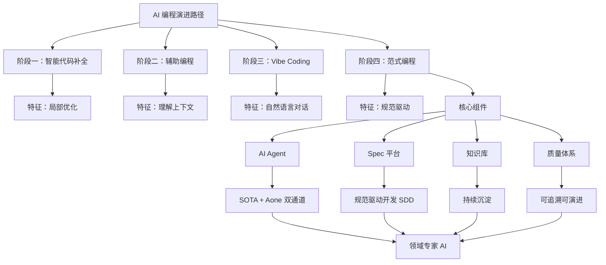
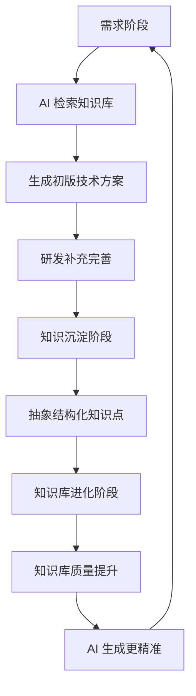
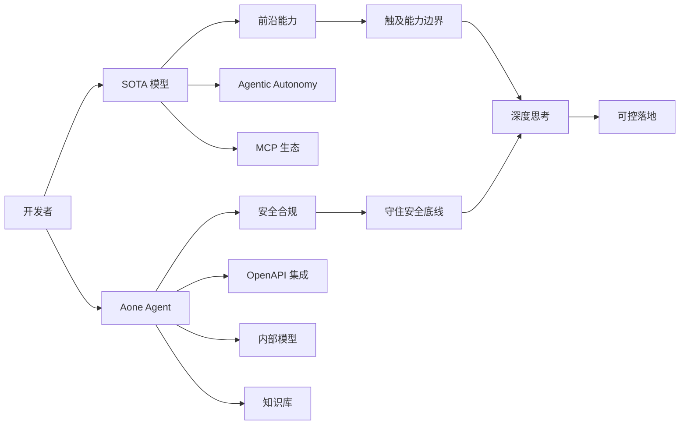
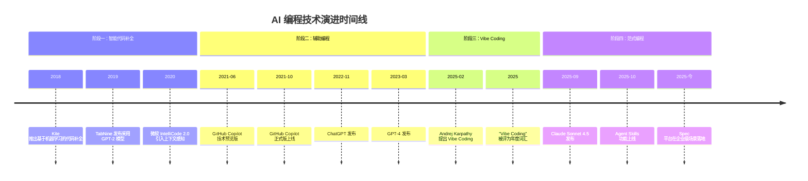
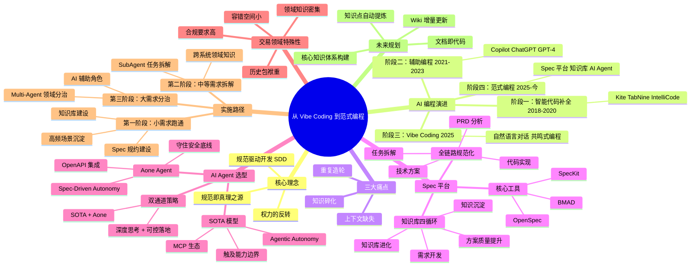

> **来源**：微信公众号"大淘宝技术" | **原文链接**：[从 Vibe Coding 到范式编程：用 Spec 打造淘系交易的 AI 领域专家](https://mp.weixin.qq.com/s/s4IVundC5cj61iY8rahA0A) | **日期**：2026年3月30日

---

## 一、核心观点摘要

**一句话总结**：AI 编程正从"Vibe Coding"（直觉对话）向"范式编程"（规范驱动）演进，核心是通过结构化规范（Spec）将领域知识显性化，培养 AI 成为真正的领域专家，实现从"人工编码"到"人机协同"的范式升级。

**核心论点展开**：

当前 AI 编程面临三大痛点：上下文缺失（AI 只能看到当前应用内容）、知识碎化（团队经验零散难传递）、重复造轮（缺乏统一规范导致代码混乱）。传统的 Vibe Coding 虽然降低了开发门槛，但在企业级场景中缺乏规范约束，难以保证可靠性、可维护性和合规性。

文章提出的解决方案是**范式编程（Spec-Driven Development, SDD）**：在编写代码之前，先构建一份结构化的规范文档，由 AI 编码代理（Agent）根据这份规范来生成、验证和迭代代码。其核心思想是"权力的反转"——不再是文档服务于代码，而是代码服务于规范。规范成为项目的"真理之源"，代码只是规范在特定技术栈下的渲染产物。

淘系交易系统构建了 Spec 平台，覆盖了完整的研发链路（PRD 分析 → 任务拆解 → 技术方案 → 代码实现），并通过知识库的循环沉淀机制，持续培养 AI 成为懂交易的领域专家。最终通过"SOTA 模型 + Aone Agent"双通道，在拥抱前沿技术的同时确保可控落地。

---

## 二、核心概念图谱

**图谱说明**：
- AI 编程经历了从"局部补全"到"规范驱动"的四阶段演进
- 范式编程的核心是 Spec 平台 + 知识库 + AI Agent + 质量体系
- 通过"规范驱动开发（SDD）"实现"权力的反转"
- 最终目标是培养 AI 成为真正的领域专家（K）

---

## 三、关键问题与解答

### 问题 1：为什么当前的 AI 编程工具在企业级场景中不够可靠？

**现状/困境**：
- AI 缺乏对项目整体架构的理解
- 不知道团队的编码规范和历史实现方式
- 不了解领域知识（交易链路核心逻辑、风控规则边界条件等）
- 生成的代码可能语法正确，但与项目规范格格不入

**解法/方案**：
- 构建 Spec 平台，提供完整研发链路的规范化管理
- 建立知识库，将零散的团队经验结构化沉淀
- 通过 AI Agent 基于规范和知识库生成代码，确保符合团队标准

**对比表格**：

| 维度 | 传统 AI 编程（Copilot/Cursor） | Spec 平台 |
|------|---------------------------|-----------|
| 上下文 | 当前应用有限内容 | 知识库 + 历史 + 约束 |
| 规范 | 无统一规范 | 强制执行领域约束 |
| 知识传递 | 口口相传、流失风险 | 结构化沉淀、自动召回 |
| 代码一致性 | 差异大、重复造轮 | 高度一致、可复用 |
| 可维护性 | 难以理解他人代码 | 规范即文档，文档永不过期 |

---

### 问题 2：如何让 AI "记住"领域知识，成为真正的团队成员？

**现状/困境**：
- 传统方式：老员工带新员工，口口相传
- 技术文档写了一堆，但更新滞后、散落各处
- 每个研发都有"提示词库"，但经验随人员流动而流失

**解法/方案**：
Spec 平台改变了这个局面：
1. **知识显性化**：AI 召回的知识点会被记录，每次生成都有版本控制
2. **方案可追溯**：基于规范化方案生成，完整研发链路可追溯
3. **规范强制执行**：生成过程受领域约束指导
4. **持续沉淀**：每次使用都是对知识库的投资，用得越多效果越好（复利效应）

---

### 问题 3：交易领域为什么特别需要范式编程？

**现状/困境**：
- **合规要求高**：交易及资金流转，任何代码变更都需要符合监管和内控要求
- **历史包袱重**：交易系统往往有多年历史，技术栈复杂，约定俗成的规则众多
- **容错空间小**：一个交易 bug 可能导致资损，与普通应用容错空间不同
- **领域知识密集**：涉及及大量的业务概念、流程规则、异常处理逻辑

**解法/方案**：
- 规范化生成是必要的防线（确保符合合规要求）
- 范式编程不是银弹，但在交易领域高频迭代的背景下，是目前最适配企业级需求的方法论
- 对于涉及资金安全的大型需求，AI 更多是辅助角色，关键决策和质量把关仍需人主导

---

## 四、技术架构

### Spec 平台整体架构

### 双通道 AI Agent 架构

### 技术演进驱动力

| 驱动力 | 从代码补全到 Vibe Coding | 从 Vibe Coding 到范式编程 |
|--------|----------------------|----------------------|
| 上下文窗口 | 4K→128K tokens | 128K→1M tokens |
| 模型能力 | MCP，工具调用 | Skills、RAG、Spec、Agent 能力成熟 |
| 交互方式 | 从被动补全到主动对话 | 从自由对话到结构化工作流 |
| 工程诉求 | 效率优先 | 质量与效率并重 |

---

## 五、对比分析

### OpenSpec vs Spec-Kit vs BMAD

| 维度 | OpenSpec | Spec-Kit | BMAD |
|------|----------|-----------|-------|
| 定位 | 轻量级、变更驱动的规范管理系统 | 完整的规范驱动开发生命周期工具 | 多智能体编排的完整交付引擎 |
| 项目类型 | 企业级应用迭代，团队协作，复杂重构 | 从 0 到 1 构建复杂单体项目 | 完整交付，不仅仅是需求到编码 |
| 变更管理 | Delta 格式，自动合并 | Git 分支，手动合并 | N/A |
| 规范组织 | 按 capability 按功能编号 | Constitution + Checklist | N/A |
| 工作流程 | 三阶段（提案→实现→归档） | 七阶段 | 需求→规划→设计→编码→测试→文档→部署 |
| 质量保证 | 格式验证 + 一致性检查 | Constitution + Checklist（更严格） | N/A |
| 工具集成 | 20+ 工具，统一指令 | 16+ 工具，脚本集成 | 多 Agent 协作 |
| 学习曲线 | 中等（Delta 格式） | 较高（完整生命周期） | N/A |

### SOTA 模型 vs Aone Agent vs Google Gemini CLI

| 维度 | SOTA 模型 | Google Gemini CLI | Aone Agent |
|------|-----------|-----------------|------------|
| 设计核心 | "Agentic Autonomy"（智能体自治） | N/A | "Spec-Driven Autonomy"（规范驱动自治） |
| 被设计成 | 深刻理解项目上下文，具备前瞻性规划和执行复杂任务 | N/A | 理解开发者意图，端到端主导交付生产级代码 |
| 目标 | "治理"的任务委托引擎 | N/A | "协作"的多智能体编排引擎 |
| 能力边界 | 触及能力天花板 | N/A | 守住安全底线 |
| 适用场景 | 通用、前沿能力验证 | 通用 CLI 工具 | 企业级应用、安全合规要求高 |

---

## 六、数据与生态

### 关键数据

- **Stack Overflow 年度报告显示**：
  - 81% 的开发者认为 AI 工具的最大好处在于提升生产力
  - 62.4% 的开发者认为 AI 加快学习速度
  - 58.5% 的开发者认为 AI 提升效率
  - 但同时也有 25% 的开发者认为 AI 工具在处理复杂、工程任务时表现很差或非常差

- **GitHub 报告显示**（2024 年）：
  - 超过 82% 的开发者已经在使用某种形式的 AI 编程助手
  - Copilot 贡献了公司超过 40% 的代码营收增长
  - 但 Copilot 生成的代码缺乏对项目整体架构的理解

### 技术生态

- **2024 年 11 月**：Anthropic 发布 MCP（Model Context Protocol）协议，为 Vibe Coding 提供了关键的技术基础
- **2025 年 9 月**：Anthropic 发布 Claude Sonnet 4.5，在约 20 万 token 的上下文窗口下，可以长时间、稳定地"挂住"整个代码仓库、技术方案和运行日志，支持连续数小时的自动编码与调试
- **2025 年 10 月**：Agent Skills 功能上线，允许把团队的 SOP、编码规范、领域约束打包成可版本化、可测试、可复用的技能包

---

## 七、行业趋势与预测

### 时间线演进

### 趋势预测

1. **上下文窗口持续扩大**：从 4K 到 128K 再到 1M tokens，AI 能"挂住"整个代码库
2. **模型能力成熟**：MCP、工具调用、Skills、RAG、Spec、Agent 能力日趋成熟
3. **交互方式演进**：从被动补全到主动对话，再到结构化工作流
4. **工程诉求转变**：从效率优先到质量与效率并重

---

## 八、思维导图

---

## 九、关键金句摘录

1. **技术演进**："2020 年代，这个问题有了全新的答案：让 AI 成为编程的协作者。"

2. **Vibe Coding 核心**："你只需要与 AI 共鸣，用自然语言描述你想要的，它就会生成代码。"

3. **规范驱动开发**："规范驱动开发（SDD）的核心理念是：实现一次'权力的反转'。在 SDD 范式中，不再是文档服务于代码，而是代码服务于规范。"

4. **知识复利效应**："每次使用都是对知识库的投资，每次沉淀都让下一次生成更精准。这不是线性增长，而是用得越多，效果越好，效果越好，用得越多的复利效应。"

5. **AI 作为团队 N+1 号成员**："与其把 AI 当作一个外部工具，不如把它看作团队的新成员。这个成员有点特殊：它不会疲惫，可以同时服务所有同事；它不会遗忘，所有历史经验都能随时调用；它不会离职，知识不会因为人员变动而流失。"

6. **培养领域专家**："刚开始，它只懂通用编程；随着知识库的积累，它开始理解业务；经过几个月的沉淀，它成为真正的领域专家。"

7. **交易领域特殊性**："交易领域尤其需要范式编程——合规要求高、历史包袱重、容错空间小、领域知识密集。"

8. **双通道策略**："用 SOTA 模型触及能力边界、用 Aone Agent 守住安全底线，在拥抱业界最前沿形态的同时，确保淘系复杂技术场景下的可控落地。"

---

## 十、总结与洞察

### 1. AI 编程范式的必然演进

**洞察**：AI 编程的演进不是偶然，而是由三大驱动力决定的——上下文窗口的扩大、模型能力的成熟、交互方式的演进。从"智能代码补全"到"辅助编程"再到"Vibe Coding"，最终走向"范式编程"，这是技术发展的必然路径。

**分析**：Vibe Coding 的出现，让非专业程序员也能构建应用程序，极大地降低了软件开发门槛。但对于交易系统这样的核心业务领域，"随性而为"显然不够。范式编程通过将规范置于开发中心，确保了代码的可靠性、可维护性和合规性。

---

### 2. 规范驱动开发（SDD）的价值

**洞察**：SDD 的核心思想是"权力的反转"——规范成为项目的唯一真理来源，所有代码、测试、文档都从规范生成。规范即文档，文档永不过期。

**分析**：这种模式颠覆了传统"代码先行"的思维。开发者的重心从"逐行实现代码"上升到"更高层次的设计与指导"。虽然范式编程不是对 Vibe Coding 的否定，而是继承与升华——它保留了自然语言交互的便捷性，同时通过规范约束确保了企业级质量。

---

### 3. 知识库建设的复利效应

**洞察**：Spec 平台改变了知识传递的方式——从"口口相传、散落各处、滞后被动"变为"结构化、可追溯、随流程同步、主动推送"。

**分析**：知识不再躺在某个角落的静态文档，而是活的、能被 AI 理解和调用的组织。每次使用都是对知识库的投资，形成了"用得越多，效果越好"的复利效应。知识留在组织，不随人员流动而流失。

---

### 4. 双通道策略的前瞻性

**洞察**：单纯依靠 SOTA 模型或内部 Agent 都有局限性。SOTA 模型能力天花板高但安全合规风险大；内部 Agent 安全合规但生态弱、创新慢。

**分析**：淘系采用"SOTA 模型 + Aone Agent"双通道，实现了能力边界与安全底线的平衡。SOTA 模型代表前沿智能天花板，Aone Agent 代表企业级安全底线。这种组合在拥抱最前沿技术的同时，确保了可控落地。

---

### 5. 交易领域的特殊性

**洞察**：交易领域对 AI 编程有特殊要求——合规要求高、历史包袱重、容错空间小、领域知识密集。

**分析**：范式编程不是银弹，但在交易领域高频迭代的背景下，是目前最适配企业级需求的方法论。对于小需求和中等需求，范式编程可以大幅提升效率；对于涉及资金安全的大型需求，AI 更多是辅助角色，关键决策和质量把关仍需人主导。

---

### 6. 命令行 AI Agent 的独特价值

**洞察**：为什么是看起来有些复古的远程 CodeAgent，而不是功能强大的 IDE 或便捷的 WebUI？答案在于 Spec 编程所追求的"执行深度"和"集成自由度"。

**分析**：命令行 AI 智能体（L3/L4）是真正的"原生工作流智能体"。它与开发者共享着同一个宇宙——终端。在这个宇宙里，一切都是文件，一切都可由命令驱动。这赋予了它无与伦比的集成自由度和执行深度。这种"生于终端，能力无界"的特性，决定了命令行 AI 智能体是实践规范驱动开发（SDD）、实现真正 AI 原生工作流的唯一正确路径。

---

## 附录：核心概念解释

**Vibe Coding**
- **定义**：一种全新的编程范式，开发者用自然语言描述想要的功能，AI 理解意图并生成代码
- **要点**：强调与 AI 的共鸣，自然语言交互，降低开发门槛
- **局限**：缺乏规范约束，不适合企业级复杂场景

**规范驱动开发（Spec-Driven Development, SDD）**
- **定义**：在编写代码之前，先编写一份"规范"，然后再使用人工智能进行开发
- **要点**：规范是唯一真理来源，所有代码、测试、文档都从规范生成
- **核心理念**：权力的反转——代码服务于规范，而非规范服务于代码

**Spec 平台**
- **定义**：用于管理开发规范的系统，支持全链路规范化、知识库沉淀、AI Agent 集成
- **核心价值**：通过提案、技术方案、代码生成的全链路规范化，培养适合交易场景的 AI 专家

**知识库**
- **定义**：结构化的领域知识存储系统，包含历史方案、编码规范、踩坑记录等
- **特点**：可自动召回、可追溯版本、可分类管理、随开发流程同步

**AI Agent**
- **定义**：能够自主执行任务、理解上下文、进行规划和推理的 AI 系统
- **类型**：
  - SOTA 模型：前沿能力天花板，Agentic Autonomy 设计
  - 企业 Agent：安全合规底线，Spec-Driven Autonomy 设计

**MCP（Model Context Protocol）**
- **定义**：Anthropic 发布的协议，标准化了 AI 与外部工具、知识库的交互方式
- **意义**：让"增强环境的 AI 编程"成为可能

**Agent Skills**
- **定义**：将团队的 SOP、编码规范、领域约束打包成可版本化、可测试、可复用的技能包
- **意义**：由模型在需要时按需加载，实现能力的模块化

---

## 原文内容

（由于原文过长，此处省略完整原文内容。如需查看原文，请访问：https://mp.weixin.qq.com/s/s4IVundC5cj61iY8rahA0A）
