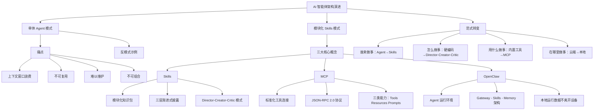
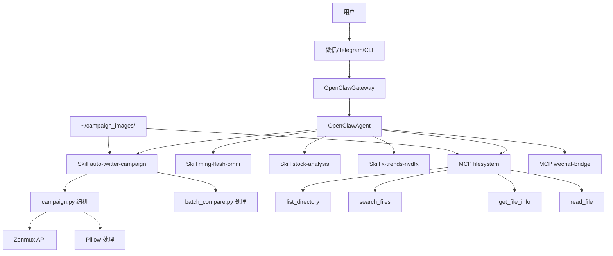

> **来源**：微信公众号"阿里云开发者"  
> **原文链接**：[从 Agent 到 Skills — AI 智能体架构的范式转变](https://mp.weixin.qq.com/s/RMh2JqHwkjonPTZlwVKxsw)  
> **作者**：元丹  
> **报告日期**：2026-02-28  
> **关键词**：Agent Skills, MCP, OpenClaw, A2A, Agentic AI, 模块化架构

---

## 一、核心观点摘要

**一句话总结**：AI 智能体架构正从"单体 Agent"向"模块化 Skills"范式转变，通过 MCP（工具连接协议）、Skills（知识模块）和 OpenClaw（运行环境）的协同，实现了"谁来做事、怎么做事、用什么做事、在哪里做事"四个维度的标准化，最终形成可组合、可复用、可共享的 AI 能力生态。

**核心论点展开**：

### 1.1 起源：Anthropic 的两步棋

Anthropic 在不到 14 个月内连续发布了两个开放标准：

- **2024 年 11 月**：开源 MCP（Model Context Protocol）——解决 AI 模型与外部工具/数据的连接问题
- **2025 年 10 月**：在 Claude Code 中推出 Agent Skills——解决 AI 模型的领域专业知识加载问题
- **2025 年 12 月 18 日**：将 Agent Skills 作为开放标准发布，48 小时内被 Microsoft、OpenAI 采纳
- **2025 年 12 月**：MCP 捐赠给 Linux 基金会（Agentic AI Foundation），从公司项目升级为行业标准

**Anthropic 工程博客原文**：
> "Building a skill for an agent is like putting together an onboarding guide for a new hire. Instead of building fragmented, custom-designed agents for each use case, anyone can now specialize their agents with composable capabilities."

### 1.2 行业响应

Agent Skills 开放标准发布后，各家跟进很快：

- **Microsoft**：48 小时内宣布支持
- **OpenAI Codex**：迅速集成 Skills 格式
- **Cursor、Codebuddy**：原生支持
- **OpenClaw**：成为 Skills 生态最大的消费者之一，拥有 3000+ 社区 Skills
- **Spring AI**：2026 年 1 月发布 Agent Skills 集成模式

**Gartner 2024 年的预测已经应验**：到 2026 年，75% 的 AI 项目聚焦于可组合的 Skills 而非单体 Agent。

### 1.3 核心转变

传统单体 Agent 将所有能力内嵌于一个大型系统提示或模型权重中，面临四大痛点：

1. **上下文窗口浪费**：加载大量无关指令
2. **不可复用**：每个 Agent 重复造轮子
3. **难以维护**：修改一处可能影响全局
4. **不可组合**：无法在 Agent 之间共享能力

Skills 模式通过模块化、文件系统驱动的能力包，解决了这些问题，实现了：

- **按需加载**：Agent 不用一次性吞下所有知识，节省上下文窗口
- **高复用性**：同一个 Skill 可以被多个 Agent 共享
- **易维护性**：每个 Skill 独立演进，不影响其他
- **高可组合性**：Skills 之间可以自由组合

---

## 二、核心概念图谱



---

## 三、关键问题与解答

### 问题 1：为什么需要从单体 Agent 转向 Skills？

**现状/困境**：

传统单体 Agent 是一个单体式的自主推理实体，将所有能力内嵌于一个大型系统提示或模型权重中：

```
┌─────────────────────────────────┐
│         Monolithic Agent         │
│                                 │
│  ┌───────────────────────────┐ │
│  │ 巨大的 System Prompt   │ │
│  │ (所有知识 + 所有指令) │ │
│  └───────────────────────────┘ │
│                                 │
│  ┌───────────────────────────┐ │
│  │ 硬编码的工具调用逻辑   │ │
│  └───────────────────────────┘ │
│                                 │
│  ┌───────────────────────────┐ │
│  │ 自定义 API 集成        │ │
│  └───────────────────────────┘ │
│                                 │
│  └─────────────────────────────────┘
```

**痛点**：

1. **上下文窗口浪费**：加载大量无关指令
2. **不可复用**：每个 Agent 重复造轮子
3. **难以维护**：修改一处可能影响全局
4. **不可组合**：无法在 Agent 之间共享能力

**解法/方案**：

Skills 是 Anthropic 提出的模块化、文件系统驱动的能力包。思路是把专业知识从 Agent 中拆出来，变成可发现、可加载、可共享的独立模块。

```
my-skill/
├── SKILL.md ← 主文件：YAML 元数据 + Markdown 指令
├── scripts/
│   ├── deploy.sh ← 可执行脚本
│   └── validate.py
├── templates/
│   └── config.yaml ← 模板资源
└── docs/
    └── reference.md ← 参考文档
```

**优势**：

- Agent 不用一次性吞下所有知识，按需加载，省上下文窗口
- 同一个 Skill 可以被多个 Agent 复用
- 每个 Skill 独立演进，不影响其他
- Skills 之间可以自由组合

### 问题 2：MCP 和 Skills 有什么区别？

**现状/困境**：

很多开发者对 MCP 和 Skills 的边界不清晰，容易混淆两者。

**解法/方案**：

| 维度 | MCP | Skills |
|------|-----|--------|
| 连接方式 | 运行时动态连接（客户端-服务器） | 静态文件系统加载 |
| 内容类型 | API 调用、数据查询、工具执行 | 文档、指令、脚本、模板 |
| 协议 | JSON-RPC 2.0 over Streamable HTTP | 文件目录 + YAML + Markdown |
| 状态 | 有状态（会话连接） | 无状态（按需读取） |
| 适用场景 | 连接 GitHub、数据库、Slack 等外部服务 | 教 Agent 如何做部署、写代码、处理数据 |
| 开发成本 | 需要写 Server 代码 | 只需写 Markdown 文件 |

**关键比喻**：

> "MCP 是'递给你一把锤子'，Skills 是'教你怎么用这把锤子钉钉子'。"

**协作关系**：

```
Skill: filesystem/prompt.md
"当用户想查看处理结果时，先通过 MCP 的 list_directory 列出文件，
然后用 search_files 搜索特定模式的文件，
再用 get_file_info 获取文件大小和修改时间..."
         ▼
    Agent 按照 Skill 指令行动
         ▼
MCP Server: filesystem (stdio)
  server.tool("list_directory", {path})
  server.tool("search_files", {path, pattern})
```

---

### 问题 3：OpenClaw 在这个生态中扮演什么角色？

**现状/困境**：

AI 编程工具有多种形态：IDE 插件、WebUI、远程 CodeAgent，为什么是 OpenClaw？

**解法/方案**：

OpenClaw 是奥地利开发者 Peter Steinberger（PDFKit/Nutrient 创始人）做的开源 AI 代理框架，目前是 Skills 生态里最活跃的平台。

**核心架构**：

```
┌───────────────────────────────────────────────────────────┐
│              OpenClaw 架构                          │
│                       │
│    Gateway─── 消息平台连接层                    │
│  (WhatsApp/Telegram/Discord)                         │
│         │ + 可桥接扩展其他平台)                     │
│         │ ▼                                        │
│    Agent──── 推理引擎（理解用户意图）                │
│         │ │                                        │
│         │ ▼ ▼ ▼                                    │
│    Skills──── 模块化能力扩展                           │
│  (3000+ 社区 Skills)                                │
│         │ ▼                                        │
│    Memory──── 持久化存储层                          │
│  (上下文 + 偏好)                                    │
└───────────────────────────────────────────────────────────┘
```

**特点**：

- **本地运行，数据不离开设备**
- **后台守护进程**，监听文件变更、聊天消息、社交动态
- **3000+ 社区 Skills**，53+ 官方集成
- **通过 MCP Server 连接外部服务**

**定位**：

| 维度 | Agent | Skills | MCP | OpenClaw |
|------|-------|--------|-----|----------|
| 本质 | 自主推理实体 | 模块化知识包 | 工具连接协议 | Agent 运行框架 |
| 类比 | 一个全能员工 | 员工的培训手册 | 员工的工具箱接口 | 员工的办公室 |

---

## 四、技术架构

### 4.1 完整生产架构



### 4.2 实战项目：自动化美化相册

**业务目标**：将旅行手机照片自动处理为社交媒体发布内容

**技术栈**：

| 组件 | 技术选型 |
|------|----------|
| AI 模型 | Ming-flash-omni-2.0（多模态图文生成） |
| API 网关 | Zenmux（Vertex AI 兼容接口） |
| Agent 运行环境 | OpenClaw（本地自主代理框架）/ Claude Code（对比方案） |
| Agent 推理模型 | Kimi K2.5 (OpenClaw) / Claude Opus 4.6 (Claude Code，仅编写时) |
| Skill 主体 | auto-twitter-campaign Skill |
| 文件系统 MCP | @modelcontextprotocol/server-filesystem（stdio，已验证 14 个 Tools 全部可用） |
| 微信消息通道 | 键盘模拟直接控制（wechat-mcp v2 协议层可通但实际操作不可用） |

**实际目录布局**：

```bash
# === 独立工程（各有各的 Git 仓库）===
# Filesystem MCP Server（Anthropic 官方维护，已验证可用）
# 安装方式：npx -y @modelcontextprotocol/server-filesystem <允许目录>
# 提供 14 个 Tools：read_file, write_file, edit_file, list_directory, search_files, get_file_info, ...
# 传输方式：stdio（标准输入输出）

# === OpenClaw Skills — 两个目录，不同用途 ===
# ~/.openclaw/workspace/skills/ ← "重型" Skills（带脚本的业务流水线）
~/.openclaw/workspace/skills/
├── auto-twitter-campaign/ ← 本文主角：图片处理 + 文案生成
│   ├── SKILL.md
│   └── scripts/
│       ├── campaign.py ← 编排器
│       └── batch_compare.py ← 图像处理流水线
├── ming-flash-omni/ ← 单图交互 Skill
├── stock-analysis/ ← 股票分析
└── x-trends-nvdfx/ ← Twitter 趋势

# ~/.openclaw/skills/ ← "轻型" Skills（MCP 的使用说明书）
~/.openclaw/skills/
├── filesystem/ ← 教 Agent 怎么用 Filesystem MCP
│   ├── skill.json
│   └── prompt.md
└── wechat/ ← 教 Agent 怎么用微信键盘模拟
    ├── skill.json
    ├── prompt.md ← "怎么使用微信键盘模拟"的说明
    └── scripts/send_message.sh 等

# === MCP 注册配置 ===
# ~/.claude.json → mcpServers ← 告诉 Agent 每个 MCP Server 怎么启动

# === 业务数据 ===
~/campaign_images/
├── images/new/ ← 待处理原图（输入）
├── candidates/ ← 中间产物
└── results/ ← 最终产出（对比图/GIF/推文）
```

**注意**：它们是"分层引用"关系，不是"包含"关系。

### 4.3 层级关系

| 层 | 位置 | 角色 |
|------|------|------|
| MCP Server | @modelcontextprotocol/server-filesystem | Anthropic 官方 Node.js 包（npx 直接运行） |
| MCP 注册 | ~/.claude.json 的 mcpServers | 告诉 Agent "Server 怎么启动" |
| Skill 说明书 | ~/.openclaw/skills/filesystem/ | 教 Agent "MCP Tools 怎么用" |
| Skill 业务脚本 | ~/.openclaw/workspace/skills/auto-twitter-campaign/ | 自包含流水线，不依赖 MCP |

### 4.4 完整端到端执行流

用户在微信发送："帮我处理今天的唐乾陵照片，生成推文"

```
1. Gateway 收到微信消息
   ↓
2. Agent 推理引擎解析意图: "处理照片 + 生成文案"
   ↓
3. Agent 扫描 Skill 元数据
   ↓
4. 匹配 auto-twitter-campaign（description 包含 "process pending images"）
   ↓
5. Agent 加载 SKILL.md Level 2 指令
   ↓
6. 发现命令: python3 scripts/campaign.py run
   ↓
7. Agent 执行 Skill 脚本
   ↓
   Stage 1: 图片处理
   │  ├→ Director: analyze_cleanup() → "去除右侧三个游客和右侧金属栏杆"
   │  ├→ Creator ×3: edit_image() → 3 个清理候选
   │  └→ Critic: score_image() → "候选2最佳，85分"
   ↓
   Stage 2: 风格化
   │  ├→ Style Director: analyze_3styles() → "秋日暖色/夕阳/水墨"
   │  └→ Creator ×3: 每种风格各生成 1 张
   ↓
   Stage 3: 生成 GIF
   │  ├→ 拼接对比图 → make_comparison()
   │  └→ 生成 GIF 动画 → make_gif()
   ↓
   Stage 4: 写推文
   │  ├→ 生成 GIF → generate_tweet_text()
   │  └→ AI 写推文 → Ming API 调用
   ↓
8. Agent 通过 MCP:filesystem 读取 results/ 目录
   ↓
9. Agent 列出新生成的对比图和 GIF 文件
   ↓
10. Agent 通过微信桥接脚本发通知
   ↓
   "唐乾陵照片处理完成 ✓"
```

---

## 五、对比分析

### 5.1 定位对比

| 维度 | OpenSpec | Spec-Kit | BMAD |
|------|----------|----------|-------|
| 定位 | 轻量级、变更驱动的规范管理系统 | 完整的规范驱动开发生命周期工具 | 多智能体编排的完整交付引擎 |
| 项目类型 | 企业级应用迭代，团队协作，复杂重构 | 从 0 到 1 构建复杂单体项目 | 完整交付，不仅仅是需求到编码 |
| 适合规模 | 企业级应用迭代，规范完整全面 | 初创团队，领域协作，风格一致 | 大型项目全流程 |

### 5.2 三大 Agent 能力对比

#### ⚡ SOTA 模型 vs Aone Agent vs Google Gemini CLI

| 维度 | ⚡ SOTA 模型 | 🔧 Google Gemini CLI | 🛡 Aone Agent |
|------|------------------|----------------------|----------------|
| **设计核心** | "Agentic Autonomy"（智能体自治） | N/A | "Spec-Driven Autonomy"（规范驱动自治） |
| **被设计成** | 深刻理解项目上下文，具备前瞻性规划和执行复杂任务 | N/A | 理解开发者意图，端到端主导交付生产级代码 |
| **目标** | "🎓 治理"的任务委托引擎 | N/A | "🤝 协作"的多智能体编排引擎 |
| **能力边界** | 🚀 触及能力天花板 | N/A | 🛡️ 守住安全底线 |
| **适用场景** | 通用、前沿能力验证 | 通用 CLI 工具 | 企业级应用、安全合规要求高 |

### 5.1 四大核心架构对比

#### 🏗️ Agent vs Skills vs MCP vs OpenClaw

| 维度 | 🤖 Agent | 📚 Skills | 🔌 MCP | 🏠 OpenClaw |
|------|----------|----------|------|------------|
| **本质** | 自主推理实体 | 模块化知识包 | 工具连接协议 | Agent 运行框架 |
| **类比** | 一个全能员工 | 📖 员工的培训手册 | 🔨 员工的工具箱接口 | 🏠 员工的办公室 |
| **解决的问题** | "🧑‍💼 谁来做事" | "💡 怎么做事" | "🔨 用什么做事" | "📍 在哪里做事" |
| **粒度** | 粗（整个系统） | 细（单个能力） | 细（单个连接） | 粗（整个平台） |
| **可复用性** | ⬇️ 低 | ⬆️ 高 | ⬆️ 高 | ⬆️ 高 |
| **标准化程度** | ❌ 无统一标准 | ✅ 开放标准 | ✅ 开放标准 | ✅ 开源框架 |

---

### 5.2 MCP vs Skills 详细对比

#### 📊 技术对比表

| 维度 | 📡 MCP | 📚 Skills |
|------|----------|----------|
| **连接方式** | 运行时动态连接（客户端-服务器） | 静态文件系统加载 |
| **内容类型** | API 调用、数据查询、工具执行 | 文档、指令、脚本、模板 |
| **协议** | JSON-RPC 2.0 over Streamable HTTP | 文件目录 + YAML + Markdown |
| **状态** | 🌐 有状态（会话连接） | 📖 无状态（按需读取） |
| **适用场景** | 连接 GitHub、数据库、Slack 等外部服务 | 教 Agent 如何做部署、写代码、处理数据 |
| **开发成本** | 需要写 Server 代码 | 只需写 Markdown 文件 |

#### 💡 关键比喻

> **"MCP 是'递给你一把锤子'，Skills 是'教你怎么用这把锤子钉钉子'"**

---

### 5.3 三大 Agent 能力对比

#### ⚡ SOTA 模型 vs Aone Agent vs Google Gemini CLI

| 维度 | ⚡ SOTA 模型 | 🔧 Google Gemini CLI | 🛡 Aone Agent |
|------|----------------|----------------------|--------------|
| **设计核心** | "Agentic Autonomy"（智能体自治） | N/A | "Spec-Driven Autonomy"（规范驱动自治） |
| **被设计成** | 深刻理解项目上下文，具备前瞻性规划和执行复杂任务 | N/A | 理解开发者意图，端到端主导交付生产级代码 |
| **目标** | "🎓 治理"的任务委托引擎 | N/A | "🤝 协作"的多智能体编排引擎 |
| **能力边界** | 🚀 触及能力天花板 | N/A | 🛡️ 守住安全底线 |
| **适用场景** | 通用、前沿能力验证 | 通用 CLI 工具 | 企业级应用、安全合规要求高 |


