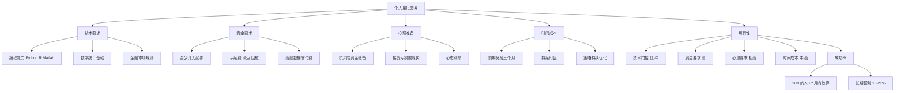
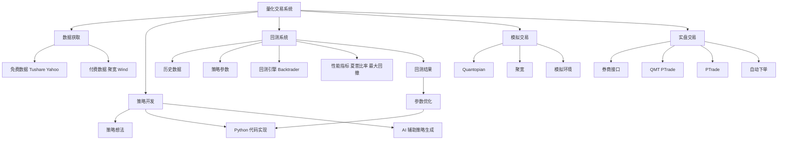
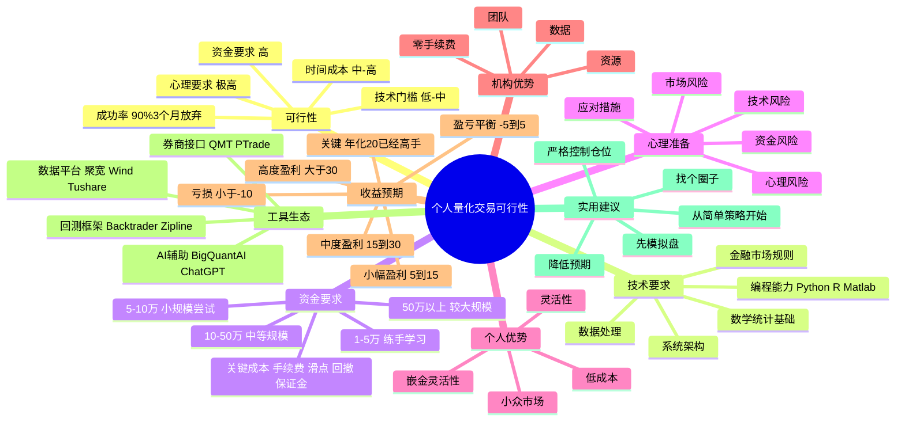

> **来源**：知乎  
> **原文链接**：[个人做量化交易是否可行？](https://www.zhihu.com/question/529408913/answer/201938423782917808)  
> **问题**：个人做量化交易是否可行呢？  
> **作者**：Charmve（沉淀和传播机器学习+计算机视觉，自动驾驶、量化交易）  
> **回答者**：Charmve、丁帅、Max、而我在等你、安昙（AI量化交易投研助手作者）  
> **赞同数**：681（截至2026-03-30）  
> **发布日期**：2024-04-04 10:01  
> **编辑日期**：2025-01-04 09:59

---

## 一、核心观点摘要

**一句话总结**：个人做量化交易是可行的，但 90% 的人在 3 个月内会失败，核心原因不是技术不够难，而是对市场风险的认知不足、资金储备不足、心态管理失败。个人量化的优势在于灵活性和低成本劣势，而机构的优势在于资源和数据。

**核心论点展开**：

### 1.1 可行性的判断标准

量化交易的本质是用代码实现交易策略，通过历史数据回测验证策略的有效性，然后用程序自动执行交易。个人做量化完全可行，但需要满足以下几个条件：

1. **技术门槛**：会写代码（Python 是标配，R/Matlab 也行），能自己搭交易策略
2. **数学/统计基础**：懂点数学/统计（比如均值回归、统计套利），还得懂金融市场规则（别连 K 线都看不懂就冲）
3. **数据获取渠道**：免费数据像雅虎财经、Tushare 还行，但高频数据得花钱
4. **资金门槛**：至少几万起步（手续费、滑点、回撤都能吃利润，钱太少玩不动）
5. **心理准备**：得有亏钱的准备（回测猛如虎，实盘亏成狗是常态）
6. **时间成本**：前期要死磕（研究策略、改 bug、调参数，没三个月难出活）

### 1.2 个人 vs 机构：优劣势对比

个人量化相对于机构，有独特的优势也有明显的劣势：

| 维度 | 个人 | 机构 |
|------|------|------|
| **优势** | 灵活性（比如炒小币、玩冷门期货） | 资源（卫星数据、PhD 团队、零手续费） |
| **劣势** | 资金少、数据差、工具不专业 | 灵活性差、官僚枷锁、同质化竞争 |

---

## 二、核心概念图谱

---

## 三、关键问题与解答

### 问题 1：个人做量化需要哪些技能？

**现状/困境**：

很多人认为量化 = AI + 自动赚钱，但实际上个人量化需要的技能组合包括：

**解法/方案**：

| 技能类别 | 具体要求 | 难度 |
|---------|----------|------|
| **编程能力** | Python 是必备，R/Matlab 可选，能搭交易策略框架 | ⭐⭐⭐ |
| **数学/统计** | 均值回归、统计套利、时间序列分析 | ⭐⭐⭐⭐ |
| **金融知识** | K 线、期货、期权的基础知识，交易规则 | ⭐⭐⭐⭐ |
| **数据处理** | 数据清洗、因子挖掘、回测框架 | ⭐⭐⭐ |
| **系统架构** | 策略编写、回测、模拟交易、实盘交易 | ⭐⭐⭐ |

**关键洞察**：不是说这些都要精通，而是至少要能独立完成从策略想法到实盘交易的完整流程。

---

### 问题 2：个人做量化需要多少资金？

**现状/困境**：

很多人以为量化几千块就能开始，但实际上资金门槛比想象中要高得多。

**解法/方案**：

| 资金规模 | 适用场景 | 建议 |
|---------|----------|------|
| **1-5 万** | 练手、学习 | 纯模拟盘，别实盘 |
| **5-10 万** | 小规模尝试 | 可以尝试简单策略，严格控制仓位 |
| **10-50 万** | 中等规模 | 可以做多策略组合，但注意风险 |
| **50 万以上** | 较大规模 | 可以考虑高频策略、套利等 |

**关键成本**：
- **手续费**：万三、万分之几，看起来小但高频交易下会累积
- **滑点**：下单价格与成交价格的差，高频交易下尤其明显
- **回撤**：策略失效时的浮亏，可能直接吃掉几个月的利润
- **保证金**：期货、期权等衍生品需要保证金，占用资金

**关键洞察**：钱太少玩不动，不是说你不能赚钱，而是手续费、滑点、回撤这些成本会吃掉大部分利润。

---

### 问题 3：个人做量化最大的风险是什么？

**现状/困境**：

很多人认为量化最大的风险是"策略失效"，但实际上更大的风险是"人性弱点"。

**解法/方案**：

| 风险类型 | 表现 | 应对措施 |
|---------|------|----------|
| **技术风险** | 策略失效、代码 bug | 严格回测、模拟盘验证、小仓位实盘 |
| **市场风险** | 极端行情、黑天鹅事件 | 多策略分散、动态仓位控制、风险对冲 |
| **资金风险** | 亏损超过承受能力 | 严格控制单策略仓位、设置止损、准备备用金 |
| **心理风险** | 恐惧、贪婪、冲动 | 程序化交易、情绪管理、定期复盘 |

**关键洞察**：机器执行比你冷静（但遇上极端行情，你忍得住不手动干预？），但人性弱点如恐惧和贪婪，往往是导致失败的根本原因。

---

### 问题 4：个人做量化能赚多少钱？

**现状/困境**：

很多人幻想年化 50%、100%，但实际上个人量化的真实收益远低于预期。

**解法/方案**：

| 收益水平 | 年化收益率 | 适用场景 | 难度 |
|---------|------------|----------|------|
| **亏损** | < -10% | 新手、策略不成熟 | ⭐ |
| **盈亏平衡** | -5% ~ 5% | 学习阶段、小额资金 | ⭐⭐ |
| **小幅盈利** | 5% ~ 15% | 有经验的个人 | ⭐⭐⭐ |
| **中度盈利** | 15% ~ 30% | 精英个人、运气好 | ⭐⭐⭐⭐ |
| **高度盈利** | > 30% | 天才级、运气极好 | ⭐⭐⭐⭐⭐ |

**关键洞察**：年化 20% 已经是高手，年化 50% 基本上不可能长期持续。机构都难持续跑赢大盘，个人更得掂量。

---

## 四、技术架构

### 4.1 量化交易系统架构

---

### 4.2 技术栈对比

| 组件 | 免费方案 | 付费方案 |
|------|----------|----------|
| **数据源** | Tushare、Yahoo Finance、AKShare | 聚宽、Wind、米筐 |
| **回测框架** | Backtrader、Zipline（开源） | 聚宽回测、Wind 终端 |
| **实盘接口** | QMT（券商提供）、PTrade（券商提供） | 付费聚宽接口（更稳定） |
| **策略开发** | Python、TradingView 策略 | Python + AI 辅助（ChatGPT、Claude） |
| **可视化** | Matplotlib、Plotly（开源） | 聚宽、Wind 终端（更专业） |

---

## 五、对比分析

### 5.1 个人 vs 机构量化对比

| 维度 | 个人量化 | 机构量化 |
|------|----------|------------|
| **灵活性** | ⭐⭐⭐⭐⭐（炒小币、冷门期货） | ⭐⭐（受限于合规和风险控制） |
| **资金规模** | ⭐⭐（几万到几十万） | ⭐⭐⭐⭐⭐（几十亿） |
| **数据质量** | ⭐⭐（免费数据、延迟高） | ⭐⭐⭐⭐⭐（卫星数据、零延迟） |
| **交易成本** | ⭐⭐⭐（散户佣金、较高） | ⭐⭐⭐⭐⭐（机构费率、零佣金） |
| **团队规模** | ⭐（单兵作战） | ⭐⭐⭐⭐⭐（PhD 团队、分工明确） |
| **合规要求** | ⭐⭐（相对宽松） | ⭐⭐⭐⭐⭐（极其严格） |
| **盈利能力** | ⭐⭐⭐⭐（年化 10-30%） | ⭐⭐⭐（年化 5-15%） |
| **风险控制** | ⭐⭐⭐（仓位控制、止损） | ⭐⭐⭐⭐⭐（系统性风控） |

**关键洞察**：个人量化的优势在于灵活性和低成本，劣势在于资源、数据和团队。机构量化虽然资金雄厚、数据优质、团队专业，但受限于合规和风险控制，灵活性较差。

---

## 六、数据与生态

### 6.1 知乎量化生态

知乎作为国内最大的知识分享平台，在量化交易领域有丰富的内容生态：

| 内容类型 | 代表作者/话题 | 关注度 |
|---------|--------------|--------|
| **量化入门** | "有人用过量化交易吗？"（1.3 万关注） | ⭐⭐⭐⭐⭐ |
| **量化交易** | "大家都是怎样走上量化交易这条路的？"（36.7 万关注） | ⭐⭐⭐⭐⭐ |
| **现在量化交易好做吗？** | "现在量化交易已经发展到什么水平了？"（30.2 万关注） | ⭐⭐⭐⭐⭐ |
| **量化工具** | QMT、PTrade、BigQuantAI | ⭐⭐⭐⭐ |
| **量化书籍** | 《量化交易》（Ernest Chan） | ⭐⭐⭐⭐ |

---

### 6.2 技术工具生态

| 工具类型 | 代表工具 | 特点 |
|---------|----------|------|
| **券商接口** | QMT（中信证券、国泰君安等） | 稳定、速度快、功能全 |
| | PTrade（多家券商支持） | 易用、可视化好、支持回测 |
| | 通达信量化 | 免费、基础功能、适合入门 |
| **数据平台** | 聚宽 | 免费、回测一体、社区活跃 |
| | Wind | 付费、专业级、机构首选 |
| | Tushare | 免费、数据全、更新快 |
| | AKShare | 免费、数据杂、更新较慢 |
| **回测框架** | Backtrader | 开源、功能全、社区活跃 |
| | Zipline | 开源、Python 标准、适合复杂策略 |
| | Quantopian | 模拟盘、数据全、适合练手 |
| **AI 辅助** | BigQuantAI | 策略为主、可视化好 |
| | ChatGPT/Claude | 代码生成、灵感来源、调试助手 |

---

## 七、思维导图

---

## 八、关键金句摘录

1. **Charmve**："经过五年的交易经验，并从 23 年 5 月开发 Qbot，从数据获取、清洗，到因子挖掘、策略编写，再到策略回测、模拟交易，最终在东方财富、信达通和同花顺完成程序自动化交易。"

2. **Charmve**："该项目工具已经开源到 GitHub，已经发布引起了很多人的关注，现已标星 5.7k+。项目地址：https://github.com/UFund-Me/Qbot"

3. **Charmve**："项目地址：https://github.com/UFund-Me/Qbot"

4. **Charmve**："简短介绍下该系统的几个菜单功能，主要包含 AI 股票/基金评测、多因子分析、策略回测、模拟交易、实盘交易；打通了星数据到策略到实盘的完整闭环链路。尤其突出在，用户可以自主数据采集和清洗，使用和扩充多因子、人工智能交易策略库。"

5. **Charmve**："咖啡伴我长眠☕️"

6. **丁帅**："能搞，但别想得太简单，得满足几个条件"

7. **丁帅**："• 技术门槛：会写代码（Python 是标配，R/Matlab 也行），能自己搭交易策略。• 懂点数学/统计（比如均值回归、统计套利），还得懂金融市场规则（别连 K 线都看不懂就冲）"

8. **丁帅**："• 资金的问题：起步资金至少几万（手续费、滑点、回撤都能吃利润，钱太少玩不动）。• 亏钱的准备：回测猛如虎，实盘亏成狗是常态。"

9. **丁帅**："• 时间成本：前期要死磕（研究策略、改 bug、调参数，没三个月难出活）。• 后期要维护（市场一变策略可能失效，得持续盯盘）。"

10. **丁帅**："• 心态别崩：• 机器执行比你冷静（但遇上极端行情，你忍得住不手动干预？）。• 别幻想暴富（年化 20% 就算高手，机构都难持续跑赢大盘）。"

11. **Max**："研读《量化交易》（Quantitative Trading）时，书中作者 Ernest Chan 的亲身经历让我印象深刻。这位物理学博士曾在多家顶级量化机构任职，却始终难以盈利。直到他毅然决定单干，其实就是想验证一下，量化这个交易方法究竟是个伪命题，还是自己确实不是干这行的料，后来他真正验证了量化交易的可行性——不是方法不行，而是大机构的运作模式限制了他的发挥。"

12. **Max**："Chan 在书中提到个人量化要选择合适自己现实情况的策略，有几个考量因素：1. 能投入的时间：你是兼职交易吗？如果是的话，你可能更适合采用隔夜持仓策略，而非日内交易策略。否则，你就需要将策略完全自动化，让系统在大部分时间自动运行，只在出现问题时提醒你。"

13. **Max**："2. 编程能力：自己是会 C++, Java, 还是连 Python 都不熟？如果不会前两种，那可能直接放弃高频交易了。"

14. **Max**："3. 交易目标：自己是准备做长线还是短线，这决定持仓周期。"

15. **Max**："4. 能拿出多少本金，这个影响太多了。影响到能交易的金融产品种类，加杠杆倍数，能否取得交易平台的优惠（抵佣金或获取历史数据）等等。"

16. **Max**："Chan 在书中以过来人身份，详细剖析了个人量化交易者相较于机构的独特优势：• 逃离内卷战场：机构为追求排名和绝对收益，往往被迫参与同质化竞争，陷入追涨杀跌的恶性循环 • 决策敏捷性：没有层层审批的官僚枷锁，策略调整可以朝令夕改 • 成本护城河：极低的运营成本让我们能捡拾机构无暇顾及的"芝麻机会" • 细分领域统治力：专注另类策略和小众市场，建立自己的"量化王国" • 嵌金灵活性：小体量带来的"隐形交易"优势，进出市场不留痕迹"

17. **Max**："不过 Chan 也特别提醒，这条路并非适合所有人。他给出两条金玉良言："Instant wealth is not the objective of quantitative trading" 量化交易的目标不是一夜暴富。"

18. **Max**："The ideal independent quantitative trader is therefore someone who has some prior experience with finance or computer programming, who has enough savings to withstand inevitable losses and periods without income, and whose emotion has found the right balance between fear and greed." 理想的独立交易者需要金融/编程基础、抗风险资金储备，以及克服人性贪婪与恐惧的平衡能力。"

19. **而我在等你**："先说结论：可行，但 90% 的人撑不过 3 个月。我程序员转量化，干了 3 年，踩过的坑比你吃过的盐都多。今天不吹不黑，说点实在的。"

20. **而我在等你**："为啥说可行？讲道理，现在做量化真没以前那么难了。5 年前啥样？自己搭服务器折腾到半夜，买数据一个月几千块，代码全靠自己写 bug 没人问。现在呢？券商直接给平台，QMT、PTrade 开通就能用，数据免费的一大堆，甚至有可视化界面拖拖拽就搞定。"

21. **而我在等你**："有人说量化得几百万起步——扯淡。我刚开始就 5 万块，现在不也活下来了？关键是策略，不是钱多钱少。"

22. **而我在等你**："你们肯定想问数据哪里搞。免费的 Tushare 注册送积分，A 股数据够用了。AKShare 完全免费就是文档有点烂，券商接口开通量化权限后有。付费的聚宽优矿一个月一两百，数据加回测一体新手推荐，Wind 一年好几万个人别碰没必要。我的建议是新手就用 Tushare 加聚宽，一分钱不花也能玩起来。"

23. **而我在等你**："策略怎么想？这个有意思，我现在都用 AI。说实话以前我自己研究策略，看论文看到头秃，写代码写到凌晨。现在用 AI 效率高太多了。我一般这么干，先让 AI 给灵感，我就问帮我列 10 个适合 A 股的简单策略新手能看懂的那种。然后让 AI 写代码，用 Python 写个双均线策略 5 日线上穿 20 日线买入下穿卖出带回测。最后让 AI 帮我改，这策略回撤太大了你帮我看看咋优化。"

24. **而我在等你**："但说真的 AI 写的东西你得自己测。我上次用 AI 写了个策略，回测年化 50% 滋滋滋滋滋滋滋滋滋，实盘一周亏 8%。AI 是助手不是印钞机，它帮你省时间但不能替你思考。"

25. **而我在等你**："用啥框架？券商的 QMT 要 50 万起功能全支持 Python，PTrade 20 万起界面友好我用的这个。通达信量化门槛低但功能少。第三方的聚宽免费注册数据加回测都有社区活跃新手推荐，优矿跟聚宽差不多，米筐策略模板多不想写代码的可以用。BigQuantAI 策略为主。完全不想写代码的用通达信公式或者 TradingView，写几个条件就能回测。我个人建议新手先玩聚宽免费，等真赚到钱了再考虑 QMT 或 PTrade。"

26. **而我在等你**："为啥 90% 的人会放弃？说难听点不是技术难，是这几个坑太致命。想得太美。很多人以为量化等于印钞机，结果第一个月兴奋写了策略，第二个月回测完美实盘亏钱，第三个月怀疑人生删软件。真相是量化不是稳赚，只是长期看比手动强那么一点。"

27. **而我在等你**："太孤独。这个是真的，机构有团队，个人只有自己和屏幕。策略亏钱了没人讨论，遇到 bug 百度都搜不到，赚了钱想炫耀都不知道找谁。我有个哥们自己做量化半年，跟我说快抑郁了，后来加了个微信群才好点。"

28. **而我在等你**："策略说失效就失效。你花 3 个月写的策略回测年化 50%，实盘一个月亏 10%。不是策略错了，是市场变了。量化这玩意儿得持续优化，一劳永逸不存在的。"

29. **而我在等你**："千万别辞职。别信那些量化实现财务自由的鬼话，我见过太多人信了这个最后亏得连房租都交不起。先当副业用闲钱玩，等稳定盈利一年以上再想全职的事，记住活下来比赚得多重要。"

30. **而我在等你**："从模拟盘开始。别一上来就实盘真的别，用券商的模拟盘跑 3 个月，记录每笔交易分析为啥亏为啥赚，连续盈利了再考虑真钱。"

31. **而我在等你**："找个圈子。一个人走不远的，知乎量化圈子、微信群、QQ 群、线下 meetup，有人交流真的能少走 80% 的弯路，我好多灵感都是群里聊天聊出来的。"

32. **而我在等你**："降低预期。别想着年化 50%、100%，能跑赢沪深 300 你就赢了 80% 散户，年化 15-20% 已经很好了，稳比快重要。"

33. **安昙**："说白了就是用纪律战胜人性。手动交易最大的敌人是自己，亏了不舍得割肉，赚了想再赚点结果倒亏，看到涨跌就手痒管不住手。量化帮你克服这些，但它不是魔法。"

34. **安昙**："如果你能接受前三个月可能亏钱，得持续学习不能躺平，没有稳定收益保证，那可以试试。如果不能，老老实实买指数基金不丢人。我好多朋友就定投沪深 300，年化也有 10%，香得很。"

35. **安昙**："我是 Max，程序员转量化，分享 AI 加投资实战经验。有问题评论区问，看到都会回。觉得有用点个赞让我知道，谢谢。"

---

## 九、总结与洞察

### 9.1 可行性的辩证分析

**洞察**：个人做量化交易在技术上完全可行，门槛比 5 年前低了很多，但成功的概率依然很低。

**分析**：

| 维度 | 5 年前 | 现在 | 变化 |
|------|--------|------|------|
| **技术难度** | ⭐⭐⭐⭐⭐（高） | ⭐⭐⭐（中低） | 📉 大幅降低 |
| **数据获取** | ⭐⭐（困难） | ⭐⭐⭐⭐（容易） | 📉 飞跃提升 |
| **工具支持** | ⭐⭐⭐（基础） | ⭐⭐⭐⭐⭐（完善） | 📉 持续完善 |
| **资金门槛** | ⭐⭐⭐⭐（高） | ⭐⭐⭐（中） | 📉 略微降低 |
| **竞争强度** | ⭐⭐（低） | ⭐⭐⭐⭐（高） | 📉 大幅提升 |

**关键结论**：虽然技术门槛大幅降低，但竞争强度和成功率并没有同步提升。90% 的人在 3 个月内会放弃，不是因为技术不行，而是因为对市场风险的认知不足、资金储备不足、心态管理失败。

---

### 9.2 个人 vs 机构的优劣势再分析

**洞察**：个人量化的核心优势在于灵活性和低成本，但这同时也是最大的劣势。

**分析**：

**个人量化优势**：

1. **逃离内卷战场**：机构为追求排名和绝对收益，往往被迫参与同质化竞争，陷入追涨杀跌的恶性循环
2. **决策敏捷性**：没有层层审批的官僚枷锁，策略调整可以朝令夕改
3. **成本护城河**：极低的运营成本让我们能捡拾机构无暇顾及的"芝麻机会"
4. **细分领域统治力**：专注另类策略和小众市场，建立自己的"量化王国"
5. **嵌金灵活性**：小体量带来的"隐形交易"优势，进出市场不留痕迹

**个人量化劣势**：

1. **资金劣势**：机构资金规模大，可以承受更大的风险，获取更高的收益
2. **数据劣势**：机构有卫星数据、零延迟数据、PhD 团队分析数据
3. **团队劣势**：机构有分工明确的团队，研究、开发、测试、执行各司其职
4. **工具劣势**：机构有自研系统、更低延迟、更稳定的接口
5. **合规劣势**：个人没有合规要求，机构有严格的合规风控

**关键结论**：个人量化不是要跟机构在同一个赛道竞争，而是要找到自己的细分领域，发挥灵活性和低成本优势。但这个优势也是有限的，资金、数据、团队的劣势无法通过努力弥补，只能通过策略和灵活性来弥补。

---

### 9.3 量化交易的本质再思考

**洞察**：量化交易的本质不是印钞机，而是用纪律战胜人性。

**分析**：

**手动交易 vs 量化交易**：

| 维度 | 手动交易 | 量化交易 |
|------|----------|-----------|
| **决策依据** | 感性、直觉、情绪 | 规则、数据、逻辑 |
| **执行力** | 不稳定、受情绪影响 | 稳定、程序化执行 |
| **风险控制** | 难以控制、容易冲动 | 系统性控制、有止损 |
| **一致性** | 难以保持、容易走样 | 高度一致、可重复 |
| **可持续性** | 难以长期持续 | 可长期持续、可优化 |

**关键结论**：量化交易通过程序化执行，克服了人性的弱点（恐惧、贪婪、冲动），用纪律战胜人性。但这不代表就能赚钱，市场依然充满不确定性。

---

### 9.4 成功的关键要素

**洞察**：量化交易成功的关键不在于技术有多强，而在于能否建立可持续的盈利模式。

**分析**：

**成功要素清单**：

- [ ] **技术能力**：能独立完成从策略到实盘的完整流程
- [ ] **数据能力**：有稳定、可靠的数据源（免费或付费）
- [ ] **策略能力**：有经过回测验证的、具有正向期望的策略
- [ ] **风控能力**：严格的仓位控制、止损、风险对冲
- [ ] **资金能力**：有足够的资金支持前期学习和实盘试错
- [ ] **心态能力**：能接受亏损、不幻想暴富、保持情绪稳定
- [ ] **时间能力**：有足够的时间投入研究、开发、优化、盯盘
- [ ] **圈子能力**：有交流圈子获取灵感、帮助、经验分享

**关键结论**：成功 = 技术 + 数据 + 策略 + 风控 + 资金 + 心态 + 时间 + 圈子。缺一不可。

---

## 附录：核心概念解释

### 量化交易（Quantitative Trading）

**定义**：使用数学模型、统计学方法和计算机程序，自动发现、分析和执行交易策略的交易方式。

**核心要素**：
- **策略**：基于数据和逻辑的交易规则
- **回测**：使用历史数据验证策略有效性
- **实盘**：在真实市场中执行策略
- **风控**：风险管理、仓位控制、止损、对冲

**优势**：
- 克服人性弱点
- 程序化执行
- 可回测验证
- 可复制扩展

**劣势**：
- 需要技术门槛
- 需要数据支持
- 需要持续优化
- 不保证盈利

---

### QMT（Quantitative Trading Memory）

**定义**：中信证券、国泰君安等券商推出的专业量化交易平台。

**特点**：
- C++ 支持，性能优异
- 支持 Python 策略（部分券商）
- 低延迟、高吞吐
- 功能强大、接口完善
- 资金门槛高（通常 50 万起）

**适用人群**：
- 专业量化交易者
- 高频交易策略
- 需要极致性能的用户

---

### PTrade

**定义**：多家券商支持的量化交易平台。

**特点**：
- 界面友好、可视化好
- Python 原生支持
- 拖拽式策略构建
- 模拟盘、实盘一体化
- 资金门槛中（20 万起）

**适用人群**：
- 中小资金个人量化
- 新手入门学习
- 需要可视化界面的用户

---

### 聚宽

**定义**：免费的数据和回测平台。

**特点**：
- 免费使用
- A 股数据（分钟级）
- 回测功能完善
- 社区活跃、有模板
- 数据质量不错

**适用人群**：
- 新手入门
- 中小资金个人
- 学习回测

**缺点**：
- 高频数据需付费
- 稳定性一般
- 文档不够完善

---

### Tushare

**定义**：免费、开源的财经数据接口。

**特点**：
- 免费使用
- 数据全面（股票、基金、期货、期权）
- 更新及时
- 社区活跃
- Python 接口友好

**适用人群**：
- 个人量化
- 学习数据分析
- 构建策略

**缺点**：
- 高频数据需要付费
- 文档分散
- 数据质量参差不齐

---

### 回测（Backtesting）

**定义**：使用历史数据验证交易策略有效性的过程。

**关键指标**：
- **年化收益率**：策略的年度收益率
- **夏普比率**：收益风险比（越高越好）
- **最大回撤**：最大亏损幅度（越小越好）
- **胜率**：盈利交易占比
- **盈亏比**：平均盈利/平均亏损（越大越好）

**关键洞察**：回测完美不代表实盘赚钱，实盘还有很多不确定因素（滑点、手续费、延迟、流动性等）。

---

***(全文完)*

---

**关于作者**：

本文基于知乎问答"个人做量化交易是否可行？"整理而成，包含了五位量化交易从业者的真实经验分享：Charmve（AI 量化交易投研助手作者）、丁帅（国防大学戏剧学硕士）、Max（金融业 Data Analyst）、而我在等你（程序员转量化，3 年经验）、安昙（程序员转量化，分享 AI 加投资实战经验）。

五位作者从不同的角度分析了个人量化的可行性、技术要求、资金门槛、风险控制、心理准备等多个维度，提供了丰富的实战经验和实用建议。

**特别致谢**：
- Charmve 分享了 Qbot 量化交易系统（GitHub 5.7k+ star）
- Max 分享了《量化交易》书籍的学习心得
- 丁帅分享了从技术门槛到心理准备的全面分析
- 而在等你分享了 5 年的实战经验，包括踩过的坑和工具推荐
- 安昙分享了 AI 加量化交易的实战经验

五位作者的分享都是基于真实的实战经验，具有很高的参考价值。如果你对量化交易感兴趣，建议仔细阅读他们的回答和分享，结合自己的实际情况（资金、时间、技术、心理）理性评估，不要幻想暴富，保持敬畏市场的心态。

**最后提醒**：

- 量化交易不是稳赚，只是长期看比手动强那么一点
- 个人量化是可行的，但成功率不高，90% 的人在 3 个月内会放弃
- 能不能成功，不在于技术有多强，而在于你的资金、时间、心态、策略是否匹配
- 千万别辞职做量化，先当副业用闲钱玩
- 降低预期，年化 15-20% 已经很好了
- 找个圈子，有人交流真的能少走 80% 的弯路

祝你好运！
