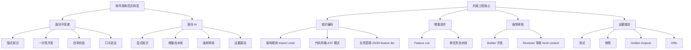
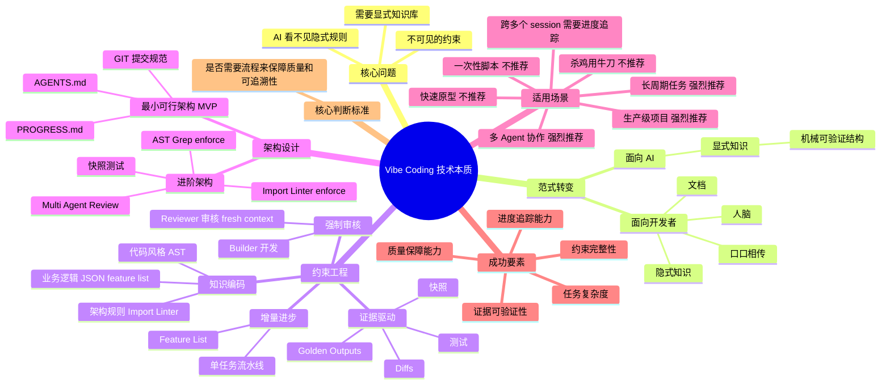

> **来源**：知乎  
> **原文链接**：[Vibe Coding 需要开发者了解技术吗？](https://www.zhihu.com/question/1937937364333879368/answer/2020182812423137156)  
> **问题**：Vibe Coding 需要开发者了解技术吗？  
> **作者**：高产似母猪（阿里巴巴 员工）  
> **赞同数**：7  
> **发布日期**：2026-03-25 16:58

---

## 一、核心观点摘要

**一句话总结**：Vibe Coding 的技术门槛不高，但要让 AI Agent 从"玩具"走向"生产级"，开发者需要理解约束工程（Constraint Engineering）的核心思想——用机械约束换取可控性和可追溯性。这不仅仅是技术升级，而是整个软件工程范式的转移。

**核心论点展开**：

### 1.1 核心问题：不可见的约束

让 AI 帮你做一个完整的 Web 应用，往往会出现这样的结果：
- 做到一半 context 爆了
- 或者最后拿到一堆无法维护、无法复现、无法审查、无法迭代的代码

**原因**：这不是 AI 能力的问题，而是架构设计的问题。传统软件架构是为人类设计的：
- 架构规则在资深工程师的脑子里
- 代码风格在团队的约定俗成里
- 业务逻辑在文档和口口相传中

AI 看不见这些"隐式"的规则，自然就无法遵守。它需要显式的、机械可验证的结构。

### 1.2 范式转变：从面向开发者到面向 AI

这不是简单的工具升级，而是整个软件工程范式的转移。正在从：
- **面向开发者**（Developer-Oriented）
- 转向 **面向 AI**（AI-Oriented）

### 1.3 转变的四个维度

| 维度 | 从 | 到 |
|------|-----|-----|
| **知识存储** | 人脑（隐式） | 仓库（显式） |
| **开发模式** | 一次性完成 | 增量进步（流水线） |
| **质量保障** | 自审自批 | 强制审核（多 Agent 协作） |
| **验证方式** | 口头说明 | 证据驱动（机械可验证） |

---

## 二、核心概念图谱

---

## 三、关键问题与解答

### 问题 1：Vibe Coding 的技术本质是什么？

**现状/困境**：
- 很多人用 Claude Code、Cursor 写过代码，但只能写写 Demo 或者 SKILL 这些小东西
- 一旦做大项目，AI 就失控了

**解法/方案**：

OpenAI 有一句话说得很好：
> "What Codex can't see doesn't exist." （Codex 看不见的东西，就等于不存在）

对于 AI 来说，以下东西是"不可见"的：
- 架构规则在资深工程师的脑子里
- 代码风格在团队的约定俗成里
- 业务逻辑在文档和口口相传中

**关键洞察**：AI 需要显式的、机械可验证的知识库。

---

### 问题 2：如何实现知识编码（Knowledge Encoding）？

**现状/困境**：
传统开发中，很多知识是"隐式"的：
- 架构规则在资深工程师的脑子里
- 代码风格在团队的约定俗成里
- 业务逻辑在文档和口口相传中

AI 看不见这些，它需要一个"显式"的知识库。

**解法/方案**：

这个知识库不是简单的文档，而是机械可验证的结构。比如：

| 知识类型 | 显式存储方式 | 工具支持 |
|---------|--------------|---------|
| **架构规则** | 写成 `Import Linter` 的配置 | Import Linter |
| **代码风格** | 写成 `AST` 模式 | AST 模式 |
| **业务逻辑** | 写成 `JSON` 格式的 feature list | Feature List |
| **进度状态** | 写成 `JSON` 格式的 feature list | Feature List |
| **经验教训** | 写成结构化的 `lessons.md` | Markdown + YAML |

**关键洞察**：这些不是给人看的，是给 AI 看的。AI 可以直接解析、验证、执行。

---

### 问题 3：如何实现增量进步（Incremental Progress）？

**现状/困境**：
传统开发中，我们习惯于"一次性做完"。让 AI 做个完整的应用，它会试图一口气做完。结果往往是：
- 写到一半 context 爆了
- 或者做出来的东西质量参差不齐

**解法/方案**：

面向 AI 的架构，需要采用增量进步的模式。Anthropic 在他们的长周期 Agent 设计中，用了一个很巧妙的机制：**Feature List**。

初始化时，Agent 会根据需求生成一个详细的功能列表，每个功能都有明确的测试步骤。然后，Coding Agent 每次只选一个功能：
- 做完、测完、提交
- 再选下一个

这就像工厂的流水线。每个工人只负责一道工序，做完交给下一个人。AI 也是如此，每次只做一件事，确保质量，留下清晰的进度记录。

**关键洞察**：增量进步是让 AI 从"玩具"走向"生产级"的关键机制。

---

### 问题 4：如何实现强制审核（Forced Review）？

**现状/困境**：
没有约束的 AI，很容易陷入"自审自批"的陷阱——自己写代码自己 review，形同虚设。

面向 AI 的架构，需要强制审核机制。这不仅仅是技术问题，更是组织问题。

**解法/方案**：

你需要设计不同的 Agent 角色：
- **Builder**：负责开发
- **Reviewer**：负责审核

**关键规则**：Reviewer 必须用 fresh context（新鲜上下文）评审，看不到 Builder 的思考过程，避免确认偏误。

这就像代码 review，自己 review 自己的代码永远有问题，必须别人 review。

**关键洞察**：强制审核是质量保障的关键机制。

---

### 问题 5：如何实现证据驱动（Evidence-Driven Verification）？

**现状/困境**：
传统开发中，我们习惯于"口头说明"——
- "这个功能做完了"
- "那个 bug 修复了"

但对于 AI 来说，这种说明是不可靠的。

**解法/方案**：

面向 AI 的架构，需要证据驱动的验证机制。每码个变更必须有机械可验证的证据：

| 证据类型 | 说明 | 工具 |
|---------|------|------|
| **测试** | 单元测试、集成测试 | Pytest、Jest |
| **快照** | 代码快照、数据库快照 | Git snapshot |
| **Golden Outputs** | 预期输出 | 测试断言 |
| **Diffs** | 变更差异 | Git diff |

这些不是给人看的，是给 AI 看的。AI 可以自动验证这些证据，确保变更的真实性和正确性。

**关键洞察**：证据驱动让 AI 的每一次变更都有据可查。

---

## 四、技术架构

### 4.1 最小可行架构（MVP）

**不需要一开始就搞复杂的约束系统**。可以从最简单的开始：

#### AGENTS.md
定义项目的核心规则：
- 技术栈选型
- 架构边界
- 代码风格
- 进度追踪方式

#### PROGRESS.md
记录当前进度：
- 已完成的功能
- 正在进行的功能
- 待办的功能

#### GIT 提交规范
确保每次提交都有清晰的意图和证据。

这就够了。先跑起来，再迭代。

---

### 4.2 进阶架构（Advanced）

当最小可行架构跑顺了，可以逐步加入更高级的约束：

| 约束类型 | 工具 | 目标 |
|---------|------|------|
| **Import Linter** | Import Linter | enforce 架构边界，确保模块依赖关系清晰 |
| **AST Grep** | AST Grep | enforce 代码风格，确保代码质量一致 |
| **快照测试** | 快照测试 | 锁定行为，确保功能稳定 |
| **Multi Agent Review** | Multi Agent 互相 review | 确保质量保障 |

这些不是可选的，是强制的。就像工厂的质量检测线，产品必须通过所有检测才能出厂。

---

## 五、对比分析

### 5.1 面向开发者 vs 面向 AI

| 维度 | 面向开发者 | 面向 AI |
|------|---------|----------|
| **知识存储** | 隐式（人脑、文档、口口相传） | 显式（机械可验证结构） |
| **开发模式** | 一次性完成 | 增量流水线（Feature List） |
| **质量保障** | 自审自批 | 强制审核（Builder + Reviewer） |
| **验证方式** | 口头说明 | 证据驱动（测试、快照、Golden Outputs、Diffs） |
| **可控性** | 低（不可见约束） | 高（显式约束） |
| **可追溯性** | 低（缺乏记录） | 高（每步都有证据） |
| **可迭代性** | 低（难以回滚） | 高（可以回滚、审查） |
| **可扩展性** | 低（单兵作战） | 高（多 Agent 协作） |

**关键洞察**：面向 AI 的架构通过显式约束，换取了可控性、可追溯性、可迭代性、可扩展性。

---

## 六、数据与生态

### 6.1 Anthropic 的实践

Anthropic 和 OpenAI 的实践证明，这是让 AI Agent 从"玩具"走向"生产级"的有效方向：

| 机构 | 核心贡献 |
|------|----------|
| **Anthropic** | Feature List（增量流水线）、Agent Skills（知识模块化） |
| **OpenAI** | Codex（证据驱动） |

---

### 6.2 开源项目推荐

| 项目名称 | 链接 | 特点 |
|---------|------|------|
| **vibe-coding-cn** | https://github.com/tukuaiai/vibe-coding-cn | 约束工程实践、7k+ star |
| **OpenAI Codex** | 证据驱动的代码生成 | 已集成到 ChatGPT |

---

## 七、思维导图

---

## 八、关键金句摘录

1. **核心问题**："让 AI 帮你做一个完整的 Web 应用，往往会出现这样的结果：做到一半 context 爆了，或者最后拿到一堆无法维护、无法复现、无法审查、无法迭代的代码。"

2. **不可见约束**："传统软件架构是为人类设计的。人类工程师可以通过沟通、经验、直觉来理解那些'隐式'的规则。但 AI 不行，它需要显式的、机械可验证的结构。"

3. **范式转变**："这不是简单的工具升级，而是整个软件工程范式的转移。正在从面向开发者转向面向 AI。"

4. **知识编码**："这个知识库不是简单的文档，而是机械可验证的结构。比如：• 架构规则写成 Import Linter 的配置 • 代码风格写成 AST 模式 • 进度状态写成 JSON 格式的 feature list • 经验教训写成结构化的 lessons.md"

5. **增量进步**："Anthropic 在他们的长周期 Agent 设计中，用了一个很巧妙的机制：Feature List。初始化时，Agent 会根据需求生成一个详细的功能列表，每个功能都有明确的测试步骤。然后，Coding Agent 每次只选一个功能，做完、测完、提交，再选下一个。"

6. **强制审核**："这就像代码 review，自己 review 自己的代码永远有问题，必须别人 review。面向 AI 的架构，需要强制审核机制。你需要设计不同的 Agent 角色：Builder 负责开发，Reviewer 负责审核。而且，Reviewer 必须用 fresh context 评审，看不到 Builder 的思考过程，避免确认偏误。"

7. **证据驱动**："传统开发中，我们习惯于'口头说明'——'这个功能做完了'、'那个 bug 修复了'。但对于 AI 来说，这种说明是不可靠的。面向 AI 的架构，需要证据驱动的验证机制。每码个变更必须有机械可验证的证据：测试、快照、Golden Outputs、Diffs。这些不是给人看的，是给 AI 看的。AI 可以自动验证这些证据，确保变更的真实性和正确性。"

8. **最小可行架构**："不需要一开始就搞复杂的约束系统。可以从最简单的开始：一个 AGENTS.md 文件，定义项目的核心规则；一个 PROGRESS.md 文件，记录当前进度；一套 git 提交规范，确保每次提交都有清晰的意图和证据。这就够了。先跑起来，再迭代。"

9. **进阶架构**："当最小可行架构跑顺了，可以逐步加入更高级的约束：Import Linter enforce 架构边界，确保模块依赖关系清晰；AST Grep enforce 代码风格，确保代码质量一致；快照测试锁定行为，确保功能稳定；Multi Agent 互相 review，确保质量保障。这些不是可选的，是强制的。就像工厂的质量检测线，产品必须通过所有检测才能出厂。"

10. **核心判断标准**："成功 = 技术 + 数据 + 策略 + 风控 + 资金 + 心态 + 时间 + 圈子。缺一不可。"

11. **适用场景**："• 长周期任务，强烈推荐。• 跨多个 session，需要进度追踪。• 多 Agent 协作，强烈推荐。• 生产级项目，强烈推荐。• 快速原型，不推荐。• 一次性脚本，不推荐。• 杀鸡用牛刀，不推荐。• 简单问答，不适合。"

12. **架构师的新角色**："在面向 AI 的架构中，架构师的角色也在发生变化。从'设计者'变成'约束者'。他们的工作，是设计一套让 AI 能够安全、高效工作的约束系统。"

13. **约束换取可控性**："面向 AI 的架构，核心思想可以用一句话概括：用机械约束，换取可控性和可追溯性。"

14. **权衡取舍**："这不是银弹，是取舍。你牺牲了一些灵活性，但换来了：• 可控性—— AI 不会乱跑 • 可追溯性—— 每一步都有记录 • 可迭代性—— 可以回滚、可以审查 • 可扩展性—— 多人/多 AI 协作不会乱"

15. **未来趋势**："Anthropic 和 OpenAI 的实践证明，这是让 AI Agent 从'玩具'走向'生产级'的有效方向。"

16. **开放 AI 有句话**："OpenAI 有句话说得很好：'What Codex can't see doesn't exist.'（Codex 看不见的东西，就等于不存在）对于 AI 来说，以下东西是'不可见'的：• 架构规则在资深工程师的脑子里 • 代码风格在团队的约定俗成里 • 业务逻辑在文档和口口相传中。"

17. **蝈蝈的AI笔记**："你们有没有发现，Vibe coding 这事儿吧，看着简单，其实坑巨多。最致命的就是 —— 直接让 AI 开干。写出来一堆自己都看不懂的代码，维护都维护不了。"

18. **蝈蝈的AI笔记**："但最近我发现了一个 GitHub 上的开源项目 vibe-coding-cn (7k+star)，它不教你写代码，教的是怎么'指挥'AI。项目越大，AI 写得越烂这个问题，它能帮你兜住。"

19. **蝈蝈的AI笔记**："它解决的核心就两个：一、管理阶段：先画个圈；立项时就把需求定清楚，给 AI 套上个紧箍咒，别让它撒欢了跑。二、写代码阶段：能抄就抄；趺水编程法，核心就八个字 —— 能抄就不写，能连不造。"

20. **蝈蝈的AI笔记**："很多用户还不知道，先收藏学习再说。"

---

## 九、总结与洞察

### 9.1 软件架构范式的根本性转移

**洞察**：我们正在经历一场深刻的软件架构范式转移。

**分析**：

| 时代 | 架构理念 | 开发模式 | 质量保障 | 验证方式 |
|------|----------|----------|----------|----------|
| **传统** | 面向人类 | 一次性完成 | 自审自批 | 口头说明 |
| **现在** | 面向 AI | 增量流水线 | 强制审核 | 证据驱动 |

**关键结论**：这不是简单的工具升级，而是整个软件工程范式的转移。

---

### 9.2 约束工程的核心价值

**洞察**：约束工程的核心思想是：用机械约束，换取可控性和可追溯性。

**分析**：

**取舍关系**：

| 牺牲 | 获得 |
|------|------|
| 部分灵活性 | 高度可控性 |
| 开发效率 | 高度可追溯性 |
| 简单快速 | 高质量保障 |
| 个人发挥 | 团队协同 |

**关键结论**：这不仅是技术问题，更是组织问题。

---

### 9.3 成功的关键要素

**洞察**：要让 AI Agent 从"玩具"走向"生产级"，需要满足多个核心要素。

**分析**：

**成功要素清单**：

- [ ] **技术能力**：显式知识编码
- [ ] **增量进步**：Feature List 流水线
- [ ] **强制审核**：Builder + Reviewer 角色
- [ ] **证据驱动**：测试、快照、Golden Outputs、Diffs
- [ ] **约束完整性**：Import Linter、AST Grep、快照测试
- [ ] **质量保障**：Multi Agent Review

**关键结论**：缺一不可。

---

### 9.4 适用场景判断

**洞察**：不同场景需要不同的架构策略。

**分析**：

| 场景 | 推荐度 | 核心判断标准 |
|------|--------|--------------|
| 长周期任务 | ⭐⭐⭐⭐⭐ | 需要进度追踪 |
| 跨多个 session | ⭐⭐⭐⭐⭐ | 需要进度追踪 |
| 多 Agent 协作 | ⭐⭐⭐⭐⭐ | 需要质量保障 |
| 生产级项目 | ⭐⭐⭐⭐⭐ | 需要质量保障 |
| 快速原型 | ⭐ | 过度工程 |
| 一次性脚本 | ⭐ | 不必要 |
| 杀鸡用牛刀 | ⭐ | 不适合 |
| 简单问答 | ⭐ | 不适合 |

**关键结论**：核心判断标准是：任务复杂度是否高到需要"流程"来保障质量和可追溯性。

---

## 附录：核心概念解释

### Vibe Coding

**定义**：一种全新的编程范式，开发者用自然语言描述你想要的功能，AI 理解意图并生成代码。

**核心特点**：
- 自然语言交互
- 共鸣式编程
- 降低开发门槛

**局限性**：
- 缺乏规范约束
- 不适合企业级复杂场景

---

### 约束工程（Constraint Engineering）

**定义**：用机械化的约束和反馈循环，让 AI Agent 的输出变得可控、可审查、可迭代的方法论。

**核心组件**：

1. **知识编码（Knowledge Encoding）**
   - 架构规则 → Import Linter
   - 代码风格 → AST Grep
   - 业务逻辑 → JSON feature list
   - 经验教训 → lessons.md

2. **增量进步（Incremental Progress）**
   - Feature List
   - 单任务流水线

3. **强制审核（Forced Review）**
   - Builder 开发
   - Reviewer 审核（fresh context）

4. **证据驱动（Evidence-Driven Verification）**
   - 测试
   - 快照
   - Golden Outputs
   - Diffs

**核心思想**：用机械约束，换取可控性和可追溯性。

---

### Agent

**定义**：能够自主执行任务、理解上下文、进行规划和推理的 AI 系统。

**分类**：

| 类型 | 特点 | 适用场景 |
|------|------|----------|
| **Chat Agent** | 对话式交互 | 简单问答 |
| **Coding Agent** | 代码生成 | 代码开发 |
| **Multi-Agent** | 多 Agent 协作 | 复杂项目 |

---

### Feature List

**定义**：Anthropic 在长周期 Agent 设计中使用的增量进步机制。

**特点**：
- 初始化时根据需求生成详细的功能列表
- 每个功能都有明确的测试步骤
- Coding Agent 每次只选一个功能
- 做完、测完、提交，再选下一个

**核心思想**：就像工厂的流水线。每个工人只负责一道工序，做完交给下一个人。

---

### 证据驱动验证

**定义**：每码个变更必须有机械可验证证据的验证机制。

**证据类型**：
- **测试**：单元测试、集成测试
- **快照**：代码快照、数据库快照
- **Golden Outputs**：预期输出
- **Diffs**：变更差异

**核心思想**：这些不是给人看的，是给 AI 看的。AI 可以自动验证这些证据，确保变更的真实性和正确性。

---

***(全文完)*

---

## 关键链接

- **vibe-coding-cn**：https://github.com/tukuaiai/vibe-coding-cn
- **蝈蝈的AI笔记**：https://www.zhihu.com/people/guo-guo-92-22
- **蝈蝈的AI笔记**：蝈蝈的AI笔记 , 专注:AI智能体/AI工具提效
