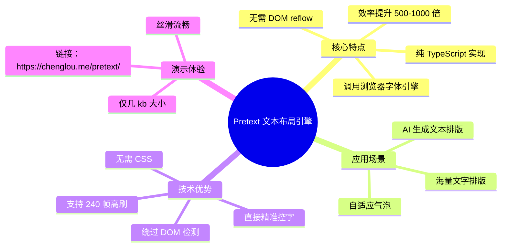

> **来源**：知乎想法
>
> **原文链接**：[前端开发的最后一个瓶颈，终于被解决喽 ~ Pretext](https://www.zhihu.com/pin/2022097880475780969)
>
> **收藏日期**：2026年3月31日

---

### 内容摘要

本文介绍了 Chenglou 大佬开源的 Pretext 文本布局引擎，这是一个纯 TypeScript 编写的库，能够直接调用浏览器的字体引擎进行底层计算排版，无需依赖 DOM reflow，将文字排版效率提升了 500-1000 倍，支持 240 帧高刷丝滑流畅，适用于自适应气泡和海量文字排版场景。

---

### 思维导图

---

## 原文内容

前端开发的最后一个瓶颈，终于被解决喽 ~ Pretext | 作为一个前端程序员，最近发觉一个很火的库，就是Chenglou 大佬开源的 Pretext （github/chenglou/pretext 这个库）。在海外火的一塌糊涂，在 推特 上有 2005 多万的流量。

这个库是一个文本布局引擎，纯 TS 写的，彻底从根本上解决了「文字排版每次都靠 DOM 量高度，超级费性能」的老问题，直接调用浏览器的字体引擎进行底层计算排版。再也无需依赖浏览器宝贵的 reflow 了！文字排版效率提升500-1000倍！

这是前端开发的最后一个瓶颈，现在终于被解决喽！也是未来 AI 生成文本在最佳排版搭档。

我们前端都知道，原来浏览器排版都是使用 CSS 等，非常缓慢。

（虽然现在前端，大把都被扫地出门解放毕业了哈哈哈， AI 太可怕了~ ）

现在有大佬能绕过 DOM 检测，无需 CSS ，也能直接完成网页的布局了。

大家可以去演示网站体验一下，那叫一个丝滑！以前都不敢想这得有多慢。

[演示链接](https://link.zhihu.com/?target=https%3A//chenglou.me/pretext/)

它只是一个只有几 kb 的小库！

它是直接绕开浏览器原生渲染，代码直接精准控字！240帧的高刷也能丝滑流畅！

可以用于自适应气泡，海量文字排版。

只可惜晚了，前端兄弟都….

