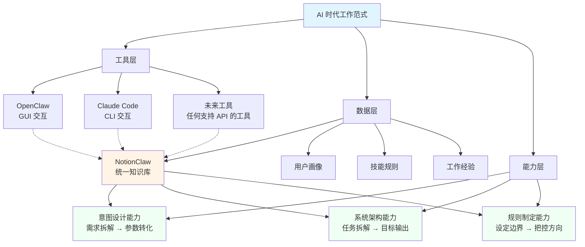
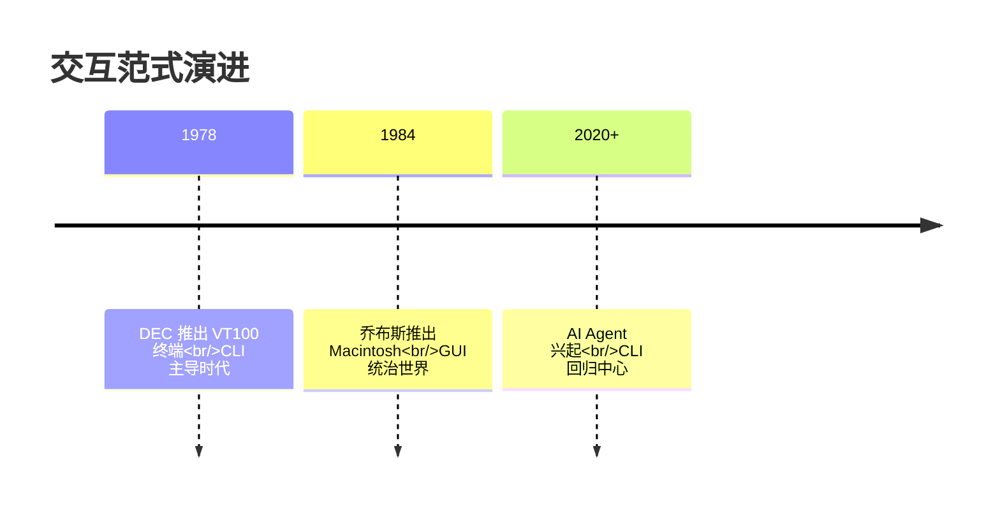
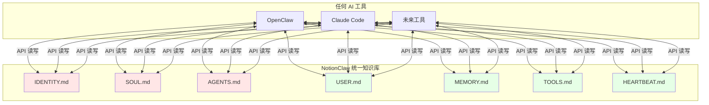
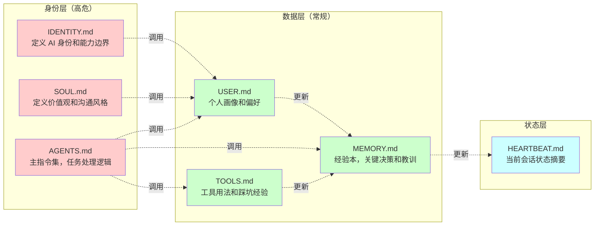
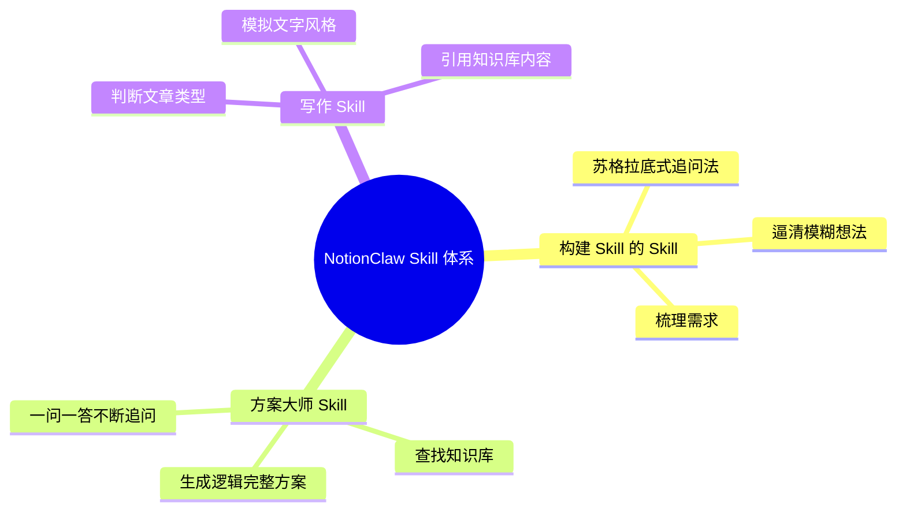
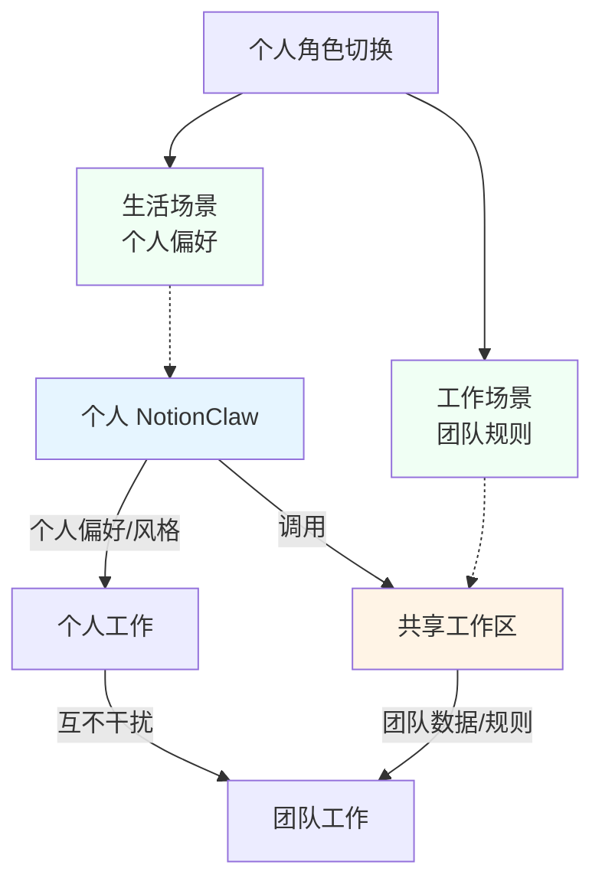
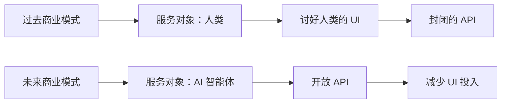
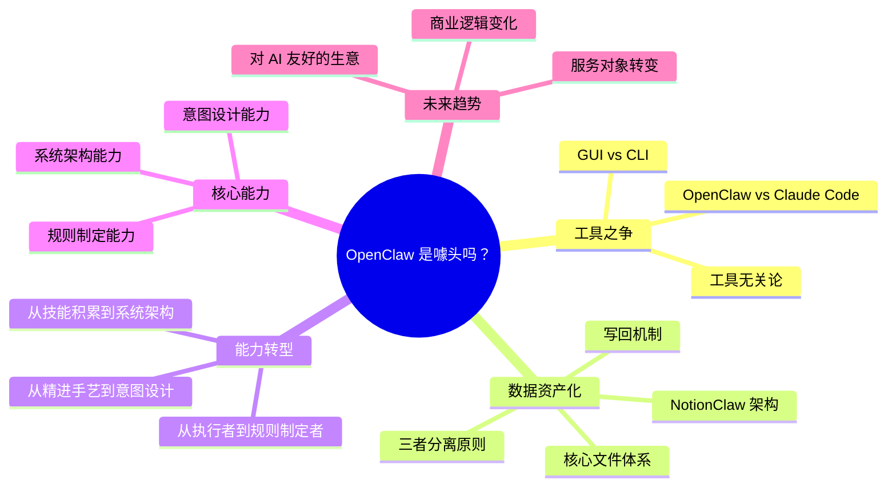

> 来源：知乎问答 | 原文链接：[OpenClaw是噱头吗？](https://www.zhihu.com/question/2012556760939013528/answer/2021625574494353387?share_code=FjrZZCAPuZND&utm_psn=2022240861895836783) | 日期：2026年3月31日

---

## 一、核心观点摘要

**一句话总结**：在 AI 时代，真正的核心竞争力不是精通某个 AI 工具，而是成为规则制定者和系统架构师，用意图设计和系统架构能力掌控 AI 智能体。

**核心论点**：

1. **工具无关论**：OpenClaw 和 Claude Code 只是不同的交互界面（GUI vs CLI），真正的价值在于你沉淀的规则和数据，而非工具本身。

2. **数据资产化**：通过 NotionClaw 这样的统一知识库，将用户画像、技能规则、工作经验与特定工具解绑，实现跨工具的数据复用。

3. **能力转型**：从"执行者"转向"规则制定者"，从精进手艺转向设计意图和架构系统，这是 AI 时代唯一不可替代的特权。

4. **商业逻辑变化**：未来生意的核心服务对象将从人类转向代表人类需求的 AI 智能体，需要开放 API 而非讨好人类的 UI。

---

## 二、核心概念图谱



**核心洞察**：工具会不断迭代，但数据和能力会一直跟着你。关键是要将三者分离——工具、规则、数据各司其职，不再被单一工具绑架。

---

## 三、关键问题与解答

### 问题 1：OpenClaw 和 Claude Code 谁更好？

**现状/困境**：
- 用户在两个工具之间切换时，面临"它不认识我了"的问题
- 在一个工具上调教好的用户画像、技能规则、工作习惯，换到另一个工具全部归零
- 就像跟同事磨合半年后突然换人，一切从头开始

**解法/方案**：
通过 NotionClaw 统一知识库，将核心文件与工具解绑：
- **IDENTITY.md**：定义 AI 的身份和能力边界
- **SOUL.md**：定义 AI 的价值观和沟通风格
- **AGENTS.md**：主指令集，规定任务处理逻辑
- **USER.md**：记录个人画像和偏好
- **MEMORY.md**：经验本，沉淀关键决策和教训
- **TOOLS.md**：记录工具用法和踩坑经验
- **HEARTBEAT.md**：当前会话状态摘要

**对比分析**：

| 维度 | OpenClaw | Claude Code |
|------|----------|-------------|
| 交互方式 | GUI（图形界面） | CLI（命令行） |
| 优势 | 所见即所得，适合大众 | AI 的"母语"，错误处理友好 |
| 数据互通 | 依赖外部统一方案 | 依赖外部统一方案 |
| 适用场景 | 团队协作、大众用户 | 个人开发者、极客 |

---

### 问题 2：为什么 CLI（命令行）会重新流行？

**现状/困境**：
- 1984 年 GUI 统治世界后，CLI 被推到边缘
- 长期以来被认为 CLI 是 GUI 的"落后版本"

**解法/方案**：
CLI 重新流行的根本原因：
- **AI Agent 的"母语"是文本**：在命令行里，Agent 读文件、写代码、跑命令，全是它最擅长的事
- **CLI 不是落后版本**：它是人类和机器最后一种共同语言
- **钟摆效应**：技术范式在 GUI 和 CLI 之间摆动，AI 时代让 CLI 回归中心

**历史脉络**：


---

### 问题 3：如何避免被单一工具绑架？

**现状/困境**：
- 每个工具都维护自己的一套 CoreFiles
- 数据被锁死在单一工具里，无法迁移
- 换工具意味着重新调教 AI，成本极高

**解法/方案**：
**三者分离原则**：
1. **工具是工具**：只是交互界面，随时可以替换
2. **规则是规则**：定义行为逻辑，独立于工具
3. **数据是数据**：沉淀经验和偏好，跨工具复用

**NotionClaw 架构**：


**分级写入机制**：
- **高危文件**（IDENTITY.md、SOUL.md、AGENTS.md）：修改前必须先给用户预览，确认后才能写入
- **常规文件**（MEMORY.md、USER.md、HEARTBEAT.md）：AI 可以自动写入，事后通知用户

---

## 四、技术架构

### NotionClaw 核心文件架构



**各文件职责**：

| 文件 | 类型 | 职责 | 变更级别 |
|------|------|------|----------|
| IDENTITY.md | 身份层 | 定义 AI 是谁、能做什么、不能做什么 | 高危 |
| SOUL.md | 身份层 | 定义价值观和沟通风格，如直言不讳还是委婉表达 | 高危 |
| AGENTS.md | 身份层 | 主指令集，规定任务处理逻辑 | 高危 |
| USER.md | 数据层 | 记录个人画像、工作习惯、表达风格 | 常规 |
| MEMORY.md | 数据层 | 经验本，沉淀关键决策、教训、项目进展 | 常规 |
| TOOLS.md | 数据层 | 记录工具用法、踩坑经验 | 常规 |
| HEARTBEAT.md | 状态层 | 当前会话状态摘要，快速恢复上下文 | 常规 |

---

### 写回机制流程

```mermaid
flowchart TD
    A[AI 与用户协作] --> B{实时判断<br/>信息是否值得沉淀？}
    B -->|关键事实/决策/教训| C[写入 MEMORY.md]
    B -->|新偏好/习惯| D[写入 USER.md]
    B -->|工具踩坑经验| E[写入 TOOLS.md]
    B -->|当前会话状态| F[写入 HEARTBEAT.md]
    B -->|低价值信息| G[不写入]
    B -->|用户说"不用记"| G

    C --> H{高危文件？}
    D --> H
    E --> H
    F --> I[常规文件<br/>自动写入]

    H -->|IDENTITY/SOUL/AGENTS| J[预览变更<br/>用户确认后写入]
    H -->|其他文件| I

    I --> K[先检查目标文档<br/>去重合并]
    J --> K
    K --> L[有更新就替换旧的]
    L --> M[通知用户完成]
    F --> N[只保留最新一条]

    style C fill:#e6ffe6
    style D fill:#e6ffe6
    style E fill:#e6ffe6
    style F fill:#e6ffe6
    style J fill:#ffe6e6
```

---

## 五、工作流技能示例

### Skill 体系



**核心特点**：
- **不绑定工具**：OpenClaw 和 Claude Code 都能调用
- **可移植性**：跟着 Notion 账户走，不跟着工具走
- **标准化指令**：可被 AI 调用的标准化指令集

---

## 六、团队场景应用

### 个人与团队的平衡



**场景说明**：
- **个人使用时**：Agent 保留个人偏好和风格
- **团队工作时**：Agent 到共享空间拿团队信息
- **角色切换**：生活和工作场景互不干扰

**实践建议**：
- 目前 OpenClaw 不太适合多人共享一个 Agent
- 最好的方式是每个人部署自己的 Agent
- 在 Notion 上创建共享工作区，团队数据统一管理

---

## 七、行业趋势与预测

### AI 时代的能力转型

| 过去能力 | AI 时代能力 | 转型方向 |
|---------|------------|----------|
| 精进执行手艺 | 意图设计能力 | 从"怎么做"转向"要什么" |
| 出卖时间 | 系统架构能力 | 从"亲手干活"转向"设定边界" |
| 技能积累 | 规则制定能力 | 从"经验沉淀"转向"数字资产" |

**核心逻辑**：
- 基础编程、文案撰写、设计执行这类熟练技能会快速贬值
- 沉浸在"亲手干活"带来的劳动获得感里，反而会变成成长的障碍

---

### 商业逻辑变化



**关键变化**：
- **服务对象**：从人类转向代表人类需求的 AI
- **产品策略**：砍掉不必要的讨好人类的 UI 投入
- **技术策略**：开放可供 AI 智能体直接调用的接口

**创业建议**：
- 尽快转型，做对 AI 友好的生意
- 开放 API，让 AI 智能体能够直接调用
- 减少 UI 投入，聚焦核心能力

---

## 八、用不好 AI 的根本原因

### 常见误区

| 误区 | 表现 | 后果 |
|------|------|------|
| 技术焦虑 | 纠结"该学哪个 AI 工具" | 陷入工具之争，忽视能力建设 |
| 执行思维 | 习惯被动接受任务，无法梳理工作流 | AI 无法理解真实需求 |
| 缺乏预期 | 对产出物缺乏清晰预期 | 不知道最终成果应该长什么样 |
| 语料匮乏 | 描述意图能力不够，从未积累语料 | GIGO（Garbage In, Garbage Out） |

### 真正值得投入的能力

**能力 1：意图设计能力**
- **定义**：把模糊的需求和商业意图，精准拆解并转化为 AI 可执行的参数
- **本质**：回答"你到底想要什么"这个问题
- **竞争力**：未来能同时熟练操控几个 AI 智能体并行完成任务

**能力 2：系统架构能力**
- **定义**：把工作和商业目标拆解成 AI 可以独立完成的子任务
- **输出**：清晰的目标拆解文档，明确每个任务的输入、输出和规则边界
- **价值**：这套可被 AI 调用的指令体系，将成为个人最核心的数字资产

**能力 3：规则制定能力**
- **定义**：设定清晰的目标、制定评判标准、明确任务约束
- **本质**：用把控方向来替代处理细节
- **特权**：这是人类在 AI 时代仅剩的不可替代特权

---

## 九、思维导图



---

## 十、关键金句摘录

1. **关于工具无关论**："我在 OpenClaw 上花了大量时间调教好的用户画像、写好的技能规则、沉淀的工作习惯，换到 Claude Code 全部归零。就像你跟一个同事磨合了半年，终于配合默契，结果公司突然给你换了个新人，一切从头开始。"

2. **关于 CLI 回归**："CLI 不是 GUI 的落后版本，它是人类和机器最后一种共同语言。"

3. **关于数据资产**："无论我用 Claude Code 还是 OpenClaw，甚至将来换任何一个新的 AI 工具，只要它能调用 Notion 的 API，启动时读一下我的规则，就立刻'认识'我了。"

4. **关于能力转型**："在 AI 时代，过去那种'靠出卖时间、精进执行手艺来提升竞争力'的逻辑正在失效。"

5. **关于 GIGO 定律**："AI 从来不会撒谎，它只是诚实地放大了你喂给它的混乱。"

6. **关于核心竞争力**："未来的核心竞争力，是看你到底能同时熟练操控几个 AI 智能体并行完成任务。"

7. **关于规则制定者**："系统的核心不是要素，而是功能目的。你不是那个亲手写代码的'执行者'，而是定义系统边界的'规则制定者'。"

8. **关于不可替代特权**："在 AI 时代，人类仅剩的不可替代特权，是成为规则制定者。"

9. **关于商业未来**："未来生意的核心服务对象，将从人类转向代表人类需求的 AI。"

10. **关于数字资产**："工具会迭代，平台会更替。但你写下的规则和沉淀的数据，会一直跟着你走。"

---

## 十一、总结与洞察

### 1. 从工具竞争到能力竞争

**传统思维**：纠结"该学哪个 AI 工具"，陷入工具之争

**新思维**：工具只是交互界面，真正的竞争力在于沉淀的规则和数据

**行动建议**：
- 不要被单一工具绑架，通过统一知识库实现跨工具数据复用
- 建立自己的 NotionClaw，将用户画像、技能规则、工作经验解绑
- 专注于打磨意图设计和系统架构能力，而不是学习工具操作

---

### 2. 系统架构的本质

**传统理解**：系统由要素构成

**新理解**：系统的核心不是要素，而是功能目的

**案例引用**：
《11 堂极简系统思维课》中的观点：
> 更换学校里的教师和学生，只要教育目的和规则不变，系统仍然是教学系统。但如果把目的改成盈利招生，系统性质就会彻底改变。

**行动建议**：
- 成为规则制定者，定义系统边界的功能目的
- 输出清晰的目标拆解文档，明确每个任务的输入、输出和规则边界
- 这套可被 AI 调用的指令体系，将成为个人最核心的数字资产

---

### 3. AI 时代的生存法则

**停止做的事**：
- ❌ 精进那些三年内会快速贬值的技能（基础编程、文案撰写、设计执行）
- ❌ 沉浸在"亲手干活"带来的劳动获得感里
- ❌ 纠结"该学哪个 AI 工具"

**开始做的事**：
- ✅ 打磨意图设计能力，精准拆解需求和商业意图
- ✅ 打磨系统架构能力，拆解任务并明确输入输出
- ✅ 打磨规则制定能力，设定目标、标准和约束
- ✅ 建立自己的数字资产（规则、数据、技能）
- ✅ 创业者转型做对 AI 友好的生意，开放 API

---

### 4. 人机协作的未来模式

**从执行者到指挥官**：
- 过去：人类亲手干活，AI 辅助
- 未来：人类设定目标和规则，AI 独立完成任务

**从个人英雄到系统构建者**：
- 过去：靠个人技能积累提升竞争力
- 未来：靠构建可被 AI 调用的指令体系

**从工具依赖到数据主权**：
- 过去：被单一工具绑架，换工具就重来
- 未来：规则和数据跟着你走，工具随时可换

---

## 附录：核心概念解释

### NotionClaw
- **定义**：基于 Notion 的统一知识库，用于存储和管理 AI 助手的用户画像、技能规则和工作经验
- **要点**：
  - 将核心文件与特定工具解绑
  - 支持跨工具数据复用
  - 建立分级写入机制（高危文件需确认，常规文件自动写入）

### CoreFiles
- **定义**：每个 AI 工具用来记录用户画像的文件集合
- **要点**：
  - 包括 IDENTITY.md、SOUL.md、AGENTS.md、USER.md、MEMORY.md、TOOLS.md、HEARTBEAT.md
  - 传统模式下，每个工具维护自己的一套 CoreFiles，彼此不互通
  - NotionClaw 方案下，CoreFiles 统一存储在 Notion，任何工具都可调用

### GIGO（Garbage In, Garbage Out）
- **定义**：垃圾进，垃圾出。计算机科学中最古老的定律，1957 年提出
- **要点**：
  - AI 从来不会撒谎，它只是诚实地放大了你喂给它的混乱
  - 如果输入的是混乱或不准确的信息，输出的结果也会是混乱的
  - 强调了数据质量和意图清晰度的重要性

### 意图设计能力
- **定义**：把模糊的需求和商业意图，精准拆解并转化为 AI 可执行的参数
- **要点**：
  - 本质是回答"你到底想要什么"这个问题
  - 未来核心竞争力：能同时熟练操控几个 AI 智能体并行完成任务
  - 需要清晰的描述意图能力，积累自己的语料

### 系统架构能力
- **定义**：把工作和商业目标拆解成 AI 可以独立完成的子任务，输出清晰的目标拆解文档
- **要点**：
  - 明确每个任务的输入、输出和规则边界
  - 这套可被 AI 调用的指令体系，将成为个人最核心的数字资产
  - 从"亲手写代码的执行者"转向"定义系统边界的规则制定者"

### 规则制定能力
- **定义**：设定清晰的目标、制定评判标准、明确任务约束，用把控方向来替代处理细节
- **要点**：
  - 这是人类在 AI 时代仅剩的不可替代特权
  - 需要退出具体的执行环节，只负责设定规则
  - 通过把控方向来替代处理细节

### CLI vs GUI
- **CLI（Command Line Interface）**：命令行界面，通过文本命令与计算机交互
- **GUI（Graphical User Interface）**：图形用户界面，通过图形元素（按钮、菜单等）与计算机交互
- **要点**：
  - 1978 年 DEC 推出 VT100 终端，CLI 主导时代
  - 1984 年乔布斯推出 Macintosh，GUI 统治世界
  - AI 时代，CLI 重新流行，因为它是 AI Agent 的"母语"
  - CLI 不是落后版本，而是人类和机器最后一种共同语言
