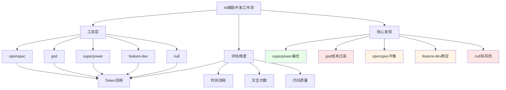
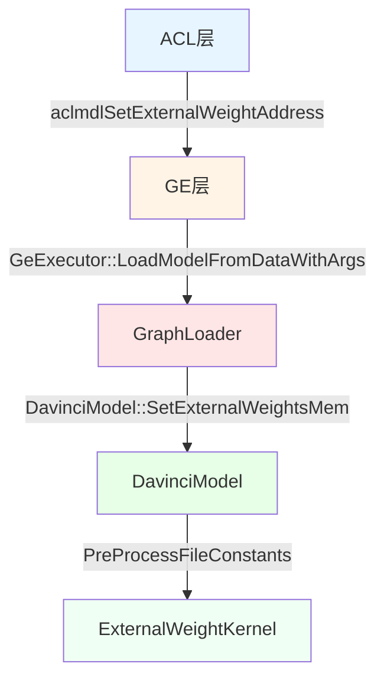
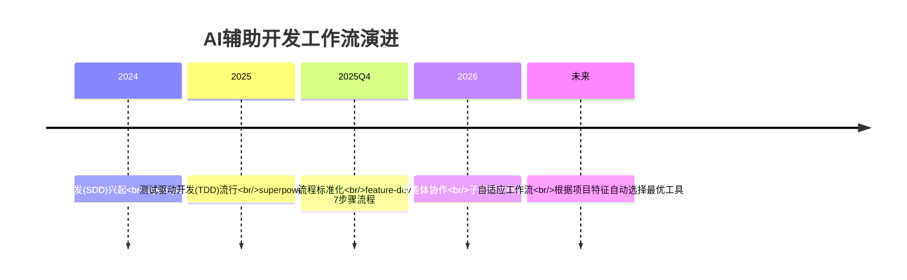
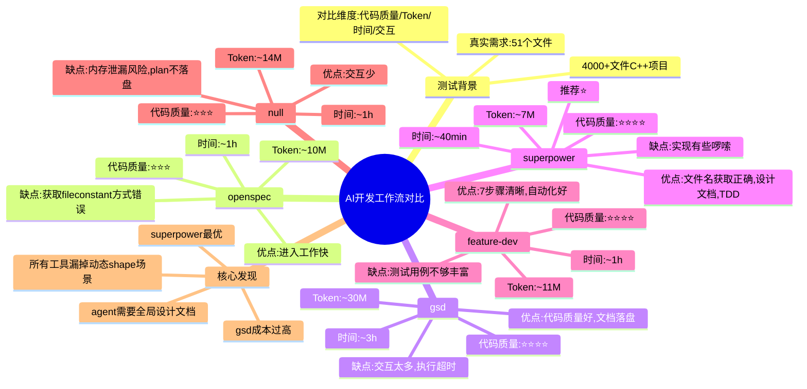

> 来源：知乎专栏 | 原文链接：[真实项目对比openSpec/superpower/feature-dev/gsd/gstack](https://zhuanlan.zhihu.com/p/2020438154780362341) | 作者：stevenaw | 日期：2026年3月31日

---

## 一、核心观点摘要

**一句话总结**：在真实4000+文件的C++复杂项目中,superpower表现最佳(token消耗~7M,耗时~40min),gsd虽然代码质量不错但交互太多、token消耗过大(~30M,耗时~3h),openspec和feature-dev表现中等,直接AI(null)方案存在内存泄漏风险。

**核心论点展开**：

### 1.1 测试背景

- **项目规模**：4000+文件的复杂C++项目
- **测试需求**：真实需求,涉及51个文件,+1196行代码,涵盖静态图、动态图、动态shape静态子图
- **对比维度**：代码质量、token消耗/时间消耗、交互次数
- **测试方法**：将代码回退到需求合入前,复制多份目录,分别安装不同skill,使用相同输入(spec_input.txt)

### 1.2 工具概览

| 工具名称 | 简介 | GitHub Stars |
|---------|------|-------------|
| openSpec | 规范驱动开发(SDD),通过proposal.md/design.md/tasks.md等文档驱动开发 | 35.4k |
| gsd (get-shit-done) | 开源SDD工作流,分为4个phase(讨论-计划-执行) | 44.8k |
| superpower | 复杂软件开发工作流,强调测试驱动开发(TDD),支持子代理并行执行 | 117k |
| feature-dev | Claude Code内置特性开发流程,分7个阶段(理解需求→探索代码库→澄清问题→架构设计→实现→质量审查等) | - |
| gstack | Headless browser工具,主要用于Web应用的QA测试 | - |

### 1.3 核心结论

先上表格,后面细说每个工作流的具体表现:

| 工作流 | Token消耗 | 时间消耗 | 交互次数 | 代码质量 | 特点 |
|-------|-----------|---------|---------|---------|------|
| openspec | ~10M | ~1h | 很少 | 1. 获取fileconstant文件名方式错误<br>2. 细节没有找我确认 | 进入工作快,但中间会多次停下来让我确认是否继续 |
| gsd | ~30M | ~3h | 很多 | 1. 获取fileconstant文件名方式错误 | 交互太多,耗时长,token消耗多;中间文档落盘,提示/clear |
| superpower | ~7M | ~40min | 中等 | 1. 获取fileconstant文件名方式正确<br>2. LoadExecutorFromModelData实现有些啰嗦 | 用户交互友好,在生成plan前生成了设计文档 |
| feature-dev | ~11M | ~1h | 较少 | 1. 测试用例不如superpower丰富 | 7个步骤,非常清晰,自动化比较好,只有在需求澄清阶段询问我关键细节 |
| null(直接AI) | ~14M | ~1h | 很少 | 1. 漏掉内存释放逻辑 | 会主动进入plan模式,也会和我确认细节场景,但plan没有落盘 |

---

## 二、核心概念图谱



**关键洞察**：superpower在效率和质量之间取得了最佳平衡,gsd虽然代码质量不错但交互成本过高,openspec和feature-dev是相对稳妥的中庸选择。

---

## 三、关键问题与解答

### 问题1：各工作流的具体表现如何?

#### gsd (get-shit-done)

**工作流程**:
1. 需要使用`claude --dangerously-skip-permissions`启动
2. 第一次使用会启动4个agent探索代码库
3. 给一个需求,会启动4个agent分析需求(stack research, feature research, architecture research, pitfall research)
4. 需求被分为4个phase,每个阶段分为discuss-plan-execute
5. 每个discuss阶段会询问一些细节,确认一些约束

**优点**:
- 引导型,一个动作完成后会提示下一个动作是什么
- 也会提示可以/clear
- 每个子任务都会commit(至少30个commit)

**缺点**:
- **交互次数过多**: 需要输入3*4=12次命令,每个discuss阶段还要确认方案选择
- **token消耗过大**: ~30M tokens
- **耗时长**: ~3h
- **文档过多**: 生成plan后让检视,包括太多代码细节,没有耐心看完
- **执行超时**: phase2的research阶段持续20分钟还没有结束,遇到问题

**代码质量**:
- 头文件完成度很高,基本一致
- 静态图执行器流程没有问题,内存释放也正确
- 动态图lowering流程正确,但缺少内存size校验和友好报错日志
- **漏掉了动态shape静态子图场景**

---

#### openspec

**工作流程**:
- 快速投入工作,在进展5/32处停下,告诉完成了什么,问是否继续
- 剩余19个task时又停下,问是否继续
- 中间context满了,不得不压缩
- 会干一会汇报一次,问是否继续

**优点**:
- token消耗比gsd少很多(~10M)
- 交互次数少,估计是gsd的10%
- 进入工作快

**缺点**:
- 中间context满了,不得不clear
- 没有像gsd那样的提醒,不知道是否对完成任务有多大影响

**代码质量**:
- 头文件修改全面
- 静态图执行器多了一个检查步骤:如果图上有多个fileconstant,检查用户是否都设置了
- **但获取fileconstant文件名方式错误**(与gsd相同的错误)
- 动态图lowering流程与gsd类似
- kernel函数实现错误:
  - 没有创建tensordata作为输出
  - 没有设置内存size
- **同样漏掉了动态shape静态子图场景**

---

#### superpower

**工作流程**:
1. 先探索项目上下文,然后开始提问
2. 展示设计阶段,一部分一部分让确认细节,直接写一些代码让逐步确认
3. 只需要说"可以",就自动进行下一步
4. 生成了设计文档(`docs/superpowers/specs/2026-03-27-external-weight-memory-design.md`)
5. 写plan,自动检视plan,发现问题自动修复,然后到下一步"过渡到实现"
6. 让选择执行方式(Subagent-Driven推荐/Inline Execution)
7. 自动完成所有任务,给出提交记录

**优点**:
- **token消耗最少**: ~7M
- **耗时最短**: ~40min
- **用户交互友好**: 只需要说"可以"或选择选项
- **生成设计文档**: 包含概述/约束场景/架构设计/详细设计/验证测试点/注意事项
- **测试用例丰富**: 基于TDD(测试驱动开发)
- **获取fileconstant文件名方式正确**: 唯一做对的工具
- **plan落盘**: 万一context满可以恢复

**缺点**:
- LoadExecutorFromModelData函数实现有些啰嗦,不如gsd
- **同样漏掉了动态shape静态子图场景**

**代码质量**:
- 头文件和结构体定义没问题
- **静态图执行器**: 从op_desc上获取外置权重文件名,只有superpower做对了
  ```cpp
  (void)ge::FileConstantUtils::GetFilePath(op_desc, file_id_and_path_map_, file_path, file_offset, file_length);
  ```
- gsd和openspec使用的错误方式:
  ```cpp
  AttrUtils::GetStr(op_desc, "file_name", file_name)
  ```
- 动态图lowering函数写得很好
- 动态图kernel写得好

---

#### feature-dev

**工作流程**:
1. 7个阶段固定套路: 理解需求→探索代码库→澄清问题→架构设计→实现→质量审查
2. 有探索/架构/代码检视三个子agent
3. 自动化程度高,只有在需求澄清阶段询问关键细节的处理策略,后面就自动搞了

**优点**:
- **7个步骤非常清晰**
- 自动化比较好
- **交互次数较少**

**缺点**:
- 测试用例不如superpower丰富

**代码质量**:
- 跟superpower给出的差不多
- 但测试用例不如superpower丰富

---

#### null (直接AI)

**工作流程**:
- 自动进入探索阶段,并开启plan模式
- 给出plan,询问是编码还是手动修改计划
- 选择的编码后,会有任务列表显示哪些完成了哪些没有完成
- 只需要确认2次

**优点**:
- plan详细
- 只需要确认2次

**缺点**:
- **plan没有落盘**,万一context满需要/clear就不好了
- **代码质量有风险**:
  - 静态图执行器漏掉了关键的地方:释放内存时,用户传入的内存要有区分,不能给释放了
  - 总体来讲还不错

---

### 问题2：为什么有的工具获取fileconstant文件名方式错误?

**反思**: 给agent的输入不仅仅是需求设计,**而且关键的细节也要给出指导**,测试中漏掉了这个细节,agent也漏掉了。

**错误方式**(gsd/openspec):
```cpp
AttrUtils::GetStr(op_desc, "file_name", file_name)
```

**正确方式**(superpower):
```cpp
(void)ge::FileConstantUtils::GetFilePath(op_desc, file_id_and_path_map_, file_path, file_offset, file_length);
```

---

### 问题3：所有工具都漏掉了动态shape静态子图场景?

**反思**: 说明agent对这个代码库的全局知识了解太少,**后续要增加一些全局模块间的设计文档**。

这个场景是作者在写代码的过程中想到的,使用agent辅助编码时,缺少了这个环节,导致思考的地方少了,可能会有隐藏bug。

---

## 四、技术架构

### 数据流架构图



### 静态图数据流

```
GeExecutor::LoadModelFromDataWithArgs(ModelLoadArg)
  → ModelManager::LoadModelOffline(model_data, model_param, model_id, rt_session)
    → DavinciModel::Init(model_param)
      → DavinciModel::PreProcessFileConstants(compute_graph)
```

### 动态图数据流

```
ACL: aclmdlSetExternalWeightAddress(handle, fileName, deviceAddr, memSize)
  ↓
GE: LoadExecutorFromModelData(model_data, load_arg, error_code)
  ↓
ModelConverter: ConvertGeModelToExecuteGraph(root_model, ModelConverterArg)
  ↓
LoweringGlobalData: SetFileConstantMem(fileName, addr, size)
  ↓
LoweringFileConstantNode:
  1. 获取fileconstant节点的文件名
  2. GetFileConstantMem()查找用户是否指定地址
  3. 有 → ExternalWeightConverter → ExternalWeightKernel
  4. 无 → FileConstantConverter → FileConstantKernel
```

---

## 五、对比分析

### 综合对比表

| 维度 | openspec | gsd | superpower | feature-dev | null |
|------|---------|-----|-----------|------------|------|
| **Token消耗** | ~10M | ~30M | ~7M | ~11M | ~14M |
| **时间消耗** | ~1h | ~3h | ~40min | ~1h | ~1h |
| **交互次数** | 很少 | 很多 | 中等 | 较少 | 很少 |
| **代码质量** | ⭐⭐⭐ | ⭐⭐⭐⭐ | ⭐⭐⭐⭐⭐ | ⭐⭐⭐⭐ | ⭐⭐⭐ |
| **设计文档** | ❌ | ❌ | ✅ | ❌ | ❌ |
| **测试用例** | ⭐⭐ | ⭐⭐ | ⭐⭐⭐⭐⭐ | ⭐⭐⭐ | ⭐⭐ |
| **自动化程度** | 中等 | 低 | 高 | 高 | 高 |
| **plan落盘** | ❌ | ✅ | ✅ | ❌ | ❌ |
| **用户体验** | ⭐⭐⭐ | ⭐⭐ | ⭐⭐⭐⭐⭐ | ⭐⭐⭐⭐ | ⭐⭐⭐ |

### 工具选择建议

| 场景 | 推荐工具 | 原因 |
|------|---------|------|
| **追求效率** | superpower | token最少,耗时最短,质量最好 |
| **追求质量** | superpower/gsd | 代码质量最好,但gsd成本过高 |
| **平衡选择** | feature-dev | 质量稳定,自动化好,7步骤清晰 |
| **简单需求** | openspec/null | 快速上手,适合小需求 |
| **复杂需求** | superpower | 设计文档+测试用例+子代理并行 |

---

## 六、数据与生态

### 关键数据点

- **测试项目**: 4000+文件的C++复杂项目
- **测试需求**: 51个文件,+1196行代码
- **涵盖场景**: 静态图、动态图、动态shape静态子图
- **测试工具**: 5种(openspec, gsd, superpower, feature-dev, null)
- **GitHub Stars**: 
  - superpower: 117k
  - gsd: 44.8k
  - openspec: 35.4k

### 生态对比

| 工具 | 生态活跃度 | 文档完善度 | 社区支持 |
|------|-----------|-----------|---------|
| superpower | 高 | 完善 | 活跃 |
| gsd | 高 | 完善 | 活跃 |
| openspec | 中等 | 中等 | 一般 |
| feature-dev | - | 完善 | - |

---

## 七、行业趋势与预测

### AI辅助开发趋势



### 预测

1. **子代理并行成为主流**: superpower的Subagent-Driven模式会被更多工具采用
2. **设计文档标准化**: 测试前先生成设计文档成为标配
3. **测试驱动开发普及**: TDD将从前端扩展到所有开发场景
4. **工具选择智能化**: 根据项目复杂度自动推荐最优工作流

---

## 八、思维导图



---

## 九、关键金句摘录

1. **关于gsd的交互成本**: "因此需要我至少输入 3*4=12次命令,每个discuss阶段也会让我确认一些方案上的选择,交互次数就更多了。这是我认为不好用的一个原因。"

2. **关于openspec的context管理**: "openspec 则没有这样的提醒,中间上下文也满了一次,不得已clear,不知道是否对完成任务有多大影响。"

3. **关于gsd和openspec对比**: "gsd更好一些,但是增加的时间和token,以及让我确认增加了我大量的投入,这些投入换这点代码上的优势,感觉不值。"

4. **关于superpower**: "用户交互友好,在生成plan前,生成了设计文档。只有superpower做对了。"

5. **关于测试用例**: "superpower应该是基于TDD(测试驱动开发)的。"

6. **关于agent知识不足**: "所有工作流都漏掉了动态shape静态子图场景。说明agent对这个代码库的全局知识了解太少,后续要增加一些全局模块间的设计文档。"

7. **关于开发思考**: "开发需求,写代码的过程中深入到了具体细节,也会产生一些思考,这些很多是需求设计和软件设计阶段没有想到的。而使用agent辅助编码,缺少了这个环节,所以触发思考的地方少了。有可能会导致隐藏的bug。"

8. **关于plan落盘**: "会主动进入plan模式,也会和我确认细节场景,但是plan没有落盘,万一context满了需要/clear就不好了。"

9. **关于输入指导**: "我给agent的输入不仅仅是需求设计,而且关键的细节也要给出指导,我漏掉了,agent也漏掉了。"

10. **关于feature-dev**: "7个步骤,非常清晰,自动化比较好,只有在需求澄清阶段询问我关键细节的处理策略,后面就自动搞了。"

---

## 十、总结与洞察

### 1. 效率与质量的平衡

**洞察**: superpower在效率和质量之间取得了最佳平衡。

- **Token消耗最少**: ~7M,比gsd节省76%
- **耗时最短**: ~40min,比gsd节省78%
- **代码质量高**: 获取fileconstant文件名方式唯一正确
- **用户体验好**: 只需要说"可以",自动化程度高

**实践建议**:
- 优先使用superpower进行复杂需求开发
- 追求快速迭代时,superpower是最佳选择
- 如果superpower不可用,feature-dev是稳定的中庸选择

---

### 2. 交互成本 vs 自动化

**洞察**: gsd虽然代码质量不错,但交互成本过高导致整体效率低下。

**交互成本对比**:
- gsd: 12+次命令 + 每个discuss阶段确认
- openspec: ~10%的gsd交互
- superpower: 中等,主要是确认设计
- feature-dev: 较少
- null: 2次确认

**自动化程度对比**:
- superpower: 子代理并行执行,自动化最高
- feature-dev: 7步骤清晰,自动化高
- gsd: 交互太多,自动化低
- openspec: 中等自动化
- null: plan模式+自动执行

**实践建议**:
- 评估工具时,不仅要看代码质量,还要看交互成本
- 选择自动化程度高的工具,减少手动干预
- 对于重复性开发任务,优先考虑自动化工具

---

### 3. Agent知识库的重要性

**洞察**: 所有工具都漏掉了动态shape静态子图场景,说明agent对代码库的全局知识了解太少。

**问题分析**:
- 需求设计时没有想到这个场景
- agent也没有全局的模块间设计文档
- 只能在代码探索时发现,容易遗漏

**解决方案**:
1. **增加全局设计文档**:
   - 模块间调用关系
   - 数据流图
   - 关键场景说明
2. **完善需求输入**:
   - 不仅提供需求设计
   - 还要提供关键细节指导
   - 包括边界情况和特殊场景
3. **建立测试用例库**:
   - 覆盖常见场景
   - 包括边界情况
   - 定期更新

**实践建议**:
- 在项目初期建立完善的设计文档
- 将设计文档作为agent的输入
- 定期更新知识库,保持信息最新

---

### 4. Plan落盘的重要性

**洞察**: superpower和gsd都有plan落盘机制,而null方案没有,导致context满时无法恢复。

**Plan落盘对比**:
| 工具 | plan落盘 | 优势 |
|------|---------|------|
| superpower | ✅ | 文档详细,包括任务依赖关系 |
| gsd | ✅ | 每个phase都有文档 |
| openspec | ❌ | context满时需要clear |
| feature-dev | ❌ | 依赖内部管理 |
| null | ❌ | context满时无法恢复 |

**实践建议**:
- 选择支持plan落盘的工具
- 定期检查plan文档的完整性
- 保留关键设计文档的备份

---

### 5. 测试驱动开发(TDD)的价值

**洞察**: superpower基于TDD,测试用例丰富,有助于提高代码质量。

**测试用例对比**:
- superpower: 丰富,基于TDD
- gsd: 中等
- openspec: 中等
- feature-dev: 较少
- null: 较少

**TDD的优势**:
1. **更早发现问题**: 测试先行,编码时就能发现bug
2. **文档作用**: 测试用例就是最好的文档
3. **重构信心**: 有测试保护,重构更安全
4. **代码质量**: 测试驱动下代码质量更高

**实践建议**:
- 选择基于TDD的工具
- 在开发前先写测试用例
- 保持测试用例的更新和覆盖

---

### 6. 设计文档的价值

**洞察**: 只有superpower生成了完整的设计文档,这对复杂项目非常重要。

**设计文档内容**:
- 概述
- 约束场景
- 架构设计(整体架构,数据流)
- 详细设计(结构体定义,静态图流程修改,动态图流程修改)
- 验证测试点
- 注意事项

**设计文档的价值**:
1. **理解全局**: 帮助理解整体架构
2. **提前发现问题**: 设计阶段发现问题成本更低
3. **团队协作**: 方便团队其他成员理解
4. **文档传承**: 项目交接时更顺利

**实践建议**:
- 选择会生成设计文档的工具
- 设计文档应该用中文,方便团队阅读
- 设计文档应该包括数据流图

---

### 7. Agent辅助编码的局限性

**洞察**: 使用agent辅助编码时,缺少了"写代码过程中的思考",可能导致隐藏bug。

**传统编码流程**:
1. 需求设计
2. 软件设计
3. 写代码 → **深入具体细节,产生思考** → 发现问题 → 修改
4. 测试

**Agent辅助流程**:
1. 需求设计
2. 软件设计
3. Agent写代码 → **缺少深入细节的思考**
4. 测试

**缺失的环节**:
- 写代码时的即时思考
- 边写边发现问题
- 对细节的深入理解

**实践建议**:
- Agent生成的代码需要人工仔细检视
- 特别是复杂的逻辑,需要深入理解
- 保留关键思考的记录,便于后续维护

---

## 附录：核心概念解释

### openSpec
- **定义**: 规范驱动开发(SDD)开源项目
- **要点**:
  - 通过proposal.md/design.md/tasks.md等文档驱动开发
  - 比spec-kit更轻量
  - GitHub 35.4k stars

### gsd (get-shit-done)
- **定义**: 开源SDD工作流
- **要点**:
  - 分为4个phase(讨论-计划-执行)
  - 支持文档落盘
  - GitHub 44.8k stars
  - 需要使用`--dangerously-skip-permissions`启动

### superpower
- **定义**: 复杂软件开发工作流
- **要点**:
  - 强调测试驱动开发(TDD)
  - 自动生成设计文档、计划、测试用例
  - 支持子代理并行执行
  - GitHub 117k stars
  - 用户交互友好

### feature-dev
- **定义**: Claude Code内置特性开发流程
- **要点**:
  - 分7个阶段(理解需求→探索代码库→澄清问题→架构设计→实现→质量审查等)
  - 自动化程度高
  - 有探索/架构/代码检视三个子agent

### gstack
- **定义**: Headless browser工具
- **要点**:
  - 主要用于Web应用的QA测试
  - 不适用于C++代码开发场景

### SDD (Specification-Driven Development)
- **定义**: 规范驱动开发
- **要点**:
  - 通过规范文档驱动开发流程
  - 需求明确,实现按照规范进行
  - 便于团队协作和代码审查

### TDD (Test-Driven Development)
- **定义**: 测试驱动开发
- **要点**:
  - 先写测试用例,再写实现代码
  - 更早发现问题
  - 测试用例就是最好的文档
  - 重构更安全
