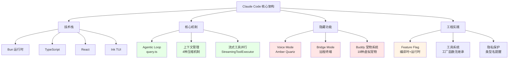
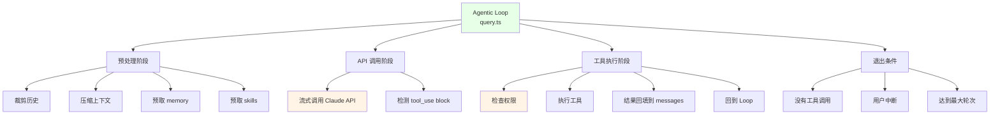
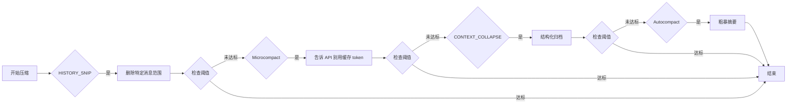
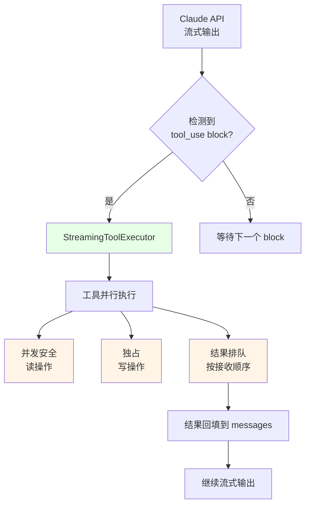
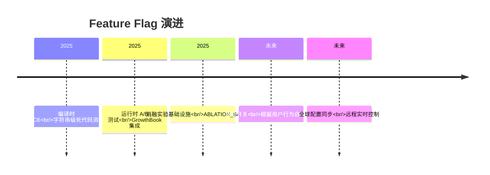
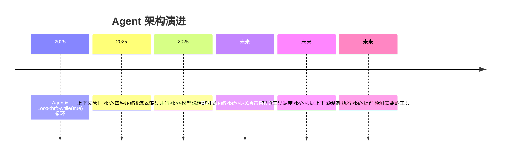

> 来源：知乎专栏 | 原文链接：[Claude Code 完整源码泄露了，花了一天读完全部源码，这是我发现的](https://zhuanlan.zhihu.com/p/2022389695955346888) | 作者：Yufeng | 日期：2026年3月31日

---

## 一、核心观点摘要

**一句话总结**：Claude Code 源码泄露(1903文件/51万行代码)揭示了 Anthropic 在工程实践上的成熟度:四种粒度的上下文管理机制、流式工具并行执行、编译时+运行时双层 Feature Flag 门控,以及隐藏的 Voice Mode/Bridge Mode/Buddy 宠物系统,每一项背后都有数据支撑的量化验证。

**核心论点展开**：

### 1.1 泄露背景

- **泄露原因**：npm 发布时忘记删除 `.map` 文件,map 里指向 Anthropic R2 存储桶的下载链接,点击是完整的未混淆 TypeScript 源码
- **泄露规模**：zip 解压后 1903 个文件,51 万行代码
- **技术栈**：Bun + TypeScript + React + Ink
  - Bun: 高性能 JavaScript 运行时
  - TypeScript: 类型安全
  - React: UI 框架(用于 TUI)
  - Ink: 把 React 组件渲染到终端的框架

### 1.2 核心发现

按照"对实际开发有参考意义"排序:

1. **Agentic Loop**：整个 Claude Code 最核心的文件 `src/query.ts`(1729 行)
2. **上下文管理**：四种不同粒度的压缩机制(HISTORY_SNIP/Microcompact/CONTEXT_COLLAPSE/Autocompact)
3. **流式工具并行**：模型还在说话就开始干活,并发安全的工具并行执行
4. **Feature Flag 系统**：编译时(字符串级 DCE) + 运行时(GrowthBook A/B 测试) 双层门控
5. **隐藏功能**：Voice Mode(代号 Amber Quartz)、Bridge Mode、Buddy 宠物系统

---

## 二、核心概念图谱



**核心洞察**: Claude Code 的架构设计体现了 Anthropic 在工程实践上的成熟度,每一项核心机制背后都有数据支撑的量化验证。

---

## 三、关键问题与解答

### 问题 1：Claude Code 的技术栈是什么?

#### 现状/困境

很多人猜测 Claude Code 的技术栈,比如用 Node.js 还是 Go?

#### 解法/方案

**确认的技术栈**：
- **运行时**: Bun(高性能 JavaScript 运行时)
- **语言**: TypeScript
- **UI 框架**: React
- **TUI 框架**: Ink(把 React 组件渲染到终端)

**为什么用 Ink**:
- 终端 UI 的状态管理确实比想象中复杂(多个 Agent 并行、流式输出、用户中断…)
- 用 React 的状态模型来管比手搓要靠谱得多

---

### 问题 2：Agentic Loop 是如何实现的?

#### 现状/困境

整个 Claude Code 最核心的机制是什么?如何实现 Agent 的循环执行?

#### 解法/方案

**核心文件**: `src/query.ts`,1729 行,实现了完整的 agentic 循环。

**简化后的核心逻辑**:
```typescript
async function* queryLoop(params) {
  let state = { messages, toolUseContext, turnCount: 1, ... }

  while (true) {
    // 1) 一堆预处理：裁历史、压缩上下文、预取 memory 和 skills
    // 2) 调 Claude API（流式）
    // 3) 一边收流一边看有没有 tool_use block
    // 4) 有的话 → 检查权限 → 执行 → 结果塞回 messages → 回到 while
    // 5) 没有工具调用 → 退出
  }
}
```

**魔鬼在细节里**:
- 每个步骤都有复杂的边界情况处理
- 工具调用的权限检查和结果回填
- 上下文压缩的触发条件判断

---

### 问题 3：上下文管理是如何实现的?

#### 现状/困境

长对话到后面会自动"压缩",具体是如何实现的?

#### 解法/方案

**四种不同粒度的压缩机制**,按顺序依次执行:

1. **HISTORY_SNIP** (最精细):
   - 直接把某些特定消息范围删掉,不做任何摘要
   - 适合清理掉已经没用的中间工具调用结果

2. **Microcompact** (黑科技):
   - 利用 API 层的 `cache_deleted_input_tokens` 能力
   - 不改消息内容,而是告诉 API"这些 token 你缓存里有但别用了"

3. **CONTEXT_COLLAPSE** (结构化归档):
   - 把旧的对话轮次"归档"成摘要
   - 维护一个类似 git 提交日志的结构
   - 每次新查询时重放这个日志
   - 和 autocompact 的区别是它保留了结构化的归档,不是一坨摘要

4. **Autocompact** (最粗暴):
   - 把整个历史压缩成一段摘要
   - 最后的兜底手段

**关键点**:
- 这四种机制**不互斥**,按顺序依次执行
- 如果 snip 和 microcompact 已经把上下文压到阈值以下,autocompact 就不触发

**启发**: 做 Agent 的上下文管理不能只有一种策略。不同场景下信息的"过期速度"不一样,需要分层处理。

---

### 问题 4：流式工具并行是如何实现的?

#### 现状/困境

普通的实现是等模型说完 → 看有没有工具调用 → 有的话执行。但 Claude Code 不等。

#### 解法/方案

**最精巧的设计**: 模型还在流式吐出一个 tool_use block,立刻开始执行。

**实现**:
```typescript
export class StreamingToolExecutor {
  // 模型流式吐出一个 tool_use block,立刻开始执行
  addTool(block: ToolUseBlock, message: AssistantMessage): void { ... }

  // 并发安全的工具可以同时跑,写操作独占
  // 结果按接收顺序排队,保证输出确定性
  async *getRemainingResults(): AsyncGenerator<MessageUpdate> { ... }
}
```

**关键特性**:
- 每个工具有个 `isConcurrencySafe` 标记
  - 读文件、grep 这种只读操作可以并行
  - 写文件、bash 这种需要独占
- 结果按**接收顺序**缓冲,不会乱序

**实测效果**: Claude Code 的响应速度明显比 Cursor 快,有一部分原因应该就在这里。

---

### 问题 5：Feature Flag 系统是如何设计的?

#### 现状/困境

Claude Code 用了 Feature Flag,具体是如何实现的?

#### 解法/方案

**双层门控机制**: 编译时 + 运行时

#### 编译时: 字符串级别的死代码消除

```typescript
import { feature } from 'bun:bundle'

const voiceModule = feature('VOICE_MODE')
  ? require('./voice/index.js')
  : null
```

**关键点**:
- `feature()` 是 Bun 的编译时宏
- 构建时会被替换成 `true` 或 `false`
- `false` 的分支直接被删除——不是"不执行",是**从二进制文件里物理消失**,连字符串字面量都不剩

**为什么要这么做**:
- 安全研究员会反编译你的二进制去找隐藏功能
- 运行时 flag 再怎么关,字符串还在那
- 编译时 DCE 才是真的"不存在"

#### 运行时: GrowthBook A/B 测试

```typescript
const enabled = checkStatsigFeatureGate_CACHED_MAY_BE_STALE(
  'tengu_streaming_tool_execution2'
)
```

**特性**:
- 用于灰度发布和 kill switch
- 所有 gate 名称都是 `tengu_` 前缀(tengu(天狗)大概是 Claude Code 的内部代号)
- 从磁盘缓存读取,接受脏读,不阻塞启动

---

### 问题 6：隐藏功能有哪些?

#### 现状/困境

泄露的源码中发现了哪些还未发布的功能?

#### 解法/方案

##### Voice Mode (代号 Amber Quartz)

**位置**: `src/voice/` 目录确认了语音模式的存在

**特性**:
- 只支持 Claude.ai OAuth 认证(API key、Bedrock、Vertex 都不行)
- 走的是一个专门的 `voice_stream` 端点
- 有个紧急 kill switch: GrowthBook flag `tengu_amber_quartz_disabled`
- 从注释看已经开发到可以使用的程度了

##### Bridge Mode

**位置**: `src/bridge/` 有 31 个文件

**特性**:
- 完整的远程控制系统
- 运行 `claude remote-control` 后,你的本地环境就变成一个被 claude.ai 远程操控的"桥接环境"
- 最多支持 **32 个并发会话**
- 有 JWT 认证 + 可信设备机制
- 企业管理员可以通过策略禁用
- 应该是为了让 claude.ai 网页版能直接操作用户本地的开发环境

##### Buddy: 终端里的电子宠物

**位置**: 内置了一个**完整的虚拟宠物系统**

**特性**:
- 18 种宠物: duck, goose, blob, cat, dragon, octopus, owl, penguin, turtle, snail, ghost, axolotl, capybara, cactus, robot, rabbit, mushroom, chonk
- 5 级稀有度: 普通(60%) / 罕见(25%) / 稀有(10%) / 史诗(4%) / 传说(1%)
- RPG 式属性: DEBUGGING, PATIENCE, CHAOS, WISDOM, SNARK
- 还有帽子(皇冠、礼帽、螺旋桨帽、光环、巫师帽、豆豆帽、头顶小鸭子)
- 眼睛样式、1% 概率的闪光变体
- 宠物属性用 Mulberry32 伪随机数生成器从你的用户 ID 确定性计算——所以每个用户的宠物是固定的,不能刷

**物种名编码**(最有趣的部分):
```typescript
// 所有物种名用 hex 编码,因为有一个名字和内部模型代号撞了
const c = String.fromCharCode

export const duck = c(0x64,0x75,0x63,0x6b) as 'duck'
export const goose = c(0x67,0x6f,0x6f,0x73,0x65) as 'goose'
// ... 全部 18 个都这样
```

**注释原文**:
> "One species name collides with a model-codename canary in excluded-strings.txt."

**猜测**: duck、goose、blob、cat、dragon、octopus、owl、penguin、turtle、snail、ghost、axolotl、capybara、cactus、robot、rabbit、mushroom、chonk——其中一个是 Anthropic 下一个模型的代号。

---

### 问题 7：工具系统是如何设计的?

#### 现状/困境

之前做 Agent 框架的工具系统,下意识会写一个 `BaseTool` 基类然后继承。

#### 解法/方案

**Claude Code 完全没有继承,全是纯函数式的 `buildTool()`**:

```typescript
type ToolDef<T> = {
  name: string
  description: string
  inputSchema: ZodSchema<T>           // Zod v4 做校验 + 自动生成 JSON Schema
  call(input: T, ctx: ToolUseContext): AsyncGenerator<...>
  isReadOnly(): boolean
  getPermissions(): ToolPermission[]
  renderToolUse?(input: T): ReactNode  // 直接渲染到终端
  getToolUseSummary?(input, result): string  // 压缩上下文时的摘要
}
```

**关键特性**:
- 每个工具完全自包含:schema、权限、执行逻辑、UI 渲染、压缩摘要,全在一个文件里
- 没有全局注册表——每个 session 动态组装工具池
- 可以混合静态工具、MCP 工具、Agent 定义的工具

**最复杂的工具**: BashTool
- 不是简单 `exec(command)`
- 自动分类命令类型(search/read/write)
- macOS 上走 sandbox-exec 沙箱
- 超过 15 秒的阻塞命令自动转后台
- 大输出存磁盘只给模型一个文件路径引用
- 还内置了一个 sed 命令专用解析器

---

## 四、技术架构

### Agentic Loop 架构图



---

### 上下文管理流程图



---

### 流式工具并行架构



---

## 五、对比分析

### Claude Code vs Cursor

| 维度 | Claude Code | Cursor |
|------|-------------|--------|
| **响应速度** | 快(流式工具并行) | 较慢 |
| **上下文管理** | 四种机制分层处理 | 不清楚 |
| **工具系统** | 工厂函数,无继承 | 不清楚 |
| **Feature Flag** | 双层门控(编译时+运行时) | 不清楚 |
| **工程文化** | 每个功能都有量化验证 | 不清楚 |

---

## 六、数据与生态

### 泄露数据

- **文件数量**: 1903
- **代码行数**: 51 万行
- **泄露原因**: npm 发布时忘记删除 `.map` 文件
- **泄露内容**: 完整的未混淆 TypeScript 源码

### 技术栈生态

| 技术 | 用途 | 状态 |
|------|------|------|
| Bun | 运行时 | ✅ 确认 |
| TypeScript | 语言 | ✅ 确认 |
| React | UI 框架 | ✅ 确认 |
| Ink | TUI 框架 | ✅ 确认 |
| Zod | Schema 校验 | ✅ 确认 |
| GrowthBook | Feature Flag | ✅ 确认 |

---

## 七、行业趋势与预测

### Feature Flag 的未来



**预测**:
- 更多工具采用编译时 + 运行时双层门控
- 消融实验基础设施将被更多产品采用
- Feature Flag 成为量化功能价值的标准实践

---

### Agent 架构的未来



---

## 八、思维导图

```mermaid
mindmap
  root((Claude Code 源码分析))
    技术栈
      Bun 运行时
      TypeScript
      React
      Ink TUI 框架
    核心机制
      Agentic Loop
        query.ts 1729行
        while(true) 循环
        五个步骤
      上下文管理
        HISTORY_SNIP
        Microcompact
        CONTEXT_COLLAPSE
        Autocompact
      流式工具并行
        StreamingToolExecutor
        isConcurrencySafe
        结果排队
    隐藏功能
      Voice Mode
        Amber Quartz
        voice_stream 端点
        OAuth 认证
      Bridge Mode
        远程终端
        32个并发会话
        JWT 认证
      Buddy 宠物
        18种宠物
        5级稀有度
        RPG属性
        hex编码
    工程实践
      Feature Flag
        编译时 DCE
        运行时 A/B 测试
      工具系统
        buildTool()
        无继承
        BashTool 最复杂
      隐私保护
        类型名提醒
    泄露原因
      npm 忘删 .map
      1903 文件
      51 万行代码
    启发
      量化验证
      分层处理
      约定优于配置
```

---

## 九、关键金句摘录

1. **关于上下文管理**: "这四种机制不互斥,按顺序依次执行。如果 snip 和 microcompact 已经把上下文压到阈值以下,autocompact 就不触发。"

2. **关于启发**: "这给我的启发挺大的——做 Agent 的上下文管理不能只有一种策略。不同场景下信息的'过期速度'不一样,需要分层处理。"

3. **关于流式并行**: "这是我觉得最精巧的设计。普通的实现是:等模型说完 → 看有没有工具调用 → 有的话执行 → 结果返回 → 下一轮。Claude Code 不等。"

4. **关于编译时 DCE**: "为什么要这么做?因为安全研究员会反编译你的二进制去找隐藏功能。运行时 flag 再怎么关,字符串还在那。编译时 DCE 才是真的'不存在'。"

5. **关于 Feature Flag**: "讽刺的是,源码泄露之后这层保护就不管用了。但设计思路还是很值得学的。"

6. **关于消融实验**: "做过 ML 的都知道消融实验是什么——逐个关掉组件看性能影响。但把这套方法论搬到产品工程上,这是我第一次在工业代码里见到。"

7. **关于工程文化**: "读完 51 万行代码,我最大的感受不是某个具体技术,而是 Anthropic 像在用做研究的方法做工程。"

8. **关于量化验证**: "消融实验基础设施、双层 feature flag、四种粒度的上下文管理、流式工具并行——每一个都不是拍脑袋加的,背后大概率有数据支撑。"

9. **关于有趣的功能**: "当然,宠物系统除外。那个纯粹是因为好玩。"

10. **关于安全**: "埋点数据的类型名叫 AnalyticsMetadata_I_VERIFIED_THIS_IS_NOT_CODE_OR_FILEPATHS。用类型名本身来提醒开发者'你确认过这不是代码或文件路径了吗'。简单粗暴但有效。"

---

## 十、总结与洞察

### 1. Anthropic 的工程方法论

**洞察**: Anthropic 用做研究的方法做工程。

**具体表现**:
- 消融实验基础设施: 逐个关掉组件看性能影响
- 双层 feature flag: 编译时 DCE + 运行时 A/B 测试
- 四种粒度的上下文管理: 分层处理,量化验证
- 每个功能都有数据支撑

**实践建议**:
- 做任何功能改动前,先建立量化指标
- 用消融实验验证每个组件的价值
- 采用多层门控机制(编译时+运行时)
- 对关键决策进行 A/B 测试

---

### 2. 上下文管理的最佳实践

**洞察**: 不同场景下信息的"过期速度"不一样,需要分层处理。

**四种机制的作用**:

| 机制 | 粒度 | 适用场景 | 触发条件 |
|------|------|---------|---------|
| HISTORY_SNIP | 最精细 | 清理中间工具调用结果 | 特定消息范围 |
| Microcompact | 缓存层 | 告诉 API 别用缓存 token | cache_deleted_input_tokens |
| CONTEXT_COLLAPSE | 结构化 | 归档旧对话轮次 | 阈值触发 |
| Autocompact | 最粗暴 | 兜底手段 | 阈值触发且前两个未达标 |

**实践建议**:
- 设计多种粒度的压缩策略
- 按顺序依次执行,互斥但递进
- 保留结构化归档,方便重放
- 最后保留兜底手段

---

### 3. 流式工具并行的优势

**洞察**: 模型还在流式输出后面的内容,前面的工具就已经在跑了。

**优势分析**:
1. **响应速度**: 模型说话的同时,工具就在后台执行,节省时间
2. **并发安全**: 通过 `isConcurrencySafe` 标记,确保读写操作不会冲突
3. **输出确定性**: 结果按接收顺序排队,不会乱序
4. **用户体验**: 明显比 Cursor 快

**实践建议**:
- 区分并发安全和独占操作
- 读操作可以并行执行
- 写操作需要独占,按顺序执行
- 结果缓冲,按接收顺序回填

---

### 4. Feature Flag 的双层门控

**洞察**: 编译时 DCE + 运行时 A/B 测试,两层门控更安全。

**编译时: 字符串级死代码消除**
- 物理删除代码,连字符串字面量都不剩
- 防止反编译发现隐藏功能
- 减小二进制体积

**运行时: GrowthBook A/B 测试**
- 灰度发布和 kill switch
- 接受脏读,不阻塞启动
- 支持实时开关

**实践建议**:
- 对隐藏功能使用编译时 DCE
- 对灰度功能使用运行时 A/B 测试
- 从磁盘缓存读取,提高启动速度
- 所有 gate 名称统一前缀,便于管理

---

### 5. 工具系统的设计哲学

**洞察**: 没有继承,全是纯函数式的 `buildTool()`。

**优势**:
1. **完全自包含**: 每个工具文件包含所有逻辑
2. **动态组装**: 没有 全局注册表,session 动态组装
3. **易于测试**: 不依赖全局状态
4. **灵活扩展**: 可以混合静态工具、MCP 工具、Agent 工具

**实践建议**:
- 避免使用继承,用工厂函数
- 每个工具文件包含 schema、权限、逻辑、UI、摘要
- 支持混合工具类型
- 使用 Zod 做 schema 校验和自动生成

---

### 6. 隐藏功能的价值

**洞察**: 一些功能还在开发中,但已经具备了可用的程度。

**Voice Mode (Amber Quartz)**:
- 支持语音输入 Claude.ai 认证
- 走专门的 `voice_stream` 端点
- 有紧急 kill switch

**Bridge Mode**:
- 远程控制系统
- 支持 32 个并发会话
- 企业级安全机制

**Buddy 宠物系统**:
- 完整的虚拟宠物系统
- 18 种宠物,5 级稀有度
- RPG 属性和视觉定制

**实践建议**:
- 用 Feature Flag 控制隐藏功能
- 提前设计好功能开关机制
- 为每个功能准备紧急 kill switch
- 确保功能的完整性后再发布

---

### 7. 隐私保护的经验

**洞察**: 用类型名本身来提醒开发者。

**具体做法**:
```typescript
// 类型名叫 AnalyticsMetadata_I_VERIFIED_THIS_IS_NOT_CODE_OR_FILEPATHS
```

**效果**:
- 开发者一看类型名就知道这是什么
- 简单粗暴但有效
- 避免误埋点敏感信息

**实践建议**:
- 对敏感字段使用明显的类型名提醒
- 在类型系统中体现安全意识
- 用类型名作为文档的一部分

---

### 8. 泄露事件的教训

**洞察**: 技术上很简单,npm 发布时忘删 `.map` 文件。

**给所有发 npm 包的人提个醒**:

1. **package.json 的 files 字段要白名单制**: 只包含你想发布的东西
2. **CI 里加一步检查发布产物里有没有 .map 文件**
3. **源码归档 URL 要有鉴权**: 别裸挂在 CDN 上
4. **构建产物和源码的访问控制应该独立管理**

**实践建议**:
- 在 CI 流程中加入安全检查
- 使用 .npmignore 排除不应该发布的文件
- 定期审查发布产物
- 建立安全发布流程

---

## 附录：核心概念解释

### Bun
- **定义**: 高性能 JavaScript 运行时,兼容 Node.js API
- **要点**:
  - 比 Node.js 更快,更小的内存占用
  - 内置了现代 JavaScript 特性
  - 支持 TypeScript 直接运行

### Ink
- **定义**: 把 React 组件渲染到终端的框架
- **要点**:
  - 支持 React 生态的所有特性
  - 自动处理终端 ANSI 转义码
  - 支持复杂的 TUI 界面

### Feature Flag
- **定义**: 功能开关机制,用于灰度发布和 A/B 测试
- **要点**:
  - 编译时 flag: 字符串级 DCE
  - 运行时 flag: A/B 测试,灰度发布
  - 支持远程开关
  - 可以嵌套和组合

### Agentic Loop
- **定义**: Agent 的主循环,负责协调整个对话过程
- **要点**:
  - 预处理上下文
  - 调用 AI API
  - 检测工具调用
  - 执行工具
  - 回填结果
  - 循环直到没有工具调用

### GrowthBook
- **定义**: Feature flag 管理工具,支持 A/B 测试
- **要点**:
  - 从磁盘缓存读取
  - 支持脏读,不阻塞启动
  - 支持灰度发布
  - 支持远程开关

### Zod
- **定义**: TypeScript-first schema 声明和校验库
- **要点**:
  - 自动生成类型安全的 TypeScript 类型
  - 自动生成 JSON Schema
  - 支持复杂的数据结构校验
