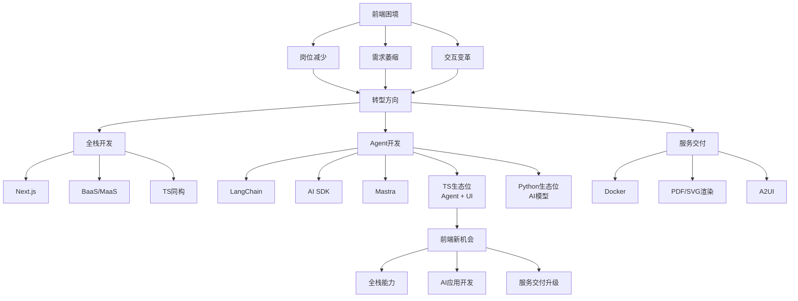

## 📋 文章信息

- **来源**: 知乎 - 前端现在怎么样呢？
- **回答者**: CoCo（前端负责人）
- **发布时间**: 2026-03-27
- **阅读链接**: https://www.zhihu.com/question/2020093631541833757/answer/2020931371720262329

---

## 🎯 核心摘要

在AI时代，前端开发面临岗位减少、需求萎缩的困境，但同时也迎来了三个重要转型方向：全栈开发、Agent开发、以及服务交付的升级。TypeScript在AI时代找到了新的生态位——Agent+UI，这为前端开发者提供了新的机会。

## 📊 核心观点

### 1. 前端面临的困境

- **岗位数量下降**：明显感知到公司前端岗位在变少
- **开发效率提升**：AI工具大幅提升开发效率，单人产出增加
- **需求结构变化**：
  - 纯前端需求减少
  - AI压缩业务中间过程，导致"页面"需求减少
  - AI正在无形地改变人机交互方式

### 2. AI带来的变革

**自动化开发流程**：
- 工单系统通过 GitLab Issues webhook 同步给云端 coding agent
- Agent 自动修改代码并提交 PR 到 GitLab
- 能解决大部分前端开发任务

**奇点预测**：
- 2026年AI能力将到达奇点
- AI自动化能力超过50%，慢慢逼近100%

### 3. 转型方向

#### 方向一：全栈开发 ✨

**技术栈**：
- Next.js 全栈架构（AI初创公司主流）
- BaaS（Backend as a Service）
- MaaS（Model as a Service）
- TypeScript 同构

**优势**：
- 快速串联完整业务流程
- 减少前后端协作成本
- 更好地理解产品全貌

**适用场景**：
- AI初创公司
- 需要快速迭代的SaaS产品
- 个人开发者/独立开发者

#### 方向二：Agent开发 🤖

**主流语言**：
- TypeScript / Python

**生态位分析**：

| 语言 | 生态位 | 优势 | 适用场景 |
|------|--------|------|----------|
| **Python** | AI模型开发 | 算法团队第一语言，中间件生态丰富 | 模型训练、算法研发、底层AI服务 |
| **TypeScript** | **Agent + UI** | 连接AI能力与用户界面 | AI应用服务、前端集成AI |

**推荐学习路径**：

1. **LangChain**（Python/TS双版本）
   - 出道早，引领行业标准
   - 提供完整的Agent开发框架

2. **AI SDK**（ai-sdk.dev）
   - 卡位 Agent + UI 生态
   - 可能成为行业标准
   - 配合全栈技能可手撸AI应用服务

3. **Mastra**（TypeScript AI Framework）
   - 框架设计完整性好
   - 适合没有UI的场景

**核心能力**：
- 全栈技能（必要基础）
- 理解Agent工作原理
- 掌握提示词工程
- 熟悉模型API调用

#### 方向三：服务交付升级 🚀

**传统交付物**：
- 打包后的 js/html/css

**新交付物**：
- Docker 容器
- 完整的服务
- 中间件

**TypeScript的特定领域价值**：
- PDF 渲染
- SVG 渲染
- A2UI（生成式 UI）

## 🧠 概念图谱



## 🔑 关键洞察

### 1. 服务沟通模式的变革

**传统模式**：
- 规则型业务逻辑
- 需要设计大量业务规则代码与算法
- 复杂的意图识别

**AI新模式**：
- 与模型 I/O 式沟通
- 意图枚举 + 提示词
- 模型完成复杂逻辑

### 2. TypeScript的崛起

**证据**：
- **Langfuse**（TS写的LLM观测平台）
- **Effect.website**（TS函数式框架）
- AI SDK 主流支持TS

**意义**：
- TS找到了在AI时代的生态位
- 框架防腐能力增强
- 围绕新模式的TS框架/服务越来越多

### 3. 产业趋势

- React 定义了 Web → AI SDK 将定义 AI
- 服务间沟通从代码逻辑变成模型交互
- 前端开发者具备UI/UX天然优势

## 📈 关键问题与解答

**Q1：前端会被AI取代吗？**

A：不是被取代，而是进化。从页面开发者转向服务开发者。AI压缩的是"写代码"的重复工作，但产品设计、用户体验、业务理解仍然需要人。

**Q2：为什么建议前端转Agent开发？**

A：
- TS在 Agent+UI 生态有独特优势
- Python 适合算法团队，TS 适合应用层
- 前端开发者具备UI/UX思维，能更好连接AI能力与用户

**Q3：全栈开发是必须的吗？**

A：在AI初创公司，全栈是标配。BaaS/MaaS让后端开发门槛降低，TS同构让前后端统一，全栈成为必然趋势。

## 🏗️ 技术架构对比

### 传统前端开发模式

```
用户需求 → 产品设计 → 前端开发 → 后端开发 → 联调测试 → 上线
         ↑________________人工编写大量代码______________↑
```

### AI驱动的开发模式

```
用户需求 → 产品设计 → Agent开发 → 配置/提示词 → 上线
                    ↑____AI自动生成大部分代码_____↑
```

### 新型全栈+Agent模式

```
用户需求 → 产品设计 → 全栈+Agent开发 → 服务交付(Docker) → 部署
                    ↑_TS同构 + AI SDK + BaaS/MaaS_↑
```

## 💡 实践建议

### 短期（1-3个月）

1. **补全栈能力**
   - 学习 Next.js
   - 了解 BaaS（如Supabase、Firebase）
   - 掌握 TypeScript 高级特性

2. **接触AI开发**
   - 熟悉主流模型API（OpenAI、Anthropic等）
   - 学习提示词工程
   - 了解 LangChain 基础概念

### 中期（3-6个月）

1. **深入Agent开发**
   - 深入学习 LangChain
   - 掌握 AI SDK
   - 实践开发AI应用服务

2. **服务交付升级**
   - 学习 Docker 容器化
   - 了解微服务架构
   - 尝试部署完整服务

### 长期（6-12个月）

1. **领域深耕**
   - 选择垂直领域（如AI+金融、AI+教育）
   - 成为该领域的专家
   - 建立个人品牌

2. **生态建设**
   - 参与开源项目
   - 分享实践经验
   - 影响行业发展

## 📚 推荐资源

### 学习框架

- [AI SDK](https://ai-sdk.dev/)
- [LangChain](https://langchain.com/)
- [Mastra](https://mastra.ai/)
- [Next.js](https://nextjs.org/)

### 观察平台

- [Langfuse](https://langfuse.com/) - LLM观测平台（TS实现）
- [Effect.website](https://effect.website/) - TS函数式框架

### 深度阅读

- [React Defined the Web, The AI SDK Will Define AI](https://egghead.io/react-defined-the-web-the-ai-sdk-will-define-ai~ugbyu)

## 🎯 总结

**核心观点**：前端不是消亡，而是进化。

**关键机会**：
1. **全栈化**：前后端界限模糊，全栈成为标配
2. **AI集成**：TS在 Agent+UI 生态有独特优势
3. **服务升级**：从交付代码到交付服务

**核心能力**：
- 全栈开发能力（必要）
- AI应用开发能力（关键）
- 服务交付能力（升级）

**行动建议**：
1. 立即开始学习全栈技术栈
2. 深入 AI SDK 和 LangChain
3. 尝试开发完整的 AI 应用服务
4. 关注TS生态的新发展

---

## 📌 关键金句

> "随着模型能力越来越强，26年会到达个奇点。越过50%慢慢逼近100%。"

> "AI SDK卡生态位是Agent+UI这个生态位。"

> "以往前端最后的交付物是打包出来的js html css，可以尝试交付docker。"

> "AI兴起很多服务之间的沟通在压缩以往规则型业务逻辑，变成与模型I/O式的沟通。"

---

## 🏷️ 标签

前端、AI、职业发展、全栈开发、Agent开发、TypeScript、AI SDK、LangChain、服务交付、技术趋势
