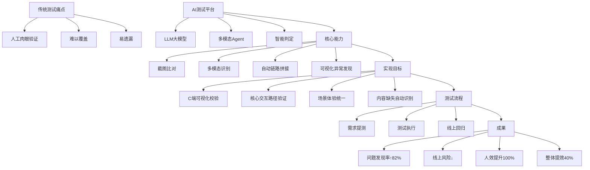

## 📋 文章信息

- **来源**: 微信公众号 - 大淘宝技术
- **作者**: 营销质量团队 - 沈芃
- **发布时间**: 2026年4月1日 17:21
- **阅读链接**: https://mp.weixin.qq.com/s/QVeetEguVAzGnfrAgWdP3w

---

## 🎯 核心摘要

淘宝营销会场智能测试平台基于LLM与多模态Agent，实现了"所见即所得"渲染校验、价格/内容/交互一致性比对、定投与多端适配自动检测，覆盖需求提测、测试执行、线上回归全流程。达成问题发现率↑82%、线上风险↓、测试人效提升100%、整体提效40%，推动测试从"人工驱动"迈向"AI智能判定+闭环自治"。

## 📊 核心观点

### 1. 背景：测试内容模板化

**业务现状**：
- 被测对象（页面、组件、数据服务）趋近稳定
- 技术方案在支持多业务产技需求场景下成熟
- 测试流程、测试范围、测试手段相对标准化

**测试内容聚焦**：
- **主链路测试**
- **埋点验证**

**测试保障维度**：
- 会场性能
- 压测
- 适配
- 兜底容灾

### 2. 传统测试的痛点

会场测试在多个维度验证困难：
- 所见所得渲染验证
- 价格一致性
- Tab/Feed 交互
- 骨架/快照/终态对比
- 渠道投放一致性
- 内容异常发现

**传统方式问题**：
- 依赖人工肉眼和脚本
- 难以覆盖
- 易遗漏

### 3. AI解决方案

**核心能力**：
- 截图比对
- 多模态识别
- 自动链路拼接
- 可视化异常发现

**实现目标**：
- C端可视化校验
- 核心交互路径验证
- 场景体验统一
- 内容缺失自动识别

## 🧠 概念图谱



## 🏗️ 技术架构

### 测试范式转变

| 维度 | 过去（任务驱动） | 现在（AI驱动） |
|------|----------------|----------------|
| **规则定义** | 人定义规则 | 模型理解意图 |
| **执行方式** | 工具执行 | 自主判断结果 |

### Agent测试模式

**模式一：轻流程 + 工具执行 + 轻判断**
```
测试数据获取 → LLM信息解读 → 测试工具执行 → LLM结果判断
```

**模式二：重流程 + 工具执行 + 轻判断**
```
测试数据获取 → LLM信息解读 → 测试工具执行 → LLM结果判断
```

**模式三：轻流程 + 工具执行 + 重多模态判断**
```
测试数据获取 → LLM信息解读 → 测试工具执行 → LLM结果判断
```

### MultiAgent框架架构

借鉴ald-lamp沉淀的solution执行框架，扩展支持：
- 多种Agent管理调用
- Agent实时、异步调用的执行引擎

**核心组件**：

#### 1. IdealLabLLMAbstractBase（抽象基类）

**职责**：
- 定义统一的模型调用接口
- 提供通用的API调用方法
- 规范子类必须实现的抽象方法

#### 2. AgentFactory（工厂类）

**职责**：
- 管理所有LLM模型实例
- 基于Spring Bean后处理器自动注册模型
- 提供模型实例获取接口

**核心功能**：
- 包路径过滤：只扫描指定包下的模型
- 注解驱动：基于@AgentParser注解自动注册
- 实例管理：维护appCode到模型实例的映射

#### 3. IdeaLabLLMConsumer（消息消费者）

**职责**：
- 监听IdealLab平台的异步消息
- 分发消息到对应的模型处理器
- 处理模型执行开始/完成事件

**消息类型**：
- `idealab_ideas_finish_tag`: 模型执行完成
- `answer`: 模型回答消息
- `start`: 模型开始执行

#### 4. AgentParser（注解）

**职责**：
- 标记LLM模型实现类
- 提供模型元数据信息
- 支持工厂自动发现和注册

### 动态扩展机制

**新模型接入步骤**：
1. 继承 `IdealLabLLMAbstractBase`
2. 添加 `@AgentParser` 注解配置
3. 实现抽象方法
4. 放置在指定包路径下

**示例代码**：
```java
@AgentParser(appCode = "text-generator",
            name = "文本生成模型",
            description = "用于生成创意文本内容")
@Component
public class TextGeneratorLLM extends IdealLabLLMAbstractBase {
    @Override
    public void finishHandler(IdeaLabMessage message) {
        // 处理完成回调
        log.info("Model execution finished: {}", message.getSessionId());
    }

    @Override
    public void startHandler(IdeaLabMessage message) {
        // 处理开始回调
        log.info("Model execution started: {}", message.getSessionId());
    }

    @Override
    public void callback(Object[] args) throws Exception {
        // 异步回写逻辑
    }

    @Override
    public IdealabRunIdeasRequest buildRequest(Object[] args) {
        // 构建请求参数
        IdealabRunIdeasRequest request = new IdealabRunIdeasRequest();
        request.setAppCode(getAppCode());
        request.setQuestion((String) args[0]);
        return request;
    }

    @Override
    public CompletionRequest buildCompletionRequest(Object[] args) {
        // 构建OpenAI兼容请求
        return new CompletionRequest();
    }
}
```

### 容错机制

- **异常隔离**：单个模型异常不影响其他模型
- **消息重试**：MetaQ消息处理失败自动重试
- **降级处理**：API调用失败时返回错误信息
- **日志监控**：完整的调用链路日志记录

## 🔑 关键洞察

### 1. 从"人工驱动"到"AI智能判定+闭环自治"

**传统模式**：
- 人工定义规则
- 工具执行
- 人工判断结果

**AI驱动模式**：
- 模型理解意图
- 自主执行
- 智能判断结果
- 闭环自治

### 2. 多模态在测试中的价值

**视觉维度**：
- 截图比对
- 渲染验证
- 界面一致性

**文本维度**：
- 价格一致性
- 内容准确性
- 埋点验证

**交互维度**：
- 点击路径
- 滑动操作
- 状态切换

### 3. 工厂模式在AI系统中的优势

**统一管理**：
- 多模型统一管理
- 动态模型注册
- 生命周期管理

**扩展性强**：
- 插件化架构
- 统一接口标准
- 注解驱动接入

**运维友好**：
- 稳定的技术追踪
- 完善的容错机制
- 实时/异步调用支持

## 📈 业务成果

### 质量提升

- **问题发现率**：↑82%
- **线上风险**：显著降低

### 效率提升

- **测试人效**：提升100%
- **整体提效**：40%
- **人力成本**：降低

### 能力演进

从"工具为主人工为辅"走向"AI驱动智能测试判定"

### 应用场景

- 大促会场巡检
- 会场需求测试
- 线上回归验证

## 🚧 当前不足

### 1. 自动化深度不足
- 问题暴露后仍依赖人工确认与复现

### 2. 兜底验证能力有待补充
- 页面渲染异常（如闪烁）识别准确率需提升
- Tab切换等动态交互体验检测能力不完善

### 3. 功能覆盖不够全面
- 巡检范围需进一步扩展（如复杂交互、个性化推荐）
- 快照能力、诊断时效性、多端一致性校验待增强

### 4. 定投策略验证能力不足
- 缺少对「用户分群定向展示」的自动化校验手段
- 无法自动识别"应展示未展示"或"非目标人群误展"问题
- 需支持基于标签（如会员等级、地域、设备）的模拟请求与结果比对

### 5. 产品化程度待提升
- 用户反馈闭环缺失：期望增加对用户问题通知、跟进机制

## 🔮 后续规划

### 深度智能化方向

在"需求意图识别"、"AI造数"、"智能用例选择"等方向探索：

1. **需求意图Agent识别**
   - 自动理解需求文档
   - 提取测试要点
   - 生成测试计划

2. **测试数据AI构造**
   - 基于需求生成测试数据
   - 覆盖多种边界场景
   - 减少人工造数工作

3. **测试用例AI选择**
   - 智能选择测试用例
   - 优先级自动排序
   - 风险评估

### 建设重点

- 在当前不足之处建设并改进
- 深化LLM、多模态、Agent在会场领域测试的落地
- 通过串联复杂工具、多模态判断进一步提升效果

## 💡 实践启示

### 1. AI在测试中的定位

**不是完全替代，而是增强**：
- AI负责理解意图、执行重复工作
- 人工负责复杂判断、异常处理
- 形成人机协同的测试体系

### 2. 多模态的价值

**单一模态的局限**：
- 纯文本：无法验证视觉效果
- 纯图像：无法理解业务逻辑

**多模态融合**：
- 结合视觉+文本+交互
- 更全面的测试覆盖
- 更准确的异常发现

### 3. 渐进式智能化

**分阶段落地**：
1. 基础自动化（工具脚本）
2. AI辅助（判定、分析）
3. AI驱动（理解、决策）
4. AI自治（闭环、优化）

**避免一次性重构**：
- 在既有基础上逐步引入AI能力
- 保持系统稳定性
- 降低落地风险

### 4. 平台化思维

**从工具到平台**：
- 统一的Agent管理
- 标准化的接口定义
- 完善的容错机制

**可扩展性优先**：
- 工厂模式
- 插件化架构
- 注解驱动接入

## 📊 技术栈总结

### AI能力

- **LLM大模型**：理解意图、生成测试计划
- **多模态Agent**：视觉识别、内容理解
- **智能判定**：结果分析、异常发现

### 工程能力

- **工厂模式**：统一模型管理
- **Spring框架**：依赖注入、AOP
- **MetaQ**：异步消息队列
- **注解驱动**：自动发现与注册

### 测试能力

- **截图比对**：视觉验证
- **链路拼接**：自动化测试
- **多端适配**：跨平台验证
- **性能监控**：Canny算子、首帧检测

## 🎯 适用场景

### 最适合的场景

✅ **可视化界面测试**
- 页面渲染验证
- UI一致性检查
- 视觉异常发现

✅ **内容一致性验证**
- 价格比对
- 内容准确性
- 埋点验证

✅ **多端适配测试**
- 不同设备型号
- 不同系统版本
- 不同分辨率

✅ **回归测试**
- 大促巡检
- 线上回归
- 快速验证

### 需要谨慎的场景

⚠️ **复杂业务逻辑测试**
- 依赖领域专业知识
- AI理解有限

⚠️ **性能压力测试**
- 需要精确的性能指标
- AI判定准确性待提升

⚠️ **安全渗透测试**
- 需要专业安全知识
- AI能力不足

## 📝 关键金句

> "构建基于AI大模型的会场智能测试平台，过去是'任务驱动'——人定义规则、工具执行VS现在是'AI驱动'——模型理解意图、自主判断结果。"

> "会场智能测试平台实现从'人工测试'到'AI驱动智能测试判定'：构建覆盖全链路、贯穿全流程的智能化质量守护体系；在大促会场巡检中提高100%人效。"

> "预期将智能体Agent在会场领域落地朝向'需求意图Agent识别'、'测试数据AI构造'、'测试用例AI选择'方向探索。"

## 🏷️ 标签

AI、测试、Agent、LLM、多模态、淘宝、自动化测试、智能测试、质量保障、实践案例

---

## 🔗 相关资源

- **拓展阅读**：3DXR技术 | 终端技术 | 音视频技术 | 服务端技术 | 技术质量 | 数据算法
- **团队**：淘天集团-营销质量团队
