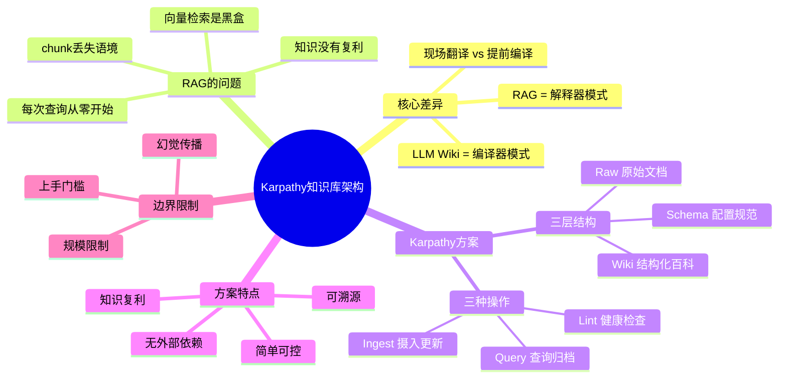

> **来源**：知乎
>
> **作者**：平凡
>
> **原文链接**：[如何评价Karpathy提出的个人知识库的架构？](https://www.zhihu.com/question/2024197832765128929/answer/2024711510899922921)
>
> **收藏日期**：2026年4月7日

---

### 内容摘要

本文分析了 Karpathy 个人知识库方案与 RAG 的核心差异，提出 RAG 是"解释器模式"（每次查询现场读取原文），而 Karpathy 的 Wiki 是"编译器模式"（提前编译成结构化百科）。文章详细介绍了知识编译机制的三层结构（Raw、Wiki、Schema）和三种日常操作（Ingest、Query、Lint），以及该方案的规模限制、幻觉传播风险和上手门槛。

---

### 思维导图

---

## 原文内容

Karpathy 这条推文，技术上没有什么新东西。

没有新模型，没有新算法，没有新工具。

但它 1700 万阅读量背后有一件事值得认真回答：这个架构的本质是什么？它和 RAG 的区别，究竟是技术层面的，还是认知模型层面的？

我认为是后者。

### 先说结论

Karpathy 的方案和 RAG 的核心差异，可以用一对计算机科学里的经典概念来描述：

**RAG = 解释器模式（Interpreter）**

**LLM Wiki = 编译器模式（Compiler）**

你先看下面这个图，很直白的区别。

如果你写过代码，你会立刻明白这意味着什么。

简单来说，就三句话

1. 解释器是每次运行时现场翻译代码，慢但灵活。
2. 编译器是提前一次性把代码翻译好，运行时直接执行，快且高效，但需要预处理时间。
3. RAG 每次查询，都让 LLM 现场去原始文档里"找"信息，临时合成答案，用完即丢。

Karpathy 的 Wiki，是提前让 LLM 把所有文档"编译"成一个结构化百科，查询时 LLM 翻的是自己写的笔记。

这个框架可以推演出几乎所有你想问的问题。

### 为什么 RAG 是"解释器"

RAG 的工作流程是这样的：

你把文档切成小块（chunk），给每个块生成一个向量（embedding）。用户提问时，系统找到最相似的几个块，拼给 LLM，LLM 基于这些块生成回答。

这里面有一个根本性的问题：每次查询，LLM 都是在"现场读原文"。

你今天问"XX 的核心架构是什么"，LLM 读了三段文本，给了你答案。明天你问"XX 的优缺点"，LLM 再读三段文本，又给了你一个答案。这两次回答之间，没有任何积累发生——它每次都从零开始。

你问了 100 次，它就综合了 100 次。

**知识没有复利。**

而且更深的问题是：chunk 本身是人为切割的，丢失了原始语境。向量 embedding 是黑盒，一个文档和另一个文档的关联是通过数学相似度建立的，不是通过语义理解。溯源很难，修改更难。

### Karpathy 方案的核心机制：知识编译

他的系统有三层：

第一层：Raw原始文档，LLM 只读不改，保持不可变。

第二层是 Wiki：LLM 读完所有原始文档后，写出来的结构化 Markdown 文件集合。包含概念页、来源摘要、实体条目，以及页面间的交叉引用（backlinks）。这层才是真正的知识库。

第三层是 Schema：一个配置文件（Gist 里建议用 CLAUDE.md），定义 Wiki 的组织结构、格式约定、操作流程。Schema 把通用 LLM 变成了有纪律的知识管理员。

日常操作只有三种：

**Ingest**：加入新的原始资料，LLM 读完后更新 Wiki。一份新资料通常会触及 10-15 个已有页面，建立新连接。

**Query**：提问，LLM 翻自己写的 Wiki 回答，有价值的回答本身也归档进 Wiki——知识开始复利。

**Lint**：定期健康检查，LLM 扫描 Wiki，找矛盾、孤立页面、过时内容。

Karpathy 自己的研究 Wiki，在单个话题上已经积累到了 100 篇文章、40 万字——比一篇博士论文还长。他没有亲自写一个字。

### 这个框架真正有趣的地方在哪

你可能会问：Wiki 文件多了，不也需要检索吗？那不就还是 RAG 吗？

还真不是。

区别在于**检索的对象是什么**。

RAG 检索的是原始文档的片段，文档本身没有经过理解，语义结构是由检索算法临时决定的。

LLM Wiki 检索的是 LLM 已经理解过、整理过的笔记——语义结构是在 ingest 阶段提前建立好的，查询时只是取出结果。

用编译器类比：RAG 是每次把源码跑一遍；Wiki 是编译好的二进制，直接执行。

Karpathy 在 Gist 里也提到了支撑这个系统的核心工具：qmd（本地 Markdown 搜索，支持 BM25 + 向量 + LLM reranking）、Obsidian（浏览 Wiki 的 IDE）、Web Clipper（自动把网页转为 Markdown 存入 raw/）。

整个技术栈的特点是：简单、可控、可溯源。没有向量数据库，没有外部 API 依赖，全是本地 Markdown 文件。

**Obsidian 的 CEO Steph Ango 本人也参与了这个话题的讨论，他建议维护两个独立 Vault：一个放人工整理的知识，一个放 AI 编译的内容，防止 AI 幻觉污染人工高质量笔记。这个建议很实用，也直接指向了这个方案最大的未解问题。**

### 这个方案的真实边界

说清楚它好在哪，也要说清楚它的边界。

第一，**规模限制**。这套方案在个人知识库规模下非常好用：100-500 篇文章，用 index.md + 上下文窗口就够了。如果你有数十万份文档，上下文窗口装不下，还是需要 RAG 辅助检索。Karpathy 本人也没说这是企业级方案。

第二，**幻觉传播风险**。如果 LLM 在 ingest 阶段写了一个错误的连接，这个错误会通过 backlinks 扩散到越来越多的页面。RAG 至少可以回头看原文，Wiki 里的错误可能更难发现。Lint 操作可以缓解，但不能完全消除。

第三，**上手门槛**。现在这套工具链对非技术用户还是偏程序员友好，需要配置 CLAUDE.md、理解文件夹结构、会用 Coding Agent 执行操作。

这个架构的价值不在于它有多新颖，而在于它把一个"显而易见但没人认真做"的想法清晰化了：

在个人知识管理这个规模，LLM 够聪明，没必要用 RAG 的复杂度。

Markdown + LLM + 纪律，就够了。

对于做研究、整理信息量大的人来说，这个方案现在就值得认真试一试。不一定要搭完整版，哪怕先用最简单的形式，一个 raw/ 文件夹、一个 wiki/ 文件夹、一个配置文件，跑起来的感觉会告诉你这件事有没有价值。
