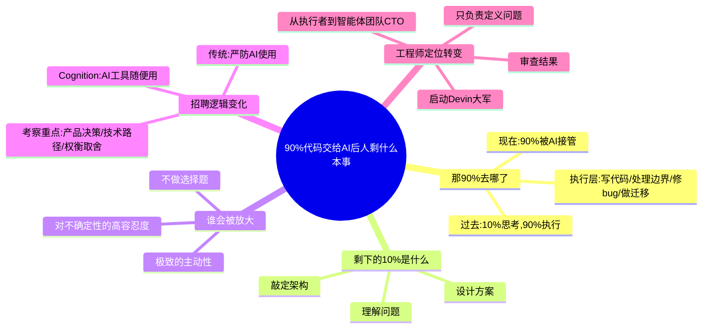

> **来源**: [AI深度研究员](https://mp.weixin.qq.com/s/PqUxWDa6c0rbMYQ9IfrNhQ)
>
> **原文链接**: [90% 的代码交给 AI 后,人还剩什么本事？](https://mp.weixin.qq.com/s/PqUxWDa6c0rbMYQ9IfrNhQ)
>
> **收藏日期**: 2026年4月10日

---

### 内容摘要

本文通过访谈 Cognition AI 创始人 Scott Wu 和联合创始人 Russell Kaplan,深入探讨了 AI 编程时代下的工程师价值转变。核心观点是:当 90% 的代码执行工作被 AI 接管后,人的真正价值在于理解问题、设计方案、敲定架构这三件事。AI 时代的核心竞争力是极致的主动性、不做选择题、对不确定性的高容忍度。

---

### 思维导图

---

## 原文内容

**90% 的代码交给 AI 后，人还剩什么本事？**

全文 3,000 字 | 阅读约 8 分钟

**（Cognition AI 创始人: 90%的代码如何被 AI 接管）**

Cognition AI 的工程师，已经很少亲自写代码了。

因为这项工作，已经被他们自己开发的 AI 接管。2024 年 3 月，这家公司推出了全球首个 AI 编程智能体 Devin。创始人 Scott Wu 是三届国际信息学奥林匹克竞赛（IOI）金牌得主，17 岁就曾拿下世界冠军。在这个顶尖的竞赛圈子里，还走出了大批重塑当今 AI 行业的人才：比如创办 Scale 的 Alexander Wang、Pika 创始人 Demi Guo，以及 RLHF（基于人类反馈的强化学习）联合发明人 Daniel Ziegler。

过去一年间，Devin 已成功接入花旗银行、桑坦德银行、美国财政部等机构的真实业务环境。2026 年仅前两个月，Devin 完成的代码交付量，就已超越了 2025 年全年的总和。

现在，工程师只需投入 1 小时来指导 Devin，就能产出过去 6 到 12 小时的工作量。

当"写代码"这一核心工作被交给 AI 之后，人的真正价值又在哪里？

---

### 第一节｜那 90% 去哪了

Scott Wu 在访谈里说：

"过去做软件开发，大约 10% 的时间用来思考要做什么，剩下 90% 的时间，都在处理实现的细节。"

这 10% 包括理解问题、设计方案、决定用什么架构；而那 90%，是写代码、处理边界情况、修 bug、做迁移、实现所有琐碎的执行环节。

现在，那 90% 的活不用人干了。

在 Cognition 内部，工程师已经不再以写代码为主要工作方式。他们用自然语言描述需求，智能体去实现、修改、测试。用 Devin 干 1 小时，相当于过去人干 6 到 12 小时。

拿产品经理来说，过去需要去问工程师：这个功能为什么这样设计？那段代码是什么意思？尤其是新人刚进公司，有点紧张，不敢问这些看起来很基础的问题。

现在可以直接问 Devin。联合创始人 Russell Kaplan 提到，Devin 不会嫌你问得蠢，你问任何问题，它都会给你答案，还会把相关代码调出来给你看。

而且 AI 能干的活，已经远不止回答问题。

有一个衡量 AI 编程能力的指标叫 SWE-bench，测的是：AI 能自己干多久活，才需要人插手纠正。

两三年前，这个数字是 10 秒。AI 写完一行代码，下一行就错了。

现在，Claude Opus 4.6 能连续工作 18 小时，相当于完成过去 18 小时的人工量，且全程无需人工干预。这一能力每年增长 4 到 5 倍，大约每隔两三个月就翻一番。

当那 90% 的活不用人干了之后，过去那种靠动手能力拉开的差距，正在被快速抹平。

写得快、写得准、经验多，这些过去的核心竞争力，AI 都能做到。一个经验不足的人，只要能把问题讲清楚，也可以靠 AI 完成复杂任务。

Russell 还提到一个细节：在 AI 工具的使用上，很多人的起点其实差不多。工具每三个月就会更新一轮，之前的经验很快就过时了。相比之下，那些没有太多老经验的人，反而更容易适应这种新的工作方式，因为他们不会被旧习惯卡住。

过去人与人之间最明显的差距，正在消失。

---

### 第二节｜剩下的 10% 是什么

当那 90% 的活不用人干了之后，剩下的 10% 是什么？

Scott Wu 给出的答案很具体：理解问题、设计方案、敲定架构。

换言之，在真正动手敲击键盘前，工程师必须先想透三件事：

- 第一，解决该问题的最优路径是什么？
- 第二，当前场景下最合理的系统架构是什么？
- 第三，我最终要实现的业务目标到底是什么？

以前想清这些只是第一步，背后还有大量的执行工作要做。而现在，执行层被彻底交给了 AI。但随之而来的新竞争法则是：当工具门槛被拉平，谁能更精准地定义"应该做什么"，谁就构筑了真正的护城河。

Russell Kaplan 曾在特斯拉自动驾驶团队工作，马斯克的一句话曾让他受益匪浅："**每个人都必须是总工程师（Everyone is a Chief Engineer）**。"

意思是，你不能只懂自己负责的那一块，必须理解全局系统是如何运转的。在自动驾驶团队里，涉及感知、规划、控制等多个模块，想要打造顶尖的系统，就必须对每一部分都有精准的认知，并深谙它们之间的协同机制。

Russell 认为，AI 时代的到来，让这种"全局观"变得前所未有地重要。因为 AI 倾向于将整个系统串联起来进行全局优化，过去各管一块的界限，现在开始模糊。如果你只懂一块，你没法判断 AI 给出的方案合不合理。

Cognition 自身的招聘逻辑，正是这一趋势的最佳注脚。

传统科技公司在面试时，往往严防死守候选人使用 AI，生怕那是"作弊"。但 Cognition 恰恰相反：面试提供数小时，AI 工具随便用，要求是候选人必须从零构建一个完整的产品出来。

这几个小时内，纯靠手写代码根本无法做完面试题目，熟练调用 AI 成了必要条件。但面试官真正考察的，绝不是"你会不会用工具"，而是：

- 你认为究竟应该构建怎样的产品？
- 你在开发中如何做产品决策？
- 面对不同的技术路径，你怎么权衡取舍？

这些需要极高商业与技术直觉的问题，AI 无法替你回答。

问题定义得越准确，后续的开发落地就越顺利。架构想得越透彻，AI 就越能完美贴合你的意图去执行。但在无数个分岔路口判断"哪个方案更好"的，依然是人类。

归根结底，AI 并没有让软件工程变得更简单，只是把难处从"怎么做"，转到了"做什么"和"怎么选"。

---

### 第三节｜谁会被放大

这场范式转变，注定不是每个人都能平稳过渡的。

当 90% 的基础执行工作被剥离后，人与人之间的能力差距不仅没有缩小，反而被进一步拉大。在这里，AI 扮演的是一个的"能力放大器"角色。它不再放大传统的代码执行力，而是成倍放大以下三种特质：

#### 第一样：极致的主动性

Scott Wu 说，Cognition AI 本质上是一个"构建智能体的推理实验室"，他们真正看重的是员工的主动性与推理能力。

什么叫主动性？就是你能不能主动去做事情，不依赖齐全的团队配置，也不需要等别人告诉你该干什么。围绕目标不断往前走，借助 AI 完成原本需要一个团队才能干完的活。

在 Russell 看来，那些主动性强的人更有优势。他们会思考："我能产生多大的业务影响？"并凭借一己之力推动项目落地。

#### 第二样：不做选择题

顶尖工程师群体中正在发生一个显著变化：就是不再纠结选 A 还是选 B。

过去受制于资源和精力，技术决策往往是单向的。但现在，最好的工程师会说："我们干脆同时跑跑看。"他们会将同一个难题拆解成多条路径，分配给多个 AI 智能体并行测试，再从结果中择优。

同样是一天时间，有人只是借助 AI 更快地做完了一件事，而有人却在同时探索五六种可能，并不断校准方向。

前者提升的是单线效率，后者拓宽的是创新边界。

#### 第三样：对不确定性的高容忍度

很多工程工作过去是一门极其精确的手艺，你要控制每一个细节。但现在，你没法完全控制 AI 在做什么，这会让人不舒服。

但是如果你愿意接受一点不确定性，只要最终能验证系统是否达标、能精准评估产出结果，这就足够了。通向结果的具体路径，不再需要被死死盯着。

Russell 在特斯拉研发自动驾驶时，有一句著名的口号："永远不要在 GPU 闲置的时候睡觉。" 当时的习惯是，睡前启动大批机器学习实验，醒来复盘结果。如今，他把这种理念平移到了所有软件开发中："为什么要让 Devin 闲置着过夜？你完全可以在睡觉时让它去跑批量的任务。"

当这三种特质结合，个体的生产力将呈指数级跃升。

以一家受强监管的大型企业为例。他们日常会使用 SonarQube、Snyk 等工具进行严格的安全漏洞扫描。过去，海量的报警日志让工程师疲于奔命。如今，他们将报警系统直接接入 Devin，让其进行首轮筛查与自动修复。结果显示，Devin 在生产环境中成功处理了 70% 的漏洞警报。

在这个过程中，人类工程师的定位彻底蜕变。Russell 将这个新角色称为"智能体团队的 CTO"。你只负责定义问题，然后启动你的 Devin 大军去干活，最后由你来审查结果。

按 Russell 的判断，超级个体和微型团队即将迎来一轮大爆发。因为当执行成本大幅降低之后，限制一个人的，不再是资源，而是他知不知道该做什么、能不能持续把事情推动下去。

面对这场变革，对于已经具备清晰方向和行动能力的人，AI 会把这些能力放大好几倍。对于依赖固定流程、缺少主动推进能力的人，即使拿着同样的工具，也很难有质的变化。

最终的差距，不再源于工具的代差，而在于驾驭工具的心智。

---

### 结语｜答案很简单

90% 的活交给 AI 之后，人还剩什么本事？

三样：问题定义、架构决策、结果取舍。

这些过去只占 10% 的工作，现在成了全部。AI 没有让人变得更平均。它放大了方向感、决策力和推动事情的能力。

谁知道该做什么，谁就更有优势。

---

**本文由 AI 深度研究院出品，内容整理自 Cognition AI 创始人 Scott Wu、联合创始人 Russell Kaplan 在《美国乐观主义者》播客访谈等网上公开素材，属评论分析性质。内容为观点提炼与合理引述，未逐字复制原访谈材料。未经授权，不得转载。**

---

**AI 深度研究员**，AI 的时代则刚到来，一切才刚开始，我们正当其时！**601 篇原创内容**公众号

---

星标公众号，
👆 点这里
1. 点击右上角
2. 点击"设为星标"
← **AI 深度研究员**
⋮ ← 设为星标

---

参考资料：

https://www.youtube.com/watch?v=-pZ3vD0r8a0

https://blog.joelonsdale.com/p/ep-147-scott-wu-and-russell-kaplan

来源：官方媒体/网络新闻
排版：Atlas
编辑：深思
"主编: 图灵"
"--END--"
