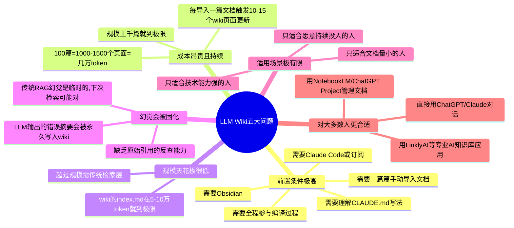

> **来源**: [安蓝 | 赛博航海日志](https://zhuanlan.zhihu.com/c_1540704251026571264)
>
> **原文链接**: [别再研究什么LLM Wiki了,它可能并不适合你!](https://zhuanlan.zhihu.com/p/2025729664270771675)
>
> **收藏日期**: 2026年4月10日

---

### 内容摘要

这篇文章深入分析了Karpathy提出的LLM Wiki知识库方案,并指出了其不适用于大多数用户的五大原因:前置条件极高、成本昂贵且持续、规模天花板低、幻觉会被固化到知识库。作者认为对大多数人来说,不如使用传统RAG或简单的AI对话工具。

---

### 思维导图

---

## 原文内容

**别再研究什么 LLM Wiki 了，它可能并不适合你！**

最近看到一个现象，我觉得挺值得聊聊的。

就是各种 Agent 现在太火了，OpenClaw、Claude Code、Codex 等等，还有 AI 创作类的东西，比如 Seedance 2.0、小云雀啥的，也爆火。

这些东西一个接一个地出来，每一个拎出来都是人类历史上从没有过的创造力工具。

很多人花了各种力气把它们装上了，打开了，然后，就没有然后了。

他们开始变得迷茫了，看着光标在那闪，脑子里一片空白。

我知道，这肯定不止屏幕前的你一个人，很多人都这样，我自己有的时候，看到一个新的 AI 工具，经常也这样。

OpenClaw 这波，把这种现象，推到了最高潮。

然后我就在网上看到一种声音，说：

> 如果你装了 OpenClaw 帮你不知道干啥，那就是你不需要。

OpenClaw 这个词，其实可以代指所有的 AI 工具。

但，坦率的讲，我觉得这话说得不对。

怎么可能有人不需要 AI 工具，也不需要 Agent 呢？很多人其实根本不是不需要，是大家，在繁忙中、在长大中，忘了自己需要什么。

或者用一个更形象的话来说，叫，遗忘了属于自己的创造力。

其实我们可以回想一下小时候，随便给你一堆木，你能玩一下午，给你一支笔，你能画满整面墙。

那个时候的你，从来不会问"我有没有创造力"这种傻问题，因为那个时候的你，浑身上下都是创造力。

每个人都是。

后来呢？我们上学了，老师告诉你，这道题只有一个标准答案。

你画的画不好看，因为太阳应该是红色的不是绿色的，你的作文跑题了，因为你没有按照模板来。

再后来，上班了。老板告诉你，按照流程来，别搞创新，先把手头的事做完。你的想法不重要，KPI 才重要，周报要准时交，PPT 要按模板做，汇报要用 STAR 法则。

如此生活二三十年，直到，大厦崩塌。

一层一层的规训之下，你的创造力消失了，现在，面对 AI 工具你不知道干啥，其实并不是因为你不需要。

是因为你的创造力被掩埋了太久，久到你自己都忘了它存在过。

我看着还挺伤感的。

因为作为一个做了快十年的设计师，同时又是一个重度游戏死宅，我一直觉得，创造是人的天性，每个人出厂自带的东西，我自己也有一些不成熟的经验，也是之前带设计团队时，激发大家创造力用的。

所以今天这篇文章，我也想分享一下我自己的经验，希望有可能，用这篇文章，帮你找回你的创造力。

我也不知道行不行，但是希望大家给我 10 分钟时间。

也希望，能对大家有用。

---

### 一、 找到那个让你浑身难受的东西

很多人觉得创造力是一种能力，就像编程能力、英语能力一样，有些人天生就有，有些人天生就没有。

但就像我上面说的，创造力，本身就是与生俱来的东西。

创造力，它是欲望。

我自己是 UI 设计师出身，那一个设计师为什么能想出一个好的界面方案？很多时候，真的不是因为他比别人聪明，单独的就是因为他看到一个烂界面的时候，浑身难受。

就是那种"这也太恶心了我受不了"的感觉，这种感觉，我觉得，才是创造的起点。

心理学上有个概念叫认知失调，大概就是说当你的预期跟现实之间出现了落差，大脑会产生一种强烈的不舒服感，然后驱动你去消除这个落差。

创造力的引擎，我觉得，就是这个不舒服感。

我以前带团队的时候，遇到过一种特别头疼的情况，就是你让一个新人去做一个页面，他会问你，"这里应该用什么颜色？那里应该放什么图标？"

你跟他说，你自己觉得呢？他说他没有想法。

他真的没有想法吗？

不是。

他没有欲望。他没有"这个东西我今天必须给他做的好看到爆炸"的执念，也没有"用户在这一步一定会懵"的共情。

他只是在完成一个任务，不是在创造一个作品。

但同样一个人，你让他去做一个他自己真正在意的东西，比如给自己的乐队做一张海报，比如给自己喜欢的游戏做一个同人图，他可能熬到凌晨三点都不觉得累，真的，欲望一旦点燃，能力自然就跟上来了。

所以我觉得，找回创造力的第一步，不需要去学什么技巧，而是去找到那个让你浑身难受的东西。

找的方法我自己是这样的。

每天刷手机或者看外面的时候，你一定会遇到两种让你停下来的瞬间。

一种是好厉害好牛逼，这种直接跳过，因为它只会让你焦虑。

另一种是我靠这也太烂了或者为什么没有人做这个？？？

后面这种，就是你创造欲的种子。

把它记下来。手机备忘录就行，就写一句话，"xx 产品的 xx 功能太反人类了"，"为什么没有一个能 xxx 的工具"，"如果这个东西能 xxx 就好了"。

不用想怎么解决，先记下来就行。

积累到十条的时候回头看看，你会发现一个规律，你记下来的这些东西，几乎都集中在同一两个领域。

那就是你真正在乎的东西。

你的创造力，就从那里长出来。

这一步看着简单，但我见过太多人卡在这里。

他们其实并不是没有创造力，只是，从来没有认真问过自己，我到底对什么不满意。

---

### 二、 把范围缩小到一个下午

有了想法之后，大多数人会卡在第二步。

因为想法太大了。

很多人的想法就是，"我想做一个屌炸天的 AI 产品"，"我想拍一个巨牛逼的短片"，"我想写一本无敌的书"。

这种量级的东西，我说实话，除了让你颅内高潮，很多时候并没有什么卵用。

心理学上管这个叫选择过载。

Barry Schwartz 在《选择的悖论》里写过，当选项太多的时候，人不会变得更自由，反而会陷入瘫痪，就像超市里有 6 种果酱的时候，30% 的人会买，而有 24 种果酱的时候，只有 3% 的人会买。

选择越多，行动力越低。

我们做交互设计的时候，也有过一个叫做 7±2 的信息块的原则，不能更多，再多的话，用户会认知过载，这时候大脑会宕机。

AI 时代，就像给你的就是这种 24 种果酱的状态。

你能做的事情太多了，多到你直接懵逼了，什么都不做了。

解决方法特别简单，是主动给自己加约束。

无限的自由是创造力的敌人，人的大脑从来不擅长在无限可能性中做选择，最擅长的，是在有限条件下找到最优解。

就像我最喜欢的游戏，《塞尔达旷野之息》，游戏里就给你四个能力，磁力、制冰、时停、炸弹，就这四个，然后武器会坏，箭会用完，体力会耗尽，你看，其实满屏都是限制。

但正是这些限制，逼出了无数的名场面操作。

比如你想上一座悬崖但体力不够，你就可以在山脚下点燃一片草地，热气流升起来了，你打开滑翔伞，直接被热气流送上去。游戏里从来没有教过你这一招，但物理引擎告诉你，火产生热空气，热空气上升，滑翔伞可以借力。你自己把这三件事连起来了。

甚至还有风弹技巧，老流氓应该都会，持盾前跳瞬间按下 L 放圆形炸弹，然后进入林克时间放置方形炸弹，切回圆形炸弹引爆，你就直接进入了引力弹弓状态。

这些，都是在限制之下，玩家自己挖掘出来的。

还有我最近抽空在玩的《宝可梦 Pokopia》更是限制极多，一堆我想造造不来了的东西，一堆我想要的宝可梦没有，但这样，反而激发了我更多的创造力和探索欲。

创造力，很多时候，也源于限制。

怎么给自己加限制呢，其实我觉得也很简单，三个约束就好。

第一个，工具约束。比如这次只用一个工具。无论是 Claude Code，或者 Midjourney，或者 Seedance 2.0，选一个就够了，别贪多。

第二个，时间约束。就一个下午或者一个晚上。绝对不能是一周，不是一个月，就今天下午，比如到晚饭前必须有一个能跑的东西。

第三个，范围约束。只做一个功能，解决一个问题。

三个约束叠在一起，就像塞尔达里你只有三个招式一样。

你相信我，这个时候，你的大脑可能不再恐慌了，反而会开始兴奋了。

我举几个真实的例子。

- "今天下午，用 Claude Code，给自己做一个每天记录灵感的小工具，就一个输入框加一个列表。"
- "今天下午，用 Midjourney，给自己的公众号设计一套视觉风格，就出 5 张图。"
- "今天下午，用 Seedance 2.0，把梦中的场景做成一个 15 秒的短视频。"

就这么小，小到你觉得我靠这也太简单了吧。

然后去做就好。

宫本茂做了一辈子游戏，一辈子都在用这一招。

他说过一句话，大意是，好的游戏设计是在一个小房间里找到乐趣，而不是在一片大陆上迷路。

所以任天堂，贡献了这个世界几乎所有最牛逼的箱庭游戏。

创造也是一样。

---

### 三、 做一个烂东西出来

接下来是最关键的一步，也是最多人过不去的一步。

动手。

很多人会卡在"我再想想"，"我还没准备好"，"等我学完 xxx 再开始"。

这种想法在传统时代可能是对的，毕竟以前做一个东西的成本很高，改一次代码要好几天，打一个样要好几千块。

但在 AI 时代，这个逻辑要彻底反过来。

AI 把动手的成本降到了几乎为零。你跟 Claude Code 说一句话，5 分钟就能跑起来一个小工具。你跟 Midjourney 描述一下脑子里的画面，10 秒钟出结果。PixVerse v6、Seedance 2.0，一段文字就能生成一个视频。

动手的成本已经低到了历史性的位置。

你不需要想好一个完美的 idea 再开始了，直接上手做一个粗糙的东西，做完看看，不满意就改，改完再看，再不满意再改。

这个过程在设计行业叫"原型思维"。

对我影响最大的游戏设计师同时也是我的偶像，宫本茂，他做了一辈子游戏，其实也都是这个路子。

他最不喜欢写长篇大论的策划文档，他每次都是先做一个极其粗糙的原型让人玩，好玩就打磨，不好玩就扔。

鬼泣最开始，也就是一个在屏幕上跳来跳去的方块。

其实不只是游戏行业。

经常创业或者做产品的朋友都知道，有个核心概念叫 MVP，最小可行产品。不做一个完美的产品去验证市场，先做一个最小的、能跑的东西，扔出去看看用户的反应，然后快速迭代。

道理是完全一样的。先出活，再迭代。

我十年前还在做 UX 设计的时候，leader 跟我说过一句话，"别想了，先画。画出来再说，哪怕画得像屎一样也没关系，屎里面也能找到黄金。"

俗，但确实是真的。

因为 idea 在脑子里的时候，是模糊的、不确定的、你自己也说不清楚的。

但一旦你把它做出来，哪怕是最简陋的版本，你立刻就能看到哪里不对、哪里可以更好、哪里是你真正想要的。

做的过程，就是思考，相信我，手比脑子快。

所以，我给一个特别具体的建议。

今天就打开 Claude Code，或者你手上任何一个 AI 工具，把你备忘录里那几条让你难受的东西拿出来，挑一条最简单的，花一个下午做一个最小版本出来。

不要求好，只要求有。

你会发现，当你做出第一个烂东西的那一刻，后面的事情会自动开始自然而然的运行起来了。因为你看着它，你会自然而然地想到"这里要是能加个 xx 就好了"，"那个地方的交互应该改一下"。

这些想法，就是创造力。

它不是从天上掉下来的，是从你的第一个烂东西里长出来的。

---

### 四、去其他的领域偷东西

做出了第一个烂东西之后，下一个问题自然就来了。

怎么让它变好？

这一步，我想围绕一个人讲。

1996 年《Wired》对乔布斯的采访里，乔布斯说了一段话，大概是全世界被引用次数最多的关于创造力的论述。

他说，creativity is just connecting things。

创造力就是把东西连起来。

然后他说了一句更重要的话。

"当你问那些有创造力的人他们是怎么做到的，他们会觉得有点心虚，因为他们并没有真的做什么，他们只是看到了一些联系。他们之所以能看到，是因为他们的经历比别人更丰富，或者他们花了更多时间去思考自己的经历。"

你看，他没有说创造力来自聪明，也没有说来自天赋，他说的是来自经历的丰富度。

你的 dots 越多，能连出来的线就越多，你的线越多，创造力就越强。

这句话被引用了无数次，但很少有人告诉你具体怎么做。

我自己过去的经验就是，方法就三步。

第一步，去不相关的领域收集 dots。

我自己就是一个活生生的例子。

我是做 UX 设计出身的，后来转做 AI 内容，也就是现在这个公众号。这两个领域看着差了十万八千里，但我写文章的时候，经常会不自觉地用设计师的思维去拆解 AI 产品。

比如我写 AI 看不到爱心那篇文章的时候，别人看到的是一个好玩的现象，但我看到的是格式塔心理学，是交互设计的基石，是人类感知系统和 AI 感知系统的底层差异。那个角度不是我硬凑的，是我这么多年的设计经验，直觉上感觉是有关系的。

再比如，我玩了这么多年模拟经营游戏，看商业模式的时候，脑子里会自动跑一个资源循环的模型。这个公司的输入是什么、加工过程是什么、产出是什么、怎么形成正向循环，不就是《城市天际线》还有《戴森球计划》的核心玩法吗？

所以你是程序员？去学学摄影。

你是设计师？去读读历史。

你是做金融的？去养一缸鱼。

不用太认真，也不用考证，就是去接触、去玩、去感受。

第二步，拆别人的作品，把 dots 连起来。

找一个你喜欢的作品，把它的骨架拆出来。

我自己就是在游戏里学会拆解的。很多时候玩一个游戏不只是通关，而是去想，这个关卡为什么让我死了十次还想再试？这个经济系统为什么让我停不下来？这个思考，其实非常的有意思。

拆的时候就回答三个问题就够了。

它怎么钩住你的？怎么一步步推进的？你在哪个瞬间觉得"卧槽"？

电影其实也是这样。

拆几个作品之后，你会开始用创造者的眼光看世界了，这个思维一定要有。

第三步，把偷来的结构用到你自己的事情上。

这一步才是关键中的关键。光拆不用，等于没拆。

我自己写文章、做案例的很多技巧，来自两个完全不相关的领域。

第一个来自编剧。比如英雄之旅是很多好莱坞电影的底层叙事结构，一个普通人被召唤去冒险，经历考验，获得宝物，带着变化回到日常。我有时候写故事的时候，结构几乎一模一样。先说我遇到了什么问题，再说怎么用 AI 工具一步步解决，最后秀出那个让人"卧槽"的结果。

何同学很多视频，也是英雄之旅的节奏。

还有一个比如契诃夫之枪。也是编剧理论，说的是你在第一幕挂了一把枪在墙上，第三幕它就得开火。翻译成内容创作就是，你前面埋的每一个细节后面都得响，我写文章的时候有时候会在开头或者中间留一个小钩子，到结尾 callback 回来，读者会觉得这是一个完整的作品，不是一堆信息的堆砌。

等等等等，编剧技巧里，其实很多东西，都对内容创作的节奏是有用的。

第二个来自喜剧。我从喜人奇妙夜里接触到了 sketch 戏剧，学到了一个叫"升番"的技巧。就是找到一个好玩的 game 点，然后一轮一轮升级，每轮都比上一轮更夸张、更出乎意料。

比如经典的《父亲的葬礼》，一轮比一轮离谱。

这个升番逻辑，我做 AI 案例的时候用得太多了。

展示一个工具不会一上来放大招。先展示基础功能让大家觉得还行，再放一个进阶用法让大家觉得有点意思，最后放出一个出乎意料的骚操作让大家觉得卧槽还能这么玩？

一轮一轮升上去，观众的情绪就是这么被推着走了。

你看，编剧、喜剧，两个看似毫不相关的领域，全部被我用在了 AI 内容创作上。

这就是 connecting dots。

dots 不是凭空出现的，是你每接触一个新领域，就在脑子里多放一个。

放得越多，有一天某两个 dots 之间突然亮了一条线，那就是创造力。

乔布斯还说过另一句话：

"你不可能在往前看的时候把 dots 连起来，你只能在回头看的时候才能看到那些连接。"

所以你必须相信，那些 dots 在未来的某一天会以某种方式连接起来。

你现在去学的每一个不相关的东西，都是在为未来的创造力，存下那个最宝贵的资产。

---

### 五、 给大脑留一段什么都不干的时间

上面四步都是做的事。

这一步恰好相反，是关于不做。

我是真的觉得，创造力最大的敌人除了注意力枯竭之外，还有一个东西。

是舒适。

脱口秀行业之前有个很有意思的概念，叫"穷门"。

何广智当年最火的时候，讲的全是自己穷困潦倒的段子，月收入 1400 块，住在上海北郊，那些窘迫的生活细节被他讲出来，笑中带泪，炸翻全场。

但后来那两季他火了，有钱了，搬进了内环，关于贫穷的段子越来越少，内容开始走低，那些生活的创意和哲学，开始少了很多，从生活泥土里长出来的东西，一旦离开了泥土，就枯了。

不过何广智是一个非常伟大的脱口秀演员，后来逐渐找到了方法，调整了回去，最后，终于夺了冠。

还有大刘刘慈欣，大刘在山西娘子关电厂干了二十多年，那个地方四面环山。但就是在那个看似偏僻无聊的地方，在大东北国企裁员的压力之下，他写出了《流浪地球》，写出了《乡村教师》。

甚至在当时时代背景的心态抑郁之下，大刘的身体出现了一些不良症状，然后庸医告诉他，你患了肝癌，没几天好活了。

于是，在那种面对死亡的终极焦虑面前，大刘彻底放开了创造力。

于是，《球状闪电》，面世了。

再后来，因为娘子关电厂要关停了，2000 个员工只能留 400 个，剩下 1600 人不知道去哪，那种死亡和生存竞争的焦虑，直接催生了黑暗森林法则。

于是，最伟大的科幻巨制之一，《三体》，诞生了。

再后来，发现是误诊，加上《三体》火了，也有钱了，然后大家都知道的，他的产量急剧下降，网上经常有人调侃，他现在写不出好作品了，主要是没有原单位那种穷感。。

所以啊，现在创造力的真正燃料，是摩擦。

是你跟现实之间的落差感，是"我对这个东西不满意"，是"我的处境必须被改变"。

那为什么我还说，要让你不做呢？

因为焦虑是燃料，但燃料需要一把火来点燃。

那个引擎，就是空白时间。

神经科学里面有个理论，就是当人处于无事可做的状态时，大脑会进入默认模式网络，开始自由联想，把散落的记忆和想法随机连接。

说真的，这年代，焦虑我们从来不缺。

工作的焦虑、落后的焦虑、燃料多得都快溢出了。

我们其实真正缺的，就是那一把火，那个让大脑安静下来把燃料点燃的空白时间。

我们现在的生活，每一秒的空闲都被手机填满了。

电梯刷手机，坐地铁刷手机，上厕所刷手机，睡前刷手机，大脑从早到晚都在处理外界输入，默认模式网络根本没机会启动。

所以我自己，一直提倡降噪，精选信息，我也是这么做的。

你也可以回想一下，你人生中那些最好的 idea，是在什么时候冒出来的？我觉得可能跟我一样，大概率是洗澡的时候、走路的时候、发呆的时候、快睡着的时候。

那些时刻，你的大脑终于有机会处理那些积压的焦虑和想法了。

所以，给你一个非常具体的建议。

每天留 30 分钟的空白，不用多，就 30 分钟。

不需要搞冥想那种刻意的空，就是散个步不带耳机，洗个澡多泡一会儿，或者就躺在那里什么都不干。

这 30 分钟不是让你放松的，是让你的大脑有机会把那些积压的焦虑、不满、想法，自己连接起来，变成创造力。

很多时候你苦思冥想想不出来的东西，相信我，在这 30 分钟里会自己冒出来。

---

### 六、 只为自己爽

最后一条，可能也是最重要的一条。

当你看到太多别人做的东西之后，你的大脑会启动一个很危险的机制。

那就是，比较。

"这个人用 Cursor 做了一个网站，比我能做的好多了。"

"那个人的 AI 视频质量也太高了，我做出来肯定不行。"

"这个 idea 已经有人做了，而且做得比我想的好。"

每比较一次，你的创造欲就下降一点。

比较到最后，你得出一个结论，算了，不做了，反正也做不过别人。

心理学管这个叫习得性无助。

Martin Seligman 在 1967 年做过一个很经典的实验，大概就是当一个生物反复经历自己无法控制的挫败后，即使后来条件改变了、它可以逃脱了，它也不会尝试了。

不是你天生无助，是你在反复的比较中学会了无助。

不是你天生无助，是你在反复的比较中学会了无助。

说真的，我自己也有过这种时刻。

我写了三年公众号，有时候看到别人的文章比我写得好，数据也比我爆，粉丝比我涨得快，那一瞬间，真的会有一种"我到底在干个啥啊"的空虚感。

但后来我想明白了。

你创造一个东西，首先应该是为了让自己爽。

我做这个公众号，最开始的动力也从来不是我要做一个大号，其实就是是我发现 AI 时代，真的有意思的东西太多了，我自己憋不住，我想分享，仅此而已。

我做 Claude Code 的教程，也不是因为这个选题有流量，这玩意真的没啥流量，单纯的就是因为我自己用得太爽了，不分享出来我难受。

Edward Deci 和 Richard Ryan 的自我决定理论说，人有三种基本心理需求，自主感、胜任感和联结感。

当你做一件事是出于内在兴趣而不是外部奖惩的时候，你的创造力、持久力和满足感都会显著提高。

就像我玩宝可梦 Pokopia，我的小岛肯定没有那些大佬设计得好看，但那是我的岛，每一棵树都是我种的，每一个角落都有我的记忆。

你让我跟别人换？我才不换。

你做这些，首先是为了自己开心。

不是为了涨粉，不是为了 KPI，不是为了让老板满意，不是为了在朋友圈炫耀。

就是因为，创造的感觉太爽了。

你做的东西可以很烂，但它是你的。

我真的很觉得，这比什么都重要。

---

### 写在最后

写到最后了，突然想到了之前看过的一本书。

叫，《游戏的人》，荷兰历史学家赫伊津哈 1938 年写的。

他说，人类文明，不是从劳动中诞生的，是从游戏中诞生的。

语言是游戏，诗歌是游戏，法律是游戏，艺术是游戏。

人类所有伟大的文明成就，都可以追溯到游戏的冲动。

我们社会的一切，其实本质上，都是一条又一条的游戏规则。

我们回看小孩子，他们最早的学习方式是什么？就是游戏。

他们没有学什么所谓的理论，是直接上手玩，在玩的过程中，来理解世界的规则。

他们不怕失败，因为游戏里失败了可以重来。

他们也无需计较成本，因为游戏就是目的。

他们也无需外部动机，因为玩这件事自带快乐。

不怕失败、不计成本、自带快乐。

这不就是创造力最纯粹的状态吗？

我们长大以后，这三样东西好像，全丢了。

怕失败，因为失败有代价。计成本，因为时间精力有限。需要外部动机，因为没有 KPI、没有别人的认可，不知道做一件事有什么意义。

但我真的想说。

AI 时代给了我们一个巨大的机会。

它在帮我们把这三样东西还回来。

失败的代价？几乎为零。Claude Code 写的代码不行？删了重来呗。动手的成本？极低。AI 帮你跳过了最枯燥的启动期，你可以直接进入"玩"的阶段。

至于自带快乐。。

这个得你自己找回来，AI 帮不了你。

但我自己的方法，已经都放在这篇文章里面了。

我也不知道对大家有没有用，但是我已经毫无保留的分享了，如果能帮到一个甚至是几个朋友，我就觉得已经很开心了。

赫伊津哈说，在游戏中，我们最接近自己。

我深以为然。

去玩吧，去创造吧。

怕，只是从一个很小很小的东西开始。

---

以上，既然看到这里了，如果觉得不错，随手点个赞、在看、转发三连吧，如果想第一时间收到推送，也可以给我个星标 ⭐～谢谢你看我的文章，我们，下次再见。

>/ 作者：卡兹克
>/ 投稿或爆料，请联系邮箱：wzglyay@virxact.com

---

*本文基于原知乎文章《别再研究什么LLM Wiki了,它可能并不适合你!》的深度收藏整理,保留了原文完整内容,并增加了内容摘要和思维导图。*
