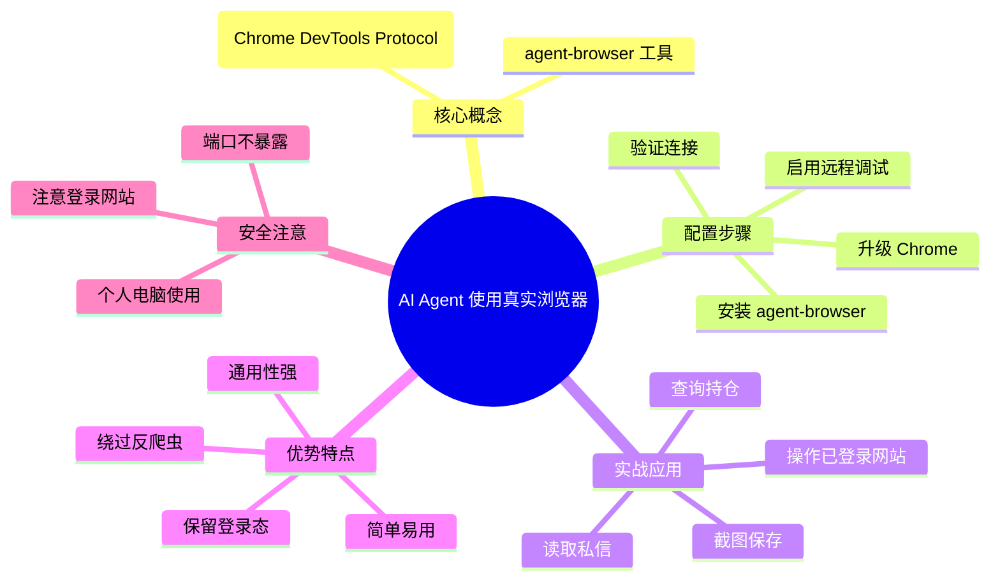

> **来源**：知乎
>
> **原文链接**：[🚀 让 AI Agent 使用你真实的浏览器：agent-browser + CDP 实战指南](https://zhuanlan.zhihu.com/p/2016619507611870518?share_code=9qA8LYye7nMw&utm_psn=2026233862406119717)
>
> **收藏日期**：2026年4月11日

---

### 内容摘要

本文介绍了一种使用 agent-browser 和 Chrome DevTools Protocol (CDP) 让 AI Agent 连接到真实 Chrome 浏览器的方法，通过启用 Chrome 远程调试功能，让 AI 可以直接使用用户的登录态和 Cookie，绕过大部分反爬虫检测，实现对需要登录网站的自动化操作。

---

### 思维导图



---

## 原文内容

🚀 让 AI Agent 使用你真实的浏览器：agent-browser + CDP 实战指南
高产似母猪​
阿里巴巴 员工
​
关注他
4 人赞同了该文章

一句话总结：把 AI 接到你正在用的 Chrome 上——不再被反爬虫拦截，直接使用你的登录态，任何网站都能访问。

### 💡 为什么要看这篇文章？

你是否遇到过这些痛点：

- ❌ AI 自动化脚本被网站反爬虫系统拦截（比如知乎返回 40362 错误）
- ❌ 每次都要重新登录，麻烦而且容易被识别
- ❌ 想用 AI 操作需要登录的网站（如券商、电商后台），但无法携带登录态
- ❌ 使用无头浏览器，容易被识别为机器人

今天分享一个超简单的解决方案，让你：

- ✅ 使用真实的 Chrome（你正在用的那个）
- ✅ 自动携带所有 Cookie、登录态、插件
- ✅ 绕过大部分反爬虫检测
- ✅ 任何 AI Agent 都能用，不只是 Claude

### 🎯 什么是 agent-browser + CDP？

**核心概念**

CDP (Chrome DevTools Protocol) 是 Chrome 的调试协议——你按 F12 打开开发者工具，底层就是 CDP 在通信。

agent-browser 是 Vercel Labs 开发的 CLI 工具，把 CDP 封装成简单易用的命令行接口。

**工作原理对比**

传统方式（无头浏览器）：
```
AI → 新建浏览器 → 被网站识别为机器人 → ❌ 失败
```

agent-browser + CDP：
```
AI → 你的真实 Chrome → 网站认为是真实用户 → ✅ 成功
```

### 🛠️ 完整配置指南

**前置要求**

- 已安装 Chrome（推荐 Chrome 145+）
- 已安装 Node.js 和 npm

**步骤 1：安装 agent-browser**

```bash
npm install -g agent-browser
```

**步骤 2：升级 Chrome（如果版本低于 145）**

检查版本：在 Chrome 中输入 `chrome://version`

如果版本低于 145，需要升级：

**Windows 用户：**

访问 https://www.google.com/chrome/ 下载最新版本，或使用 winget：

```bash
winget upgrade Google.Chrome
```

**Mac 用户：**

```bash
brew install --cask google-chrome
```

**步骤 3：启用 Chrome 远程调试**

**Chrome 145+（推荐方式）：**

- 在 Chrome 中打开：`chrome://inspect/#remote-debugging`
- 勾选 "Allow remote debugging for this browser instance"
- 点击 "Configure"，确保端口设置为 `9222`
- 点击 "Done" 保存

不需要重启 Chrome！

**Chrome 145 以下：**

需要用命令行参数启动 Chrome（会关闭所有标签页）：

```bash
# Windows
"C:\Program Files\Google\Chrome\Application\chrome.exe" --remote-debugging-port=9222

# Mac
"/Applications/Google Chrome.app/Contents/MacOS/Google Chrome" --remote-debugging-port=9222
```

**步骤 4：验证连接**

```bash
# 检查端口是否在监听
netstat -ano | grep 9222 | grep LISTENING

# 或
lsof -i :9222
```

如果看到端口在监听，说明配置成功！

**步骤 5：连接并测试**

```bash
# 自动发现并连接
agent-browser --auto-connect get url

# 打开一个测试网站
agent-browser --auto-connect open "https://example.com"
```

### 📝 实战案例：操作已登录的知乎

**场景：使用 AI 读取知乎私信**

传统方式：直接用 agent-browser 访问知乎 → 返回 40362 错误

使用 CDP 方式：

```bash
# 连接到已登录知乎的 Chrome
agent-browser --auto-connect open "https://www.zhihu.com"

# 获取页面快照
agent-browser snapshot
```

你会看到：

```
(99+ 封私信 / 80 条消息) - 知乎
```

完全保留了你的登录态！

**更实用的操作示例**

```bash
# 登录券商网站并查询持仓
agent-browser --auto-connect open "https://trade.example.com"
agent-browser snapshot

# 提取持仓数据
agent-browser eval 'document.querySelector(".position").innerText'

# 截图保存
agent-browser screenshot position.png
```

### ⚠️ 重要注意事项

**安全性**

⚠️ 警告：启用远程调试会给予浏览器完全访问权限

- ✅ 在个人电脑上使用
- ❌ 不要在公共电脑上启用
- ❌ 不要将 CDP 端口暴露到网络
- ❌ 启用调试时注意你登录了哪些网站

**Chrome 重启**

- Chrome 重启后，远程调试会自动关闭（安全特性）
- 如果 Chrome 145+，只需重新勾选选项即可
- 如果 Chrome 145 以下，需要用命令行参数重新启动

**多标签页问题**

- agent-browser 会连接到任意一个标签页
- 如果有多个 Chrome 实例，可能连接错
- 建议关闭不必要的 Chrome 实例

**Windows 特殊注意**

如果遇到端口占用问题：

```bash
# 查看端口占用
netstat -ano | findstr :9222

# 杀死占用进程（谨慎使用）
taskkill /F /PID <进程ID>
```

### 🎓 进阶学习

**常用命令速查**

```bash
# 导航
agent-browser open <url>              # 打开网址
agent-browser back                     # 后退
agent-browser forward                  # 前进

# 交互
agent-browser click <selector>        # 点击元素
agent-browser fill <selector> <text>   # 填写表单
agent-browser type <selector> <text>   # 输入文本

# 等待
agent-browser wait <ms>               # 等待毫秒
agent-browser wait --load networkidle # 等待网络空闲

# 信息获取
agent-browser get url                  # 获取当前 URL
agent-browser snapshot                  # 获取页面快照
agent-browser screenshot <path>       # 截图

# JavaScript 执行
agent-browser eval 'document.title'    # 执行 JS
```

**调试技巧**

```bash
# 打开 Chrome DevTools
agent-browser inspect

# 查看控制台日志
agent-browser console

# 查看 JavaScript 错误
agent-browser errors

# 高亮元素
agent-browser highlight <selector>
```

### ❓ 常见问题

**Q1: 连接失败怎么办？**

A: 检查以下几点：

- Chrome 是否正在运行？
- 远程调试是否已启用？
- 端口 9222 是否在监听？
- 防火墙是否阻止了连接？

**Q2: 可以同时有多个 Chrome 实例吗？**

A: 可以，但要注意：

- 每个 Chrome 实例需要不同的 CDP 端口
- agent-browser 会连接到第一个找到的实例
- 建议关闭不需要的 Chrome 实例

**Q3: 会影响浏览器性能吗？**

A: 影响很小：

- CDP 协议开销很小
- 主要性能消耗在浏览器本身的操作
- 正常使用不会明显卡顿

**Q4: 支持其他浏览器吗？**

A: agent-browser 主要支持 Chrome/Chromium，但也支持：

- Edge（Chromium 内核）
- Brave（Chromium 内核）
- 其他基于 Chromium 的浏览器

### 🎉 总结

agent-browser + CDP 方案的核心优势：

- 简单易用：只需在 Chrome 中勾选一个选项
- 绕过检测：使用真实浏览器，不易被识别为机器人
- 保留登录态：直接使用你的 Cookie 和会话
- 通用性强：任何 AI Agent 都能用
- 性能优秀：比传统方式更快更省 Token

如果你经常需要用 AI 操作需要登录的网站，这个方案绝对是神器！

💡 提示：第一次使用建议在测试网站上练习，熟悉后再应用到生产环境。

🔒 重要：记得使用完毕后检查是否需要关闭远程调试（如果需要更高的安全性）。

希望这篇指南对你有帮助！有任何问题欢迎交流讨论。
