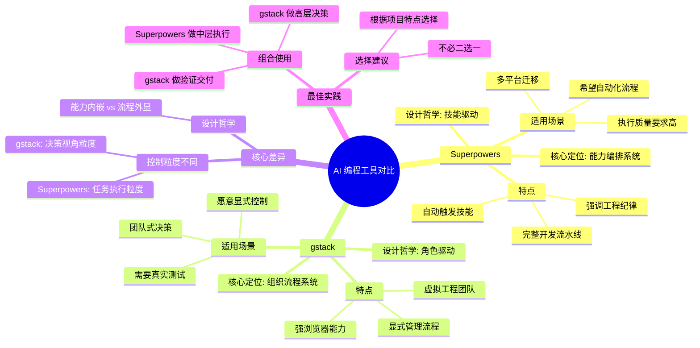

> **来源**：知乎
>
> **原文链接**：[深度拆解 Superpowers 和 gstack：AI 编程真正的差距，不在模型，在工作流](https://zhuanlan.zhihu.com/p/2019440154893374100)
>
> **收藏日期**：2026年4月11日

---

### 内容摘要

本文深度分析了 Superpowers 和 gstack 两个代表性的 AI 编程工具，指出它们虽然都在增强 AI coding agent，但设计哲学完全不同：Superpowers 是"能力编排系统"，gstack 是"组织流程系统"。文章从核心差异、技术实现、适用场景、落地方式等多个维度进行拆解，并提出两者组合使用的最佳实践。

---

### 思维导图

---

## 原文内容

深度拆解 Superpowers 和 gstack：AI 编程真正的差距，不在模型，在工作流
youe

关注他
收录于 · AI 编程
171 人赞同了该文章

目录
深度拆解 Superpowers 和 gstack：它们都在重塑 AI 编程，但走的是两条完全不同的路

过去一年，AI 编程工具最大的变化，不是模型更强了，而是大家逐渐意识到一件事：

真正决定 AI 写代码质量的，往往不是模型本身，而是你如何组织它的工作方式。

也就是说，问题已经从"用哪个模型"慢慢转向了：

怎么让 AI 不要一上来就胡乱写代码？
怎么让它先想清楚需求、边界、测试和设计？
怎么让它像一个靠谱的工程团队，而不是一个情绪不稳定的实习生？

最近两个很有代表性的开源项目，正好走了两条不同但都很值得研究的路径：

obra/superpowers：把 AI 编程流程建立在 skills（技能） 之上，强调可组合、可复用、可自动触发的工程化工作流。官方将它定义为"一个基于可组合 skills 的完整软件开发工作流"。

garrytan/gstack：把 AI 编程流程建立在 roles（角色） 之上，用"CEO、工程经理、设计师、QA、发布经理"等角色，把 Claude Code 组织成一个"虚拟工程团队"。README 里明确写的是：它把 Claude Code 变成了一个 virtual engineering team。

这篇文章，我不只想做一个"项目介绍"。我更想回答四个更本质的问题：

Superpowers 和 gstack 到底分别在解决什么问题？
它们的核心差别，不只是 skills vs roles 这么简单，到底差在哪里？
为什么这两个项目会在 AI Coding Agent 时代变得重要？
如果你真的想用，应该怎么选、怎么落地？

### 一、先说结论：它们不是同类竞品，而是两种不同的 Agent 设计哲学

如果让我先给一句总结：

Superpowers 是"能力编排系统"，gstack 是"组织流程系统"。

再直白一点：

Superpowers 关心的是：
AI 该按照什么方法做事。

gstack 关心的是：
AI 该以什么角色做判断。

表面上它们都在增强 Claude Code / Codex 一类 coding agent，但底层思路非常不同。

### 二、Superpowers 是什么：它不是一组 prompt，而是一套"技能驱动"的开发方法论

根据项目 README，Superpowers 的核心定义是：

它是一套完整的软件开发工作流，建立在一组可组合的 skills 之上，并通过初始指令确保 agent 会去使用这些 skills。

这句话非常关键，因为它意味着 Superpowers 不是"多写几个系统提示词"那么简单，而是在做三件事：

1. 它把开发过程拆成一系列可触发的技能

Superpowers 官方 README 给出的基础流程包括这些环节：brainstorming、using-git-worktrees、writing-plans、subagent-driven-development / executing-plans、test-driven-development、requesting-code-review、finishing-a-development-branch。

你会发现，这不是单纯的"问答式助手"，而是在模拟一个相对完整的软件开发流水线：

先讨论需求和设计
再进入工作区隔离和分支管理
再把任务切成细粒度计划
再由子 agent 分步骤执行
执行过程中强制 TDD
每个阶段之间插入 code review
最后再做分支收尾和提交选择

也就是说，Superpowers 的真正价值，不是某一个 skill 本身，而是 skill 之间形成了一个工程闭环。

2. 它尽量让这些技能"自动触发"

README 明确提到，Superpowers 的目标之一，是让这些技能在合适的时机自动生效，而不是每一步都要用户显式调用；"because skills trigger automatically, you don't need to do anything special."

这点很重要。因为很多人以为 AI 工作流增强，就是记住一堆 /command。但 Superpowers 的设计更接近：

把最佳实践埋进 agent 的行为默认值里。

这比"你自己记得每一步都调用正确命令"更进一步。

3. 它强调"先设计，后实现；先测试，后代码"

README 里写得非常明确：在设计确认后，agent 会先给出 implementation plan，并强调 true red/green TDD、YAGNI、DRY。

这其实暴露了 Superpowers 的工程立场：

它不相信"先写点代码看看"
它不鼓励一上来就全局重构
它希望 agent 像受过训练的工程师一样，先澄清设计、写测试、再推进实现

所以，Superpowers 本质上不是在强化"生成能力"，而是在强化 工程纪律。

### 三、gstack 是什么：它不是技能库，而是一套"角色驱动"的 AI 工程组织

再看 gstack。

gstack README 对自己的定位非常鲜明：它把 Claude Code 变成一个"虚拟工程团队"，其中包括 CEO、工程经理、设计师、Reviewer、QA、Security Officer、Release Engineer 等角色。

这个设计背后的思想，其实非常聪明：

很多 AI 写代码的问题，不是不会写，而是没有"站在正确角色视角上"思考。

比如：
你让 AI 设计功能，它可能直接跳进实现细节
你让 AI 改 UI，它可能只会做"能运行"，但没有设计判断
你让 AI review 代码，它可能只检查语法，却没想到线上风险
你让 AI 做 QA，它可能压根不会真的打开浏览器验证交互

gstack 的解决方案是：不要让同一个 agent 用一种模糊的统一人格做所有事，而是给不同任务绑定不同角色。

1. gstack 的核心不是"命令多"，而是"角色明确"

README 里的 quick start 建议非常直接：

/office-hours：先描述你在做什么
/plan-ceo-review：从产品 / 业务视角重想一遍这个功能
/review：对当前分支进行代码审查
/qa：对 staging URL 做测试

同时，项目还列出了更多命令，例如：

/plan-eng-review
/plan-design-review
/ship
/browse
/retro
/autoplan
/setup-browser-cookies
/cso 等

这意味着 gstack 本质上在做一件事：

把软件团队中的"分工"映射成 Claude Code 中的"操作入口"。

你不再是对一个模糊的"AI 助手"说话，而是在调用某个明确职能的角色。

2. gstack 很强调真实开发中的"组织流程"

比如：

/plan-ceo-review 用 CEO 视角重构产品想法
/plan-eng-review 用工程经理视角锁定架构、数据流、边界条件与测试
/plan-design-review 会对设计维度打分并提出修改建议
/review 做偏资深工程师式的代码审查
/ship 面向发布和 PR
/retro 做团队复盘

这里最值得注意的是，gstack 并不试图"隐藏流程"。相反，它把流程显式地摆到用户面前。

所以它不像 Superpowers 那样偏"自动内化"，而更像：

把工程组织的方法论外显出来，让你像管理团队一样管理 agent。

3. gstack 非常看重浏览器能力和持久会话

gstack 的 ARCHITECTURE 文档有一个很重要的点：它认为浏览器自动化是"硬问题"，其他很多东西只是 Markdown。为了获得 亚秒级延迟和持久状态，它采用了一个 long-lived Chromium daemon，让 CLI 通过 localhost HTTP 与之通信，从而避免每次工具调用都冷启动浏览器，也能保留 cookies、tabs 和登录状态。

这件事非常关键，因为它解释了：

为什么 gstack 不只是"几个 slash commands 的集合"。

它背后其实还有一个相对清晰的运行时架构：

CLI
本地 server
持久化 headless Chromium
会话状态管理

因此，当 gstack 在 README 里强调 /browse、/qa、/setup-browser-cookies 这些能力时，它不是停留在 prompt 层，而是已经把浏览器操作当成了一等公民。

### 四、Superpowers 和 gstack 的相同点：它们都在试图解决"AI 编程失控"问题

虽然两者风格不同，但它们有一个共同点：

都在反对"直接对 AI 说一句：帮我把这个功能写了"。

因为这种方式最大的问题是，AI 会：

不澄清需求
不先写测试
不主动拆解任务
不区分设计问题、架构问题、实现问题、验证问题
最后生成一堆"看起来很忙，实际上不可维护"的代码

Superpowers 和 gstack 都在做的，是把这种混乱过程重新结构化。

它们共同相信三件事：

1. AI 需要流程，不只是 prompt

从 README 可以看出，两者都不是单条提示工程，而是流程工程。Superpowers 提供的是从 brainstorming 到 development branch finishing 的完整链路；gstack 提供的是从 office hours、plan、review、qa 到 ship / retro 的组织化步骤。

2. AI 需要角色或技能约束，而不是自由发挥

Superpowers 用 skills 约束行为。gstack 用 roles 约束判断。

本质上都在做一件事：

限制 agent 在错误的时间做错误的事。

3. AI 编程的关键不是"生成"，而是"决策质量"

这其实是最核心的一点。

很多开发者把 AI 编程理解成"自动写代码"。

但真正成熟的工程实践里，更有价值的是：

什么时候该先问问题
什么时候该停下来设计
什么时候该拆任务
什么时候该 review
什么时候该用真实浏览器验证
什么时候该拒绝继续推进

Superpowers 和 gstack，都在增强 agent 的"决策过程"，而不只是"代码输出"。

### 五、两者最本质的区别：不是 skills vs roles，而是"控制粒度"不同

很多文章喜欢把它们的区别简单概括成：

Superpowers = skills
gstack = roles

这当然没错，但还不够深。

更准确地说，它们的根本差异在于：

Superpowers 控制的是"任务执行粒度"，gstack 控制的是"决策视角粒度"。

#### 1. Superpowers 更像"工程操作系统"

Superpowers 的 skill 设计更接近一个可以不断扩展的操作层。

它关心的问题是：

当前应该进入 brainstorming 还是 implementation？
任务是否已经被拆成足够小的 steps？
是否应该切换到 git worktree？
是否应该启用 subagent-driven-development？
是否符合 TDD？
是否该触发 code review？
是否该 finish 当前分支？

这意味着 Superpowers 的抽象层更"底层"，更靠近工程动作本身。

如果用程序设计来类比：

gstack 更像面向对象中的"角色接口"
Superpowers 更像底层 runtime + workflow engine

它管的是"怎么执行"。

#### 2. gstack 更像"AI 版软件组织架构"

gstack 的高明之处，是它并不试图把每一步隐藏起来。

相反，它让你显式地进入不同角色：

CEO 看价值和产品方向
Eng Manager 看架构与测试
Designer 看体验和视觉质量
QA 看真实页面行为
Reviewer 看代码风险
Release Engineer 看交付和上线

这种设计更接近真实公司里的协作结构。

所以 gstack 的抽象层更"高层"，更偏组织与决策分工。

它管的是"谁来判断"。

#### 3. 一个是"能力内嵌"，一个是"流程外显"

这是我认为最值得记住的一句话。

Superpowers：

把工程最佳实践尽量内嵌到 agent 行为默认值里。
你触发一个任务，agent 自动进入更合理的 skill 链条。

gstack：

把工程流程显式展现在你面前。
你需要有意识地调用某个角色，让它从对应立场进行分析和执行。

所以如果你喜欢一句话总结：

Superpowers：让 AI 自己变得更像一个训练有素的工程师

gstack：让 AI 看起来像一个组织良好的工程团队

### 六、从技术落地看，它们分别适合什么样的开发者？

这部分是最实际的。

#### 适合 Superpowers 的人

如果你是下面这些情况，Superpowers 往往更对味：

1. 你更关注"执行质量"

比如你在做：

后端系统
基础设施
编译器 / 内核 / 推理引擎
大模型训练 / serving / benchmark
大型重构

这些场景里，最怕的是 AI 乱改、跳步、没测试、没计划。

Superpowers 通过 planning、TDD、subagent、review、branch finishing 等机制，天然更偏向"把执行流程做稳"。

2. 你希望 agent 自动遵循流程

如果你不想手动记很多命令，更想让 AI 自己进入合适流程，那 Superpowers 的"自动触发 skill"思路更适合你。

3. 你想把方法论复用到不同 agent 平台

Superpowers 不只面向 Claude Code。当前文档显示它还支持 Cursor、Codex、OpenCode、Gemini CLI 等平台。

这意味着它更像一个跨平台的工作流层，而不是只绑定某个单一工具。

#### 适合 gstack 的人

1. 你更关注"团队式决策"

如果你是：

创业者
技术负责人
产品 / 设计 / 工程混合角色
独立开发者但想模拟团队协作

那么 gstack 会很有吸引力，因为它把你平时脑子里要切换的多重视角拆成了显式角色。

2. 你需要强浏览器测试与 QA

gstack 的 /browse、/qa、/setup-browser-cookies，加上它为浏览器持久状态专门设计的 daemon 架构，使它在"真实网页操作、登录态保持、页面验证"这条链路上明显更重。

如果你做的是：

Web 应用
SaaS 产品
管理后台
带复杂交互的前端
需要真实页面测试的产品

gstack 的优势会更直观。

3. 你愿意显式管理工作流

gstack 很适合喜欢"把过程看清楚"的人。

它不是把一切都自动化，而是让你在关键节点明确选择：

现在先做产品复盘？
先做架构 review？
先 review 代码？
先 QA？
还是直接 ship？

这对于很多有经验的开发者来说，反而更安心。

### 七、怎么安装和使用：别只知道它们"很强"，你得知道它们是怎么落地的

#### Superpowers 怎么用？

Superpowers 当前支持多平台。以 Claude Code 为例，README 给出的安装方式包括：

官方 Claude marketplace：
`/plugin install superpowers@claude-plugins-official`

或先添加 marketplace 再安装：
`/plugin marketplace add obra/superpowers-marketplace`
`/plugin install superpowers@superpowers-marketplace`

如果是 Cursor，可以通过插件市场安装；如果是 Codex，则文档提供了通过 ~/.agents/skills/ 暴露 skills 的方式，并说明 Codex 会在启动时扫描这些 skills。

**Superpowers 的典型使用方式**

它最典型的使用姿势不是"背命令"，而是直接开始一个开发任务：

"帮我规划这个功能"
"我们来修这个 bug"
"帮我实现这个 feature"

然后让 agent 自动进入：

brainstorming
design validation
writing-plans
subagent-driven-development
TDD
review
finish branch

换句话说，Superpowers 更适合这样的交互方式：

你描述目标，agent 自动套用工程工作流。

#### gstack 怎么用？

gstack 的 quick start 非常直接：

安装 gstack
运行 /office-hours 描述你在做什么
用 /plan-ceo-review 审视功能方向
用 /review 检查当前分支
用 /qa 检查 staging URL

README 还提供了一条非常明确的安装命令：将仓库 clone 到 ~/.claude/skills/gstack，执行 ./setup，再在 CLAUDE.md 中加入 gstack 配置和可用 skills 列表。

**gstack 的典型使用路径**

一个比较自然的工作流可能是：

/office-hours：先统一上下文
/plan-ceo-review：看这个需求是否值得这样做
/plan-eng-review：锁定架构和测试策略
/plan-design-review：避免界面和交互层面的 AI slop
开始实现
/review：审代码
/qa 或 /browse：做真实页面验证
/ship：发 PR / 发布

和 Superpowers 最大的差异是：

gstack 希望你"显式操盘"；Superpowers 更倾向于"隐式接管"。

### 八、如果只能选一个，怎么选？

我给一个尽量实用、不绕弯的建议。

**选 Superpowers，如果你更在意这些：**

让 agent 少跳步骤
让实现更规整
更严格的 TDD / plan / review 纪律
更强的 task decomposition
多平台可迁移性
希望流程尽量自动内化

**选 gstack，如果你更在意这些：**

把 AI 当作"虚拟团队"来协作
明确切换产品 / 架构 / 设计 / QA / 发布视角
真实浏览器测试能力
更适合 Web 产品和创业团队语境
想显式控制每一步流程

### 九、真正高级的用法：不是二选一，而是组合使用

我认为很多人低估了一点：

Superpowers 和 gstack 其实是有互补性的。

一种非常合理的组合方式是：

用 gstack 做高层决策

/plan-ceo-review：需求是否值得做
/plan-eng-review：架构是否合理
/plan-design-review：设计是否过关

用 Superpowers 做中低层执行

brainstorming 的细化
plan 的任务拆分
subagent-driven-development
TDD
code review
branch finishing

再回到 gstack 做验证与交付

/qa / /browse
/ship
/retro

这样你会得到一种非常强的组合：

gstack 负责"想对"
Superpowers 负责"做稳"
gstack 再负责"验真"和"交付"

如果你做的是复杂 Web 产品，这套组合非常有潜力。

### 十、我对这两个项目的真实判断：它们代表了 AI Coding 的下一阶段

我觉得这两个项目真正有价值的地方，不在于"又出现了两个开源工具"。

而在于它们代表了一个趋势：

AI 编程正在从"单次回答"演进到"结构化协作"。

过去我们说 prompt engineering。
后来我们说 agent。

现在更准确的词，其实是：

workflow engineering
agent orchestration
decision scaffolding
AI-native software process

Superpowers 和 gstack，分别给出了两种可行答案：

一种答案是：

把最佳实践封装成 skills，让 agent 按工程方法论自动执行。

另一种答案是：

把软件团队组织结构映射成 roles，让 agent 在不同职责下做判断。

这两种路径，都比"直接叫 AI 写代码"成熟得多。

### 十一、最后一句话总结

如果你让我用最短的话概括：

Superpowers 让 AI 更像工程师，gstack 让 AI 更像团队。

一个偏"能力系统"，一个偏"组织系统"。
一个擅长把执行做扎实，一个擅长把流程做清晰。

它们不只是两个项目，更像是 AI 编程进入工程化阶段后，两种非常典型的方法论样本。

而这，才是它们真正值得研究的原因。

### 结尾

我自己的感受是，未来真正高效的 AI 编程方式，未必是找到"最强模型"，而是找到"最适合你团队和项目的工作流结构"。

Superpowers 和 gstack 都说明了一件事：

AI 不缺写代码的能力，缺的是被放进一个正确的工程系统里。

谁先把这个系统搭好，谁就会在下一轮 AI 编程效率竞争里拉开差距。

参考依据
本文关于项目定位、安装命令、基础工作流、可用命令与架构细节，主要依据两项目当前 GitHub README / 架构文档整理：Superpowers 的 README 与 Codex 文档说明了其 skill 驱动工作流、跨平台安装方式及基础流程；gstack 的 README 与 ARCHITECTURE 文档说明了其 role-based 命令体系、安装方式，以及持久化 Chromium daemon 架构。
