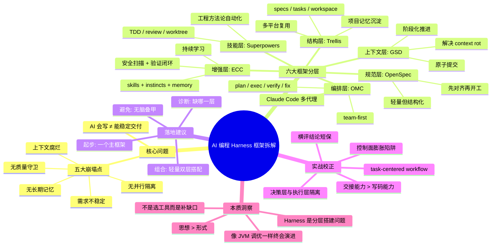

> **来源**：知乎
>
> **原文链接**：[6 个代表性 AI 编程 Harness 工程化框架拆解](https://zhuanlan.zhihu.com/p/2026095041966261373?share_code=1nl9JaVoWMuiD&utm_psn=2026410473084429849)
>
> **精读日期**：2026年4月11日
>
> **作者**：单向箔

---

## 深度摘要

本文针对 AI 编程从"Vibe Coding"走向真实工程时面临的五大痛点（需求不稳定、上下文腐烂、无长期记忆、无并行隔离、无质量守卫），系统拆解了 6 个代表性 Harness 框架，按照"从单层补位到体系化搭建"的逻辑，将它们定位为 Harness 的不同层级：OpenSpec（规范层）、Superpowers（技能与行为约束层）、GSD（上下文工程与阶段化执行层）、OMC（多代理编排层）、ECC（性能增强与能力补全层）、Trellis（结构层与项目记忆层）。作者的核心观点是：**Harness 不是"选一个最强工具"的问题，而是分层搭建、按缺口补位的问题**，并从一线实战角度提出了多条校正经验——横评成本极高、多代理易导致控制面膨胀、上下文压缩与交接能力比单次写码更关键、决策层与执行层应隔离等。最后，作者将 Harness 比作早期 JVM 调优，认为它未必永远以当前形式存在，但"把项目知识沉淀给 AI"这个思想不会过时。

---

## 核心观点拆解

### 观点一：AI 编程的真正瓶颈不是模型，而是工程化

文章开篇即指出 Vibe Coding 在真实工程中的五大崩塌点：
1. **需求只存在于聊天里**，输出天然不稳定
2. **上下文腐烂崩坏**，模型在长对话中逐渐变形
3. **没有长期记忆**，跨 session 就像断片
4. **没有并行与隔离机制**，AI 很难像团队一样协作
5. **没有质量守卫**，AI 最擅长的是"看起来像写对了"

**精读笔记**：这五点的本质是——当 AI 从"写代码"走向"交付软件"时，缺失的不是更强的模型，而是工程基础设施。这和我们之前收藏的 Superpowers vs gstack 那篇文章的观点一脉相承：问题已经从"用哪个模型"转向"怎么组织 AI 的工作方式"。

### 观点二：6 个框架不是同类竞品，而是不同层级的能力模块

作者给出的分层定位非常清晰：

| 框架 | 层级定位 | 一句话概括 | 适合谁 |
|------|---------|-----------|--------|
| **OpenSpec** | 规范层 | 先把"要做什么"写清楚 | 需要先对齐再开工的个人/团队 |
| **Superpowers** | 方法论与技能层 | 让 agent 默认按工程纪律工作 | 重视质量纪律和流程约束的开发者 |
| **GSD** | 上下文工程 + 阶段化执行层 | 把复杂任务拆进干净上下文里执行 | 长任务、复杂仓库、重构场景 |
| **OMC** | 多代理编排层 | 把 Claude Code 组织成团队式执行系统 | Claude Code 重度用户、并行开发场景 |
| **ECC** | 增强层 | 给 Harness 补技能、记忆、安全、验证和学习能力 | 想把 AI workflow 长期工程化的人 |
| **Trellis** | 结构层 | 把 specs、tasks、workspace 变成统一工作流骨架 | 多工具团队、长期协作项目 |

**精读笔记**：这个分层框架的价值在于——它把一个看似"6 选 1"的选择题，变成了"我缺哪一层"的诊断题。这和软件架构中的分层思想完全一致：每一层解决一个特定问题，而不是试图用一个框架解决所有问题。

### 观点三：单层补位 vs 体系型方案的区分

作者进一步将 6 个框架分为两类：
- **单层补位型**：OpenSpec、Superpowers、GSD——分别聚焦规范、工程技能、上下文与阶段执行
- **体系型方案**：OMC、ECC、Trellis——覆盖面更广，但代价是更重

**精读笔记**：这个区分很有实操价值。对个人开发者和小团队来说，起步只需要一个主框架，而不是上来就叠甲。作者建议"先搭建最痛的一层，跑稳后再补第二层"。

### 观点四：组合使用建议

作者给出了几组推荐组合：
- **OpenSpec + Superpowers**：先解决"别跑偏"，再解决"别乱写"
- **OpenSpec + GSD**：前者固定规格，后者解决 context rot 和阶段化执行
- **OMC + Superpowers**：前者负责编排，后者补工程纪律

**精读笔记**：这和我们之前收藏的 Superpowers + gstack 组合文章的结论高度一致——最佳实践是组合使用不同层级的工具，而不是依赖单一"全能框架"。

### 观点五：一线实战的五个校正结论

这是本文最有价值的部分之一：

1. **横评成本极高，结论天然是"短保"的**——Harness 不是"看起来功能最全的赢"，而是"谁能在真实工程里稳定跑更久"
2. **多代理不等于真正 hands-off，最怕控制面膨胀**——设计文档越来越多，但真正落到代码上的产出反而没有想象中高
3. **上下文压缩与交接能力，比单次写码能力更关键**——长任务不是在比谁更会写，而是在比谁更不容易失忆
4. **超级任务最好拆成 task-centered workflow**——不是"给一个更大的总目标"，而是先写清楚 spec、再拆成 task、再按 phase 推进
5. **决策层和执行层最好隔离**——不要让"最贵的大脑"泡在细节里，高阶模型应负责架构判断和偏差识别

**精读笔记**：这五条校正结论的共性是——它们都在提醒我们，AI 编程的成熟度不是由"能做多复杂的事"决定的，而是由"能多稳定地持续做事"决定的。特别是第二点"控制面膨胀"，直击多代理系统的核心陷阱：看起来很忙，但产出没有同步增长。

### 观点六：Harness 是过渡性工程能力，但思想不会过时

作者将 Harness 比作早期 JVM 调优——当前上下文不够大、AI 不够强，所以需要 Harness；未来可能被简化，但"把项目知识沉淀给 AI"这个思想不会消失。

**精读笔记**：这个比喻非常精准。JVM 调优的经验后来变成了对 JVM 原理的深刻理解，即使不再需要手动调优，这些知识依然有价值。同理，即使未来 AI 上下文足够大，我们通过 Harness 积累的"如何组织 AI 工作"的经验，也依然会是有价值的工程智慧。

---

## 思维导图

---

## 实践建议

### 对个人开发者的建议

1. **如果你刚开始用 AI 编程**：先从 OpenSpec 入手，建立"先把需求写清楚"的习惯
2. **如果你已经遇到 AI 写代码不稳定的问题**：叠加 Superpowers，强制 TDD 和 review 纪律
3. **如果你在做复杂的长任务**：考虑 GSD，把上下文腐烂问题解决掉
4. **如果你是 Claude Code 重度用户**：试试 OMC，体验多代理编排的效率提升

### 对团队的建议

1. **选择一个主框架作为骨干**，不要上来就叠多个框架
2. **团队标准通过 Trellis 或 OpenSpec 沉淀到 repo 中**，让每个成员的 AI 都能读取
3. **建立 Harness 量化指标**——虽然作者说"都在摸石头过河"，但至少可以跟踪：AI 代码的 Bug 率、需求跑偏次数、代码审查通过率等
4. **重视上下文交接能力**——在长任务场景中，这是系统稳定性的关键

### 与之前收藏文章的关联

这篇文章和我们之前收藏的两篇 AI 编程文章形成了一个很好的知识体系：

1. **《Superpowers vs gstack》**：从两个代表性项目的角度，探讨"技能驱动"vs"角色驱动"两种设计哲学
2. **本文（6 大 Harness 框架）**：从更宏观的视角，将多个框架分层定位，给出选型和组合建议
3. **综合来看**：AI 编程正在从"单次回答"演进到"结构化协作"，核心不是更强的模型，而是更好的工程系统

---

## 延伸思考

### 文章没有深入讨论的问题

1. **这些框架之间的互操作性如何？**——如果你已经用了 OpenSpec 的 spec 格式，再引入 Trellis 时是否需要迁移？
2. **非 Claude Code 生态的覆盖情况**——6 个框架中有 3 个明确绑定 Claude Code，其他工具链（Cursor、Windsurf 等）的选择更少
3. **企业级场景下的治理问题**——比如权限管理、代码安全扫描、合规性审计等，这些框架都没有涉及

### 我的观点

作者的核心论点"Harness 是思想而不是模板"非常值得认同。但值得注意的是：

- **当前 Harness 框架的迭代速度极快**，今天的最佳实践可能 3 个月后就会过时
- **真正有价值的不是框架本身，而是通过框架积累的工程习惯**——比如"先写 spec 再实现"、"原子提交"、"阶段化推进"这些原则，无论用什么框架都应该坚持
- **Harness 的量化问题确实是行业痛点**，作者坦诚地说"都在摸石头过河"，这种诚实比很多"AI 编程已经是成熟工程"的宣传更有价值

---

## 原文内容

6 个代表性 AI 编程 Harness 工程化框架拆解：OpenSpec、Superpowers、GSD、OMC、ECC、Trellis 怎么选？
单向箔

关注他
收录于 · 所思
17 人赞同了该文章

大家好，我是努力想把复杂的问题降维给你听的单向箔。

这两年来，AI 编程一直在飞速地发展。不说远了，可能半年前还只在少部分人中流行，到现在基本上是互联网中无人不晓，颇有种大刘老师《三体》里"技术爆炸"的即视感。

当然，这些明显的变化不只是在于模型越来越会写代码了，而是现在越来越多人开始关注 AI Coding 的一个现实问题：

AI 会写，不等于 AI 能稳定交付。

前段时间我们都在说 Vibe Coding，大家都知道是氛围编程的意思，但是现在也有叫"直觉编程"。什么叫直觉编程，就是完全不用管其它的，想到什么就做什么，主打一个靠直觉写代码。

你要只是让它写个脚本、补个函数、改个页面，那没问题，当然是又快又爽。

但一旦任务进入需求复杂、代码项目庞大、多人协作、分支并行、需要质量把关的真实工程。那么，Vibe Coding 这种方法，很快就会露出底牌：

**需求只存在于聊天里，输出天然不稳定。**

当需求、边界、设计决策都散落在对话记录里，AI 本质上只能靠概率去"猜"你真正想要什么。同一句话换个会话、换个上下文，结果就可能完全不同。

**上下文腐烂崩坏，模型会在长对话中逐渐变形。**

历史信息越多、无效噪音越重、窗口越接近上限，AI 越容易忘约束、重复犯错、误判因果。很多时候不是模型降智，而是上下文已经坏了。

**普通会话没有长期记忆，项目一跨 session 就像断片。**

你今天讲清楚的架构原则、昨天确认的约束、上轮讨论过的边界，下一次新会话基本上就要从头再讲一遍，不然就看 AI 自我发挥了。没有历史知识库、执行状态、Spec、任务文档、工作日志这些持久化资产，AI 就很难真正"接班"。

**没有并行与隔离机制，AI 很难像团队一样协作。**

一个会话能盯，两个会话还能勉强切换，十个会话并发开发基本就是灾难。没有分支隔离、worktree、角色分工和统一回收机制，多代理只会把混乱放大。

**没有质量守卫，AI 最擅长的是"看起来像写对了"。**

能运行，不代表对；有测试，不代表测到了关键路径；自称"已完成"，也不代表没有偷偷删功能、绕校验、留隐患。没有验证闭环，幻觉就会被包装成进度。

**基本无法团队协作，大家用着自己的方式在"抽卡"**

谁来解释这段代码为什么这么写？谁来判断这个依赖是不是该引？谁来保证风格统一、测试齐全、改动可回溯？一旦这些都没有，团队拿到的就不是资产，而是一堆需要共同供养的随机产物。

这就是为什么前段时间总有人质疑 AI 编码怎么敢在生产上实际使用的原因，也正是现在 Harness 开始变得越来越重要的原因。

在 AI 编程语境里，你可以把 Harness 理解成一套规范好的"智能体脚手架"：它不是单个 Prompt，也不只是某个插件，而是一套围绕 AI 助手构建的工程化运行环境与规则系统。它会把需求、上下文、技能、验证、记忆、并行协作这些原本散落在聊天中的东西，沉淀成可复用的结构。

所以，Harness 的价值并不是"让 AI 更会聊天"，而是让 AI 在复杂工程里变得更可控、更可验证、更可规模化。

### 6 个代表性 Harness 路线拆解：从单层补位到体系化搭建

先说结论：这 6 个框架并不是同一种东西。

如果非要把它们都笼统地称为"AI 编程框架"，那很容易写偏。我是按照我理解，把它们看作了 Harness 不同层级上的能力模块。

我也没有试图穷尽所有 Harness 项目，也不想把每个框架代码详细解释念给大家听。毕竟我还是那句话，相比于在纷杂的框架中做选择，我希望大家更关注 Harness 思想本身。所以我选择了开源社区里较有代表性的 6 条路线，看看它们分别在补哪一层。

为了更方便理解，我按一个更接近真实采用路径的顺序来写：从单层补位到体系化搭建。

也就是：**OpenSpec → Superpowers → GSD → OMC → ECC → Trellis**

#### OpenSpec：先把"要做什么"写清楚

如果只用一句话概括 OpenSpec，那就是：

它是一个 spec framework，而不是一个执行引擎。

OpenSpec 在 README 里的定位非常清晰：它强调的是 SDD（规格驱动开发），核心主张是：

**Agree before you build**

也就是：先对齐，再动手。

它的典型工作流，是把一个需求沉淀成一组结构化工件：proposal、specs、design、tasks。

这样做的价值非常直接：把原本只存在于聊天记录里的模糊意图，变成可以被审核、被复用、被持续迭代的项目资产。

它最适合解决的问题，是：需求经常漂、AI 老跑偏、团队对边界理解不一致、改动缺少结构化依据、Brownfield 项目里聊天记录越来越难追溯。

**OpenSpec 更像 Harness 里的规范层。如果需求都还没固定下来，后面再强的 orchestration 也只是在更高效地跑偏。**

#### Superpowers：把工程方法论做成自动触发的技能

关键词是 composable skills，组合技能。

它围绕 skills 组织工作流，从头脑风暴、计划编写、使用 git worktrees、子代理驱动开发、测试驱动开发、系统化调试、请求代码 review 一路往下铺开。

它最重要的思想不是"结构有多宏大"，而是：优秀工程师的工作方法，能不能被做成 agent 的默认动作。

**Superpowers 更像 Harness 里的技能与行为约束层。如果你担心 AI "会写，但写得不像工程师"，它特别有价值。**

#### Get Shit Done：把复杂任务拆进干净上下文里

GSD 在 README 里几乎是直接把卖点写在脸上：**Solves context rot**——"解决上下文腐烂问题"。

它强调：上下文工程、阶段化推进、刷新上下文、wave 执行、原子性提交、状态管理。

典型工作流是：new-project、discuss-phase、plan-phase、execute-phase、verify-work。

和 OpenSpec 的差异：OpenSpec 更像"先把规格讲清楚"；GSD 更像"把复杂任务拆进干净上下文里执行"。

**GSD 更像 Harness 里的上下文工程与阶段化执行层。如果你最痛的是 context rot，它比很多"会聊天的 agent 套件"更直击问题本质。**

#### Oh My ClaudeCode：把 Claude Code 从单助手变成团队系统

OMC 主要解决的是：怎么把 Claude Code 升级成 team-first 的多代理系统。

团队工作流：team-plan、team-prd、team-exec、team-verify、team-fix。再加上 tmux workers、Codex / Gemini CLI workers、tri-model advisor synthesis 等能力。

**OMC 更像 Harness 里的多代理编排层。如果你想解决的是"怎么让多个 agent 像团队一样协作"，它的定位非常清楚。**

#### Everything Claude Code：给 Harness 再补一层"性能增强系统"

ECC 是这几个项目里最容易被误读的一个。很多人以为它只是个 Claude Code 配置大礼包。但它的 README 自我描述是：

**The performance optimization system for AI agent harnesses**

能力系统化：skills、instincts、memory 优化、持续学习、安全扫描、research 优先开发。

**ECC 更像 Harness 里的性能增强与能力补全层。全面往往意味着太重，对初学者来说容易有"东西太多"的感觉，更建议进阶阶段选择。**

#### Trellis：更像工作流骨架

Trellis 的关键词非常鲜明：自动注入 Spec、任务驱动工作流、并行 Agent 执行、项目记忆、团队共享标准、多平台复用。

核心目录：`.trellis/spec/`、`.trellis/tasks/`、`.trellis/workspace/`

**Trellis 更像 Harness 里的结构层、任务层和项目记忆层。如果你的问题不是"某个 agent 不够强"，而是"团队 workflow 没有统一骨架"，那 Trellis 的价值会非常高。**

### 把这 6 个框架放在一起看，真正差异是什么？

**OpenSpec 负责：先把"要做什么"说清楚**
**Superpowers 负责：让 agent 默认按工程纪律工作**
**GSD 负责：把复杂任务拆进干净上下文中执行**
**OMC 负责：把 Claude Code 组织成团队式执行系统**
**ECC 负责：给 Harness 补技能、记忆、安全、验证和学习能力**
**Trellis 负责：把 specs、tasks、workspace 变成统一工作流骨架**

- OpenSpec、Superpowers、GSD 更偏向**单层补位**
- OMC、ECC、Trellis 更偏**体系型方案**

### 落地建议：别把 Harness 当成"选一个最强工具"的问题

**第一步：搭建完架子后补最痛的一层**

- 缺少 memory / security / verification → ECC
- 多工具协作、项目记忆混乱 → Trellis
- 需求总跑偏 → OpenSpec
- 工程纪律太松 → Superpowers
- 长任务容易崩 → GSD
- Claude Code 多代理并行 → OMC

**第二步：轻量框架可双层组合，重型框架建议不要叠甲**

推荐组合：
- OpenSpec + Superpowers：先解决"别跑偏"，再解决"别乱写"
- OpenSpec + GSD：前者固定规格，后者解决 context rot
- OMC + Superpowers：前者负责编排，后者补工程纪律

### 来自一线实战的几个校正

**横评成本极高，结论天然是"短保"的**

Harness 不是"看起来功能最全的赢"，而是"谁能在真实工程里稳定跑更久、出问题后更容易接班和纠偏"。

**多代理不等于真正 hands-off，最怕的是"控制面膨胀"**

设计文档越来越多、进度记录越来越多、协调信息越来越多，真正落到代码上的产出，反而没有想象中高。

**上下文压缩与交接能力，往往比单次写码能力更关键**

长任务不是在比谁更会写，而是在比谁更不容易失忆。

**超级任务最好拆成 task-centered workflow，而不是一次性许愿**

先写清楚 spec、再拆成 task、再按 phase 推进、每一段都留验证和交接工件。

**决策层和执行层最好隔离，别让"最贵的大脑"泡在细节里**

高阶模型负责架构判断、偏差识别、方向决策；执行型工具负责跨文件修改、批量实现；压缩/总结型模型负责清洗历史、提炼大纲、生成交接材料。

### 最后

Harness 这件事，框架在精不在多；选自己真正需要的，比无脑叠甲重要得多。

我更愿意把 Harness 看成一种思想，而不是一套固定模板。核心不是"先把所有东西装满"，而是：在使用中发现缺口，再把缺口补起来。

这个思想哪怕放到未来，我觉得也不会过时。
