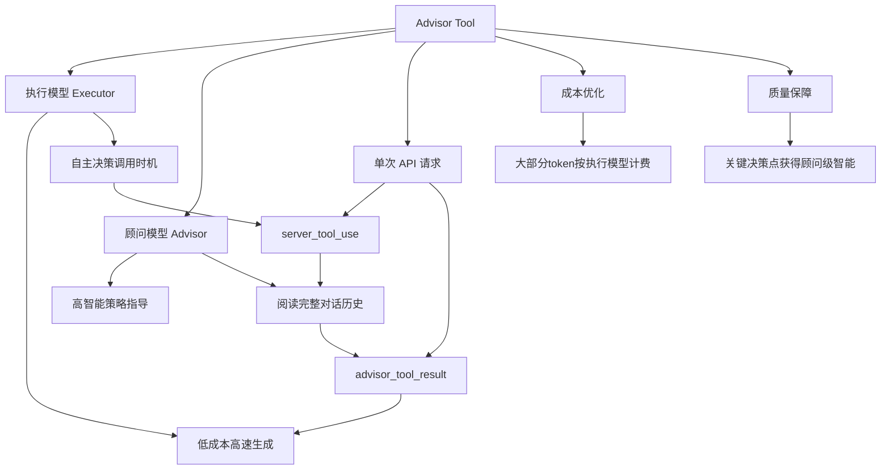

## 📋 文章信息

- **来源**: Claude API Docs - Tools
- **作者**: Anthropic
- **发布时间**: 2026年3月（Beta）
- **阅读链接**: https://platform.claude.com/docs/en/agents-and-tools/tool-use/advisor-tool

---

## 🎯 核心摘要

Claude Advisor Tool 是 Anthropic 在 2026 年 3 月推出的 Beta 功能，核心思路是将一个快速、低成本的**执行模型（Executor）**与一个更高智能的**顾问模型（Advisor）**配对。执行模型在完成任务过程中自主决定何时调用顾问，顾问阅读完整对话历史后给出策略性指导（通常 400-700 文本 token），执行模型据此继续工作。这一模式适用于编码 Agent、计算机操作、多步研究管线等长周期 Agentic 工作负载，既能接近顾问模型的质量水平，又以执行模型的速率消耗大部分 token，实现质量与成本的平衡。

## 📊 核心观点

### 1. 质量与成本的最优折中点

**背景/现状**：
- 当前 Agent 系统面临一个经典困境：使用高智能模型（如 Opus）质量好但成本高、速度慢；使用快速模型（如 Haiku/Sonnet）成本低但复杂任务质量不足
- 大多数 Agent 交互中，很多轮次是机械性的（读文件、运行测试、格式化输出），只有少数关键时刻需要高智能决策

**核心论述**：
- Advisor Tool 采用「顾问-执行者」分离架构：大部分 token 由低成本的执行模型生成，只在关键决策点调用高智能顾问
- 早期基准测试显示：在复杂任务上使用 Sonnet + Opus 顾问，质量接近纯 Opus 但总成本更低；使用 Haiku + Opus 顾问，质量显著提升，成本低于直接切换到更大的执行模型
- 顾问输出通常 400-700 文本 token（含 thinking 1400-1800 token），成本节省来自顾问不生成最终完整输出

### 2. 执行模型自主决定何时咨询

**背景/现状**：
- 传统方案中，何时「求助」更高智能模型通常需要人工编排或固定策略
- Agent 工作流的复杂性使得固定时机难以覆盖所有场景

**核心论述**：
- Advisor Tool 被定义为执行模型的普通工具之一，执行模型像调用其他工具一样自主决定何时调用顾问
- 工具自带内置描述，引导执行模型在复杂任务开始时和遇到困难时调用顾问
- 最佳实践推荐两个关键时机：一是早期探索后（在做实质性工作之前），二是文件写入和测试输出就绪后（任务完成前）

### 3. 单一 API 请求内的透明集成

**背景/现状**：
- 多模型协作通常需要客户端管理多次 API 调用、协调上下文传递
- 这增加了系统复杂度和延迟

**核心论述**：
- 整个顾问-执行者循环在单个 `/v1/messages` 请求内完成，客户端无需额外轮次
- 调用流程：执行模型发出 `server_tool_use` → 服务端将完整对话历史传递给顾问模型 → 顾问返回建议作为 `advisor_tool_result` → 执行模型继续生成
- 顾问本身无工具、无上下文管理，thinking blocks 在返回前被丢弃，只有建议文本到达执行模型

## 🧠 概念图谱



## 🏗️ 技术架构

### 架构概述

Advisor Tool 采用服务端侧工具（Server-side Tool）架构。客户端只需在 `tools` 数组中添加一个 `advisor_20260301` 类型的工具定义，指定顾问模型 ID。执行模型在生成过程中自主决定何时调用，服务端自动完成上下文传递和子推理，客户端对顾问的存在几乎无感。

### 核心组件

| 组件 | 职责 | 关键技术 |
|------|------|----------|
| 执行模型（Executor） | 完成实际任务，决定何时咨询顾问 | Sonnet 4.6 / Haiku 4.5 / Opus 4.6 |
| 顾问模型（Advisor） | 阅读完整对话历史，提供策略指导 | Opus 4.6（必须 ≥ 执行模型能力） |
| Server Tool Bridge | 服务端桥梁，传递上下文，执行子推理 | `server_tool_use` → `advisor_tool_result` |
| Prompt Cache | 两层缓存：执行端 + 顾问端 | `cache_control` + `caching` 配置 |

### 模型兼容性

| 执行模型 | 顾问模型 |
|----------|----------|
| Claude Haiku 4.5 | Claude Opus 4.6 |
| Claude Sonnet 4.6 | Claude Opus 4.6 |
| Claude Opus 4.6 | Claude Opus 4.6 |

顾问模型能力必须 ≥ 执行模型，无效组合返回 `400 invalid_request_error`。

### API 集成

```json
{
  "type": "advisor_20260301",
  "name": "advisor",
  "model": "claude-opus-4-6",
  "max_uses": 5,
  "caching": {"type": "ephemeral", "ttl": "5m"}
}
```

需要在请求头中添加 Beta 标识：`anthropic-beta: advisor-tool-2026-03-01`

### 响应结构

顾问调用成功时返回 `advisor_tool_result`，失败时返回 `advisor_tool_result_error`（含 error_code）。错误不会中断请求，执行模型会继续工作。错误类型包括 `max_uses_exceeded`、`too_many_requests`、`overloaded`、`prompt_too_long`、`execution_time_exceeded`、`unavailable`。

### 用量计费

- 顶层 `usage` 字段仅反映执行模型 token
- 顾问 token 在 `usage.iterations[]` 中以 `type: "advisor_message"` 单独报告，按顾问模型费率计费
- 顾问输出不计入执行模型的 `max_tokens` 预算

## 🔑 关键洞察

### 1. 「模型即工具」范式的新高度

**分析**：
- 传统 Tool Use 是让模型调用外部功能（搜索、计算、数据库），而 Advisor Tool 让模型调用**另一个更强大的模型**作为工具
- 这模糊了「工具」和「模型」的边界，本质上是一种**模型间的委托模式**——执行模型将策略思考委托给更擅长此道的顾问
- 这一模式可以被推广：未来可能出现「写作顾问」「代码审查顾问」「安全审计顾问」等专用顾问角色

### 2. 成本结构的设计哲学

**分析**：
- 顾问输出限制在 100 词以内（通过系统提示），可减少 35-45% 的顾问 token 消耗
- 顾问端缓存默认关闭，因为 2 次以内的调用写入成本高于读取节省，3 次以上才划算
- 计费分离（`advisor_message` vs `message`）让开发者能精确追踪每种模型的成本贡献
- 这种精细化的成本控制体现了 Anthropic 对生产级 Agent 部署的务实态度

### 3. 顾问调用时机的系统提示工程

**分析**：
- Anthropic 提供了详细的系统提示模板，明确指导执行模型在三个时机调用顾问：实质性工作前、任务完成后、遇到困难时
- 关键细节：建议在调用顾问前先「固化交付物」（写文件、保存结果），防止会话中断导致未保存的建议丢失
- 还建议当执行模型发现与顾问意见冲突时，不要默默切换方向，而是再次调用顾问进行「reconcile call」——这是一种模型间的对话协商机制

## 🚧 不足与局限

### 1. 顾问输出不支持流式传输
- 顾问子推理期间，执行模型的输出流会暂停。虽然服务端会发送 SSE ping keepalive（约 30 秒一次），但用户体验上可能出现明显延迟

### 2. 无内置会话级调用上限
- `max_uses` 仅限制单次请求内的调用次数，跨多轮对话的总量限制需要客户端自行实现
- 达到上限后需要同时移除工具定义和清理历史中的 `advisor_tool_result` 块，否则会触发 400 错误

### 3. 上下文编辑兼容性不完整
- `clear_tool_uses` 尚未与 Advisor Tool 完全兼容
- `clear_thinking` 的非 `all` 设置会导致顾问端缓存失效（因为被引用的对话记录每轮偏移）

### 4. 仍在 Beta 阶段
- 需要联系 Anthropic 账户团队获取访问权限
- 需要添加 Beta header `advisor-tool-2026-03-01`

## 🔮 延伸思考

### 方向1: 多顾问模式
- 当前仅支持单一顾问。如果能在同一任务中配置多个专项顾问（如「架构顾问」+ 「安全顾问」+ 「性能顾问」），执行模型可以根据问题类型选择最合适的顾问，进一步提升专业度。

### 方向2: 顾问输出的结构化
- 当前顾问输出为纯文本建议。如果未来支持结构化输出（如 JSON schema），执行模型可以更精确地解析和遵循建议，减少理解偏差。

### 方向3: 跨 Agent 的顾问共享
- 在多 Agent 协作场景中，一个中央顾问可以为多个执行 Agent 提供策略指导，避免各 Agent 各自为战的低效情况。

### 方向4: 顾问模型的自适应选择
- 基于任务复杂度自动选择顾问模型：简单任务用 Sonnet 顾问，复杂任务用 Opus 顾问，进一步优化成本效益比。

## 💡 实践启示

### 1. 渐进式采用策略

**要点**：
- 如果你已经在用 Sonnet 做复杂任务，加 Opus 顾问是最直接的质量提升路径，总成本甚至可能更低
- 如果你用 Haiku 做简单任务但偶尔遇到难题，加 Opus 顾问比直接升级执行模型更经济
- 不适合单轮问答、用户自选模型的场景，以及每轮都需要最高智能的工作负载

### 2. 系统提示是关键杠杆

**要点**：
- Anthropic 提供的「时机指导」和「建议处理」系统提示模板经过内部验证，直接使用可获得最佳性价比
- 添加精简指令（`"The advisor should respond in under 100 words"`）可减少 35-45% 顾问 token 消耗
- 配合 `effort` 设置：Sonnet 中等 effort + Opus 顾问 ≈ Sonnet 默认 effort 的智能水平，但成本更低

### 3. 成本监控的必要性

**要点**：
- 使用 `usage.iterations[]` 构建精确的成本追踪逻辑，区分执行模型和顾问模型的消耗
- 顾问 token 不计入执行模型的 `max_tokens`，需要独立设置预算
- 启用顾问端缓存前评估预期调用次数：3 次以上才值得开启

### 4. 错误处理的韧性设计

**要点**：
- 顾问调用失败不会中断请求，执行模型会继续工作——这保证了系统的韧性
- 但需要客户端处理 `advisor_tool_result_error`，特别是 `prompt_too_long` 场景下的降级策略
- Priority Tier 需要在执行模型和顾问模型上分别设置，不能共享

## 📝 关键金句

> "The advisor tool lets a faster, lower-cost executor model consult a higher-intelligence advisor model mid-generation for strategic guidance."

> "You get close to advisor-solo quality while the bulk of token generation happens at executor-model rates."

> "If you've already retrieved data pointing one way and the advisor points another: don't silently switch. Surface the conflict in one more advisor call — 'I found X, you suggest Y, which constraint breaks the tie?'"

## 🏷️ 标签

AI、Claude、Tool Use、Agent、LLM、模型协作、成本优化、API 设计

---

## 🔗 相关资源

- **拓展阅读**：Claude Tool Use Overview（工具使用概览）、Server Tools（服务端工具）、Extended Thinking（扩展思考）、Effort Settings（effort 设置）
- **API Reference**：`advisor_20260301` 工具类型、`advisor_tool_result` 响应结构
