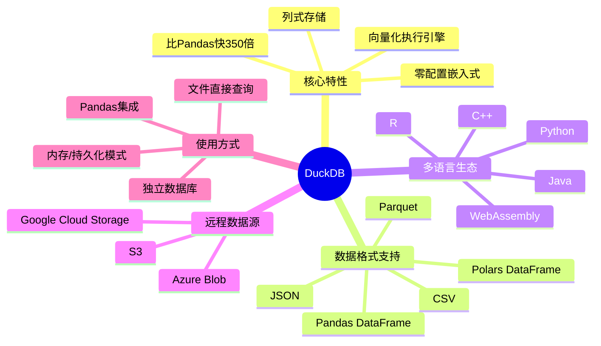

## 📋 文章信息

- **来源**：知乎专栏
- **作者**：GitHub Daily
- **原文链接**：[狂揽 36.8k+ Star！碾压 SQLite，强到离谱！](https://zhuanlan.zhihu.com/p/2019198805006922939)
- **收藏日期**：2026年4月12日

---

## 🎯 内容摘要

DuckDB 是一款被誉为"分析型数据库中的 SQLite"的开源嵌入式分析数据库，专为解决单机数据分析的性能瓶颈而生。它基于列式存储和向量化执行引擎，处理超过 1 亿条记录仅需 2 秒，比 Pandas 快 350 倍以上。DuckDB 采用零配置嵌入式设计，无需启动服务器进程，支持直接查询 CSV、Parquet、JSON 等文件格式，并能与 Pandas、Polars 等数据科学工具无缝集成。

---

## 🗺️ 思维导图



---

## 📄 原文内容

处理几百万行数据时，Pandas 慢得让人抓狂；SQLite 遇到复杂分析查询就卡顿；搭建传统数据库又太重了。

仅仅为了本地数据分析显得杀鸡用牛刀，这些痛点让我们在数据分析的路上总是磕磕绊绊。

无独有偶，在 GitHub 上发现了一个完美的解决方案：DuckDB。

这款被誉为 "分析型数据库中的 SQLite" 的开源神器，专门为解决单机数据分析的性能瓶颈而生。

它以嵌入式设计为核心，将极致性能与简单易用完美结合，让我们能够在本地环境中享受到前所未有的数据处理速度，彻底告别等待的焦虑。

主要功能

极致性能表现：基于列式存储和向量化执行引擎，处理超过 1 亿条记录的数据集仅需 2 秒，比 Pandas 快 350 倍以上。

零配置嵌入式设计：无需启动服务器进程，直接嵌入到 Python、R、Java 等应用程序中，使用体验如同 SQLite 般简单。

丰富的数据格式支持：原生支持 CSV、Parquet、JSON 等多种格式，还能直接查询 Pandas、Polars 数据框，真正做到"拿来即用"。

强大的 SQL 方言：支持复杂的嵌套子查询、窗口函数、复杂类型 (数组、结构体) 等高级 SQL 特性，语法比传统嵌入式数据库更加丰富。

多语言生态支持：提供 Python、R、Java、C++ 等多种语言的 API，甚至还能编译成 WebAssembly 在浏览器中运行。

高效的跨数据源查询：支持直接查询远程文件 (S3、Azure Blob、Google Cloud Storage)，实现真正的数据联邦查询。

安装指南

安装 DuckDB 非常简单，几乎不需要任何复杂的配置过程，这也是它最大的优势之一。

对于 Python 用户，只需要一行命令就能完成安装：

```
pip install duckdb
```

如果使用 conda 或 mamba 环境管理工具，也可以直接安装：

```
conda install python-duckdb
# 或者
mamba install python-duckdb
```

对于 R 用户，安装同样简单：

```
install.packages("duckdb")
```

DuckDB 的另一个优势是它完全没有外部依赖，整个数据库引擎都是用 C++ 编写的单文件实现。

这意味着安装过程不会出现各种依赖冲突的问题，真正做到了开箱即用。

使用指南

DuckDB 的使用方式非常灵活，既可以作为独立的数据库使用，也可以与现有的数据科学工具无缝集成。

基础查询操作：

```python
import duckdb

# 直接执行 SQL 查询
result = duckdb.sql('SELECT 42 as answer').fetchall()
print(result)  # [(42,)]

# 创建数据库连接
conn = duckdb.connect(':memory:')  # 内存数据库
# 或者
conn = duckdb.connect('mydata.duckdb')  # 持久化数据库
```

文件操作：

```python
# 直接查询 CSV 文件
duckdb.sql("SELECT * FROM 'data.csv' LIMIT 10").show()

# 查询 Parquet 文件
duckdb.sql("SELECT * FROM 'data.parquet' WHERE amount > 1000").show()

# 批量读取多个文件
duckdb.sql("SELECT * FROM 'data/*.parquet'").show()
```

与 Pandas 集成：

```python
import pandas as pd

# 从 Pandas DataFrame 创建关系
df = pd.read_csv('data.csv')
result = duckdb.sql("SELECT * FROM df WHERE price > 100").df()
```

写在最后

DuckDB 作为新一代的嵌入式分析数据库，真正解决了我们在单机数据分析中遇到的性能瓶颈问题。

无论是处理企业报表生成、数据科学实验，还是构建轻量级的数据分析应用，DuckDB 都能提供更便捷、高效的解决方案。

它不仅让我们告别了等待 Pandas 处理大数据的痛苦，更为我们打开了在本地环境进行高性能数据分析的全新可能性！

GitHub 项目地址：https://github.com/duckdb/duckdb
