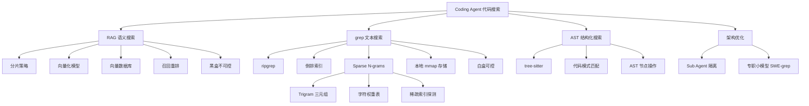

## 📋 文章信息

- **来源**: 知乎 - 专栏文章
- **作者**: AlienZHOU
- **发布时间**: 2026年4月4日
- **阅读链接**: https://zhuanlan.zhihu.com/p/2023722294573277905

---

## 🎯 核心摘要

在 Coding Agent 的本地代码搜索场景中，RAG（检索增强生成）从"默认选项"退位为"可选辅助"，行业用脚投票选择了 grep 系方案。根本原因在于代码是高度结构化的封闭域，文本硬匹配的天花板出奇地高；RAG 的系统链路过重，且作为黑盒会削弱 Agent 的可控性。但 grep 胜出不代表问题已解——性能瓶颈、搜索污染、规模边界仍是待解命题，行业正通过稀疏 N-grams 索引、Sub Agent 隔离、专职小模型、AST 结构化搜索等多条路线持续演进。

## 📊 核心观点

### 1. 搜索能力是 Coding Agent 的刚需

**背景/现状**：
- 仅靠"读文件查目录"能力，Agent 无法高效理解代码
- 小仓库勉强能跑，项目一大就崩——Agent 要么通读吞噬 Token，要么瞎猜路径试错
- 真实工程师的惯用方式：先搜索关键词缩小范围，再打开文件精读

**核心论述**：
- 搜索占据了 Coding Agent 15-20% 的工具调用比例，是除读写文件外最核心的基础能力
- 搜索的性能和准确性直接影响 Agent 的整体效率

### 2. RAG 沦为辅助的三层原因

**背景/现状**：
- 前几年 RAG 几乎是知识库/AI 问答的标配，Cursor 早期也是此路线
- 但 Claude Code 之后，主流产品无人将 RAG 作为代码搜索主力

**核心论述**：

**第一层：代码搜索是封闭域问题**
- 自然语言中同一概念表达各异（user/customer/member），语义召回有价值
- 代码是高度结构化体系，函数名、变量名本身信息密度极高
- 大模型对主流代码写法已有强先验认知，文本硬匹配天花板出奇地高
- 本地代码库是收敛的封闭域，与开放的网络搜索本质不同

**第二层：RAG 的系统账太重**
- 需要处理分片策略、向量化模型选择、向量数据库、召回重排、实时更新等一整套链路
- 企业级高频变动场景下，维持向量索引实时同步成本不低
- ripgrep 配合本地优化，能给出极具性价比的体验

**第三层：Agent 需要可控性（最关键）**
- Agent 调 grep 没结果，立刻知道是关键词问题，可以换策略重试
- RAG 是黑盒——向量偏轨返回语义相关但实际不相关的代码，Agent 无从排错
- Agent 最怕的不是"搜不到"，而是"返回一堆看似相关的噪音污染推理上下文"
- 确定性与可迭代性，超过了模糊的"语义智能"

### 3. grep 的性能瓶颈与索引优化

**背景/现状**：
- ripgrep 在大仓里遇到性能上限，动辄 15 秒以上扫描时间
- Agent 一个任务可能搜索几十次，累积几分钟纯等待

**核心论述**：
- Cursor 借鉴 ClickHouse 和 GitHub Code Search 的方案：**稀疏 N-grams (Sparse N-grams)**
- 算法为文档中每对字符分配基于真实开源代码频率表的确定性权重
- 只提取两端权重大于内部权重的子串作为索引 token
- 查询时只需极少的索引探测，就能将候选范围从几万精准坍缩到个位数
- 索引使用本地内存 + mmap 寻址表 + 磁盘 posting list，配合 Git 增量合并

### 4. 三条值得关注的新路线

**背景/现状**：
- grep 胜出但问题未完美解决，多条并行路线在被探索

**核心论述**：

**路线 A：用架构隔离搜索污染**
- 主 Agent 多轮 grep 试错会导致上下文被搜索噪音填满
- 将探索剥离给 Sub Agent，在隔离沙盒中并行搜索排查
- 子进程只返回筛洗干净的结论，用"空间"隔离换取推理纯净度
- Claude Code 已采用此模式

**路线 B：专职搜代码的小模型**
- Cognition（Devin 团队）发现 Agent 超 60% 时间浪费在"找代码"上
- 用 RL 训练专职小模型 SWE-grep，多路并发探测，最多 4 轮锁定
- Reward 严重偏袒"查准率"——宁可漏线索，不容许带回无关代码

**路线 C：基于语法树的结构化搜索**
- ast-grep（13k+ Stars）：不搜文本，改搜结构
- 借助 tree-sitter 将源码解析为 AST，用代码模式而非正则匹配
- 只命中逻辑上的函数调用，附带代码重写能力
- 局限：跨语言一致性、并发稳定性尚未解决

## 🧠 概念图谱

## 🏗️ 技术架构

### 架构概述

文章从搜索方案选型的角度，梳理了 Coding Agent 代码搜索模块的技术架构演进，涵盖从基础搜索工具到底层索引优化、再到架构层面隔离的多层设计。

### 核心组件

| 组件 | 职责 | 关键技术 |
|------|------|----------|
| grep/ripgrep | 基础文本搜索 | 正则匹配、行级扫描 |
| Sparse N-grams 索引 | 加速大规模代码搜索 | 稀疏倒排索引、字符权重、mmap |
| Sub Agent | 隔离搜索污染，保持推理纯净 | 沙盒上下文、并行探索 |
| SWE-grep | 专职代码搜索小模型 | RL 训练、多路并发、查准率优先 |
| ast-grep | 结构化代码搜索 | tree-sitter AST、代码模式匹配 |

## 🔑 关键洞察

### 1. 封闭域 vs 开放域决定技术选型

**分析**：
- 代码搜索之所以 RAG 落败，核心在于代码是**封闭域**——几千到几万文件，百万行量级
- 在封闭域中，结构化信息和确定性匹配天然优于模糊语义检索
- 但作者指出，如果搜索范围扩展到"所有 GitHub 仓库"或亿级文件，问题本质突变，RAG 的思路会重新变得必要
- 这揭示了一个更深层的技术选型原则：**技术方案没有绝对优劣，只有场景适配**

### 2. Agent 时代的"可控性优先"原则

**分析**：
- 传统 AI 系统中，黑盒 Pipeline（如 RAG）可以接受，因为输出由人类审核
- 但 Agent 是**自主决策**的——它需要理解搜索结果、判断相关性、决定下一步行动
- 黑盒搜索会给 Agent 带来不可验证的噪音，导致推理链路污染
- 这一洞察可推广：**任何作为 Agent 工具链中的组件，透明度和可控性比绝对性能更重要**

### 3. 搜索污染是 Agent 效率的隐形杀手

**分析**：
- 文章揭示了容易被忽视的问题：搜索噪音不是浪费时间，而是**污染推理上下文**
- Agent 在错误方向上越陷越深，比"搜不到"更危险
- Sub Agent 隔离方案本质上是用**上下文管理**解决信息质量问题
- 这与 Prompt Engineering 中"少即是多"原则一脉相承

## 🚧 不足与局限

### 1. RAG 结论的场景边界

- 文章主要讨论本地开发场景（单仓库、百万行级别），对跨仓库搜索、分布式代码分析等更大规模场景的讨论较少
- 对于混合语言、历史遗留代码库（命名不规范）的场景，grep 的优势可能不如文中所述

### 2. 缺少量化对比数据

- 虽然定性分析了 RAG vs grep 的优劣，但缺少具体的召回率、准确率、延迟等量化对比
- Sparse N-grams vs Trigram 的性能提升也没有给出具体数据

## 🔮 延伸思考

### RAG 在非代码场景的适用性

- 作者指出在"语义非结构化"场景（零散笔记、混乱文档、口语化记录）中，文本硬匹配天花板急剧下降
- 这暗示 RAG 的核心价值不在于代码搜索，而在于**信息结构化程度低**的场景
- 未来可能的趋势：根据信息结构化程度自动选择搜索策略——结构化用 grep，非结构化用 RAG

### 搜索即推理（Search as Reasoning）

- 专职小模型 SWE-grep 的出现，暗示搜索本身正在成为一种可学习、可优化的推理能力
- 未来 Agent 可能不再是"调用搜索工具"，而是将搜索能力内化为自身推理过程的一部分
- 这与当前大模型的"思维链"推理方向形成有趣呼应

## 💡 实践启示

### 1. 在 Agent 工具设计中优先考虑可控性

**要点**：
- 为 Agent 提供的工具，宁可简单透明，也不要复杂黑盒
- 工具返回的结果应是 Agent 可验证、可理解的
- 设计工具 API 时，考虑 Agent 的"排错能力"——失败时 Agent 能理解原因并调整策略

### 2. 用 Sub Agent 模式隔离探索性工作

**要点**：
- 高频试错类任务（搜索、调试、探索）应隔离到子 Agent 中
- 主 Agent 的上下文是稀缺资源，需要像管理内存一样管理
- Claude Code 的实践可作为架构参考

### 3. 根据场景规模选择搜索策略

**要点**：
- 单仓库（<10 万文件）：grep + 倒排索引足矣
- 跨仓库/大规模：需要考虑语义检索的补充
- 信息非结构化场景：RAG 仍然有价值
- 不要迷信任何单一方案，混合策略是常态

## 📝 关键金句

> "对 Agent 来说，最怕的不是'搜不到'，而是'返回一堆看起来相关、但无法验证的噪音'。搜不到，Agent 知道要换策略。但拿到一堆似是而非的结果，Agent 也许会困惑、会在错误的方向上越陷越深。"

> "在封闭的代码域内，确定性与可迭代性，超过了模糊的'语义智能'。"

> "不是让大模型做所有事，而是让专职小模型做专职的事。"

## 🏷️ 标签

AI、Agent、RAG、代码搜索、grep、索引优化、Sub Agent、ast-grep、Sparse N-grams

---

## 🔗 相关资源

- **拓展阅读**：Cursor 索引优化方案、Claude Code Sub Agent 架构、ast-grep 项目（GitHub 13k+ Stars）
- **项目链接**：Zero2Agent 系列 - https://github.com/alienzhou/zero2agent
