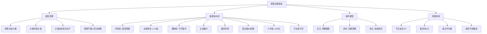

## 📋 文章信息

- **来源**: 知乎 - 专栏文章
- **作者**: 木已断水
- **发布时间**: 2026年3月20日
- **阅读链接**: https://zhuanlan.zhihu.com/p/2018340333189113683

---

## 🎯 核心摘要

本文系统梳理了雪球大V"寒武纪的鳄鱼"的完整投资体系。该体系的核心是在可理解的周期和供需规律中，低价占有稀缺生产资料（国资背景的资源、化工、稀缺牌照类资产），等待业绩爆发与价格修复，在市场疯狂时退出。不同于纯价值投资或短线博弈，它是一套聚焦少数行业、极度集中仓位、依靠完整周期获利的"少而重"方法论。文章还重点指出了六种常见误用，对想学习该体系的投资者有实战参考价值。

## 📊 核心观点

### 1. 底层真理：供需决定价格，价格兑现价值

**背景/现状**：
- 市场中充斥着各种投资流派——技术分析、题材轮动、消息驱动
- 鳄鱼体系回归最朴素的经济规律

**核心论述**：
- 四条底层真理构成体系基石：
  - **供需决定价格**：一切周期股、涨价逻辑最终要回到供需
  - **价格必然兑现价值**：短期会错，但长期股价会兑现企业业绩
  - **价值来自真实生产**：劳动、资源、生产、资产控制权，而非纯概念
  - **规律不以人的意志为转移**：投资是让行为符合规律，而非证明自己聪明
- 主要矛盾是基本面和价格的巨大偏差，次要矛盾是每天涨跌和情绪扰动

### 2. 股票的本质：不是数字，是生产资料

**背景/现状**：
- 大多数散户把股票视为涨跌的数字游戏
- 鳄鱼体系从根本上重新定义了"买股票"的含义

**核心论述**：
- 买股票本质是买公司所有权，背后是对生产资料的间接占有
- 关注的不是股价跳动，而是三个问题：你到底占有了什么资产？这种资产是否稀缺不可复制？它未来能否带来资本自我增殖？
- 短线赚的是波动，长线赚的是生产资料不断增值的钱

### 3. 八层选股流水线：极严的前端过滤

**背景/现状**：
- 市场上 5000+ 只股票，选什么决定了 80% 的结果
- 鳄鱼的选股不是"挑好看的"，而是"用筛子筛"

**核心论述**：
- 八层递进筛选：
  1. **所有权筛选**：优先国务院国资委/省国资委控股，不买民企
  2. **业绩弹性**：三年 5-10 倍或单年 3 倍以上增长
  3. **稀缺性**：国内独一无二或不可替代，有牌照/资源/区域垄断
  4. **主营集中**：单一领域为主，利润弹性才能纯粹释放
  5. **商业模式**：业务简单、赚钱方式容易理解
  6. **位置**：低价低位，长期盘整 2-3 年以上
  7. **市值**：优先 200 亿以下
  8. **行业地位**：在行业里必须有独特优势，"让资本没有其他选择"

### 4. 买卖持有模型：完整的周期操作框架

**背景/现状**：
- 大多数投资者的失败不是因为买错了，而是拿不住或卖早了
- 鳄鱼体系对买卖时点有系统化的思考

**核心论述**：

**买点四要素**：
- 行业最差、价格超跌时的恐慌买点
- 业绩将爆发但股价未反应的错配买点
- 长期盘整末端的筹码冰点
- 低成本区的安全垫买点

**持有核心**：
- 真正赚钱的时间只有 5%，但必须一直在场
- 接受磨底、盘整、中途回撤，不因小波动否定大逻辑
- 上涨中的恐惧比下跌更难克服——满仓赚钱时反而更容易卖飞

**卖点八字诀**：
- "买其所值，卖其疯狂"
- 连自己都觉得涨得不正常、市场已失真、情绪已疯狂时才是真卖点

## 🧠 概念图谱

## 🔑 关键洞察

### 1. "极简专注"才是普通人的护城河

**分析**：
- 鳄鱼体系最反直觉的一点：一生只跟踪几十只股票，99% 的市场与自己无关
- 这与大多数散户"到处看、到处试"的焦虑式投资形成鲜明对比
- 深层逻辑：研究越分散→理解越浅→持股越不稳→靠运气赚的钱靠实力亏回去
- 这其实是一个信息论问题——人的认知带宽有限，深度覆盖 1% 永远优于广度覆盖 99%

### 2. "拿住"比"买到"难十倍，因为上涨中也有恐惧

**分析**：
- 文章揭示了一个被低估的心理陷阱：大多数人以为恐惧只在下跌时出现
- 实际上，满仓赚钱、连续拉升时，人反而更容易卖飞——因为害怕到手利润消失
- 这解释了为什么"完整的牛股体验"是核心能力，而不是知识——你必须亲身经历从绝望到疯狂的全过程，才能在下次克制住中途退出的冲动
- "成功才是成功之母"——只有重仓完整拿到过一次翻倍，才知道以后如何复制

### 3. 仓位即认知——轻仓赚再多也改变不了认知

**分析**：
- 鳄鱼的仓位观极其犀利：离开仓位谈涨幅没有意义
- 轻仓赚几个板只是"知道"，重仓拿住翻倍才是"认知"
- 因为只有重仓时，恐惧、贪婪、动摇才会被真实激活，你才能真正检验自己对这笔投资的理解深度
- 这对普通人尤其重要——很多人以为"我看对了"就是能力，但没经过仓位压力验证的判断，很可能只是幸存者偏差

## 🚧 不足与局限

### 1. 适用范围极窄

- 该体系明确只适合资源、化工、军工、稀缺牌照等少数行业
- 对科技股、消费股、成长股、互联网等行业基本不适用
- 如果你的投资兴趣不在这些领域，这套体系参考价值有限

### 2. 对研究深度的要求极高

- 需要跟踪产品价格、年报、行业供需、同行比较等专业信息
- 文章没有提供具体的信息获取渠道和研究方法论
- 普通投资者很难达到"判断行业处于周期哪一步"的水平

### 3. 原文是二手总结，非鳄鱼本人所述

- 文章作者明确标注是"今日总结"，是个人理解后的梳理
- 可能存在对原始观点的筛选、简化或偏差
- 想深入了解应直接阅读鳄鱼本人的原始内容

## 🔮 延伸思考

### "鳄鱼体系"与巴菲特体系的异同

- 相似处：都强调能力圈、不懂不投、集中持仓、长期持有
- 核心差异：巴菲特偏消费/金融/品牌护城河，鳄鱼偏资源/化工/周期
- 巴菲特强调"以合理价格买入好公司"，鳄鱼强调"以极低价格买入被错配的稀缺资产"
- 两者本质都是"在市场犯错时重仓出击"，但对"什么算犯错"的定义不同

### 该体系在 2026 年的市场环境是否还有效

- 国资改革持续推进，稀缺资源战略价值上升，大方向仍有利
- 但市场有效性在提升，极端错配的机会可能越来越少
- AI 等新技术正在改变资源行业的供需格局（如算力对能源的需求）
- 体系的核心逻辑（供需+稀缺+错配）可能不变，但具体行业和标的需要更新

## 💡 实践启示

### 1. 建立"前端过滤"思维

**要点**：
- 与其在买入后纠结卖不卖，不如在买入前用严格标准过滤
- 可以借鉴八层筛选思路，建立自己的选股清单
- 不符合标准的股票，不管别人怎么说都不碰

### 2. 用"完成度"衡量投资能力，而非"胜率"

**要点**：
- 真正的投资能力不是"看对了几次"，而是"完整地做对了几次"
- 从发现机会→重仓买入→扛过波动→完整兑现→合理退出，缺一环都不算数
- 建议每次投资都做完整记录，复盘哪个环节出了问题

### 3. 把"拿住"作为专项能力训练

**要点**：
- 下跌时的恐惧可以通过分散仓位缓解，但上涨时的恐惧只能通过认知深度解决
- 在买入前就写好卖出逻辑（什么条件下卖），避免被情绪驱动
- 真正理解标的的价值区间，才能在暴涨时保持冷静

### 4. 普通人可以借鉴的精神内核

**要点**：
- 不必照搬选股标准，但"专注、集中、有耐心"适用于所有投资者
- "99% 的市场与你无关"——减少信息噪音，聚焦自己懂的领域
- 重仓的前提是深度研究，轻仓试水解决不了认知问题

## 📝 关键金句

> "真正赚钱的时间可能只有 5%，剩下 95% 的时间都很平淡，但你必须一直在场，才能等到那几天或那几周的爆发。"

> "离开仓位谈涨幅没有意义。真正改变认知的，不是轻仓赚几个板，而是通过自己的分析，至少半仓甚至重仓，完整拿到一只翻倍、两倍的股票。"

> "如果你自己都还没感觉到疯狂，那往往还没到真正顶部。同理，如果你自己都还没感到绝望，那往往也没到底。"

> "有把握就重，没把握就不做。不搞'到处试一点'，不靠分散来掩盖认知不足。"

## 🏷️ 标签

投资理念、价值投资、周期股、鳄鱼投资、选股策略、供需分析、国资股、仓位管理

---

## 🔗 相关资源

- **原始来源**: 寒武纪的鳄鱼（@寒武纪的鳄鱼）雪球账号
- **拓展阅读**: 周期股投资经典——《投资最重要的事》（霍华德·马克斯）
