## 📋 文章信息

- **来源**: 知乎 - 专栏文章
- **作者**: 木已断水
- **发布时间**: 2026年3月23日
- **阅读链接**: https://zhuanlan.zhihu.com/p/2019355080969703574

---

## 🎯 核心摘要

本文系统梳理了雪球大V "Mr.D" 的完整投资体系。该体系围绕六个核心支柱展开：生产资料（买能持续创造现金流的真实资产）、高股息（以股息率为安全垫和容错器）、安全边际（动态估值而非机械低估值）、周期位置（低位敢买高位敢卖）、仓位纪律（仓位控制高于选股）、独立思考（不被情绪和共识推着走）。它不是单一价值投资或红利投资，而是将价值底盘、周期弹性、逆向交易纪律揉成一套偏实战的完整方法论，目标不是追求最高收益，而是"稳、久、活"。

## 📊 核心观点

### 1. 世界观：A 股是"生存游戏"，不是"梦想舞台"

**背景/现状**：
- A 股多数时候是存量资金博弈、结构分化极强的市场
- "牛市"经常只是结构性牛市，指数表现和个股赚钱效应是两回事
- 没有持续增量资金，很多上涨只是局部抱团和题材轮动

**核心论述**：
- 整套体系的基调：先假设市场并不友好，再去寻找能让自己生存下来的方法
- 非常反对散户在宏观环境不支持时，用全面牛市心态满仓、加杠杆、追高

### 2. 投资定义：买生产资料，不是买数字

**背景/现状**：
- 多数散户把股票视为涨跌的数字游戏

**核心论述**：
- "买生产资料"是体系最核心的概念——任何能替你持续创造现金流、持续承担生产职能的资产
- 持有生产资料本质是购买别人的剩余生产力，让资产替你工作
- 银行股是金融系统的生产资料，铜矿钾肥是资源系统的生产资料，电力公用事业是基础运行的生产资料
- 真正的投资不是找故事最好听的，而是找真正能生产的

### 3. 仓位控制高于一切

**背景/现状**：
- 散户亏损的核心原因不是不会选股，而是不会做仓位
- 典型路径：低位不敢买→中位满仓→高位满仓加融资→回调后补仓→最后爆仓深套

**核心论述**：
- 反向操作：低位敢重仓满融，中位正常持有，高位主动减仓，极高位尽量空仓
- 仓位本身是收益和风险的放大器，方向和位置错了再好的股票也救不了
- 量化预案：事前计划周全，事中严格执行，事后一刀两断
- 新手建议：持仓 3-4 只，单只 10%-50%，标的间不相关，留足空仓

### 4. 波动观：波动不是礼物，是复利杀手

**背景/现状**：
- 很多人以为"会涨会跌"就够好了

**核心论述**：
- "平方差魔咒"：同样涨跌 10%，涨上去再跌回来，净值不能回到原点
- 长期在高波动的零和甚至负期望环境中反复交易，账户会不断被侵蚀
- 破解三招：投资数学期望为正的资产、减少波动、做好仓位控制
- 这解释了天然偏好高股息低估值，天然厌恶 300PE 科技股和纯题材

### 5. 股息率：安全垫、下限、容错器

**背景/现状**：
- 很多人把股息率当作"分红爱好者"的偏好

**核心论述**：
- 股息率决定投资下限——提升容错率，判断失误仍有翻身机会
- 重视预期股息率而非过去股息率
- 不同类型企业对股息率要求不同，波动性越强要求越高
- 股息率直接用于买卖决策：低于安全线不加，高到一定程度重视，涨到明显下降进入止盈区

### 6. 银行股体系：盲盒可视化理论

**背景/现状**：
- 银行是同质化极强的行业，资产负债表不透明
- 仅靠报表指标容易陷入伪精确

**核心论述**：
- "银行盲盒可视化理论"：不去赌看不见的部分，先利用能看懂的部分排除明显不好的
- 三大筛选维度：股息（实打实分给你多少钱）、地域（区域经济活力决定资产质量）、经营性现金流与净资产匹配（多年累计检验）
- 不追逐最会讲故事的银行，优先找高股息、地域优、现金流可靠、估值低的

### 7. 资源股体系：禀赋优先，成本优先，国内优先

**背景/现状**：
- 资源行业波动大，选股需要稳定框架

**核心论述**：
- 筛选优先级：资源禀赋→成本→估值→股息→管理→地缘税收→扩产预期
- 资源禀赋最重要——储量、品位、开采成本不可复制，管理可以改善但资源不能补
- 国内优于国外（地缘风险小）、有矿优于没矿、成本最低优于成本居中
- 中游企业一般不投资，除非是成本最低的那个（上下游都是标准品时，中游壁垒极弱）

## 🧠 概念图谱

```mermaid
graph TD
    A[MR Dang 投资体系] --> B[核心支柱]
    A --> C[选股框架]
    A --> D[操作纪律]
    A --> E[投资观]
    
    B --> B1[生产资料]
    B --> B2[高股息]
    B --> B3[安全边际]
    B --> B4[周期位置]
    B --> B5[仓位控制]
    B --> B6[独立思考]
    
    C --> C1[先判大环境]
    C --> C2[明确主线]
    C --> C3[筛行业: 偏上游偏必要]
    C --> C4[筛公司: 禀赋/成本/股息]
    C --> C5[确定买点: 低位预期差]
    C --> C6[制定仓位预案]
    C --> C7[执行纪律]
    
    D --> D1[低位敢重仓]
    D --> D2[高位敢减仓]
    D --> D3[回调不乱补]
    D --> D4[止盈不后悔]
    D --> D5[预案化交易]
    
    E --> E1[价值投资去神化]
    E --> E2[波动是复利杀手]
    E --> E3[财报辅助不迷信]
    E --> E4[科技承认但不追高估值]
    E --> E5[投机可玩不当主业]
    E --> E6[反骗局先避坑]
```

## 🔑 关键洞察

### 1. "生产资料"是对价值投资最接地气的重定义

**分析**：
- 巴菲特说"买好公司"，MR Dang 说"买生产资料"——看似不同，本质相通但更可操作
- "好公司"是定性概念，需要深厚的商业判断力；"生产资料"是功能性概念——只要能持续产生现金流，就是生产资料
- 这个重定义降低了价值投资的认知门槛：不需要判断公司是否有"护城河"或"竞争优势"，只需判断它是否在持续生产、是否有稳定现金流
- 同时它天然过滤掉了大部分纯概念炒作——没有现金流生产能力的公司，直接被排除

### 2. "仓位控制高于选股"是对散户最实用的忠告

**分析**：
- 大多数投资教育把 80% 的篇幅放在选股上，但 MR Dang 认为仓位才是亏损的第一原因
- 这个判断有深刻的行为金融学基础：选股涉及认知能力，仓位涉及情绪控制——而情绪失控比认知不足更致命
- 散户亏钱的路径几乎都是仓位问题：高位满仓、回调补仓、越补越深
- 量化预案（事前计划→事中执行→事后一刀两断）是对抗情绪的最有效工具，因为它把决策前置到了理性时刻

### 3. "平方差魔咒"揭示了波动率的隐性代价

**分析**：
- 很多投资者知道波动不好，但说不清为什么
- MR Dang 用最朴素的方式解释了：涨 10% 再跌 10%，结果不是回到原点，而是亏了 1%
- 年化波动率 30% 的组合，实际长期收益会被严重侵蚀
- 这解释了为什么高股息低波动策略虽然看起来无聊，但长期复利效果反而更好
- 在中国市场，高波动是常态，因此降低波动几乎等于提高收益

### 4. "全职投资≠全职炒股"的区分极具现实意义

**分析**：
- 很多人梦想"辞职炒股"，但混淆了两个概念
- 全职炒股靠不断判断行情和波动为生，难度极高
- 全职投资靠充足本金、资产现金流、低错误率生存——本质是让资产替你赚钱
- 关键门槛：至少 20 倍年生活开销的自有资金
- 这个区分帮助人们正确理解"财务自由"的本质——不是靠交易能力，而是靠资产积累

## 🚧 不足与局限

### 1. 适用性局限

- 对高成长高估值科技的容忍度极低，容易错过超级成长股（如早期的腾讯、比亚迪等）
- 高股息低估值策略在牛市中表现偏慢，需要极强的心理素质承受"别人赚得多"
- 非常依赖对周期位置的感知，普通投资者很难判断当前处于周期的哪个阶段

### 2. 执行纪律要求极高

- "知道"和"做到"之间的差距可能是最大的障碍
- 低位敢重仓需要极强的逆向勇气，高位敢卖需要克服贪婪
- 预案化交易需要纪律和自律，而大多数人盘中会被情绪裹挟

### 3. 二手总结的局限

- 原文是木已断水对 Mr.D 内容的个人总结，可能存在筛选偏差
- 10,700+ 字的篇幅覆盖 29 个模块，每个模块的深度有限
- 想深入了解应直接阅读 Mr.D 的原始内容

## 🔮 延伸思考

### 与鳄鱼体系的对比

- 相似处：都重国资/资源、都重低位买入、都强调集中持仓和长期持有
- 核心差异：鳄鱼追求"大波段大赔率"（翻倍起步），MR Dang 追求"稳久活"（长期复利+现金流）
- 鳄鱼的仓位更激进（低位满仓满融），MR Dang 更保守（不用融资、留空仓）
- 鳄鱼的选股更激进（业绩弹性 3-10 倍），MR Dang 更稳健（高股息+安全边际）
- 两条路径都有效，但适合不同风险偏好的人

### "中游企业无投资价值"这个判断是否绝对

- MR Dang 认为中游企业在上下游都是标准品时壁垒极弱
- 但如果中游企业有技术壁垒、品牌优势或客户粘性呢？比如某些化工中间体、半导体设备
- 这个判断更适用于"纯加工型"中游，对"技术壁垒型"中游可能过于简单化

## 💡 实践启示

### 1. 用"生产资料"思维重新审视持仓

**要点**：
- 对持有的每只股票问一个问题：它是否在持续为我产生现金流？
- 如果答案是"不"，那就需要有非常明确的资本增值逻辑来支撑
- 如果两个答案都是"不"，就应该考虑退出

### 2. 建立量化预案系统

**要点**：
- 在买入前就写好：什么条件下加仓、什么条件下减仓、什么条件下清仓
- 不要盘中靠感觉决策，所有决策都应该在开盘前完成
- 可以用简单表格记录：当前仓位、指数位置、加减仓触发条件

### 3. 把股息率纳入估值框架

**要点**：
- 不要只看 PE、PB，加入股息率维度
- 股息率 5%+ 的资产在当前低利率环境下非常珍贵
- 用股息率做粗筛：低于 3% 的高股息标的需要更强的成长逻辑支撑

### 4. 100 万之前先提升生产力

**要点**：
- 对年轻人：100 万之前劳动收入 > 投资收益，优先提升技能和职业
- 用小钱练手积累经验，不要为了三瓜两枣消耗精力
- 先攒够"20 倍年开销"的本金，再谈全职投资

## 📝 关键金句

> "税率决定盈利上限；股息率决定投资下限。股息率高，本质上是提升容错率。"

> "仓位本身就是收益和风险的放大器。如果方向和位置错了，再好的股票也救不了你。"

> "中游企业一般不要投资，除非它是成本最低的那个。如果上下游都是标准品，本质上你完全可以通过期货构造'虚拟工厂'，这说明中游真正的壁垒非常弱。"

> "止盈不代表不看好，只是有更安全的选择。钱赚不完，只赚看得懂的钱、只赚安全的钱。"

> "别人真有稳定暴利方法，根本不需要卖给你。"

> "100 万是个关键门槛。超过这个门槛，分红和现金流开始真正具备改变生活节奏的意义。"

## 🏷️ 标签

投资体系、价值投资、高股息、生产资料、仓位管理、周期股、银行股、资源股、复利、现金流

---

## 🔗 相关资源

- **原始来源**: Mr.D（@Mr.D）雪球账号
- **同类体系参考**: 寒武纪的鳄鱼投资体系（偏周期波段）、巴菲特价值投资（偏消费品牌）
- **拓展阅读**: 《投资最重要的事》（霍华德·马克斯）——关于周期和逆向投资
