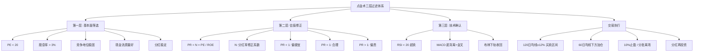

## 📋 文章信息

- **来源**: 知乎 - 专栏文章
- **作者**: 木已断水（整理自奥特之父@奥特之父 的点金术）
- **发布时间**: 2026年4月8日
- **阅读链接**: https://zhuanlan.zhihu.com/p/2024913930770819018

---

## 🎯 核心摘要

"点金术"是一套面向普通投资者的三层过滤选股方法：第一层用 PE < 20 和股息率 > 3% 筛出低估值高回报标的，第二层用市赚率 PR（修正后的 PE/ROE 比值）过滤"低估值陷阱"，第三层用 RSI + MACD 背离 + 布林带三重技术确认提升入场时机胜率。文章在原始体系基础上加入了市赚率和三重技术条件作为增强，目标是建立"看得懂、拿得住、赚得到"的复利闭环。

## 📊 核心观点

### 1. 策略总原则：买能持续赚钱并愿意分红的公司

**背景/现状**：
- 市场中充斥着追热点、炒题材的交易方式
- 普通投资者需要一套简单可执行的框架

**核心论述**：
- 四个核心标准：相对稳固的竞争地位、现金流质量好、分红稳定、通过长期持有+分红再投资穿越周期
- 先把"企业是否值得长期持有"放在第一位，避免把交易技巧用在劣质公司上
- 从源头降低大亏概率

### 2. 第一层筛选：PE < 20 + 股息率 > 3%

**背景/现状**：
- 需要一个简单高效的初筛规则

**核心论述**：
- PE 不过高 → 买入价格相对不昂贵
- 股息率达到 3%+ → 持有期有现金回报，不完全依赖价差
- 优势：规则简单、执行效率高、快速过滤高估值低回报标的
- 提供分红缓冲垫，增强持有信心

### 3. 第二层升级：引入市赚率 PR

**背景/现状**：
- 仅看 PE 和股息率可能遇到"便宜但不优质"的公司
- 需要把"便宜"和"赚钱能力"放在同一框架

**核心论述**：
- PR = N × PE / ROE，N 是基于股利支付率的修正系数
- 股利支付率 ≥ 50% 时 N=1.0，≤ 25% 时 N=2.0，中间线性插值
- PR = 1 为合理区间可建仓，PR > 1 偏贵倾向减仓，PR < 1 偏便宜可重点关注
- N 系数的作用：惩罚低分红公司，降低"赚了利润但不给股东现金"的风险

**利弊分析**：
- 优势：比单纯 PE 更能识别低估值陷阱，合并评估价格和赚钱能力
- 劣势：模型更复杂，ROE 受周期影响可能失真，N 阈值固定化可能错杀成长型公司

### 4. 交易执行：均线做节奏，不靠情绪

**背景/现状**：
- 散户最容易犯的错：买入靠感觉，卖出靠情绪

**核心论述**：
- **买入**：参考 120 日均线下方约 12% 区域分批布局
- **加仓**：优先用分红再投入，加仓选在 60 日均线下方
- **卖出**：达到约 10% 收益可止盈，或在 120 日均线上方约 12% 分批离场
- 分批操作降低择时误差，卖出规则前置避免"会买不会卖"

### 5. 胜率提升：三重技术确认

**背景/现状**：
- 基本面选股好不等于入场时机好，需要技术面辅助

**核心论述**：
三条技术条件串联执行：
1. **RSI < 20**：进入明显超卖区，避免高位追涨
2. **MACD 底背离 + 金叉确认**：价格和动能出现修复信号
3. **跌破布林下轨后收回**：识别恐慌后的价格修复

- 组合逻辑：先等超卖→再等反转确认→再等价格回归
- 本质是提升入场质量、降低左侧接刀概率

## 🧠 概念图谱

## 🔑 关键洞察

### 1. "三层过滤"是对投资决策流程的标准化

**分析**：
- 大多数散户的决策是"看觉得好就买了"，缺乏系统流程
- 点金术的价值不在某个具体指标，而在把决策拆解为三个独立环节：选什么（基本面）→ 估价多少（估值修正）→ 何时买（技术面）
- 这三个环节相互独立、递进过滤，每一步都在降低风险
- 这种"流水线式"决策框架比单一指标靠谱得多，因为它迫使你在每个环节都做判断

### 2. 市赚率 PR 是 PE 的重要修正，但有边界

**分析**：
- 单看 PE 的问题是：PE=15 的公司，如果 ROE=30% 那其实不便宜，ROE=5% 那可能还贵
- PR 把 ROE 纳入考量，解决了"便宜但赚钱能力差"的问题
- N 系数对低分红公司的惩罚很有意思——它隐含了一个假设：不分红的公司有更大概率在做"账面利润"
- 但局限也很明显：ROE 是滞后指标，在业绩拐点时可能严重失真；N 阈值过于刚性

### 3. 三重技术确认的真正价值：强制等待

**分析**：
- 三个技术条件（RSI<20、MACD 底背离、布林下轨收回）本质上都在做一件事——**让你等到最恐慌的时刻再入场**
- 它的真正价值不是技术分析的精确性，而是**纪律性**：在基本面已经选好的前提下，强制你等一个更安全的入场点
- 这避免了最常见的散户错误：看好了就马上买，结果买在半山腰
- 但代价也很明显——可能错过上涨行情，需要极强的耐心

## 🚧 不足与局限

### 1. 策略容量有限

- PE<20 + 股息率>3% 的条件会过滤掉大量优秀公司
- 在 A 股当前环境下，符合条件的标的可能集中在银行、煤炭、钢铁等少数行业
- 策略的行业分布可能过于集中，分散化不足

### 2. 10% 止盈可能过早

- 在大行情中，10% 止盈会导致频繁卖出好公司
- 对于基本面优秀、估值仍然合理的标的，过早止盈反而降低了长期收益
- 止盈幅度应该与基本面估值挂钩，而非固定百分比

### 3. 技术条件组合可能过于严格

- RSI<20 + MACD 底背离 + 布林下轨收回，三个条件同时满足的情况可能非常少
- 等待完美信号可能错过大量机会
- 实际执行中可能需要"满足两个即可"的弹性规则

### 4. 原文是二手整理

- 文章是木已断水对奥特之父"点金术"的个人理解和补充
- 市赚率和三重技术确认是作者自行添加的增强部分，非原始体系
- 原始"点金术"的完整细节需要参考奥特之父本人的内容

## 🔮 延伸思考

### 与 MR Dang、鳄鱼体系的定位差异

- **MR Dang 体系**：偏重宏观判断和仓位管理，选股是框架之一
- **鳄鱼体系**：偏重极严格的选股流水线和周期判断，重仓长持
- **点金术**：偏重可量化的选股规则和交易执行，更适合初学者入门
- 三者的共同点：都强调高股息、都强调纪律、都回避纯概念炒作
- 点金术的独特价值：提供了最具体的量化规则（PE 阈值、均线百分比、RSI 数值），可执行性最强

### 市赚率 PR 的潜在改进方向

- N 系数可以改为连续函数，避免 50%/25% 的硬阈值
- 可以加入 ROE 的稳定性指标（如 5 年 ROE 标准差），惩罚波动大的公司
- 可以结合行业平均 ROE 做调整，因为不同行业的 ROE 中位数差异很大

## 💡 实践启示

### 1. 建立自己的"三层过滤"清单

**要点**：
- 不一定要照搬点金术的具体参数，但"基本面→估值→时机"的三层结构值得借鉴
- 每一层用 2-3 个量化条件，避免主观判断
- 三层之间独立评估，任何一层不通过就排除

### 2. 用技术指标做"等待纪律"，而非"预测工具"

**要点**：
- 技术指标最大的价值不是预测涨跌，而是强制你等到更安全的时机
- RSI<20 本质是"等市场恐慌"，MACD 底背离本质是"等动能修复"
- 把技术指标当作纪律执行的触发器，而非涨跌预测器

### 3. 分批操作是降低择时误差的最佳手段

**要点**：
- 任何人都不可能精准买在最低点
- 在均线下方 12% 区域分批买入，本质上是用空间换时间
- 配合分红再投资，即使第一笔买的位置不完美，后续也能通过分批加仓降低成本

## 📝 关键金句

> "在股市里，真正能长期跑赢通胀和情绪波动的，不是追热点，而是建立一套可重复执行的体系。"

> "先把'企业是否值得长期持有'放在第一位，能避免把交易技巧用在劣质公司上，从源头降低大亏概率。"

> "最终目标不是'每一笔都赢'，而是通过可复制的纪律，把大概率正确的事反复做，逐步累积复利。"

## 🏷️ 标签

投资策略、价值投资、高股息、市赚率、技术分析、选股方法、复利、PE、ROE

---

## 🔗 相关资源

- **原始来源**: 奥特之父（@奥特之父）雪球账号
- **概念来源**: 市赚率（PR）由丁总在雪球提出
- **同类体系参考**: MR Dang 投资体系（偏宏观仓位）、鳄鱼投资体系（偏周期选股）
