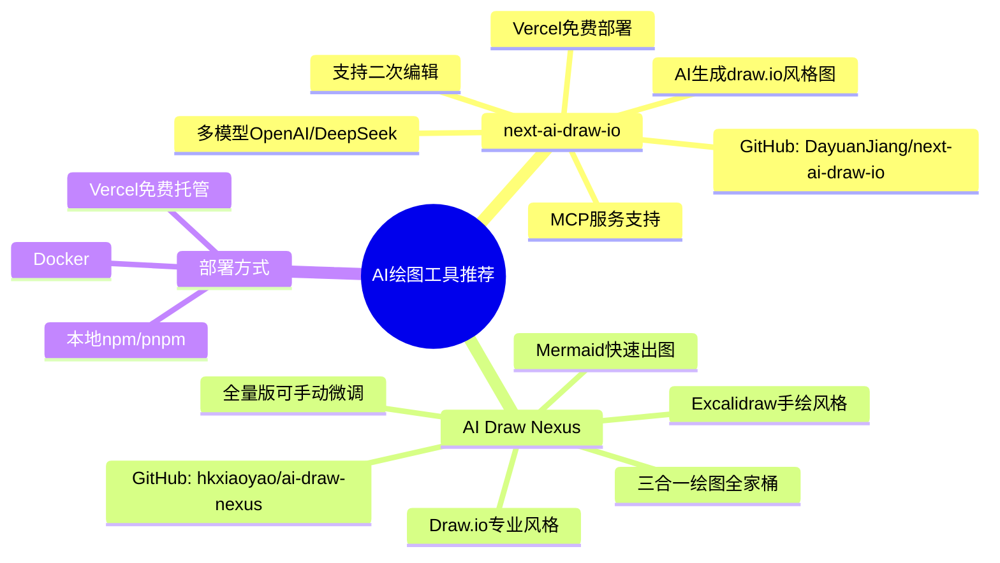

## 📋 文章信息

- **来源**：知乎 - 问答
- **作者**：程序员小富
- **原文链接**：[程序员画图工具用什么？](https://www.zhihu.com/question/280734656/answer/2025497687147967177)
- **收藏日期**：2026年4月12日

---

## 🎯 内容摘要

文章推荐了两款 AI 辅助绘图开源工具：**next-ai-draw-io** 支持 AI 生成 draw.io 风格的流程图、架构图，可二次编辑，支持 Vercel 免费部署和 MCP 服务；**AI Draw Nexus** 是三合一绘图全家桶，支持 Mermaid、Draw.io、Excalidraw 三种风格。两者都能显著减少程序员画图的手工时间。

---

## 🗺️ 思维导图



---

## 📄 原文内容

我是个程序员博主，现在都是AI绘图了

绘图我比较喜欢两种主题的：drawio 和 Excalidraw

### drawio

老粉丝都知道，我以前的文章中会出现很多还算精美的插图，这些图片大部分都是我用 draw.io 一点点抠出来的。


现在AI越来越牛X，写文章都可以用AI来辅助，可是画图这事儿，还是得手动绘制。有时候为了画一个逻辑严密的架构图，画图可能就占了写文章一半以上的时间！

我个人还是比较喜欢 draw.io 那种清爽、专业的风格，但现在我用的 drawio 版本 AI 也使不上劲。所以我就在想，有没有一个AI + drawio 的结合体？我说需求，它出图，而且还能支持二次编辑？


在我摸鱼时候，居然让我在Github 扒到了 next-ai-draw-io 这个开源项目。

### next-ai-draw-io

他是个纯前端的基于 Next.js 和 AI 模型的项目，使用非常简单，就像你使用其他的AI工具一样，编写 prompt 就能快速把文字描述，变成简约美观的流程图、序列图、思维导图。

而且生成的不是一张死图，是可以二次编辑微调的，这对程序员和架构师来说太重要了。

多模型支持也还算全吧，市面上常用的OpenAI、deepseek 基础都支持了。

现在很多技术文章里的图很多也是AI做的，所以我越来越觉得，单纯的写技术文章价值越来越低了，必须要弄一些AI也给不出你满意结果的东西。

#### 上手使用

改配置：next-ai-draw-io 项目源码下载以后，只需要做一件事，复制文件 env.example 内容新建一个 .env.local 文件，主要是设置默认的大模型。

编译启动：
```bash
git clone https://github.com/DayuanJiang/next-ai-draw-io
cd next-ai-draw-io
npm install
cp env.example .env.local
npm run dev
```

更简单的可以直接 docker 启动，参数上设置要用的模型类型：
```bash
docker run -d -p 3000:3000 \
  -e AI_PROVIDER=openai \
  -e AI_MODEL=gpt-4o \
  -e OPENAI_API_KEY=your_api_key \
  ghcr.io/dayuanjiang/next-ai-draw-io:latest
```

或者用一个环境文件：
```bash
cp env.example .env
docker run -d -p 3000:3000 --env-file .env ghcr.io/dayuanjiang/next-ai-draw-io:latest
```

直接页面访问 http://localhost:3000 ，打开能看到了，可以选择修改模型配置。

#### MCP

它还提供了 MCP 服务，可以在大模型里直接配置调用，要不你让大模型给你画图，它只能提供 mermaid 格式，渲染不直观改起还来麻烦。
```json
{
  "mcpServers": {
    "drawio": {
      "command": "npx",
      "args": ["@next-ai-drawio/mcp-server@latest"]
    }
  }
}
```

#### Vercel 免费部署

官方推荐 Docker 部署，但还得买服务器，那不是我的风格。因为这是个 Next 项目，而 Vercel 它支持 Next 个人开发者免费托管部署，一分钱不花，服务器都不用买。

部署流程也非常简单，几步就搞定。

导入项目：首先将 next-ai-draw-io Fork到你自己的GitHub里，GitHub地址：https://github.com/DayuanJiang/next-ai-draw-io

登录 Vercel 官网 https://vercel.com/new ，用 GitHub 登录并导入刚刚你 Fork 的 next-ai-draw-io 项目。

配置环境变量，这里一定是 Hobby，只有个人开发者是免费的。如果你不想在项目代码中设置密钥，可以在 Environment Variables 区域，需要填入 AI 的配置信息。比如用 deepseek 那就配置如下就行：

```
AI_PROVIDER=deepseek
AI_MODEL=deepseek-chat
DEEPSEEK_API_KEY=sk-22222
DEEPSEEK_BASE_URL=https://api.deepseek.com
```

填好后，直接点击 Deploy。大概等待 1-2 分钟，Vercel 提供了 xxx.vercel.app 格式的域名，可以直接访问。

自定义域名：如果你自己有域名也可以直接指向过来，Vercel 的地址是 76.76.21.21，然后在已经部署的项目上 setting -> domain -> add domain 就可以了，直接傻瓜式操作。

#### 总结

以前手搓一个复杂的业务架构图，光是拖拽对齐就要半小时。现在底稿由 AI 生成，我只需要修修补补确实快了很多。有时候脑子卡壳，不知道流程哪里漏了，能帮我查漏补缺。

缺点就是审美一般，AI 直接生成的配色和布局比较直男，所以prompt 多给他提要求就好了。复杂逻辑不够准，特别复杂的超大系统图，连线会乱飞，还是要人调整的。

总的来说，这是一个 80 分的辅助工具，对于我这种写文章、写文档的人来说，绝对是神器，可以省掉很多重复劳动。

---

### Excalidraw

上边不是分享了如何零成本搭建 next-ai-draw-io，教大家用 AI 生成 draw.io 风格的架构图。后台反响还不错，看来大家对手绘架构图真的是苦之久矣。

但在日常写文章时，我发现很多读者更偏爱那种手绘感十足的 Excalidraw 风格，就是下面这种，逼格高、视觉美，能让文章瞬间显得高级起来：


我原本在琢磨，能不能用 Gemini Pro 给自己搓一个 AI 绘图整合平台，把 draw.io 和 Excalidraw 全揉进去。

结果去 GitHub 一搜，好家伙，已经有大佬把我想做的给做了！这个开源项目简直是为我这种懒癌博主量身定制的：Mermaid、draw.io、Excalidraw 三大王牌风格全部支持。

回头再看看以前为了画个原理图熬夜的样子，真的感觉是在浪费生命啊！

#### AI Draw Nexus AI 绘图全家桶

GitHub 地址：https://github.com/hkxiaoyao/ai-draw-nexus

在线体验：https://ai-draw-nexus.aizhi.site/

三种输出风格：

**1. Excalidraw 风格**：输入: HTTP 长轮询原理图，生成的逻辑线条清晰，手绘质感爆棚。


**2. Draw.io 风格**：我之前很多的系统架构、流程图都是这个风格，现在 AI 加持真的太方便了。


**3. Mermaid 风格**：写 Markdown 就更简单了一秒出图。


这不是功能阉割版，而是全量版！可以在 AI 生成的基础上，直接手动微调。

#### 快速上手

如果你想本地运行，这个基于 Next.js 的前端项目安装起来也非常简单：

```bash
# 1. 克隆项目
git clone https://github.com/hkxiaoyao/ai-draw-nexus
cd ai-draw-nexus

# 2. 安装依赖 (推荐用 pnpm)
pnpm install

# 3. 开启生产力大门
pnpm dev
```

不过，目前的在线版本每天有 10 次免费配额，这也很正常毕竟 API 线上的费用确实贵。

现在仅支持 OpenAI 和 Anthropic 两大模型。如果你有自己的 Key，建议本地搭一个，那才是真正的绘图自由！
