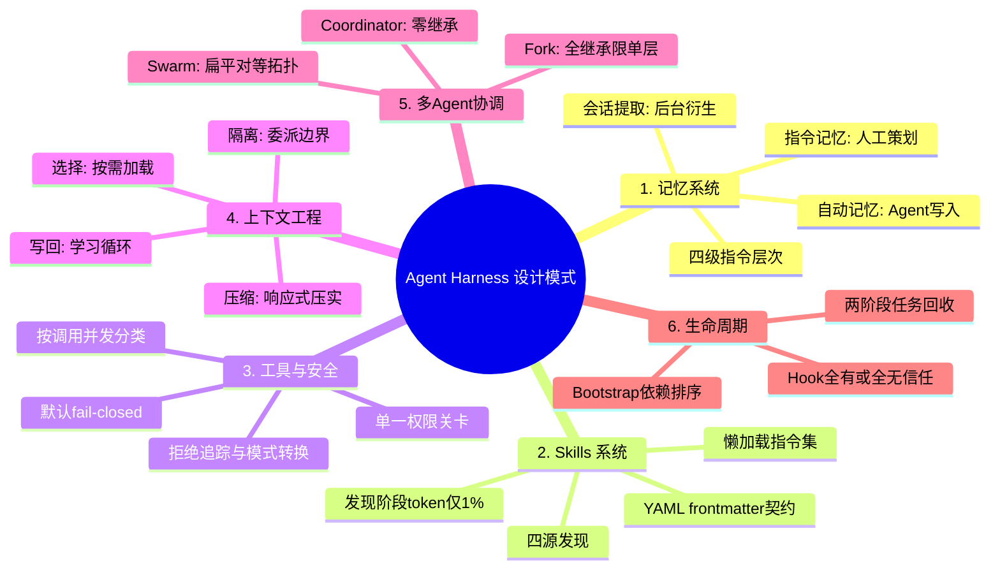

## 📋 文章信息

- **来源**：GitHub
- **作者**：keli-wen
- **原文链接**：[agentic-harness-patterns-skill](https://github.com/keli-wen/agentic-harness-patterns-skill/blob/master/README_ZH.md)
- **收藏日期**：2026年4月12日

---

## 🎯 内容摘要

一个从 Claude Code 源码中提炼 AI Agent Harness 设计模式的开源项目。覆盖 6 大核心模式（记忆系统、Skills 系统、工具与安全、上下文工程、多 Agent 协调、生命周期）和 11 篇深度参考文档，所有内容表达为运行时无关的设计原则，适用于在任何技术栈上构建 Agent 系统。

---

## 🗺️ 思维导图



---

## 📄 原文内容

一个 AI 编程助手的核心循环 — 用户 → LLM → tool_use → 执行 → 循环 — 在工程上并不复杂。真正决定一个 Agent 能否在生产环境中稳定运行的，是循环之外的基础设施：跨会话的记忆管理、默认关闭的权限管道、可预测的上下文预算控制、多 Agent 之间的协调机制、以及不引入新攻击面的扩展体系。

Anthropic 将这一层称为 harness。本项目试图从 Claude Code 的源码实现中提取其中可复用的设计原则。

> 本项目兼容开放 Agent 技能生态，支持通过 npx skills add 安装到 Claude Code、Codex 及其他 40+ Agent 运行时。

**6 个设计模式章节 + 11 篇深度参考文档。基于对 Claude Code TypeScript 源码的系统性分析。**

**这不是源码镜像，也不是代码搬运。所有内容均表达为运行时无关的设计原则 — Claude Code 在这里是实证依据（evidence），而非唯一的实现参考。**

适合正在构建或扩展以下系统的工程师：AI 编程助手运行时（Claude Code、Codex CLI、Gemini CLI、Cursor、Windsurf 等）、自定义 Agent 与 Agent 插件、多 Agent 编排系统、任何需要 LLM 可靠调用工具的生产系统。

### 6 大核心模式

| # | 模式 | 解决的问题 | 核心洞察 |
|---|------|-----------|---------|
| 1 | **记忆系统** | Agent 无法跨会话保留上下文 | 区分指令记忆（人工策划）、自动记忆（Agent 写入）、会话提取（后台衍生），三层在持久性、信任度、审查机制上各有不同 |
| 2 | **Skills 系统** | 每次对话需重复解释工作流 | 技能是懒加载的指令集；发现阶段的 token 成本约为上下文窗口的 1%，完整内容仅在激活时加载 |
| 3 | **工具与安全** | 工具调用的安全与并发控制 | 默认 fail-closed；并发分类按调用而非按工具类型；权限管道在评估过程中会产生副作用（拒绝追踪、模式转换等） |
| 4 | **上下文工程** | 上下文窗口中信息过多、过少或过时 | 四种操作：选择（按需加载）、写回（学习循环）、压缩（响应式压实）、隔离（委派边界） |
| 5 | **多 Agent 协调** | 并行执行中的协调与控制 | 三种模式各有适用场景：Coordinator（零继承）、Fork（全继承但限单层）、Swarm（扁平对等拓扑） |
| 6 | **生命周期** | Hook、后台任务与初始化序列的管理 | Hook 信任采用全有或全无策略；任务回收分两阶段；Bootstrap 按依赖排序，信任边界是关键拐点 |

### 11 篇参考文档

| 文档 | 覆盖内容 |
|------|---------|
| memory-persistence-pattern | 四级指令层次、四类自动记忆、带互斥锁的后台提取 |
| skill-runtime-pattern | 四源发现、YAML frontmatter 契约、预算约束 listing、优雅降级 |
| tool-registry-pattern | Fail-closed 构建器、按调用并发分类、分区排序拼接以保持 cache 稳定 |
| permission-gate-pattern | 单一关卡、三种行为、严格分层评估、原子声明防竞态 |
| agent-orchestration-pattern | 模式互斥、Fork cache 优化、扁平 Swarm 拓扑、工具过滤层 |
| context-engineering | 索引页：选择 / 压缩 / 隔离三个子模式的路由 |
| select-pattern | Promise 记忆化、三级渐进披露、手动 cache 失效 |
| compress-pattern | 带恢复指针的截断、响应式压实、快照标注 |
| isolate-pattern | 零继承默认、单层 Fork 边界、基于 worktree 的文件系统隔离 |
| hook-lifecycle-pattern | 单一分发点、全有或全无信任、六种 Hook 类型、退出码语义 |
| task-decomposition-pattern | 带类型前缀的 ID、严格状态机、磁盘后备输出、两阶段回收 |
| bootstrap-sequence-pattern | 依赖排序初始化、信任分割环境变量、记忆化并发调用、快速路径分发 |

### 蒸馏方法论

- **源码探索** — 4 个并行 Agent 扫描约 1,900 个源文件，识别 harness 子系统
- **溯源草稿** — 7 个并行 Agent 各负责一篇参考文档，每条声明追溯到具体源文件
- **事实审查** — 3 轮独立 review，逐条核验声明与源码的对应关系
- **抽象提升** — 将实现细节下沉到 "Evidence" 段落，原则层面泛化为运行时无关的表述
- **用户体验审计** — 从使用者视角审查可发现性、读者匹配度、从原则到操作的落差

### 安装方式

```bash
npx skills add github:keli-wen/agentic-harness-patterns-skill
```

### 项目结构

```
agentic-harness-patterns/
├── README.md                    # English version
├── README_ZH.md                 # 中文版
├── LICENSE
└── skills/
    ├── agentic-harness-patterns/    # English skill
    │   ├── SKILL.md
    │   ├── metadata.json
    │   └── references/
    └── agentic-harness-patterns-zh/ # 中文 skill
        ├── SKILL.md
        ├── metadata.json
        └── references/
```

### 扩展计划

| 运行时 | 状态 | 说明 |
|--------|------|------|
| Claude Code | ✅ 已完成 | 当前版本 — 6 章 + 11 篇参考文档 |
| Codex CLI | 📋 计划中 | OpenAI 的 Agent CLI；上下文和委派模型与 Claude Code 有显著差异 |
| Gemini CLI | 📋 计划中 | Google 在工具编排与记忆管理上的设计路径 |
| 统一综合 | 🔮 远期 | 提炼跨三套实现仍然成立的共性模式 |

> 一个值得验证的假设：在 Claude Code、Codex 和 Gemini CLI 中独立涌现的模式，更可能反映问题域的本质结构，而非某个团队的设计偏好。

### 相关资源

- [Anthropic: Effective harnesses for long-running agents](https://www.anthropic.com/engineering/effective-harnesses-for-long-running-agents) — Anthropic 关于 harness 概念的阐述
- [Claude Code 源码仓库](https://github.com/anthropics/claude-code) — 本分析所基于的源码
- [Vercel Skills CLI](https://github.com/vercel-labs/skills) — npx skills add 包管理器
- [作者博客：一诗足矣](https://keli-wen.github.io/One-Poem-Suffices/) — 上下文工程系列文章
