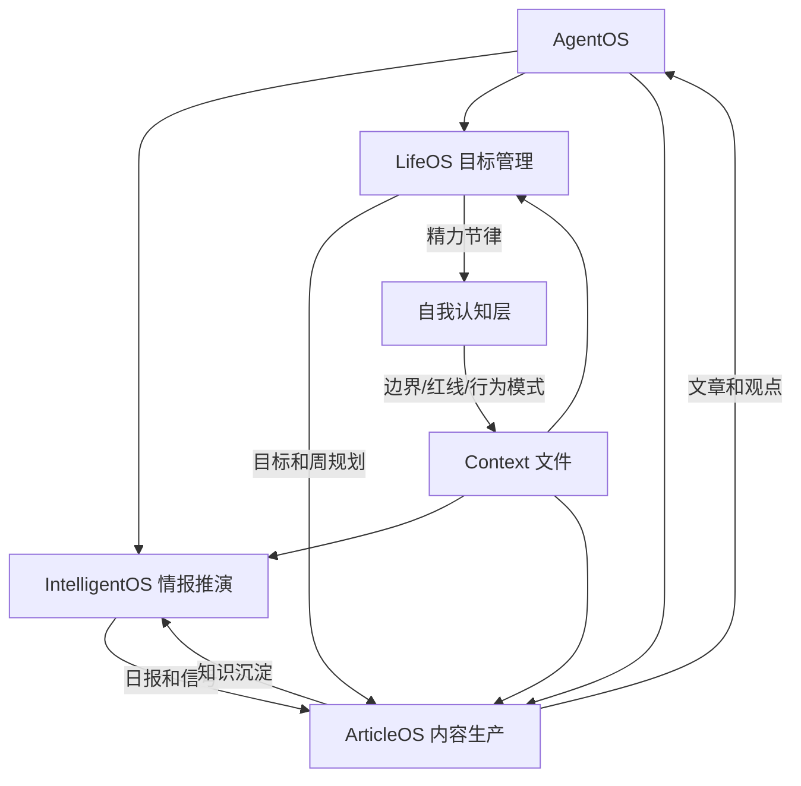

## 📋 文章信息

- **来源**: 知乎专栏 - Designero
- **作者**: 薛志荣（《写给设计师的技术书》《前瞻交互》《AI改变设计》作者）
- **发布时间**: 2026年4月13日
- **阅读链接**: https://zhuanlan.zhihu.com/p/2027064039319052483

---

## 🎯 核心摘要

本文不是技术教程，而是一次系统结构的公开解构。作者提出一人公司要构建「飞轮」——信息输入、自我管理、内容输出三件事必须打通并相互喂养。其 AgentOS 由 IntelligentOS（情报推演）、LifeOS（目标管理）、ArticleOS（内容生产）三大子系统构成，共享同一组 Context 文件作为底层参数。核心观点：AI 最大的价值不是提效，而是作为思维放大器，让你从执行者变成决策者。

## 📊 核心观点

### 1. 先把自己解构一遍

**背景/现状**：
- 大多数人跳过了「定义自己」这一步，直接让 AI 帮忙做事
- 模糊的自我认知无法转化为系统参数

**核心论述**：
- 构建 AgentOS 的前提是建立 Context 文件，覆盖：我是谁、我所处的环境、我的观点和判断、我的受众、我的精力状态、我的边界和红线
- 这些文件被所有 Agent 读取，每一次建议都经过「自我认知」过滤
- 这个过程是强迫自己把模糊的感觉变成精确描述，受益最大的是自己而非 AI
- 核心判断：如果你连边界都没想清楚，AI 帮你做的每个决定都是在赌运气

### 2. 知识蒸馏：过滤比收集更重要

**背景/现状**：
- 大多数人的信息管理停留在「收藏」层面
- 收藏和蒸馏之间隔着很宽的沟——收藏 ≠ 可用的知识

**核心论述**：
- 蒸馏的本质：从大量信息里提炼出自己的判断
- ArticleOS 的三层结构：输入端（多源抓取）→ 蒸馏层（四条清晰分流）→ 输出端（可调用的素材库）
- 四条分流：他人洞察、自己判断、行业领袖观点、闪念灵感
- 核心：一个从不被调用的知识库是仓库不是系统；过滤比收集更重要

### 3. 情报推演：不是知道，是预判

**背景/现状**：
- 大多数人刷信息流是被动的——算法推什么看什么
- 信息焦虑的本质不是信息太多，而是缺乏分析框架

**核心论述**：
- 情报推演四步：识别信号 → 交叉分析 → 形成判断 → 沉淀为未来信号
- 推演必须落地到具体：不是「AI 行业在发展」的废话，而是「未来 3 个月可能出现什么窗口，我现在该做什么准备」
- 宽度是焦虑，深度才是竞争力
- 关键问题：你有没有机制每周系统性回答「我的赛道上正在发生什么变化」？

### 4. LifeOS：让目标系统真正运转

**背景/现状**：
- 很多人有目标管理工具，但目标和日常行动始终断裂
- 目标只在年初写下来，年底才复盘

**核心论述**：
- LifeOS 是层级化结构：3-5 年北极星 → 年度 → 季度 → 月度 → 每周
- 八个协作 Skill：目标管理、每周规划、业务顾问、复盘教练、头脑风暴、人生教练、创业导师、未来信号解读
- 核心设计判断：不是任务管理工具，而是决策辅助系统
- 设计原则：通过构建明确的未来来引导自己，而不是被动地响应当下
- 每次规划都在问：这件事和我想去的地方，有没有关系？

### 5. AgentOS 的真正价值

**背景/现状**：
- 大多数人把 AI 的价值理解为「提效」

**核心论述**：
- 三层价值：
  - **思维放大器**：不同角色强迫你从多角度审视同一问题（一楼 vs 三楼 vs 十楼 vs 楼顶）
  - **认知盲区纠正器**：AI 能记住你告诉它的所有信息并做交叉检查，而你会忘
  - **飞轮引擎**：从「手动」到「自转」，你的角色从执行者变成决策者
- AgentOS 的本质是信息代谢系统，健康程度取决于每个环节的蒸馏质量
- 核心：不是让你多一个工具，而是让你从 Loop 里抽离出来

## 🧠 概念图谱

## 🔑 关键洞察

### 1. 「系统绑定在数据和认知上，而非工具上」

**分析**：
- 这是全文最深刻的设计哲学。工具会换、平台会变，但你对自我的描述、沉淀的观点、积累的判断才是系统真正的内核
- 这意味着迁移成本不在于重新配置工具，而在于重新构建「对自己的精确描述」
- 反过来也说明：Context 文件的打磨质量，直接决定系统的天花板

### 2. 「蒸馏」是连接信息与行动的关键动词

**分析**：
- 作者区分了「收藏」和「蒸馏」，这个区分非常有价值
- 大多数知识管理工作流卡在收集环节，信息进了收藏夹就等于进了坟墓
- 蒸馏的核心动作是「用自己的话重新表达」——只有经过自己判断过滤的信息，才能被后续环节有效调用
- 这与「费曼学习法」异曲同工：能用自己的话说出来，才算真正理解

### 3. AI 的角色是「决策辅助」而非「任务执行」

**分析**：
- 作者明确指出 LifeOS 不是任务管理工具，AgentOS 的价值不是提效
- 这是一个反直觉但重要的判断：大多数人追求「让 AI 帮我做得更快」，但真正的高价值在于「让 AI 帮我看清楚该做什么」
- 从执行者变成决策者的转变，本质上是从战术层上升到战略层

## 🚧 不足与局限

### 1. 系统门槛极高

- 构建 AgentOS 的前置条件（深刻自我认知 + 系统构建能力 + 跨学科视野）过滤掉了绝大多数人
- 作者自己也是 HCI 背景的 7 本书作者，其能力模型很难被普通人复制

### 2. 缺乏具体实现细节

- 文章是概念解构，没有提供可操作的搭建指南
- Context 文件的具体结构、Agent 之间的协作协议、蒸馏层的具体分流规则都未展开
- 对大多数读者来说，看完之后「知道了」但「做不到」

### 3. 未讨论维护成本

- 一套持续运转的系统需要持续的维护和迭代
- 上下文文件的更新频率、信息蒸馏的时间投入、系统崩溃时的恢复机制都未提及
- 风险：系统可能变成另一种形式的「收藏夹」

### 4. 跑道偏窄

- 整个系统围绕「知识 IP / 内容创作者」这个角色设计
- 虽然文末做了扩展讨论（设计师、销售、研究者），但这些设想未经验证

## 🔮 延伸思考

### 方向1: AgentOS vs 个人知识管理 2.0

- PKM（Personal Knowledge Management）运动发展了十年，从 Evernote 到 Notion 到 Obsidian，核心困境始终未解决：收集容易、调用困难
- AgentOS 本质上是 PKM 2.0——从静态知识库进化为动态知识处理系统
- 关键差异：PKM 1.0 是人驱动系统，AgentOS 是系统辅助人
- 但这个方向的风险在于：增加了一个需要维护的系统，可能反而增加负担

### 方向2: Context 文件能否标准化？

- 如果「精确描述自己」是核心前置条件，是否可以设计一套标准化的自我评估框架？
- 类似 MBTI 或 StrengthsFinder，但面向 AI Agent 系统优化
- 这个方向如果可行，可以大幅降低 AgentOS 的构建门槛

### 方向3: 多人协作的 AgentOS

- 一人公司是起点，但真正的价值可能在于多人协作
- 如果每个人的 AgentOS 能安全地交换特定维度的 Context，是否可以形成更强大的集体智能？
- 这涉及隐私、信任和标准化等更深层的挑战

## 💡 实践启示

### 1. 从 Context 文件开始

**要点**：
- 不需要构建完整系统，先从写清楚「我是谁」开始
- 回答三个问题：我的核心能力是什么？我的精力节律是什么？我的边界在哪里？
- 写下来、反复打磨，让这些描述精确到 AI 可以据此给出高质量建议

### 2. 建立「蒸馏」习惯

**要点**：
- 每周花 30 分钟，从收藏夹里挑出最有价值的 3-5 条内容
- 用自己的话重新表达核心观点，并记录「我的判断是什么」
- 目标：让收藏夹里的信息从「仓库」变成「可调用的素材库」

### 3. 回答三个底层问题

**要点**：
- 我是怎么运作的？（能力、精力、边界、行为模式）
- 我有哪些经验可以变成 Skill？（哪些反复做的事可以被系统化）
- 我的飞轮是什么？（哪几件事可以形成相互喂养的循环）
- 回答完这三个问题，你的 AgentOS 就有了骨架

## 📝 关键金句

> "飞轮的本质是：你做的每一件事，都在为下一件事积累势能。但飞轮有一个前提：你必须同时处理好信息输入、自我管理、内容输出这三件事，而且它们之间必须是打通的。"

> "一个从不被调用的知识库是仓库，不是系统。蒸馏的目的，是让信息变得可以被使用。"

> "宽度是焦虑，深度才是竞争力。"

> "它不是让你多一个工具，而是让你从 Loop 里抽离出来。你不再是飞轮上的仓鼠，而是站在飞轮旁边的人——观察它的运转，在关键时刻推一把。"

> "系统不应该绑定在某一个工具上，而应该绑定在你的数据和认知上。工具会换，平台会变，但你对自己的描述、你沉淀的观点、你积累的判断——这些才是系统真正的内核。"

## 🏷️ 标签

AgentOS、一人公司、AI Agent、知识蒸馏、个人操作系统、飞轮效应、自我管理、内容创作、认知框架、决策系统

---

## 🔗 相关资源

- **延伸阅读**：薛志荣的 AgentOS 系列文章（微信公众号）
- **相关概念**：Personal Knowledge Management (PKM)、Second Brain、Flywheel Effect
- **相关工具**：OpenClaw、Claude Code
