## 📋 文章信息

- **来源**: 微信公众号 - 阿里云开发者
- **作者**: 飞樰
- **发布时间**: 2026年4月20日
- **阅读链接**: https://mp.weixin.qq.com/s/YgGW92VBP8s846yzIxjVWQ

---

## 🎯 核心摘要

本文从 Prompt Engineering、Context Engineering、Harness Engineering 三个维度，深度解析了 Claude Code 作为顶级 AI Coding Agent 的设计哲学与工程实现。文章揭示了一个成熟 Agent 系统的核心公式：Prompt Engineering 决定 70 分基线，Context Engineering 将其提升到 80-85 分，Harness Engineering 才能冲刺到 90-95 分。作者通过大量源码级别的分析，展示了 Claude Code 在 System Prompt 动态组装、三层渐进式上下文压缩、六大内置 AgentTool 协作、精细化安全体系等方面的精妙设计，并与 OpenClaw 进行了对比，为构建高质量 Agent 系统提供了极具参考价值的方法论。

## 📊 核心观点

### 1. Prompt Engineering：从"写提示词"到"组装提示词"的范式转变

**背景/现状**：
- 很多人认为写好 System Prompt 就是做好了 Prompt Engineering，这是误区
- 真正的"工程"体现在如何将身份人设、系统行为、安全守则、工具规范等动态信息进行实时拼接组装
- Claude Code 的 System Prompt 由静态部分（全局缓存）和动态部分（按用户/会话变化）两大块组成

**核心论述**：
- System Prompt 的组装像搭积木：先放固定底座（静态内容），再叠加环境相关的积木块（动态内容）
- 七个静态模块：身份介绍、系统行为规则、任务执行指南、操作安全守则、工具使用指南、语气和风格、输出效率
- 动态模块包括：会话特定指导、自动记忆、环境信息、语言偏好、输出风格、MCP 服务器指令等
- 最终通过优先级决策机制选择：override > Coordinator > Agent > customSystemPrompt > defaultSystemPrompt
- **KV Cache 分块策略**：通过 `__SYSTEM_PROMPT_DYNAMIC_BOUNDARY__` 标记将静态内容标记为可缓存，动态内容标记为不缓存，提高缓存命中率

### 2. Context Engineering：三层渐进式压缩 + 结构化记忆系统

**背景/现状**：
- 上下文窗口是制约 Agent 长程任务执行能力的核心瓶颈
- 对话轮数增加后，工具输出、代码片段和历史交互会迅速耗尽 token 配额

**核心论述**：
- **三层压缩体系**：
  - Layer 1 MicroCompact（微压缩）：纯规则驱动，无 LLM 调用，基于时间阈值截断旧工具输出，图片按 2000 token 估算
  - Layer 2 Session Memory Compact（会话记忆压缩）：复用已生成的会话记忆摘要替换冗长历史，零额外推理成本
  - Layer 3 Full LLM Compact（完全 LLM 压缩）：强制模型遵循 9 段式结构化模板生成摘要，引入隐式 CoT 优化和反工具调用保护
- **Memdir 结构化记忆系统**：将记忆拆解为 User（用户偏好）、Feedback（修正记录）、Project（技术决策）、Reference（知识底座）四种类型，并通过 LLM-in-the-loop 的语义检索策略精准召回最相关的 5 条记忆

### 3. Harness Engineering：六大 AgentTool + 精细化安全 + 可编程钩子

**背景/现状**：
- Prompt Engineering 告诉模型"做什么"，Context Engineering 让模型"做得更好"，Harness Engineering 确保模型"可控地做"
- Agent 就像千里马，Harness 就是为它套上的马具——既可交互，又受约束

**核心论述**：
- **六大内置 AgentTool**：
  - General-Purpose Agent：万能打工人，拥有所有工具权限
  - Explore Agent：代码库侦察兵，严格只读，使用便宜模型，至少搜索 3 次才值得调用
  - Plan Agent：软件架构师，继承父模型进行高质量规划
  - Verification Agent：质量检验官，红蓝对抗思维，专挑代码毛病，有完整的反偷懒话术
  - Claude Code Guide Agent：使用说明书，查文档回答使用问题
  - Statusline Setup Agent：状态栏安装小工具
- **精细化安全体系**：Permission Engine（Allow/Deny/Ask 三行为模型）+ Sandbox Isolation（bubblewrap 沙箱隔离）
- **异步生成器主循环**：`async function*` 实现流式处理、协作式控制、优雅取消、有状态上下文维持
- **20+ 种可编程钩子**：覆盖工具生命周期、会话生命周期、消息生命周期、文件操作全链路

## 🧠 概念图谱

```mermaid
graph TD
    A[Claude Code 设计哲学] --> B[Prompt Engineering]
    A --> C[Context Engineering]
    A --> D[Harness Engineering]
    
    B --> B1[静态模块 7个]
    B --> B2[动态模块 11个]
    B --> B3[优先级决策机制]
    B --> B4[KV Cache 分块优化]
    
    C --> C1[CLAUDE.md 四层规范]
    C --> C2[三层渐进式压缩]
    C --> C3[Memdir 结构化记忆]
    
    C2 --> C2a[MicroCompact 微压缩]
    C2 --> C2b[Session Memory 压缩]
    C2 --> C2c[Full LLM 压缩]
    
    C3 --> C3a[User 用户偏好]
    C3 --> C3b[Feedback 修正记录]
    C3 --> C3c[Project 技术决策]
    C3 --> C3d[Reference 知识底座]
    
    D --> D1[六大 AgentTool]
    D --> D2[System Reminder 注入]
    D --> D3[Permission Engine]
    D --> D4[Sandbox Isolation]
    D --> D5[20+ 可编程钩子]
    D --> D6[异步生成器主循环]
    
    D1 --> D1a[General-Purpose]
    D1 --> D1b[Explore 只读侦察]
    D1 --> D1c[Plan 架构规划]
    D1 --> D1d[Verification 红蓝对抗]
    D1 --> D1e[Guide 使用说明]
    D1 --> D1f[Statusline 状态栏]
```

## 🏗️ 技术架构

### 架构概述

Claude Code 的整体架构是一个分层设计的 Agent 系统：底层是 Prompt 组装引擎（静态 + 动态拼装），中间层是 Context 管理引擎（压缩 + 记忆），上层是 Harness 控制引擎（安全 + 钩子 + 多 Agent 协作）。三层紧密耦合，共同确保 Agent 在长程复杂任务中的可靠执行。

### 核心组件

| 组件 | 职责 | 关键技术 |
|------|------|----------|
| QueryEngine.ask() | 请求主入口 | System Prompt 组装 + API 调用 |
| fetchSystemPromptParts() | 并行获取三大组件 | 默认 prompt + 系统上下文 + 用户上下文 |
| getSystemPrompt() | 核心 Prompt 构建函数 | 静态部分 + 动态部分 + 边界标记 |
| buildEffectiveSystemPrompt() | 优先级决策 | 五级优先级覆盖机制 |
| splitSysPromptPrefix() | 缓存分块 | KV Cache 命中率优化 |
| MicroCompact | 第一层压缩 | 规则驱动，零 LLM 成本 |
| Full LLM Compact | 第三层压缩 | 9 段式结构化摘要模板 + 反工具调用保护 |
| Memdir | 结构化记忆 | 四类记忆 + LLM 语义检索 |
| Permission Engine | 安全大脑 | Allow/Deny/Ask 三行为模型 |
| Sandbox Adapter | 操作系统隔离 | bubblewrap 文件系统/网络/进程隔离 |
| queryLoop | 主循环 | async function* 异步生成器 |
| Hooks System | 可编程拦截 | 20+ 事件类型，JSON 结构化干预 |

## 🔑 关键洞察

### 1. "组装优于编写"的 Prompt 工程新范式

**分析**：
- Claude Code 将 System Prompt 设计为可组装的模块化积木系统，而非一个巨大文本块
- 关键创新在于 `__SYSTEM_PROMPT_DYNAMIC_BOUNDARY__` 边界标记——它让系统能够精确区分哪些内容应该进入 KV Cache，哪些不应该
- 这启示我们：构建 Agent 系统时，Prompt 的可维护性和缓存效率同等重要
- 五级优先级决策机制（override > Coordinator > Agent > customSystemPrompt > defaultSystemPrompt）体现了"渐进覆盖"的设计哲学

### 2. 三层压缩体系的成本意识设计

**分析**：
- 压缩策略从规则驱动到 LLM 驱动渐进升级，体现了极致的成本优化思维
- MicroCompact 用规则拦截 80% 的简单场景，Session Memory Compact 复用已有成果，Full LLM Compact 只在必要时启动
- 自动触发机制的安全缓冲水位线（13,000 token）保证了压缩时机恰到好处——不会过早（浪费信息）也不会过晚（触发错误）
- 9 段式结构化摘要模板 + 反工具调用保护，解决了 LLM 压缩时可能"偷懒"或产生副作用的痛点

### 3. Verification Agent 的"反人性"设计哲学

**分析**：
- "你的工作不是确认代码能跑——而是想办法把它搞崩"——红蓝对抗思维是 AI 质量保障的核心
- 验证逃避和被前 80% 迷惑两个"典型问题"的精准刻画，说明 Anthropic 对 AI 验证中的心理陷阱有深刻理解
- 反偷懒话术设计（"看起来不是验证，运行它"、"大概不是验证过了"）本质上是在对抗模型的自回归偏差
- 按变更类型分类的验证策略（前端、后端、CLI、移动端等），体现了"领域特定的验证"思想

### 4. Hook 系统的"可编程拦截"哲学

**分析**：
- 20+ 种钩子事件将 Agent 从封闭黑盒变成开放平台
- 阻断执行、动态篡改、反馈注入三种干预能力，让外部系统能在不修改 Agent 核心代码的情况下定制行为
- 10 分钟超时保护体现了对 Agent 系统鲁棒性的极致追求

## 🚧 不足与局限

### 1. 分析深度受限于公开信息
- 文章声明所有分析基于网络公开信息，对于核心的模型推理逻辑、量化策略等无法触及

### 2. OpenClaw 对比不够深入
- 文章主要聚焦 Claude Code 的设计分析，与 OpenClaw 的对比仅在少数维度展开，缺乏更系统性的横向对比

### 3. 缺少实际效果数据
- 文章更多是架构层面的分析，缺少各层设计（如三层压缩）的实际效果量化数据

## 🔮 延伸思考

### 方向1：Agent 系统的成熟度模型
- Claude Code 的三层工程体系（Prompt + Context + Harness）是否可以演化为一个通用的 Agent 系统成熟度评估框架？
- 是否可以定义 L0-L4 的成熟度等级：L0 原始 Prompt → L1 动态组装 → L2 上下文管理 → L3 Harness 约束 → L4 多 Agent 协作？

### 方向2：Verification Agent 在非编码场景的泛化
- 红蓝对抗的验证思想是否可以迁移到内容创作、数据分析等非编码场景？
- 例如：一个"Review Agent"专门对抗"Writer Agent"，确保内容质量

### 方向3：Memdir 记忆架构的通用化
- 四类记忆（User/Feedback/Project/Reference）的分类方式是否适用于其他类型的 Agent？
- LLM-in-the-loop 的语义检索策略与传统的 RAG 方案相比，在记忆管理场景下的优劣如何？

## 💡 实践启示

### 1. 构建 Agent 时优先设计 Prompt 的模块化架构

**要点**：
- 将 System Prompt 拆分为静态模块（可全局缓存）和动态模块（按用户/会话变化）
- 使用边界标记区分缓存区域，优化 KV Cache 命中率
- 设计多级优先级覆盖机制，支持灵活的自定义

### 2. 实现分层渐进式的上下文压缩

**要点**：
- 第一层用规则拦截（截断旧工具输出、估算图片 token）
- 第二层复用已有摘要（避免重复调用 LLM）
- 第三层才动用 LLM 压缩（使用结构化模板 + 反偷懒约束）
- 设置安全缓冲水位线自动触发压缩

### 3. 为 Agent 设计"反模式"防护

**要点**：
- 在 Verification Agent 中预设模型常见的"偷懒模式"并逐一拆穿
- 在压缩阶段禁止工具调用，防止不可控的副作用
- 为每种变更类型设计专门的验证策略

### 4. 用 Hook 系统实现可编程的 Agent 行为约束

**要点**：
- 覆盖工具、会话、消息、文件操作全生命周期
- 支持阻断执行、动态篡改、反馈注入三种干预能力
- 设置超时保护防止 Hook 阻塞主进程

## 📝 关键金句

> "Prompt Engineering 决定 70 分基线，Context Engineering 将其提升到 80-85 分，Harness Engineering 才能冲刺到 90-95 分。"

> "不要重复造轮子。之前交互中已生成的高质量会话记忆，直接复用即可替换冗长的原始历史消息。"

> "你的工作不是确认代码能跑——而是想办法把它搞崩。"

> "前 80% 是容易的部分。你的全部价值在于找到最后那 20%。"

> "细节决定成败——极致的产品体验背后其实就是极致的工程优化和细节打磨。"

## 🏷️ 标签

Claude-Code、Agent、Prompt-Engineering、Context-Engineering、Harness-Engineering、AI-Coding、多Agent协作、上下文压缩、安全防护、系统设计

---

## 🔗 相关资源

- **拓展阅读**：深度解析 OpenClaw 在 Prompt / Context / Harness 三个维度中的设计哲学与实践
- **拓展阅读**：Agent / Skills / Teams 架构演进过程及技术选型之道
