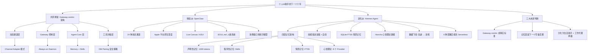

## 📋 文章信息

- **来源**: 微信公众号 - 技术方舟
- **作者**: 技术方舟
- **发布时间**: 2026年4月20日
- **阅读链接**: https://mp.weixin.qq.com/s/fcr-U-W1Eh8ms-fZYB4aLQ

---

## 🎯 核心摘要

本文通过一周时间深度扒开 OpenClaw（359k star）和 Hermes Agent（61.2k star）的源码，揭示了一个被忽视的事实：Hermes 不是 OpenClaw 的竞争者，而是它的演化分支——Nous Research fork 了 OpenClaw 的核心架构并用 Python 重写。两者共享 Gateway-centric Agent 架构范式，却在哲学上分叉为"体验派"和"进化派"两条路径：OpenClaw 赌"无处不在的助手"（24 种通道、Apple 原生深度、Live Canvas），Hermes 赌"会自我进化的智能体"（四层记忆架构、技能自创、数据飞轮）。文章最终判断，Gateway-centric 架构将成为行业事实标准，记忆层是下一个军备竞赛，个人 AI 助手将分化为"生活助手"和"工作代理"两极。

## 📊 核心观点

### 1. Hermes 是 OpenClaw 的"继承者"而非竞争者

**背景/现状**：
- 两个项目都定位为"跑在你自己设备上的 always-on AI"，支持多通道接入
- Hermes 内置 `hermes claw migrate` 迁移命令，能将 `~/.openclaw` 完整导入 `~/.hermes`
- 仓库结构几乎一一对应：`hermes_cli`、`gateway`、`skills/`、`SOUL.md`、`AGENTS.md`

**核心论述**：
- OpenClaw 由 Peter Steinberger（PSPDFKit 创始人）开发，TypeScript + Node.js 技术栈，面向消费级终端体验
- Hermes 诞生于 Nous Research（以 Hermes 系列微调模型闻名的 AI 实验室），Python + uv 技术栈，底层 DNA 是模型训练
- `hermes claw migrate` 不是兼容层，而是官方承认的"同源演化"声明
- 两个项目代表了同一架构思想在两种不同组织哲学下的具现

### 2. 共享的 Gateway-centric Agent 架构是未来的事实标准

**背景/现状**：
- 两个项目独立收敛到几乎一致的架构范式，这在技术史上极少是偶然
- 四层架构：消息通道 → Gateway → Agent Core（含 Memory/Skills）→ 工具沙箱

**核心论述**：
- **Always-on 存在感**：Gateway 作为本地 daemon 承担"永不下线"角色
- **设备无关的人格一致性**：Agent Core 和 Memory 与具体设备解耦
- **渐进式信任边界**：按会话分级的信任模型（main 直接执行 vs non-main 进沙盒）
- **Provider-agnostic 模型层**：内置 OpenRouter、多 provider 路由
- **Channel Adapter 模式**：每个通道实现统一的 `inbound_message` / `outbound_message` / `pairing` 接口
- **DM Pairing 安全策略**：陌生消息只发 pairing code，不处理内容——这是生产级安全系统的标志

### 3. Hermes 的四层记忆架构：认知科学的工程落地

**背景/现状**：
- 个人 AI 助手的真正价值在于"用得越久越懂你"，记忆系统是核心基础设施
- Hermes 参照 CoALA 论文（Cognitive Architectures for Language Agents, 2023）设计了四层记忆体系

**核心论述**：
- **第一层：声明性记忆**（MEMORY.md / USER.md）—— 两个文件合计不到 1,300 tokens，采用 Frozen Snapshot 策略：session 开始时一次性加载，session 内不改变，但修改立即落盘，通过 tool response 保证 agent 自身一致性
- **第二层：程序性记忆**（Agent-managed Skills）—— 渐进加载（Level 0 元数据 ~3k tokens → Level 1 完整 SKILL.md → Level 2 子资源）+ 条件激活（`fallback_for_toolsets` / `requires_toolsets`）+ Agent 自创技能（复杂任务成功后自动生成 reusable skill）
- **第三层：情景记忆**（SQLite FTS5）—— 放弃向量数据库方案，用 SQLite 全文索引 + Gemini Flash 摘要替代，理由是个人助手场景主要是精确关键词查询
- **第四层：心智理论**（Honcho 等 8 个外部 Provider）—— 不仅记录事实，还让 LLM 持续推断用户的信念、偏好、情绪状态，外部 Provider 是加法式的，不替代内置记忆

### 4. 数据飞轮：Hermes 的真正战略层

**背景/现状**：
- Nous Research 不只是做产品，还是在建设 agent 训练数据工厂
- 仓库包含 `batch_runner.py`（批量轨迹生成）、`trajectory_compressor.py`（轨迹压缩）、`rl_cli.py`（RL 训练 CLI）

**核心论述**：
- 产品运行时产生真实 agent 轨迹（用户请求 + 工具调用序列 + 最终结果）
- `trajectory_compressor` 压缩成可训练格式，`batch_runner` 批量探索
- Atropos RL 环境框架提供训练抽象，产出数据训练下一代 Hermes 模型
- 闭环：产品产生数据 → 数据训练模型 → 模型让产品更强 → 更多用户 → 更多数据
- OpenClaw 完全没有这一层——它是纯粹的产品，不是训练基础设施

### 5. 体验派 vs 进化派：两种未来的关键分叉

**背景/现状**：
- 两条路径在短期（2-3 年）资源投入和架构取舍完全不同
- 选错路线的团队会在半年后发现技术债难以偿还

**核心论述**：
- **体验派（OpenClaw）**：赌"无处不在的助手"——通道覆盖比模型智能更重要，平台原生体验决定留存，可视化交互是差异化赌点。经济模型是消费级订阅 + 硬件 + 高端个人助手市场
- **进化派（Hermes）**：赌"会自我进化的智能体"——记忆分层是核心基础设施，技能自创是长期价值，数据飞轮是商业护城河。经济模型是开源产品 + 底层模型商业化 + 研究领先性
- 两者大概率最终会融合，但短期内资源投入方向完全不同

## 🧠 概念图谱

## 🏗️ 技术架构

### 架构概述

两个项目共享 Gateway-centric Personal Agent 架构，以本地 Gateway 为控制中心、多通道入口、可沙盒化工具执行。Hermes 在此基础上叠加了四层认知架构和数据飞轮管线，形成了更完整的研究基础设施。

### 核心组件对比

| 组件 | OpenClaw | Hermes Agent |
|------|----------|-------------|
| 技术栈 | TypeScript + Node.js + pnpm | Python + uv + pyproject |
| 消息通道 | 24 种（含 iMessage、WeChat、QQ、Feishu） | 6 种主流（Telegram、Discord、Slack 等） |
| 记忆系统 | MEMORY.md + memory/日期.md | 四层认知架构（声明性/程序性/情景/心智理论） |
| 技能系统 | SKILL.md 手动管理 | 渐进加载 + 条件激活 + Agent 自创 |
| 部署方式 | 本地 daemon（Mac 优先） | 6 种后端含 Modal Serverless |
| 安全策略 | dmPolicy=pairing + sandbox.mode=non-main | 同源继承 + 扩展 |
| 独特能力 | Live Canvas / A2UI、Voice Wake | 数据飞轮、轨迹压缩、RL 训练管线 |
| 记忆优化 | 朴素加载策略 | Frozen Snapshot + Prefix Cache 优化 |

## 🔑 关键洞察

### 1. Prefix Cache 是 Agent 经济学的第一性原理

**分析**：
- Hermes 将 MEMORY.md（2,200 字符）+ USER.md（1,375 字符）合计控制在 1,300 tokens 以内，session 开始时冻结为 snapshot，整个 session 共享同一个 prefix
- 这个设计的本质是把"记忆稳定性"和"serving 经济学"对齐——prefix cache 折扣通常能打到原价的 10%-20%
- Frozen Snapshot 通过三层一致性保证同时满足性能、持久化和认知一致性：system prompt 冻结（成本层）、磁盘立即写入（持久化层）、tool response 实时（认知层）
- 启示：任何 agent 系统设计时，system prompt 的稳定性必须是一等公民考量

### 2. "自我进化"发生在 Context/Prompt/Tool-Routing 层面，而非模型权重

**分析**：
- 很多人误解 Hermes 的"self-improving"是模型权重自更新，实际上 LLM 权重完全冻结
- 自我进化通过四层认知架构实现：声明性记忆（事实积累）→ 程序性记忆（技能自创）→ 情景记忆（跨会话检索）→ 心智理论（用户建模）
- Agent 自创技能是最激进的设计——完成复杂任务后自动将执行路径封装为 reusable skill，这是真正的"procedural memory"
- 启示：Agent 的进化不一定需要修改模型本身，通过外部记忆和技能系统的动态组装同样可以实现

### 3. SQLite FTS5 对抗向量数据库：工程实用主义的胜利

**分析**：
- Hermes 放弃了主流的向量数据库 + embedding 检索方案，选择 SQLite FTS5 全文索引
- 判断依据：个人助手场景下用户最常问的是"我上次说过 X 吗"——精确关键词查询，FTS5 足够用
- 命中后不塞原文回 context，而是用便宜的 Gemini Flash 做摘要 → 注入，把主模型的 context 预算留给核心推理
- 启示：技术选型不应追求"最先进"，而应追求"最匹配场景"——零依赖、近零成本的方案在个人助手场景下往往更优

### 4. `hermes claw migrate` 揭示的开源生态演化规律

**分析**：
- 一个项目给另一个项目写官方迁移工具，在开源世界象征意义深远——标志着共同语言、共同资产、共同遗产的形成
- Nous Research 认定 OpenClaw 的架构思路是对的，但想把它变成能生成训练数据、能自我进化、能跑在云端的研究基础设施
- 这不是竞争关系，而是"同源演化"——同一个架构思想在两种组织哲学下的具现
- 启示：AI 项目的竞争可能不是"谁胜谁输"，而是"谁在哪个细分方向上走得更远"

## 🚧 不足与局限

### 1. 部分数据可能不准确
- 文章提及 OpenClaw 359k star、Hermes 61.2k star 等数据，但实际 star 数可能有变化，需自行验证

### 2. Hermes 仍处于 v0.8.0 早期阶段
- 文章虽提到 Hermes 还在早期，但对具体的不稳定性和 breaking change 风险分析不够深入

### 3. 对企业场景的覆盖较浅
- 虽然提到了企业场景不适合直接 fork，但对多用户、RBAC、审计合规等企业需求的分析篇幅有限

### 4. 缺少实际使用对比数据
- 文章更多是源码级别的架构分析，缺少两个项目在实际使用中的效果对比数据

## 🔮 延伸思考

### 方向1：记忆架构的军备竞赛会如何演进？
- 四层记忆只是一个起点，未来可能出现：主动遗忘机制（agent 主动决定什么该忘掉）、可版本化记忆（像 git 一样的 memory 分支和回滚）、跨 agent 记忆共享、记忆的隐私原语
- 记忆架构会分化成一个和数据库领域一样复杂的学科

### 方向2：Agent 的"身份归属"问题
- agent 理论上属于用户，但运行在云服务上、调用公司模型 API、使用公司分发的技能、接入公司的消息通道——每一个环节都构成"数字依附"
- 去中心化、本地优先、数据主权将在未来成为影响产品选型的实际标准

### 方向3：体验派和进化派的融合时机
- 短期两条路径各自生长，但大概率最终融合——OpenClaw 需要补上分层记忆，Hermes 需要补上通道覆盖和 UI 交互
- 融合后的形态可能是"生活助手"和"工作代理"两极分化，中间地带产品将被挤出市场

## 💡 实践启示

### 1. 设计 Agent 系统时优先考虑 Prefix Cache 友好性

**要点**：
- System prompt 的稳定性是一等公民设计考量
- 将记忆限制在可预测、可缓存的固定尺寸
- 采用 Frozen Snapshot + 分层一致性保证的设计模式

### 2. 记忆系统必须分层设计

**要点**：
- 不要把用户偏好、环境事实、历史事件、用户心智模型扔进同一个向量库
- 不同类型的记忆具有不同的时间尺度、精度要求、更新频率
- 外部 Provider 应该是加法式的，不替代内置记忆

### 3. 沙盒不是可选项，是默认项

**要点**：
- 只要 agent 接入任何不完全受信任的输入源，工具调用默认进沙盒
- DM Pairing + 按会话分级的信任模型是最清晰的默认安全策略
- `main` / `non-main` 的二元划分是生产级安全系统的标志

### 4. 有意识地收集 Agent 轨迹数据

**要点**：
- 即使不训练模型，结构化的 agent 轨迹也是高价值资产
- 借鉴 Hermes 的 `trajectory_compressor.py` 和 `batch_runner.py` 做内部分析
- 数据可以用于离线评估、产品决策，甚至作为商业资产

## 📝 关键金句

> "Prompt Engineering 决定 70 分基线，Context Engineering 将其提升到 80-85 分，Harness Engineering 才能冲刺到 90-95 分。"

> "模型每半年洗一次牌，但一个 agent 陪伴用户 3 年积累的记忆是不可替代的资产。"

> "记忆架构的设计空间几乎还没被开垦——四层记忆只是一个起点，未来五年它会分化成一个和数据库领域一样复杂的学科。"

> "OpenClaw 是在设计'用户用起来爽'的产品——它关心的是交互、通道、界面。Hermes 是在设计'LLM 用起来高效'的系统——它关心的是 token 经济学、cache 命中率、推理成本的确定性。"

> "每一个环节都可能构成一种'数字依附'。你的 agent 理论上是你的，但它的任何一个关键组件被切断，它就变成废铁。"

## 🏷️ 标签

OpenClaw、Hermes-Agent、个人AI助手、Agent架构、Gateway架构、记忆系统、数据飞轮、认知架构、Prefix-Cache、技能系统

---

## 🔗 相关资源

- **前置阅读**：深度解析 Claude Code 在 Prompt / Context / Harness 的设计与实践
- **相关概念**：CoALA 论文（Cognitive Architectures for Language Agents, Sumers et al. 2023）
- **相关项目**：Nous Research、Honcho（Plastic Labs）、MemGPT / Letta
