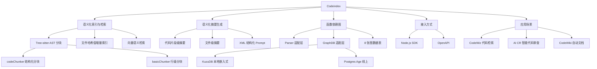

## 📋 文章信息

- **来源**: 微信公众号 - 大淘宝技术
- **作者**: 崇野（淘天集团-跨端技术团队）
- **发布时间**: 2026年4月20日
- **阅读链接**: https://mp.weixin.qq.com/s/F0dqp08Qas_aSui4eVplCA

---

## 🎯 核心摘要

Codeindex 是阿里淘天集团跨端技术团队开发的一款代码语义化索引、检索和函数依赖图生成工具，专为解决大模型处理大型代码仓库时的上下文理解难题而设计。其三大核心能力是：增量语义化索引与检索（基于 Tree-sitter AST 分块 + 大模型摘要生成）、函数依赖关系图（基于分层架构 + 图数据库 KuzuDB/Postgres）、以及文件级与代码片段级的语义化摘要生成。工具提供 SDK 和 OpenAPI 两种接入方式，已在 CodeWiz 代码检索、AI CR 智能代码审查、CodeWiki 自动文档生成三个场景落地。

## 📊 核心观点

### 1. 大模型理解大型代码仓库的核心痛点

**背景/现状**：
- 大型代码仓库无法整体塞给大模型，上下文窗口限制是硬瓶颈
- 不同仓库、不同分支的文件变化使得传统索引方案难以复用
- 函数的上下游依赖关系识别需要额外实现，增加了 AI 应用构建复杂度

**核心论述**：
- 代码量大 → 需要语义化索引 + 检索能力，精准召回相关代码片段
- 分支多 → 需要增量索引机制，通过文件哈希值复用已有索引
- 依赖复杂 → 需要函数依赖图，为大模型提供完整的调用链上下文

### 2. 基于双策略的代码分块与语义化摘要

**背景/现状**：
- 代码分块质量直接影响后续检索和摘要的效果
- 不同类型的文件需要不同的分块策略

**核心论述**：
- **codeChunker**：利用 Tree-sitter 解析器生成 AST，基于语法结构分块
  - Class 内代码超出 token 上限时，省略函数体保持 Class 整体结构完整
  - 对 Class 内部函数成员二次处理，单独进行 Chunk 拆分
- **basicChunker**：基于行的简单分块器，适用于纯文本和 Markdown 文件
- 摘要生成采用结构化 XML 标签注入：`<document path="...">` + `<code start_line="..." end_line="...">` 格式，让大模型同时理解文件级和片段级的语义
- 返回 JSON 结构包含文件级摘要和每个代码片段的独立摘要

### 3. 分层架构设计的函数依赖图

**背景/现状**：
- 函数依赖分析涉及多种编程语言，语法差异大
- 需要 SDK（本地）和 OpenAPI（线上）两种部署模式，存储介质不同

**核心论述**：
- **Parser 适配层**：所有语言的依赖图解析通过扩展该层实现，对外 API 一致，内部采用 tree-sitter 解析
- **GraphDB 适配层**：KuzuDB（嵌入式，本地 SDK）与 Postgres Age 插件（线上 OpenAPI）接口标准化，无缝切换
- 图数据结构包含 8 张表：3 个节点表（Files、Functions）+ 5 个关系表（Contains、FunctionCalls、FileCalls、Imports、Exports、FunctionContains）
- 支持查询函数的多级依赖关系，生成可视化的函数调用关系图

### 4. 三个落地应用场景

**背景/现状**：
- Codeindex 作为基础能力层，需要对接具体的应用场景才能发挥价值

**核心论述**：
- **CodeWiz 代码检索**：基于索引/检索能力为 Chat 过程中的大模型提供上下文
- **AI CR Agent**：获取函数依赖上下游信息，帮助大模型判断代码变更是否对已有功能产生影响
- **CodeWiki 自动文档**：基于 Qwen 大模型，利用代码片段和语义化摘要生成 Wiki 文档

## 🧠 概念图谱

## 🏗️ 技术架构

### 架构概述

Codeindex 采用分层解耦的架构设计，核心分为三部分：索引与检索引擎（基于 Tree-sitter AST 分块 + 向量化存储）、摘要生成模块（结构化 Prompt 驱动大模型生成多级摘要）、函数依赖图引擎（Parser 适配层 + GraphDB 适配层）。通过 SDK 和 OpenAPI 两种方式对外提供服务。

### 核心组件

| 组件 | 职责 | 关键技术 |
|------|------|----------|
| codeChunker | 结构化代码分块 | Tree-sitter AST 解析 |
| basicChunker | 纯文本分块 | 基于行的 token 上限拆分 |
| 语义化摘要引擎 | 生成多级代码摘要 | XML 结构化 Prompt + 大模型 |
| Parser 适配层 | 多语言函数依赖解析 | Tree-sitter + 统一 API |
| GraphDB 适配层 | 图数据存储 | KuzuDB（本地）/ Postgres Age（线上） |
| 增量索引模块 | 文件变更检测与增量更新 | 文件哈希值比对 |

## 🔑 关键洞察

### 1. XML 结构化标签：让大模型理解代码上下文的工程技巧

**分析**：
- Codeindex 将代码片段包装在 `<document path="..."><code start_line="..." end_line="...">` 的 XML 结构中发送给大模型
- 这种设计让大模型同时获得文件路径上下文和代码片段的精确位置信息
- 返回的 JSON 结构同样分层：文件级摘要 + 每个片段的独立摘要，形成双粒度的语义理解
- 启示：在设计大模型输入时，结构化的上下文注入（XML/JSON 标签）比纯文本拼接能显著提升模型的理解质量

### 2. 分层适配架构：多语言 + 多存储的统一抽象

**分析**：
- 函数依赖图面临两个维度的不确定性：编程语言多样性（Parser）和存储介质多样性（GraphDB）
- 采用两层独立的适配层设计，每层内部统一 API，外部解耦
- KuzuDB（嵌入式零依赖）用于本地 SDK，Postgres Age（成熟生态）用于线上 OpenAPI
- 启示：当系统面临多个正交的变化维度时，分层适配比一体化设计更易维护和扩展

### 3. 增量索引的实用价值

**分析**：
- 大型代码仓库的完整索引涉及大量文本模型和向量模型调用，耗时很长
- 通过文件哈希值存储实现增量索引：二次索引只处理变更文件，大幅降低时间和成本
- 提供索引进度查询能力，让用户能实时感知索引状态
- 启示：对于大模型驱动的工具，索引/预处理阶段的成本控制至关重要，增量策略是必选项

## 🚧 不足与局限

### 1. 文章深度不足
- 作为工具介绍文章，缺少关键的性能数据（索引速度、检索准确率、支持的最大仓库规模等）
- 对 Tree-sitter 支持的具体编程语言列表、向量模型的选型等细节未提及

### 2. 缺少与传统方案的对比
- 未与 GitHub Copilot 的代码索引方案、Sourcegraph 的代码搜索等业界方案进行对比
- 缺少对 RAG（检索增强生成）在代码领域应用的分析

### 3. 函数依赖图的局限性未讨论
- 动态语言（如 JavaScript）的函数依赖分析天然存在局限性，文章未提及如何处理动态调用、反射等情况
- 跨仓库依赖（npm 包、内部依赖库）的处理方式未说明

## 🔮 延伸思考

### 方向1：代码索引 + Agent 的深度结合
- Codeindex 目前作为被动工具被 Agent 调用，未来是否可以让 Agent 主动触发索引更新、管理索引生命周期？
- 函数依赖图是否可以与 Claude Code 的 Verification Agent 结合，实现更精准的变更影响分析？

### 方向2：语义化索引在多仓库场景的扩展
- 微服务架构下的跨仓库代码理解是一个更大的挑战
- 能否在函数依赖图的基础上构建服务间调用关系图，实现跨仓库的语义检索？

### 方向3：代码摘要的质量评估体系
- 如何量化"语义化摘要"的质量？是否需要引入人工标注的评估数据集？
- 不同编程语言的摘要质量是否一致？是否需要语言特定的摘要策略？

## 💡 实践启示

### 1. 构建代码 AI 应用时优先考虑索引层

**要点**：
- 不要直接将代码塞给大模型，先建立语义化索引层
- 增量索引是必选项，通过文件哈希值实现变更检测
- 分块策略应区分结构化代码（AST 分块）和纯文本（行级分块）

### 2. 用结构化标签增强大模型的代码理解

**要点**：
- 将代码片段包装在带路径、行号的 XML 标签中
- 请求大模型返回分层摘要（文件级 + 片段级）
- 结构化的输入和输出更容易被下游系统消费

### 3. 函数依赖分析是代码 AI 的关键基础设施

**要点**：
- 在 AI CR、变更影响分析等场景中，函数依赖图是不可或缺的上下文
- 采用分层适配架构应对多语言和多存储的复杂性
- 图数据库（KuzuDB/Postgres）比关系数据库更适合存储和查询依赖关系

## 📝 关键金句

> "想自己实现一个 Agent 助手来回答关于代码的一些问题，但是代码仓库过大，都塞给大模型也不太现实。"

> "嵌⼊式图数据库采⽤ KuzuDB，线上使⽤ Postgres Age 插件，⼆者对外暴露接⼝标准化，⽆缝切换存储介质。"

> "AI CR 是聚焦中后台场景、具有智能上下⽂分析能⼒的 Agent 应⽤，其内部依赖了 Codeindex 来获取函数依赖的上下游信息。"

## 🏷️ 标签

Codeindex、代码索引、代码检索、函数依赖图、Tree-sitter、KuzuDB、AI-Coding、语义化摘要、大淘宝技术

---

## 🔗 相关资源

- **相关工具**：Sourcegraph（代码搜索）、GitHub Copilot（AI 编程）、Tree-sitter（语法解析）
- **相关概念**：RAG（检索增强生成）、AST（抽象语法树）、GraphDB（图数据库）
