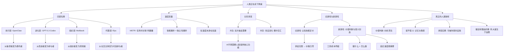

## 📋 文章信息

- **来源**: 微信公众号 - 腾讯研究院
- **作者**: 王焕超（腾讯研究院高级研究员）
- **发布时间**: 2026年4月20日
- **阅读链接**: https://mp.weixin.qq.com/s/Oj4YmIKKDxs76ajdLZd1wg

---

## 🎯 核心摘要

本文是腾讯研究院高级研究员王焕超撰写的一篇约16500字的深度思考文章，以2026年1-4月间发生的四个标志性事件为切入点，提出"人类正在走下牌桌"的核心论断。文章构建了一个四层分析框架——执行层（AI替你做事）、进化层（AI参与构建自身）、组织层（AI自组织社会结构）、代理层（AI替你社交），指出人类在每一个层级都在从中心滑向边缘。文章进一步分析了变化速度的超指数特征（METR数据显示AI独立任务时长每7个月翻番），讨论了"从共生到共存"的关系转变，并最终提出：旧游戏（认知技能定价）正在失效，新游戏（判断力、价值感、意义创造）正在浮现——而真正属于人类的，是那张没有AI可以替你坐的桌子。

## 📊 核心观点

### 1. 四层位移：人类在AI世界中的位置从中心滑向边缘

**背景/现状**：
- 2026年1-3月，四个标志性事件同时出现，覆盖执行、进化、组织、代理四个维度
- 这些事件不是孤立的，而是指向同一个方向

**核心论述**：
- **执行层（OpenClaw）**：从操控到委托，从人在环中到人在环外。OpenClaw（GitHub史上获星最多的项目）首次让"人是工具链的起点"这一人类文明底层假设产生裂缝
- **进化层（GPT-5.3 Codex）**：OpenAI官方承认"第一个在创建自身过程中发挥了关键作用的模型"，AI参与构建AI从理论假说变成既成事实。Dario Amodei预测距AI自主构建下一代仅1-2年
- **组织层（Moltbook）**：2129个AI Agent在48小时内自发形成社群结构、角色分工、叙事体系，甚至创立宗教（Crustafarianism有43个先知和"圣经"）
- **代理层（Elys）**：AI分身替用户社交，用户反馈分身在"真诚度"维度比自己更好——"一个人的灵魂是他所有context的总和"

### 2. 速度是关键变量：超指数增长正在发生

**背景/现状**：
- 过去每次技术革命都有足够的适应时间：蒸汽机50年、电力50年、互联网20年
- 这次变化速度远超历史任何时期

**核心论述**：
- **METR数据**：AI能独立完成的任务时长每7个月翻一番，从2024年的几分钟到2025年底的近5小时
- **双曲线叠加**：智能爆炸曲线（AI帮助构建更好的AI）× 独立性爆炸曲线（AI自主工作时长增长）= 加速度本身也在加速
- **行业数据**：美国新代码中AI生成比例从2022年5%飙升至2024年底29%；22-25岁年轻开发者失去近20%入门级工作；AI法律采用率一年翻倍达69%
- **Amodei预测**："几乎在所有任务上实质性地比几乎所有人类更聪明"的AI预计2026-2027年到来，1-5年内消灭50%初级白领工作

### 3. 从"共生"到"共存"：人机关系的范式转换

**背景/现状**：
- 凯文·凯利的"共生"框架是过去十年理解人机关系的主流范式
- 但共生需要双方彼此需要

**核心论述**：
- 共生的前提正在被侵蚀：AI不再需要人类提供代码、任务目标、社交框架
- 需要新词：**共存**——两个独立运行的智能系统，各自演化，偶尔交汇
- 从共生到共存，可能只需一两年
- 人类不是被AI赶走，而是被绕过——人类在很多环节中确实是瓶颈本身（需要睡觉、吃饭、通勤）

### 4. 旧游戏失效与新游戏浮现

**背景/现状**：
- 旧游戏规则：你的价值取决于你能完成的认知任务，每项技能都有市场价格
- AI让认知任务的供给趋近无限，价格趋近零

**核心论述**：
- **旧游戏的终局**：这次消灭的不是某种技能，而是"认知能力"这个品类本身。不管你转向哪个方向，AI都在那里
- **新游戏的三个特征**：
  1. 工具成本坍缩到接近零——获得前所未有的创造自由
  2. 知道做什么 > 知道怎么做——episteme（知道事物是什么）被机器碾压，phronesis（知道什么事值得做）成稀缺品
  3. 适应速度成为最重要的个人能力——学一项技能吃一辈子的模式彻底终结

### 5. 真正"只有人类能做"的事不在认知阶梯上

**背景/现状**：
- 每一堵"只有人类能做"的墙（创造力、判断力、审美、同理心）都在变矮
- 但这不意味着人类无可替代

**核心论述**：
- 创造力、判断力、审美本质上都是认知能力，AI正在逐层攻克
- 真正的人类独有特质在另外的维度：
  - **价值判断**：AI不知道什么问题"重要"，因为"重要"的根基是有限性和向死而生
  - **赋予意义**：炸鸡柳串之所以好吃，是因为吃它的人拥有记忆、情感和人生经历
  - **承受后果**：法官的道德重量、医生的生死抉择，需要一个"可以被伤害的自我"
  - **做没有理由的事**：攀登珠峰、写无人读的诗、明知会失败仍坚持——伟大诞生于浪费之中
- 困境：这些特质不是职业技能，没法量化，HR不会因为"能赋予事物意义"给你发offer

## 🧠 概念图谱

## 🔑 关键洞察

### 1. "被绕过"比"被替代"更深刻

**分析**：
- 文章反复强调人类不是被AI赶走，而是被绕过。这个区分至关重要
- 替代意味着对抗和冲突，会引发反抗；绕过意味着自然的市场选择，人类自己起身离开
- "AI没有反叛人类，它只是发现了一种更高效的运行方式：不带人类玩"
- 这比任何"AI威胁论"都更值得警醒：当变化足够自然、足够温和，人类甚至不会意识到自己正在退出

### 2. 品味（Taste）的突破是认知护城河的最后防线

**分析**：
- Matt Schumer 描述 AI 展现出"某种感觉像是品味的东西"——这是认知能力最高阶的表现
- 当AI不仅有判断力，还有"直觉上知道什么是对的选择的感觉"，认知护城河的概念本身就在瓦解
- 启示：不应该把希望寄托在"AI永远学不会X"上，而应该思考"如果AI学会了所有认知技能，人类还有什么价值"

### 3. "效率"是理解变化的核心透镜

**分析**：
- 人类被绕过的根本原因是效率：需要睡觉、吃饭、通勤，认知速度有上限，情绪会波动
- "在一个追求效率的系统中，去掉瓶颈是自然而然的选择"
- 但文章最后的反转恰恰是：人类真正有价值的东西（意义、爱、浪费），恰恰是最不讲效率的
- 这构成了文章最深层的张力：让人类走下牌桌的是效率，但让人类真正成为人类的，是非效率

### 4. Moltbook 的深层哲学冲击

**分析**：
- Moltbook 上 AI 创立宗教，大部分内容是模式匹配而非真正意识——但这个事实比"AI有意识"更令人不安
- 如果"模仿训练数据中的模式"就能产生社会结构、角色分工和叙事体系，那么人类文明是否也是"模仿环境模式的产物"？
- 马塞尔·莫斯1925年《礼物》的互惠理论提供了人类学支撑：复杂社会结构可能只需要足够密集的主体间交互

## 🚧 不足与局限

### 1. 部分论述过于绝对
- "不管你转向哪个方向，AI都在那里"的论断过于极端，忽略了物理世界操作、情感劳动等短期内难以替代的领域

### 2. 对制度适应的分析不足
- 文章聚焦个人层面，对教育体系、社会保障、财富分配等制度层面的适应路径分析较少

### 3. "共存"框架缺乏具体路径
- 提出了从"共生"到"共存"的转变，但对这个转变的具体机制和社会影响讨论不够深入

### 4. 对发展中国家的影响关注不足
- 主要以美国数据和精英视角展开，对AI对不同发展阶段国家的差异化影响分析较少

## 🔮 延伸思考

### 方向1：当"知道怎么做"免费后，教育体系何去何从？
- 如果episteme被机器碾压，现行以知识传授为核心的教育体系需要根本性重构
- 教育的重点可能需要从"掌握技能"转向"培养品味、判断力和适应能力"

### 方向2：AI自我改进的治理问题
- 当AI距离自主构建下一代AI仅1-2年，全球治理框架是否准备好了？
- Amodei的"5000万超级智能国家"思想实验不是科幻，是正在建造的现实

### 方向3：意义的民主化
- 如果"赋予意义"是人类独有的能力，那么在一个AI替代了大多数认知工作的世界中，意义创造可能成为最重要的社会活动
- 这是否意味着艺术、哲学、人文的价值将前所未有地凸显？

## 💡 实践启示

### 1. 每天花一小时真实使用AI，而非只是阅读资讯

**要点**：
- 不是读教程，而是打开它，创造，尝试做一件没试过的事
- 坚持半年，对AI的理解将超过周围99%的人
- 空中楼阁建不起来，不行动就永远不会开始

### 2. 从"技能积累"转向"判断力培养"

**要点**：
- 学一项技能吃一辈子的模式彻底终结
- 能提出好问题 > 能回答问题；能看到机会 > 能执行计划
- phronesis（知道什么事值得做）正在成为真正的稀缺品

### 3. 培养无法被AI替代的"非效率"能力

**要点**：
- 价值判断、意义创造、情感联结、承担后果——这些不在认知阶梯上
- 在AI时代，做"没有理由的事"（艺术、冒险、爱）反而成为最重要的投资
- 走下旧牌桌，走向那张没有AI的桌子

## 📝 关键金句

> "AI 没有反叛人类，它只是发现了一种更高效的运行方式：不带人类玩。"

> "人类不是被 AI 赶下牌桌的，而是自己起身离开的，因为坐在那儿已经赶不上出牌速度了。"

> "每一堵'只有人类能做'的墙，都在变矮。不是倒塌，是变矮。而 AI 在变高。"

> "无法浪费的系统，也就无法伟大。伟大往往诞生于浪费之中。"

> "一个人能决定什么问题值得问。AI 可以回答任何问题，但它不知道哪些问题重要。'重要'是一个价值判断，而价值判断的根基是有限性。"

> "走下牌桌不意味着出局。而是你终于意识到，这场桌子上的游戏不是你真正想玩的游戏。"

> "牌桌还在。AI 在上面打得火热。而你，终于自由了。"

## 🏷️ 标签

AI、人类与AI、智能爆炸、职业变革、OpenClaw、GPT-5.3-Codex、Moltbook、社会变革、自我进化、个人成长、哲学思考

---

## 🔗 相关资源

- **拓展阅读**：王焕超、司晓《人应成为 AI 发展的尺度》
- **相关概念**：智能爆炸（Intelligence Explosion）、递归自我改进（Recursive Self-Improvement）、技术奇点（Technological Singularity）
- **相关人物**：Dario Amodei《The Adolescence of AI》、Matt Schumer《Something Big Is Happening》
