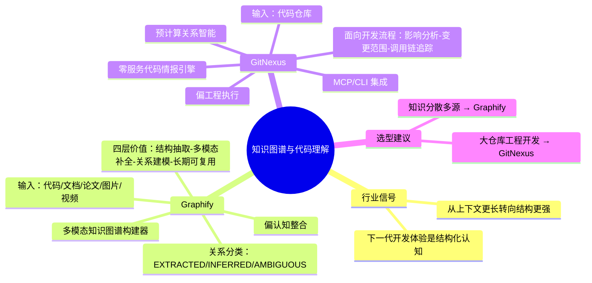

## 📋 文章信息

- **来源**：微信公众号 - 山行AI
- **作者**：山行AI
- **原文链接**：[Graphify 与 GitNexus](https://mp.weixin.qq.com/s/ZNk32JA63-MYpSRTBqlk1g)
- **收藏日期**：2026年4月20日

---

## 🎯 内容摘要

文章对比了 Graphify 和 GitNexus 两个知识图谱项目：Graphify 偏"认知整合"，将代码、文档、论文、图片、视频等多模态材料统一构建为知识图谱；GitNexus 偏"工程执行"，通过预计算关系智能（Precomputed Relational Intelligence）让 AI agent 在真实开发中获得更可靠的架构理解和影响分析。两者共同揭示了 AI 编程工具正在从"上下文更长"转向"结构更强"的趋势。

## 🗺️ 思维导图

---

## 📄 原文内容

# Graphify 与 GitNexus，正在用知识图谱把"代码理解"从搜索升级为结构化认知

**图谱化**

过去大家谈 AI 编程助手，常见的想象还是"更会补全""更会改代码""上下文更长"。但真正进入复杂项目之后，很快会遇到一个更现实的问题：**模型不是不会写，而是不够懂整个代码系统**。

它可能知道一个函数怎么改，却不知道这个改动会影响哪些调用链；它可能能读懂一段模块代码，却不知道这段代码在整套架构里到底承担什么角色。

今天想放在一起聊的两个项目，分别是 **Graphify** 和 **GitNexus**。它们都在解决同一个核心问题：**如何让 AI 不再只是"读文件"，而是"理解结构"**。但两者切入点、能力边界和适用场景并不相同，放在一起看，反而更容易看清这一波代码知识图谱工具的真正分层。

一句话先说结论：

- **Graphify** 更像一个"多模态知识图谱构建器"，重点是把代码、文档、论文、图片、视频等材料统一转成可查询的知识网络。
- **GitNexus** 更像一个"面向工程开发的零服务代码情报引擎"，重点是让 AI agent 在真实开发中获得更可靠的架构理解、影响分析与流程追踪能力。

## 一、为什么这类工具开始变得重要？

大多数 AI 编程工具到今天仍然有一个共同短板：
- 能看到的只是当前窗口附近的代码
- 擅长文本匹配，不擅长系统级关系理解
- 能回答"这段代码是什么"，却不一定回答得好"为什么这样设计"
- 能改局部，但经常漏掉上下游依赖与隐藏影响面

这就是为什么"知识图谱 + agent"这条路线越来越受关注。

因为对于一个真实仓库来说，最难的不是读到文件，而是建立这些关系：
- 哪些模块彼此耦合
- 哪些函数构成一条执行流程
- 哪些设计是显式写出来的，哪些只是隐含在线索里
- 哪个改动会带来多大 blast radius
- 哪些文档、注释、截图、会议记录能解释代码背后的"why"

Graphify 和 GitNexus，都是朝这个方向在走，但打法非常不一样。

## 二、Graphify 在做什么？

如果只用一句话概括，**Graphify 是把"代码仓库理解"扩展成"项目知识理解"**。

它的核心定位不是单纯分析代码，而是把一个项目周边的各种材料——包括：代码文件、Markdown 文档、PDF/论文、截图/图表/白板照片、视频与音频、多语言图片内容——统一抽取概念与关系，然后构建成一个知识图谱。

### 1）Graphify 的核心价值

Graphify 最有辨识度的一点，是它明显不把"代码"当成唯一输入。

它更像在回答这样一个问题：**如果一个项目的真实知识并不只存在于源码里，而是散落在代码、文档、论文、图示和录屏里，AI 要怎么把这些碎片重新组织起来？**

所以它的作用可以概括为四层：
1. **结构抽取**：通过 AST 等方式从代码中拿到类、函数、导入、调用关系、注释与理由线索。
2. **多模态补全**：把图片、视频、音频、PDF 等非代码材料也转成可理解的概念节点。
3. **关系建模**：把"这个概念来自哪里""和谁有关""是直接发现还是推断出来"标清楚。
4. **面向 agent 的长期可复用上下文**：生成 `graph.json`、`GRAPH_REPORT.md` 等产物，后续会话可以复用，而不是每次重新读一遍原始资料。

### 2）Graphify 的一个关键优势：多模态 + 可追溯

很多代码分析工具的问题在于，最后只给出一个"貌似很聪明的总结"，但你很难知道哪些是直接从材料里找到的，哪些是模型自己推断的。

Graphify 明确区分了三类关系：
- **EXTRACTED**：直接从源材料中抽取
- **INFERRED**：基于上下文的合理推断
- **AMBIGUOUS**：有歧义，需要复核

这个设计很重要。因为它让知识图谱不只是"更丰富"，还尽量做到**更诚实**。

### 3）Graphify 更适合哪些场景？

- 项目资料很分散，不止有源码
- 想把论文、设计稿、截图、会议录屏等一起纳入知识体系
- 想让 AI 在长期会话中复用结构化上下文
- 更关心"理解一个复杂知识域"，而不只是"改一段代码"

**Graphify 偏"认知整合"**，它把项目看成一个多源知识集合，而不是单一代码仓库。

## 三、GitNexus 在做什么？

如果说 Graphify 更偏"知识整合"，那么 **GitNexus 更偏"工程作战"**。

它的核心目标很直接：**把代码仓库索引成知识图谱，再通过 CLI、MCP 和智能工具能力，把这些结构化结果直接喂给 AI agent，让它在真实开发中更少漏信息、更少盲改代码。**

### 1）GitNexus 的核心价值：面向开发流程的代码情报

GitNexus 的目标不是给你一个漂亮的图，而是让 AI agent 在下面这些任务里更可靠：
- 影响分析（impact analysis）
- 变更范围评估（blast radius）
- 调用链和执行流程追踪
- 架构分区与模块关系理解
- 多仓库/单体仓库服务关系管理
- 结合 MCP 让 Cursor、Claude Code、Codex 等工具拿到结构化上下文

### 2）GitNexus 的一个关键特点：预计算关系 intelligence

GitNexus 特别强调"Precomputed Relational Intelligence"。不是把一堆原始图边塞给模型，再让模型自己想办法查；而是在索引阶段就提前完成一部分结构化工作，比如：聚类、调用路径追踪、影响面分析、执行流程组织、混合检索索引。

这样带来的结果是，agent 在调用工具时，不需要自己做多轮拼接推理，就能一次拿到更完整的答案。

### 3）GitNexus 更适合哪些场景？

- 让 Cursor/Claude Code/Codex 等 agent 在大仓库里少走弯路
- 做重构前的影响分析
- 追踪跨模块执行流程
- 在多仓库场景里管理服务间契约与关系
- 基于MCP，把本地索引长期接入自己的开发工具链

**GitNexus 偏"工程执行"**，它的核心是让 agent 在实际开发里更稳。

## 四、Graphify 与 GitNexus 的专业对比

- **定位**：知识图谱构建器 vs 工程代码情报引擎
- **输入范围**：Graphify 更广（多模态），GitNexus 更聚焦（代码仓库）
- **输出形式**：Graphify 偏解释与图谱资产，GitNexus 偏工具能力
- **方法论**：Graphify 重"发现更多知识"，GitNexus 重"减少工程失误"

## 五、行业信号

**AI 编程工具正在从"上下文更长"转向"结构更强"。**

过去大家主要拼模型参数、上下文窗口、补全质量。接下来越来越关键的，是是否有稳定的代码知识图谱、是否能把架构关系预先整理好、是否能把多源材料转成结构化上下文。

**下一代 AI 开发体验，不只是"会写代码"，而是"对系统有结构化认知"。**

- Graphify：https://github.com/safishamsi/graphify
- GitNexus：https://github.com/abhigyanpatwari/GitNexus
