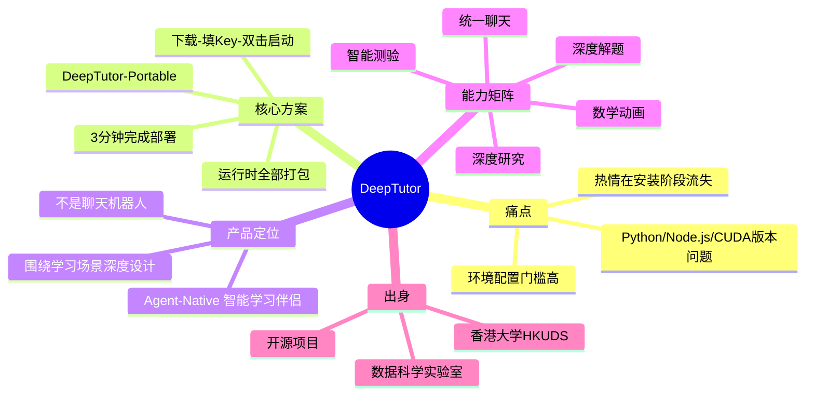

## 📋 文章信息

- **来源**: 知乎
- **问题**: 如何评价DeepTutor 这个开源学习助手？
- **阅读链接**: https://www.zhihu.com/question/1991806381913809056/answer/2029686713698513768

---

## 🎯 核心摘要

本回答介绍了香港大学数据科学实验室（HKUDS）开源的 DeepTutor——一个 Agent-Native 智能学习伴侣。其核心亮点是 DeepTutor-Portable 版本，将整个运行时（Python + Node.js + 所有依赖）打包进一个文件夹，用户只需下载、填 API Key、双击即可启动，3 分钟内完成部署，彻底解决了 AI 工具部署的环境配置门槛。DeepTutor 不是一个简单的聊天机器人，而是围绕"学习"场景深度设计的 AI 工作空间，提供统一聊天、深度解题、智能测验、深度研究、数学动画等能力。

## 📊 核心观点

### 1. 环境配置是 AI 工具普及的最大门槛

**背景/现状**：
- 过去一年各种 AI 学习助手层出不穷，但部署时往往卡在环境配置上
- 典型问题：Python 版本不匹配、npm install 报错、CUDA 版本不一致

**核心论述**：
- "环境配完，热情也磨得差不多了"——用户流失的最大环节不在使用阶段，而在安装阶段
- DeepTutor-Portable 的解决方案：整个运行时全部塞进一个文件夹，零配置启动
- 这是"降低用户门槛"思维的工程实践——把复杂度藏在产品内部

### 2. Agent-Native 设计理念

**背景/现状**：
- 大多数 AI 学习工具本质上是对话式 ChatBot 的包装
- 真正围绕学习场景深度设计的工具很少

**核心论述**：
- DeepTutor 定位为"Agent-Native 智能学习伴侣"，不是简单聊天机器人
- 围绕"学习"场景深度设计的 AI 工作空间
- 提供统一聊天、深度解题、智能测验、深度研究、数学动画等多维能力
- "Agent-Native" 意味着 AI 不是被动回答问题的工具，而是主动参与学习过程的智能体

### 3. 学术机构做开源产品的独特优势

**背景/现状**：
- 香港大学数据科学实验室（HKUDS）是知名的学术研究团队
- 学术机构做产品往往面临工程化和产品化的挑战

**核心论述**：
- HKUDS 在数据科学和 AI 领域有深厚的研究积累
- DeepTutor 体现了学术机构对"教育 + AI"交叉领域的理解
- Portable 版本的设计说明团队对真实用户痛点有深入洞察

## 🧠 概念图谱

## 🔑 关键洞察

### 1. "Portable" 模式是降低开源工具门槛的最佳实践

**分析**：
- 把整个运行时打包成免安装版本，看似简单，实则需要解决大量依赖冲突和跨平台兼容问题
- 这种模式类似于绿色版软件的思路，但在 AI 工具领域还很少见
- 启示：开源工具的竞争不只是功能竞争，也是"谁能更快让用户跑起来"的竞争

### 2. "Agent-Native" 是 AI 教育产品的新范式

**分析**：
- 传统的教育 AI 工具大多是 "ChatBot + Prompt Engineering" 的组合
- Agent-Native 意味着 AI 主动参与学习过程，具备解题、测验、研究等多维能力
- 这代表了 AI 教育工具从"问答辅助"向"智能伴学"的演进

### 3. 学术机构做产品的差异化路径

**分析**：
- HKUDS 选择从"学习场景"切入，体现了学术机构对教育领域的深刻理解
- 与商业公司追求通用性不同，学术机构更倾向于在垂直领域做深
- Portable 版本的设计说明团队关注的是"真实用户的使用体验"，而不只是技术先进性

## 🚧 不足与局限

### 1. 回答内容较短
- 知乎 API 仅返回约 1900 字符，可能存在内容截断，完整回答可能包含更多细节

### 2. 缺少深度技术分析
- 回答偏向产品介绍，未涉及 DeepTutor 的技术架构、模型选型、Agent 实现细节

### 3. 缺少与其他工具的对比
- 未与 KIMI、ChatGPT、NotebookLM 等同类 AI 学习工具进行功能或体验对比

## 💡 实践启示

### 1. 如果你想快速体验 AI 学习工具

**要点**：
- DeepTutor-Portable 提供了零门槛的入门方式
- 只需填入 API Key（支持多种 LLM 提供商）即可开始使用
- 适合不想折腾环境配置的学习者和教育工作者

### 2. "Agent-Native" 思维适用于更多领域

**要点**：
- 不只是学习工具，任何 AI 产品都可以从"被动响应"转向"主动参与"
- 围绕具体场景深度设计 > 通用 ChatBot 包装
- 降低使用门槛是开源产品获得用户的关键

## 📝 关键金句

> "环境配完，热情也磨得差不多了。"

> "不用装 Python，不用配 Node.js，不用折腾环境变量。下载、解压、双击——3 分钟后，私人 AI 学习助手就准备好了。"

## 🏷️ 标签

DeepTutor、AI学习助手、开源工具、HKUDS、Agent-Native、Portable、学习工具、教育AI

---

## 🔗 相关资源

- **相关工具**：NotebookLM、KIMI、ChatGPT、Claude
- **相关概念**：Agent-Native Design、Portable Application、AI in Education
