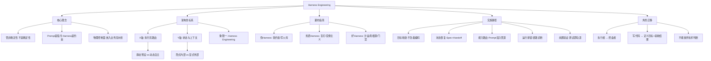

## 📋 文章信息

- **来源**: 微信公众号 - 阿里云开发者
- **作者**: 无岳
- **发布时间**: 2026年4月21日
- **阅读链接**: https://mp.weixin.qq.com/s/xLdQ9Z3n3SNwaQtmrM28FA

---

## 🎯 核心摘要

本文是关于 AI Agent Harness Engineering 的深度实践文章，基于作者在企业内部 Aegis 项目的真实经验。核心论点：大模型已够强，可以参与研发交付；但决定成败的不是 Prompt 写得多妙，而是 Harness 做得多扎实。文章提出了四象限架构坐标系（执行流路由 × 状态管理），系统区分了"伪 Harness"与"好 Harness"，分享了 Aegis 项目五阶段演进过程，并给出了可直接照抄的 8 阶段 SOP 和实操句式。最终结论：程序员的角色正从"亲手写代码的人"迁移为"定义目标、卡住边界、掌控节奏、验收结果"的控盘者，而 Harness 是让这种放权变得可控的前提。

## 📊 核心观点

### 1. Harness Engineering 管的是"非确定性"，不是"确定性"

**背景/现状**：
- 很多同行第一次听到 Harness，反应是"加测试、看日志、写规范，不就是软件工程良好实践吗？"
- 如果只是这样，没必要造新词

**核心论述**：
- 传统软件工程管的是**确定性**——`add(a, b)` 只要代码没 bug，结果永远确定
- Harness Engineering 管的是**非确定性**——大模型是概率引擎，同样的输入可能返回不同结果，甚至"幻觉"暴走
- Harness 不是泛泛的"好习惯"，它是为了把一台"聪明但没有工程常识的非确定性引擎"嵌进"确定的业务流水线"而设计的**物理控制面**
- 关键区分：**Prompt 是指令，Harness 是约束**——前者在模型脑子里，后者在模型外面

### 2. 四象限架构坐标系：Harness 的边界在哪里

**背景/现状**：
- AI Agent 架构模式多种多样，缺少统一的分类框架

**核心论述**：
- **X 轴（执行流路由）**：静态预设 vs. 动态自主——下一步干什么，是代码写死的还是大模型决定的
- **Y 轴（状态与上下文）**：隐式内部 vs. 显式外部——系统的记忆是塞在 Prompt 窗口里还是由外部数据库/状态机接管
- 四个象限：
  - **象限三（无状态链）**：单次 API 调用，LLM 当纯函数。适合一次性翻译、海量分类
  - **象限二（提示词驱动）**：AutoGPT、ReAct。模型自主性高，中间步骤全堆在 Prompt。适合探索性问题、短链路
  - **象限四（传统管道）**：LangChain 顺序链。外部状态管理严谨，模型只是被动处理节点。适合流程固定场景
  - **象限一（Harness Engineering）**：模型提供意图，外部 Harness 负责状态隔离与沙盒校验。开发成本高但系统下限稳

### 3. 识别"伪 Harness"与"劣质 Harness"

**背景/现状**：
- 很多团队陷入混乱，是因为没分清"是不是 Harness（边界问题）"和"是不是好做法（质量问题）"

**核心论述**：
- **伪 Harness（根本不是 Harness）**：
  - "软约束"陷阱：Prompt 里写 5000 字 DO NOT——这只是"口头嘱咐"，长链路中容易被遗忘
  - "军火库"陷阱：给 Agent 塞 20 个 API 让它自己挑——没有边界约束，危险调用迟早发生
- **劣质 Harness（是 Harness 但质量差）**：
  - "盲打"陷阱：外层套个执行器，报错就把 Error 塞回模型继续试——裸奔的 Loop 容易让模型删掉核心架构
  - "官僚主义"陷阱：强制模型先输出万字设计文档才能写代码——浪费 Token，一变就成垃圾
- **好 Harness 的三个特征**：
  - 前置验证（Evaluator 沙盒）：单测失败时抓日志给 Agent，修 Bug 前强制复述核心目标
  - 最小真相源（Spec is Truth）：维护轻量状态机文档，任务跨天能无损恢复
  - 物理门禁（Checkpoint Before Execute）：模型破坏现有环境前必须拿到授权

### 4. 程序员角色迁移：从执行者到控盘者

**背景/现状**：
- AI Agent 能力的提升让程序员面临身份焦虑

**核心论述**：
- 工程师核心价值正在从"亲手写出每一行代码"迁移到"定义目标、卡住边界、掌控节奏、验收结果"
- **不是**"以后程序员只要像老板一样甩活就行"——你可以不再亲手写大量代码，但**不能放弃技术判断**
- 真正强的 Harness 使用者，是知道什么时候不必盯细节、什么时候必须下潜检查的人
- 四个必须亲自接管的时刻：架构主线可能被污染时、阶段目标开始漂移时、日志暴露系统性异常时、模型把"阶段完成"误报成"全局完成"时

### 5. Aegis 项目五阶段演进：从裸奔到 Harness

**背景/现状**：
- 真实项目暴露了"给一段神仙 Prompt，Agent 就能长出整个系统"的幻想

**核心论述**：
- **起步阶段**：先收敛目标，不急着编码——给 Agent 的第一条指令是"读架构文档，复述需求并讨论"
- **连续开发阶段**：用 Spec 和 Handoff 对抗上下文腐烂——每轮开场先读 Handoff 恢复状态
- **执行阶段**：将 Prompt 溶解进 Capability 框架——不再用几千字 Prompt 穷举分支，而是拆成独立 Python 管道
- **运行阶段**：跨越"能聊"与"能跑"——504/403 不是调 Prompt 语气，而是引导 Agent 做链路排错
- **交付阶段**：让测试与回归前置化——测试不再是收尾动作，而是工作轨道本身

### 6. sdd-riper-one-light：契约式设计的实施骨架

**背景/现状**：
- SDD（Spec-Driven Development）是人机协作的方法论，Harness 是承载它的底层架构

**核心论述**：
- sdd-riper-one-light 的核心是运用**契约式设计（Design by Contract）**，把非确定性引擎夹在确定性管道里
- 四个控制点对应三大契约：
  - **前置断言（Pre-conditions）**：强制 Checkpoint 与 Restate First，执行高危代码前必须复述核心目标
  - **后置断言（Post-conditions）**：闭环回写（Reverse Sync），完成动作后必须通过测试与日志外部验证，不接受主观宣称成功
  - **不变式（Invariants）**：维护最小真相源（Spec is Truth），无论 Context 怎么滚动，外部 Spec 不容篡改

## 🧠 概念图谱

## 🏗️ 技术架构

### 架构概述

文章提出的四象限架构矩阵是理解 AI Agent 架构选择的核心框架。Harness Engineering 位于象限一（动态自主执行 + 显式外部状态），其本质是在模型外部构建物理控制面，通过 Spec 真相源、Checkpoint 门禁、Capability 路由、Evaluator 验证四个控制点，将非确定性的 LLM 嵌入确定性的工程流水线。

### 核心控制点

| 控制点 | 作用 | 对应契约 |
|--------|------|----------|
| Spec is Truth | 最小真相源，跨会话状态恢复 | 不变式（Invariants） |
| Checkpoint Before Execute | 执行前强制复述目标与风险 | 前置断言（Pre-conditions） |
| Capability 路由 | Prompt 溶入确定性管道，避免概率猜测 | — |
| Evaluator 沙盒 | 外部证据验证，拒绝主观宣称成功 | 后置断言（Post-conditions） |
| Handoff 交接 | 每轮暂停前回写，保证可恢复 | 不变式（Invariants） |

## 🔑 关键洞察

### 1. "做偏了再纠回来"比"一开始就不偏"更常见

**分析**：
- 文章最有价值的教学部分不是模型做对了什么，而是偏了怎么拽回来
- 模型不是一开始就错，而是做着做着慢慢偏——所以控制动作必须是持续性的，不是一次性指令
- 四个偏航信号：绕过阶段目标、跳过中间产物、用主观语气替代客观证据、混淆阶段完成和全局完成
- 启示：Harness 是**动态控盘能力**，不是静态预设流程——证据变了就要重定义本轮最小目标

### 2. "三层目标"是防止偏航的核心心智模型

**分析**：
- 总核心目标（指北）、阶段核心目标（收束）、本轮动作目标（防一口气做完）
- 最危险的不是模型不会做，而是它会绕过当前阶段目标直接冲向自己理解的"总目标"
- "阶段完成不等于全局完成"——这个区分看似简单，但在长链路中极其容易被忽视
- 启示：人类控盘者的核心工作就是持续盯着三层目标有没有被混用

### 3. 将 Prompt 溶解进 Capability 管道是架构层面的关键抉择

**分析**：
- 传统做法：几千字 Prompt 穷举所有分支，让模型靠概率"猜"
- Harness 做法：把分支拆成独立的 Python 管道，Agent 只做一次轻量路由决策
- 一个 Capability = 一小段专属 Prompt + 一段确定的 Python 脚本 + 一个 Validator
- 启示：降低模型决策的"自由度"反而提高系统稳定性——这不是限制，是工程智慧

### 4. 行业共识正在形成：顶级团队都走向 Harness

**分析**：
- OpenAI Engineering：放弃巨型 Prompt，把代码仓库作为唯一记录系统
- Anthropic Labs：引入强制 Context Resets + 独立 Evaluator Agent
- 字节 deer-flow：自称"Super Agent Harness"，模型"大脑"与执行环境物理隔离
- 三家顶级团队独立收敛到同一个方向——这不是巧合，而是工程规律的必然
- 启示：Harness Engineering 正在成为 AI Agent 走向生产环境的事实标准

## 🚧 不足与局限

### 1. 案例规模有限
- Aegis 是内部项目，规模和复杂度可能无法代表所有企业场景
- 缺少多团队协作、多人 Agent 并发等更复杂场景的讨论

### 2. 成本效益分析缺失
- 提到 Harness "开发成本相对高"，但未量化具体的时间和人力投入
- 未讨论在什么规模的项目上投入 Harness 建设是划算的

### 3. 对模型能力演进的假设偏静态
- 假设模型始终"缺乏工程常识"，但模型能力在快速提升
- 未来模型如果内生具备了更多工程意识，部分 Harness 可能变得冗余

## 🔮 延伸思考

### 方向1：Harness 的自动化程度能走多远？
- 目前 Harness 的很多控制点（Checkpoint 审批、目标纠偏）仍需要人类介入
- 未来是否可以用"监督者 Agent"来自动化部分控制面？这会引入新的信任链问题

### 方向2：当模型足够聪明时，Harness 会简化还是更复杂？
- 模型变强可能减少低级错误，但也可能让"高层偏航"更难察觉
- Harness 可能从"防模型犯错"演变为"防模型做聪明但错误的事"

### 方向3：团队级 Harness 与个人级 Harness 的差异
- 个人开发者需要轻量 SOP，企业团队需要更严格的治理框架
- 两者的核心原则一致，但控制粒度和自动化程度可能差异很大

## 💡 实践启示

### 1. 直接可用的 8 阶段 SOP

**要点**：
- 目标收敛 → 状态恢复 → 上下文装配 → 任务分块 → 链路设计 → 执行前校准 → 外部验证 → 回写交接
- 每一轮都要先拿到中间产物，再决定是否放行
- 核心原则：每一个阶段只给模型一个带边界的输入

### 2. 可直接照抄的控盘句式

**要点**：
- 起手："先读架构文档，不要实现。先复述你理解的目标。"
- 压 Spec："把这轮压成最小 spec，写清目标、范围、约束、暂不处理项。"
- Checkpoint："先别改代码。做一次 checkpoint：总结理解、目标、动作、风险、验证方式。"
- 纠偏："先停。你先复述这轮阶段性核心目标到底是什么，不要谈总目标。"
- 验证："不要主观判断。去看测试、日志、接口回包，基于事实回答。"
- 验收："不要把最小收敛和全局完成混为一谈。明确：完成了什么，没完成什么，下一轮目标是什么。"

### 3. 三层目标心智模型

**要点**：
- 总核心目标：整个项目到底要完成什么
- 阶段核心目标：当前几轮对话只收敛哪一个主问题
- 本轮动作目标：这一轮只做 1-3 个动作
- 持续盯着三层有没有被混用

## 📝 关键金句

> "传统软件工程管的是确定性，Harness Engineering 管的是非确定性。"

> "Prompt 是指令，Harness 是约束——前者在模型脑子里，后者在模型外面。"

> "Harness 的价值不是'让 Agent 更自由'，而是让人类始终握着方向盘，把非确定性执行压缩成可验证、可回退、可交接的小闭环。"

> "你可以不再亲手写大量代码，但你不能放弃技术判断。"

> "它不是一开始就错，而是做着做着慢慢偏。所以你的控制动作必须是持续性的，而不是起手一次性下指令就结束。"

> "阶段完成不等于全局完成。"

## 🏷️ 标签

Harness-Engineering、AI-Agent、非确定性工程、控制面、Spec-Driven、契约式设计、企业AI、角色迁移、OpenAI、Anthropic、deer-flow

---

## 🔗 相关资源

- **延伸阅读**：
  - [OpenAI Engineering: Harness Engineering with Codex](https://openai.com/zh-Hans-CN/index/harness-engineering/)
  - [Anthropic Labs: Harness design for long-running apps](https://www.anthropic.com/engineering/harness-design-long-running-apps)
  - [bytedance/deer-flow: Super Agent Harness](https://github.com/bytedance/deer-flow)
  - [sdd-riper-one-light Skill](https://github.com/huisezhiyin/sdd-riper/tree/main/skills/sdd-riper-one-light)
- **关联精读**：深度解析 Claude Code 在 Prompt/Context/Harness 的设计与实践（同系列文章）
