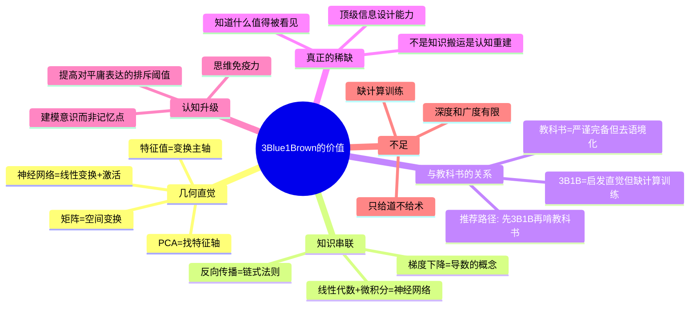

## 📋 文章信息

- **来源**: 知乎
- **作者**: CodeCrafter（一个朴实的技术人）
- **原文链接**: [看 b 站 UP 主 @3Blue1Brown 的视频有哪些收获？](https://www.zhihu.com/question/383924063/answer/1953754614613665167)
- **收藏日期**: 2026年4月21日

---

## 🎯 内容摘要

作者是一位互联网大厂十年经验的算法工程师，从面试官视角出发，阐述 3Blue1Brown 的核心价值——不是教人做题或背公式，而是帮人建立"几何直觉"（Geometric Intuition）和"建模意识"。文章深入对比了教科书与 3B1B 的教学哲学差异，指出 3B1B 的真正稀缺之处在于"认知重建"而非"知识搬运"，并提出其最大的副作用是"会开始对平庸表达产生无法逆转的排斥"——这不是挑剔，是认知升级。

## 🗺️ 思维导图

---

## 📄 原文内容

**问题**: 看 b 站 UP 主 @3Blue1Brown 的视频有哪些收获？

**作者**: CodeCrafter

### 几何直觉

泻药。

在互联网大厂混了十来年，从算法工程师干到带个小团队，面过的应届生、社招的加起来三位数是有了。聊技术的时候，我特喜欢冷不丁问一句，"讲讲你对矩阵乘法的理解？"

大部分人给我的答案基本就是背书：一个 m x n 的矩阵和一个 n x p 的矩阵相乘，得到一个 m x p 的矩阵……没错，完全正确，考试能拿满分。但这也是我最不想要的答案。

我真正想听的是什么？是矩阵代表着一种**空间变换**，矩阵乘法就是**变换的叠加**。

能答出这一层的人，寥寥无几。而这些人里，十有八九都提到了一个名字：3Blue1Brown。

### 最大的收获：建立几何直觉

比如特征值和特征向量。教科书上告诉你满足 `Av = λv` 的 λ 就是特征值，v 就是特征向量。然后算行列式 `|A - λI| = 0`，一通计算猛如虎。

3B1B 是怎么讲的？一个矩阵 A 代表一个空间变换。这个空间里大部分向量经过 A 变换后方向都变了。但就是有那么几个特殊的向量，经过 A 变换后方向没变，仅仅是长度被拉伸或压缩了。这些"不动"的向量就是特征向量，被拉伸或压缩的比例就是特征值。

有了这个直觉，PageRank 算法的核心就是在找状态转移矩阵的主要特征向量。PCA 主成分分析就是在找数据分布最主要的"特征轴"。

**没有这个几何直觉，你学这些东西就是纯背公式，纯调包。有了这个直觉，你就是从根儿上理解了它。这是工程师和"调包侠"的根本区别。**

### 其次：把孤立知识点串联成体系

微积分、线性代数、概率论，都是一门一门分开的。但实际上这些学科是深度交织的。

- 神经网络的每一层，无非就是一次线性变换（乘以权重矩阵 W）加上一次非线性激活（比如 ReLU）
- 学习过程，就是调整权重矩阵 W，用梯度下降——梯度是函数变化最快的方向，这就是微积分里导数的概念
- 反向传播，就是把输出层的误差通过链式法则一层层往前传递

**线性代数 + 微积分 = 神经网络的核心。**

### 学习路径：先 3B1B 再啃教科书

教科书的目标是严谨和完备，但代价是"去语境化"，对初学者极不友好。3B1B 的目标是启发和直觉，会忽略复杂证明和边缘情况。

推荐路径：遇到新概念，先看 3B1B 建立可视化认知框架，再回头啃教科书补细节。**学习过程从"死记硬背"变成"按图索骥"。**

### 3B1B 的不足

最大的问题是只给你"道"不给你"术"——看完视频感觉什么都懂了，但真给一道题还是不会算。几乎没有计算训练。在深度和广度上有限，很多更深入的概念没涉及。

### 认知重建：真正稀缺的能力

**3B1B 之所以难被复制，因为他的视频不是知识搬运，而是认知重建。**

重建意味着他不是站在内容后面做翻译，而是站在问题前面重新开路。他不是告诉观众这个结论已经存在请接受它，他是在帮观众亲眼看到为什么这个结论会长出来。

很多人只注意到他的动画做得好。这当然对，但太浅了。**动画只是表层。真正稀缺的是，他知道什么值得被看见。**

好的讲解一定包含取舍。哪些细节暂时压住，哪些结构优先浮现，哪些核心关系必须反复强化。这种取舍能力本质上是一种很高阶的认知组织能力。它更接近一种**顶级的信息设计能力**。

### 最大的副作用：认知阈值被抬高

看完之后，会开始对平庸表达产生无法逆转的排斥。

**这不是挑剔，是阈值被抬高了。** 讲对只是底线，讲清楚也只是及格，真正优秀的表达应该让人看到结构、感受到必要性、理解到核心张力。

**中文互联网最普遍的问题不是内容少，是二手理解太多。** 很多知识博主看起来讲得头头是道，其实只是把别人的结论换一种说法再讲一遍。真正难的那一步——从理解到再创造——很多人根本没做。

### 思维免疫力

**今天这个环境里，最廉价的东西就是立场，最昂贵的东西是推理过程。**

AI 出来以后，知识的获取门槛还会继续下降，答案会越来越廉价。区分人与人能力层级的，已经不再是能不能搜到信息，而是能不能判断什么是核心结构，能不能把碎片组装成体系。

**3Blue1B 提供的正是这种能力的样板。** 他没有教人偷懒，倒是教人省掉大量无意义的弯路。他没有降低知识的门槛，反而抬高了人对理解的要求。看完之后最大的变化，常常不是会做更多题，而是**不再甘心于只会做题**。

**真正的高级学习不是接收结论，而是缩短自己与结论之间的距离。** 真正的理解一定伴随结构，真正的结构会改变一个人看世界的方式。数学只是入口，不是终点。
