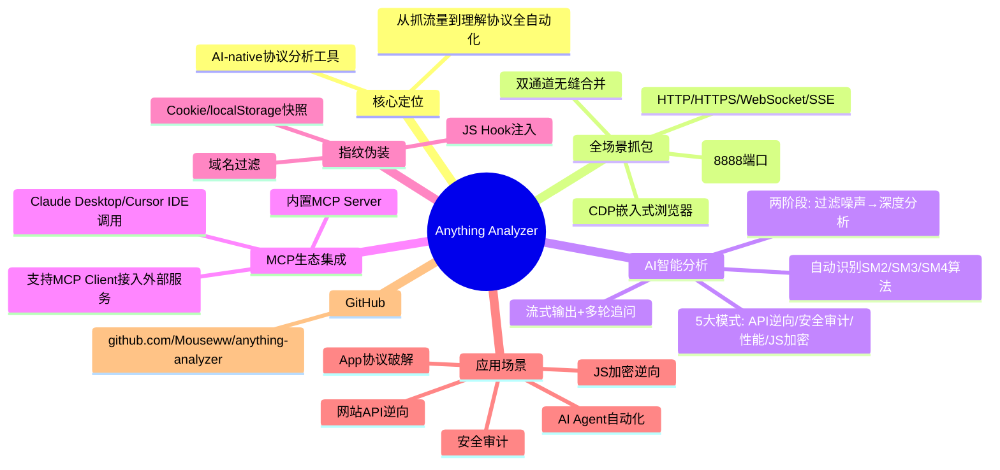

## 📋 文章信息

- **来源**: 知乎专栏 - 互联网支付杂思
- **作者**: 梁川（互联网金融话题优秀答主）
- **原文链接**: [Anything Analyzer 全能协议分析工具](https://zhuanlan.zhihu.com/p/2029841028778141370)
- **收藏日期**: 2026年4月23日

---

## 🎯 内容摘要

Anything Analyzer 是 GitHub 上热门的 AI 加持全能协议分析工具，集成了浏览器抓包（CDP 嵌入式浏览器）、MITM 代理（默认 8888 端口）、指纹伪装、AI 智能分析和 MCP Server 无缝对接，实现了从"抓到流量"到"理解协议"的全流程自动化。支持 HTTP/HTTPS/WebSocket/SSE 全协议，提供 5 大 AI 分析模式（自动识别、API 逆向、安全审计、性能分析、JS 加密逆向），可被 Claude Desktop、Cursor IDE 等 AI Agent 通过 MCP 协议调用。

## 🗺️ 思维导图

---

## 📄 原文内容

# Anything Analyzer，全能协议分析工具，一站式完成浏览器抓包 + MITM 代理 + 指纹伪装 + AI 分析

**作者**: 梁川

### 传统抓包流程的痛点

在逆向工程、API调试、安全审计和协议分析领域，传统流程极为繁琐：

- 打开 Charles / Fiddler / mitmproxy / Wireshark 抓包
- 浏览器安装证书、配代理、处理 HSTS 和证书透明度告警
- 目标站点 JS 混淆、请求带签名 / token / AES-CBC 加密，得手动下断点
- 调出 DevTools Sources，搜 CryptoJS / encrypt / sign，打条件断点
- 把关键函数扣出来，本地跑 Node 或 Python 复现
- 写 README / 脚本 / 协议文档

**这套标准流程里，严重依赖使用人的行业经验和各种奇淫技巧。**

随着 LLM 和 AI Agent 技术的普及，传统的抓包工具、逆向工程正在经历一场"降维打击"式的进化。

### Anything Analyzer 的三大核心能力

**1. 全场景抓包（Anything，不止浏览器）**

- 内置 Chrome DevTools Protocol（CDP）嵌入式浏览器，支持多标签、弹窗自动捕获、标签页防护
- MITM 代理（默认 8888 端口），一键设置为系统代理，支持 Wi-Fi、终端、脚本、桌面 App、手机 App 甚至 IoT 设备
- 所有流量统一汇入同一个 Session，双通道（CDP + 代理）无缝合并
- 额外福利：指纹伪装、JS Hook 注入（拦截 fetch/XHR/crypto 等）、Cookie/localStorage 实时快照、域名过滤

**2. AI 智能分析（不只是抓包，是自动理解协议）**

- 两阶段分析：Phase 1 智能过滤噪声（广告、静态资源），Phase 2 深度分析
- 5 大分析模式：自动识别、API 逆向、安全审计、性能分析、JS 加密逆向
- 自动提取加密代码、识别 SM2/SM3/SM4 等算法，支持流式输出 + 多轮追问
- 支持 OpenAI/Anthropic/任意兼容 LLM API，自定义 Prompt 模板

**3. MCP 生态集成（AI Agent/IDE 的原生抓包工具）**

- 内置 MCP Server，将抓包和分析能力直接暴露为工具，可被 Claude Desktop、Cursor IDE 等 AI Agent 无缝调用
- 同时支持 MCP Client 接入外部服务器，扩展能力无限

### 应用场景

- **网站 API 逆向**：打开嵌入式浏览器登录目标站点，抓包后一键 AI 分析，自动生成 API 文档 + Python 复现代码
- **App 协议破解**：手机 Wi-Fi 代理指向电脑，AI 帮你找出隐藏接口、签名逻辑、加密参数
- **JS 加密逆向**：Hook 注入后，AI 自动提取并解释 CryptoJS/SM 系列调用
- **安全审计**：批量检测敏感数据泄露、弱加密、异常请求
- **AI Agent 自动化**：通过 MCP 让 Claude 直接"指挥"抓包分析

**项目地址**: https://github.com/Mouseww/anything-analyzer
