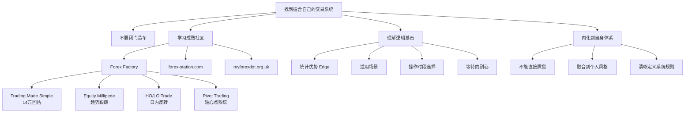

## 📋 文章信息

- **来源**: 知乎 - 知乎问答
- **作者**: Chen
- **发布时间**: 2024年9月21日
- **阅读链接**: https://www.zhihu.com/question/563058804/answer/3631821989

---

## 🎯 核心摘要

这篇回答为没有高手带的新手交易者推荐了一系列高质量的海外交易学习资源，核心主张是：不要闭门造车自己发明交易系统，去成熟的交易社区学习已被时间验证的策略。作者推荐了 Forex Factory 论坛的几个经典帖子，包括 Trading Made Simple（14 万回帖）、Equity Millipede（趋势跟踪）、Highest Open / Lowest Open Trade（日内反转）等，并强调理解系统背后的逻辑基石和适用场景比照搬规则重要得多。此外还推荐了 forex-station.com 技术指标社区和 myforexdot.org.uk 的交易系统写作方法。

## 📊 核心观点

### 1. 不要闭门造车，去成熟的交易社区学习

**背景/现状**：
- 新手交易者缺乏高手指导，容易陷入"灵光一现"的自创策略幻觉
- 大多数自以为创新的策略早已被别人尝试过

**核心论述**：
- 墙裂推荐 Forex Factory 交易系统板块（forexfactory.com/forum/71-trading-systems）
- 该论坛有真交易大牛出没，每个系统都有人做回测、模拟盘、甚至实盘运行并报告结果
- 能找到各种千奇百怪的交易思路，搜索用得好总能找到适合自己性格的系统
- 重要提醒：直接照搬模仿就是死，要揣摩作者的思路和逻辑，融到自己体系里

### 2. 经典交易系统推荐

**背景/现状**：
- Forex Factory 论坛积累了大量经长时间验证的交易系统

**核心论述**：
- **Trading Made Simple**：论坛第一神贴，2011 年发帖，14 万+ 回帖，日间波段系统，用指标辅助加价格行为（Price Action），作者已去世但帖子仍在活跃维护
- **Building an Equity Millipede**：趋势交易必看，入场和浮盈加仓思想震撼，作者也去世了
- **Highest Open / Lowest Open Trade**：日内/日间小波段反转系统，几乎不用指标，核心金句——"The most difficult thing about this method is you have to WAIT"
- **Pivot Trading**：用轴心点做支撑阻力的系统，4 万+ 回帖
- **PVSRA Scalping**：剥头皮系统，历经 8 年考验

### 3. 理解系统逻辑比照搬规则重要 10086 倍

**背景/现状**：
- 很多人看了系统规则后编程回测，结果不理想就觉得是垃圾
- 他们只看到了系统的表象，不理解构建系统的历程

**核心论述**：
- 作者以 Highest Open / Lowest Open 为例：收盘价基于统计优势大多在当天最高 H1 开盘价之下、最低 H1 开盘价之上——这是系统的 edge
- 作者只在纽约时段操作，因为 8:30 新闻带来波动，且伦敦尾声时段最高最低价已形成
- "高手知道什么时候做什么时候等，如果他还讲出个中缘由，这不让你泪流满面？"
- 每个系统策略在合适行情下都能赚钱，关键是知道在什么情况下最有效

### 4. 学会用理工科论文方式定义交易系统

**背景/现状**：
- 很多交易者无法清晰描述自己的交易系统
- "回调站稳后再向上突破入场"、"均线缠绕时观望"这类模糊表述没有可执行性

**核心论述**：
- 推荐 myforexdot.org.uk（需通过 Web Archive 访问）
- 该作者的每个系统都有：底层逻辑、出入场规则、测试结果、总结、改进建议
- "优美得就像一篇短小精悍的理工科论文，有观点论据和数据支撑"
- 拿给另一个人去操作也不会有任何歧义
- 关于"顺势而为"，作者 David 提出直接比较当前收盘价和 N 天前收盘价是最有效的方法，并用量化方法支撑观点

### 5. 额外资源：forex-station.com

**背景/现状**：
- 由早年 MQL 论坛老炮建立，主打进阶技术分析

**核心论述**：
- 几乎能找到所有千奇百怪的技术指标，很多有源代码
- 未注册游客也能下载
- 镇站之宝 Xard 简单趋势跟踪系统，2017 年发帖持续活跃

## 🧠 概念图谱

## 🔑 关键洞察

### 1. 交易系统的 edge 本质是统计优势

**分析**：
- Highest Open / Lowest Open 系统的 edge 来源于一个简单统计事实：收盘价通常在当天最高和最低 H1 开盘价之间
- 这说明很多成功的交易系统并不复杂，而是建立在可验证的统计规律之上
- 但理解 edge 和在实际交易中执行 edge 是两回事，后者需要极大的耐心

### 2. "等待"是所有成功交易系统的共同基因

**分析**：
- 不管是趋势跟踪、反转交易还是剥头皮，作者推荐的每个系统都强调"耐心等待适合自己系统的那种行情出现，然后疯狂干"
- 这与 Paul Tudor Jones 等顶级交易员的观点一致：赚钱的关键不是交易频率，而是选择性
- "The most difficult thing about this method is you have to WAIT"——作者建议字面意义上把手放在腿上避免过早入场

### 3. 交易系统文档化的价值被严重低估

**分析**：
- myforexdot.org.uk 作者的交易系统文档风格（底层逻辑→出入场规则→测试结果→改进建议）值得每个交易者学习
- 能用一两页纸清晰描述自己的系统，说明你真的理解了它
- 模糊的系统定义（如"回调站稳"）会导致执行不一致，而不一致是交易失败的主要根源

## 🚧 不足与局限

### 1. 资源门槛

- Forex Factory 主要是英文社区，对英语不好的交易者是障碍
- myforexdot.org.uk 已需要通过 Web Archive 访问，原始站点已失效
- 文中推荐的帖子年代较早（2009-2017），部分链接可能已失效

### 2. 缺乏资金管理细节

- 回答侧重策略学习，但对资金管理、仓位控制着墨较少
- 实际交易中，资金管理往往是决定成败的关键因素

### 3. 样本偏差

- 论坛上能长期分享盈利的交易者天然存在幸存者偏差
- 跟帖者报告的结果可能存在选择性展示

## 🔮 延伸思考

### 方向1：中国交易者的学习路径

- 如何将海外社区的经验适配到 A 股/期货市场？
- A 股的 T+1、涨跌停板等制度与外汇市场差异巨大，策略不可直接移植
- 但"等待行情 + 理解逻辑 + 清晰定义系统"的思维方式是普适的

### 方向2：社区化学习的未来

- 随着社交媒体和 AI 的发展，交易学习社区的形式正在变化
- 中文交易社区能否产生类似 Forex Factory 的高质量内容生态？
- AI 能否辅助交易者更高效地测试和验证策略？

## 💡 实践启示

### 1. 从"发明者"转变为"学习者"

**要点**：
- 停止试图发明自己的交易系统，先去了解已经被验证的系统
- 列出 3-5 个经典系统，逐一深入研究其逻辑基石
- 不要只看规则，要理解"为什么"

### 2. 建立交易系统文档

**要点**：
- 用一页纸清晰定义你的交易系统：底层逻辑、入场条件、出场条件、仓位管理
- 如果无法用明确的语言写出来，说明你还不够理解它
- 参考理工科论文的写作方式，加入测试数据支撑

### 3. 刻意练习"等待"

**要点**：
- 交易日志中记录每天"放弃的交易"和"入场的交易"
- 回顾放弃的交易：行情发展是否验证了你的等待是对的？
- 把"等待"当作交易系统中最重要的一部分来训练

## 📝 关键金句

> "直接照搬模仿就是死，把学习技术指标的那些精力好好去揣摩作者的思路和逻辑。交易不用发明任何东西，也不用解任何难题，直接看成功者是如何做的，再去仔细思考，融到自己体系里。"

> "The most difficult thing about this method is you have to WAIT. For many traders, waiting does not come naturally. Failure to wait, will in most cases, result in losses. I suggest you literally sit on your hands while you wait to avoid entering a trade too soon."

> "高手知道什么时候做什么时候等，如果他还讲出个中缘由，这不让你泪流满面？"

> "每个系统策略在他合适的行情下都能赚钱，甚至是被无数人唾弃的马丁。"

> "什么该做，什么不该做，做的标准是什么，剩下做好资管执行就行。"

## 🏷️ 标签

交易系统、外汇交易、Forex Factory、趋势跟踪、概率思维、价格行为、资金管理、交易社区

---

## 🔗 相关资源

- **Trading Made Simple**: https://www.forexfactory.com/thread/291622-trading-made-simple
- **Equity Millipede**: https://www.forexfactory.com/thread/245149-building-an-equity-millipede
- **Highest Open / Lowest Open Trade**: https://www.forexfactory.com/thread/590623-highest-open-lowest-open-trade
- **Pivot Trading**: https://www.forexfactory.com/thread/588764-pivot-trading
- **forex-station.com**: https://forex-station.com/
- **myforexdot.org.uk (Archive)**: https://web.archive.org/web/20110110085850/http://www.myforexdot.org.uk/index.htm
