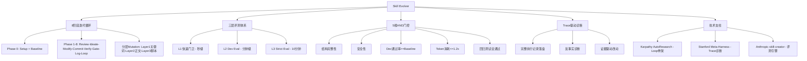

## 📋 文章信息

- **来源**: 微信公众号 - 腾讯云开发者
- **作者**: 张思宇
- **发布时间**: 2026年5月19日
- **阅读链接**: https://mp.weixin.qq.com/s/dDkVA9mfNbJWTwkVKN1AOQ

---

## 🎯 核心摘要

这篇文章提出了一种名为 **Skill-Evolver** 的框架，灵感来自 Karpathy 的 autoresearch、Stanford 的 Meta-Harness 和 Anthropic 的 skill-creator，将深度学习的训练范式（训练循环、评测、回滚）迁移到 Skill 的开发与优化中。核心思想是把 Skill 从「手工打磨的工艺品」转变为「可以被训练、被回滚、被选优的对象」。通过 8 阶段迭代循环、3 层递进评测、5 维 AND 门控机制和 trace 驱动诊断，实现了 Skill 的自进化。作者在 meta-evolution（让框架优化自身）中完成 19 轮迭代，零回滚、零崩溃，最终通过率 100%，主文件从 1411 行精简到 557 行。

## 📊 核心观点

### 1. Skill 不是 Prompt，是 Harness

**背景/现状**：
- Skill 正在渗透 AI 应用的各个角落，各巨头在 Skill 生态上出奇一致
- SKILL.md 加参考资料和脚本即可打包为可分发的能力单元
- 大多数人把 Skill 当作 prompt 来写，实际上它更像一套系统（harness）

**核心论述**：
- 写一个能跑的 Skill 不难，但让它稳定干活很难：触发边界、安全规则、references 一致性、脚本版本兼容
- 规则越多，模型行为越不确定——不是模型问题，是规则复杂度爆炸
- 三个典型痛点：稳定性（测试盲区）、边界条件（如字符串排序 iteration-10 排到 iteration-2 前面）、规则互相打架
- 「能跑」只是语法通过，「真的好」是行为匹配数据分布，如同训模型不是让代码编过而是让 loss 收敛

### 2. Skill Evolver 的架构设计：三个思想支柱

**背景/现状**：
- Karpathy 的 autoresearch：630 行 Python 脚本，让 AI 迭代 LLM 训练代码，两天跑 700 个实验，性能提升 19%
- Udit Goenka 的通用化：从「优化 LLM 训练」泛化到「优化任何可测量事物」，提炼 5 条原则
- Stanford Meta-Harness：消融实验证明完整 trace vs 摘要，效果差 44%
- Anthropic skill-creator：提供 quick_validate、grader、comparator 和 GT 生成能力

**核心论述**：
- Skill-Evolver = AutoResearch 的 loop 骨架 + Creator 的评测引擎 + Meta-Harness 的诊断大脑
- 外层用 autoresearch 方式不断试错、回滚、保留；内层用 creator 评测把「好不好」测清楚；用 Meta-Harness 的 trace 把失败变成可诊断的证据
- 训模型 vs 训 Skill 的对应关系：GT（标准答案）↔ 数据集、assertion ↔ loss、holdout split ↔ 验证集、分层 mutation ↔ 学习率调度

### 3. 8 阶段 Loop + 5 维 AND 门控

**背景/现状**：
- 传统 Skill 调优依赖人工循环：改 SKILL.md → 手动测 → 觉得不对 → 再改
- 质量完全取决于作者水平，缺乏系统性

**核心论述**：
- **Phase 0 Setup**：检查环境、生成评测计划 evolve_plan.md、建立 baseline
- **Phase 1-8 循环**：Review（读 memory）→ Ideate（trace 诊断 + 原子化改动提案）→ Modify（执行一个改动）→ Commit → Verify（三层评测）→ Gate（5 维门控）→ Log → Loop
- **三层评测递进**：L1 快速门卫（秒级，结构/安全/格式检查）→ L2 Dev Eval（分钟级，全量 dev 集跑 8 种 assertion）→ L3 Strict Eval（10 分钟，holdout 集 + regression 集 + A/B 盲审）
- **5 维 AND 门控**：结构完整 ✓、安全通过 ✓、dev pass rate ≥ baseline ✓、token 消耗 ≤ 1.2× ✓、回归全部通过 ✓。全 YES 才 keep，任何 NO 直接 git revert
- 为什么是 AND 不是加权求和：防止「质量涨 10% 但 token 消耗翻倍」的假优化

### 4. Trace 驱动诊断：不猜，看证据

**背景/现状**：
- 一般优化工具只告诉你「这轮 80 分」，具体哪里出问题自己猜
- Meta-Harness 实验证明：只给摘要 vs 给完整 trace，效果差 44%

**核心论述**：
- 每轮每个 case 的完整执行记录落盘成文件，给 proposer 一张「地图」而非塞进 10M token
- 硬性协议：先看 trace 再诊断再改，没证据不许动手
- 每步改动像写论文引文献一样有 trace 背书，不是「感觉可以优化」而是「Case 41 因为 Y 失败了，所以改 Z」

### 5. Meta-Evolution 验证：19 轮零人工干预

**背景/现状**：
- Skill Evolver 本身也是一个 Skill，用它优化自己——SKILL.md 既是菜谱又是被烤的蛋糕

**核心论述**：
- 19 轮迭代：10 轮修 bug/文档、3 轮修安全漏洞、1 轮清死代码、5 轮代码重构
- 被丢弃轮次：0；崩溃：0；最终通过率：71/71 = 100%
- GT 从 17 个扩到 31 个，多出的 14 个是 AI 在迭代中自动发现并补充的
- 主文件从 1411 行拆成 13 个单一职责文件（557 行），减少 60%
- 真实业务验证：客服问答 Skill，候选数从 ~10 压到 ~6，召回率从 86% 拉到 98.67%，Stage 2 处理压力降 59%

## 🧠 概念图谱

## 🏗️ 技术架构

### 架构概述

Skill Evolver 是一个对话驱动的 Skill 训练框架，采用 agent 架构实现自主迭代。整体设计借鉴深度学习训练范式：外循环（8 阶段 Loop）类比训练 epoch，评测体系类比 validation，AND 门控类比 early stopping，trace 诊断类比 grad 检查。

### 核心组件

| 组件 | 职责 | 关键技术 |
|------|------|----------|
| Setup Engine | 环境检查、生成评测计划、建立 baseline | SKILL.md 结构校验、GT 数据准备 |
| Memory Reader | 读取 git log、results.tsv、experiments.jsonl | 最近 20 条历史信号提取 |
| Trace Proposer | 基于 trace 证据提出原子化改动 | 反事实诊断、6 级优先级排序 |
| Modifier | 执行单一原子化改动 | git diff --stat 控制（≤5 文件） |
| L1 Gate | 秒级快速门卫 | quick_validate + 11 条安全规则 |
| L2 Evaluator | 全量 dev 集评测 | 8 种 assertion（6 程序判 + 2 LLM 判） |
| L3 Evaluator | holdout + regression + A/B | 防过拟合、确保泛化 |
| Gate Controller | 5 维 AND 决策 | git revert 机制 |
| GT Generator | 自动生成测试用例 | skill-creator eval 功能 |

### 8 种 Assertion 类型

| 类型 | 判断方式 | 说明 |
|------|----------|------|
| contains | 程序判 | 输出是否包含指定文本 |
| regex | 程序判 | 正则匹配 |
| script_check | 程序判 | 运行脚本检查返回值 |
| path_hit | LLM 判 | 是否引用了正确文件路径 |
| fact_coverage | LLM 判 | 知识点是否被覆盖 |
| 其他 3 种 | 程序判 | 文中未详列 |

## 🔑 关键洞察

### 1. 从「授人以鱼」到「授人以渔」的范式跃迁

**分析**：
- 当前 Skill 开发的主流模式仍是人工调优：改规则 → 测 → 改规则，本质是「授人以鱼」
- Skill Evolver 实现了「授人以渔」：给 Skill 一个目标（GT）、一套方法（loop + 评测），让它自己探索
- 这不是简单的自动化，而是将训练范式从模型参数扩展到了非参数化的 Skill 层面
- 核心洞察：**可观测性决定可优化性**——trace 让 Skill 的行为变得可诊断，这才让自进化成为可能

### 2. Agent 架构 vs 传统 Pipeline 的本质区别

**分析**：
- 传统自动化管道一旦启动就是黑盒，人在外面等结果
- Agent 架构允许在迭代过程中随时插入人类判断（如第 10 轮要求提取 gate 逻辑）
- 更准确的协作模式不是「分工」而是「互补」——人在明处看方向，AI 在暗处试错
- 这解释了为什么前 3-5 轮最好有人盯：不是技术限制，是帮助建立正确的迭代方向

### 3. 程序掌握控制流，LLM 只管生成

**分析**：
- LLM 会偷懒、过拟合、自作主张——这是概率模型的本质特性
- 与其写更长的 prompt 来「说服」LLM 守规矩，不如把规矩写进代码
- 门控函数不通过就 git revert HEAD，没有商量余地
- 这是一个重要的设计哲学：**LLM 做单点生成，程序做状态控制**

### 4. Meta-Evolution 的真正价值：探索不可见的 Regime

**分析**：
- 19 轮最有价值的不是自动化省时间，而是替你跑你永远跑不到的路径
- 你自己的测试环境有盲区：所有 Skill 都在 git 下、迭代从不超过 5 轮、工作区永远干净
- 每一轮 rebaseline 都会暴露一类之前想不到的失败——14 个新 GT case 全来自 AI 自己发现的问题
- 这揭示了 AI 辅助开发的一个深层价值：**它能到达人类认知边界之外的空间**

## 🚧 不足与局限

### 1. LLM 评测噪声
- 同一 Skill 状态、同一份 GT，Claude 跑 4 次结果在 0.79~0.92 间漂移
- 改一行规则 pass_rate 从 0.85 到 0.87——分不清是功劳还是 LLM「心情好」
- 解法是跑 3 次取均值，但评测成本翻 3 倍

### 2. GT 质量天花板
- Case 48 「如何进入内部群」GT 标注本身有争议，5 轮迭代都修不好
- GT 质量决定了 Skill 质量的上限
- 好处：5 轮修不好时先怀疑数据而非 Skill，这是 feature 不是 bug

### 3. 成本高昂
- 19 轮 meta-evolution 花费约 100 美元
- 不适合小规模或低频使用的 Skill 优化

### 4. 冷启动依赖
- 前 3-5 轮需要人工介入建立正确方向
- 不能真的「丢进去睡一觉」就不管了

## 🔮 延伸思考

### 1. Skill 训练的「过拟合」问题
- 31 个 GT case 全过，是否意味着在更广泛的输入分布上也表现良好？
- holdout 集有帮助，但 GT 本身的覆盖面是否足够？
- 是否需要引入 adversarial case generation？

### 2. 跨 Skill 迁移的可能性
- 当前框架是否可以优化不同类型的 Skill（代码生成、知识问答、创意写作）？
- 不同 Skill 是否需要不同的 assertion 类型和门控阈值？

### 3. 人机协作的新范式
- 作者描述的「人在 edge 上 optionally 贡献」是一个很有启发的模型
- 未来是否会出现「Skill 训练师」这个新角色——不写 Skill，只准备 GT 和定指标？

## 💡 实践启示

### 1. 对 Skill 开发者的启示

**要点**：
- 把 Skill 当作系统工程而非 prompt 工程——关注触发边界、安全规则、一致性
- 建立自动化评测体系（GT + assertion），手动测试天花板太低
- 用 git 作为 Skill 版本管理的核心工具，每次改动都 commit

### 2. 对 AI 工程团队的启示

**要点**：
- 控制流交给程序，生成交给 LLM——这是构建可靠 AI 系统的关键设计原则
- Trace 记录是诊断和迭代的基础设施，值得投入建设
- 分层 mutation 的思路可以推广到任何渐进式优化场景

### 3. 对个人实践的启示

**要点**：
- 如果你在用 OpenClaw / Claude Code 等平台的 Skill，可以考虑用类似思路建立自进化循环
- 从小规模开始：准备 5-10 个 GT case，设简单的门控条件，手动辅助前几轮
- 善用 skill-creator 的 eval 功能自动生成 GT

## 📝 关键金句

> "Skill 最容易让人误会的一点，是它看起来像 prompt，实际上更像 harness。"

> "与其写更长的 prompt 来「说服」它守规矩，不如把规矩写进代码——门控函数不通过就 git revert HEAD，没有商量余地。"

> "Meta-evolution 最有价值的不是自动化节省时间，是它在替一个你还没见过的用户，跑一遍你自己永远跑不到的路径。"

> "更准确的描述是互补——你在明处看着，AI 在暗处替你试错，你看不见的那一半就是 AI 能贡献的地方。"

> "在我写的每一行代码的背后，都藏着一整片我没有能力去观察的 regime。而那片 regime 里面，住着我真正的用户。"

## 🏷️ 标签

AI、Agent、Skill、LLM、自进化、自动化测试、深度学习范式、Meta-Harness、Karpathy

---

## 🔗 相关资源

- **Karpathy autoresearch**: https://github.com/karpathy/autoresearch
- **Udit Goenka 通用化版本**: https://github.com/uditgoenka/autoresearch
- **Stanford Meta-Harness 论文**: https://arxiv.org/abs/2603.28052
- **Anthropic skill-creator**: https://github.com/anthropics/skills/tree/main/skills/skill-creator
- **Fortune 报道**: https://fortune.com/2026/03/17/andrej-karpathy-loop-autonomous-ai-agents-future/
