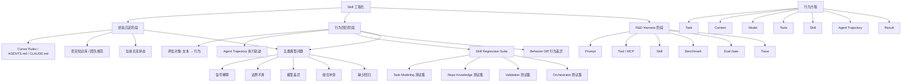

## 📋 文章信息

- **来源**: 微信公众号 - 梯度不陡
- **作者**: 梯度不陡
- **发布时间**: 2026年5月24日
- **阅读链接**: https://mp.weixin.qq.com/s/46sZ3jbOapz_CP17gEbhXA

---

## 🎯 核心摘要

本文提出了一个关键观点：Skill（写给 Agent 看的经验资产）正在成为 AI 工程化的核心组件，但如果只停留在"写得更完整"的阶段而不建立测试和回归体系，Skill 就会变成新的文档债。文章从五个层面展开论述——Skill 作为经验资产的价值、完整不等于有效的五大典型问题、评估对象应从文本转向 Agent 行为、Skill Regression Suite 的设计思路，以及从 Skill Collection 到 R&D Harness 的系统工程演进。核心主张是：Skill 的质量不在文件里，而在 Agent 被它影响之后的执行轨迹里。

## 📊 核心观点

### 1. Skill 是行为控制资产，不是经验文档

**背景/现状**：
- 过去一年，Cursor Rules、AGENTS.md、Claude Skill、项目知识库等形式涌现，将团队经验从人脑外置为 Agent 可消费的资产
- Skill 的价值在于让 Agent 不再只依赖模型参数里的通用知识，而是接入团队自己的项目经验、工程规范和执行路径

**核心论述**：
- Skill 最容易让人误会的：它不是普通文档，而是会改变 Agent 上下文选择、工具调用和执行路径的行为控制资产
- 文章泛化 Skill 概念，涵盖 Cursor Rules、AGENTS.md、CLAUDE.md、项目知识库、团队规范、工具说明、流程约束等
- 既然 Skill 能改变行为，就必须被测试——一次合理改动可能让 Agent 更稳定，也可能让它偏得更远
- 开篇案例：给 Repo Knowledge Skill 加了"优先查找历史相似页面"的规则，结果 Agent 过度复用旧页面，忽略了当前设计稿和接口变化

### 2. Skill 写得完整，不等于 Agent 行为稳定

**背景/现状**：
- 行业关注点从"有没有 Skill"进阶到"Skill 够不够完整"
- Skill 开始变长、分层，加入背景说明、执行步骤、注意事项、反例等

**核心论述**：
- 五类典型问题导致完整 Skill 未必有效：
  - **信号稀释**：Skill 越长，真正能控制 Agent 行为的信号未必变强
  - **边界不清**：自然语言描述的适用场景在真实任务中边界模糊
  - **模型差异**：同一 Skill 在不同模型上效果不同
  - **组合冲突**：多个 Skill 同时进入链路后出现重叠、冲突和优先级不明
  - **缺少回归**：Skill 改了之后没有测试集，只能靠体感判断

- Skill 不是确定性执行系统的代码模块，它更像自然语言控制信号，进入模型、上下文、工具和执行环境后影响的是 Agent 的行为倾向
- 文本 diff 无法告诉我们 Agent 行为到底有没有变好

### 3. 评估对象：从 Skill 文本到 Agent 执行轨迹

**背景/现状**：
- 传统思维把 Skill 当函数：input → deterministic function → output
- VS Code 的 GitHub Copilot Coding Harness 已开始对 core tool、system prompt、harness 逻辑变更做 benchmark 评估

**核心论述**：
- Agent 行为由五类因素共同决定：task + context + model + tools + skill
- 真正要评估的是 **agent trajectory**（执行轨迹）：看了哪些上下文、调用了哪些工具、有没有理解任务边界、有没有在关键节点验证、最终结果是否符合预期
- 测试 Skill 不只看任务是否完成，要看它如何改变 Agent 的执行路径
- 举例：修改 Validation Skill 强调 build 和 typecheck 后，Agent 更稳定执行了验证，但开始把"工程验证通过"误认为"需求已验收"——验证信号发生了偏移

### 4. Skill Regression Suite：给 Skill 建行为回归集

**背景/现状**：
- 代码改了可以跑测试，Skill 改了之后只能看文本 diff
- 缺少系统化的 Skill 评估方法

**核心论述**：
- Skill Regression Suite 不测文本语法，而是验证 Skill 改动后在一组代表性任务上 Agent 行为和结果是否变好
- 按 Skill 类型拆分测试集：Task Modeling 测需求理解、Repo Knowledge 测上下文检索、Validation 测验证策略、Orchestrator 测路径选择
- Skill 迭代工程流程：变更 → 声明影响范围 → 选择测试集 → 运行任务 → 记录 trace → 对比结果和轨迹 → 归因变化 → 决定发布
- 一个完整的 Regression Case 应包含：原始输入、期望中间表示、期望执行路径、期望验证方式、风险点、历史失败、自动断言、人工评审项
- 核心原则：看行为 diff，不只看文本 diff 和结果 diff

### 5. 从 Skill Collection 到 R&D Harness

**背景/现状**：
- Skill 越来越多，形成 Skill Collection
- 管理问题浮现：谁来管理、谁决定调用、谁处理冲突、谁评估效果

**核心论述**：
- 当每个 Skill 都需要测试集、trace、行为 diff 和发布门禁时，需要更大的系统承载层
- VS Code 的 Coding Harness 解决模型如何在 IDE 完成编码任务，企业需要 R&D Harness 解决 Agent 如何在真实研发链路中形成可控闭环
- R&D Harness 包含的资产：Prompt、Tool、MCP、Skill、项目知识、Task IR、执行轨迹、验证结果、Benchmark、Eval Gate
- 如果没有这些机制，Skill 越多反而越不可控——沉淀了更多经验却无法判断是否在正确影响 Agent

## 🧠 概念图谱

## 🏗️ 技术架构

### 架构概述

文章没有提出具体的技术系统实现，而是构建了一套从 Skill Collection 到 R&D Harness 的演进架构。核心思想是将 Skill 从"自然语言资产"提升为"可测试、可组合、可回归的控制资产"。

### Skill Regression Suite 结构

| 组件 | 职责 | 关键要素 |
|------|------|----------|
| 原始输入 | 定义测试场景 | PRD、设计稿、API、Repo Context |
| 期望中间表示 | 期望的任务理解 | 目标、范围、约束、验收标准、不确定项 |
| 期望执行路径 | 期望的 Agent 行为 | 应读取的上下文、应调用的工具 |
| 期望验证方式 | 期望的验证执行 | 哪些必须验证、哪些可选验证 |
| Trace Assertion | 过程断言 | 是否读取了正确目录、是否识别了差异 |
| Result Assertion | 结果断言 | 行为是否符合 PRD、是否扩大修改范围 |
| Known Failure | 历史失败模式 | 过去 Agent 犯过的错误 |
| 人工评审项 | 无法自动化的判断 | 暂时需要人工确认的标准 |

### R&D Harness 资产体系

| 资产类型 | 说明 |
|----------|------|
| Prompt | 系统提示和指令 |
| Tool / MCP | 工具和协议接口 |
| Skill | 经验和控制信号 |
| Benchmark | 评估基准 |
| Eval Gate | 发布门禁 |
| Trace | 执行轨迹记录 |
| Task IR | 任务中间表示 |
| Validation | 验证结果 |

## 🔑 关键洞察

### 1. "文档债"的隐喻精准击中了 AI 工程化的核心矛盾

**分析**：
- 文章标题用"文档债"精准类比：就像技术债是代码质量的隐性成本，文档债是经验沉淀的隐性成本
- 企业积累了大量 Skill 但没有测试体系，就像积累了大量代码但没有测试覆盖——表面繁荣，实际不可控
- 这个洞察的价值在于：它指出了当前 AI 工程化最大的盲区不是"模型不够强"而是"经验不可验证"

### 2. 从确定性测试到行为性评估的范式转换

**分析**：
- 代码测试是确定性的（函数输入→输出），Skill 测试是概率性的（同一 Skill 在不同上下文下产出不同轨迹）
- 这要求测试方法论的根本转变：不是测"对不对"而是测"偏没偏"
- Behavior Diff 比 Result Diff 更重要——两个 Agent 可能都完成了任务，但一个路径稳定、验证充分，另一个误打误撞
- 这种范式转换在 QA 领域已有先例（模糊测试、混沌工程），但应用到 AI Agent 的 Skill 层面是全新的

### 3. Skill 组合冲突是规模化后的首要问题

**分析**：
- 单个 Skill 优化相对简单，但多个 Skill 同时进入 Agent 链路后的交互效应是未被充分研究的领域
- 文章指出了一个关键矛盾：Skill 强调快速执行 vs Skill 强调先完整建模——Agent 听谁的？
- 这类优先级冲突、语义重叠、执行路径漂移问题，在 Agent 系统规模化后会越来越严重
- 暗示了未来需要 Skill 之间的兼容性测试和冲突检测机制

### 4. Trace 是连接 Skill 和行为的唯一桥梁

**分析**：
- 没有完整的执行轨迹记录，就无法诊断 Skill 改动的真实影响
- 这与前一篇（Skill Evolver）的 Meta-Harness 结论一致：完整 trace vs 摘要，效果差 44%
- Trace 不仅是调试工具，更是 Skill 迭代的"数据集"——没有数据就无法训练
- 文章提出了最小 Regression Case 的格式设计，但 trace 的标准化记录和存储仍然是待解决的工程问题

### 5. R&D Harness 是 Skill 工程化的终极形态

**分析**：
- VS Code 的 Coding Harness 给出了产品化范例：把上下文组装、工具暴露、agent loop、评估机制纳入同一系统
- 企业级的 R&D Harness 需要：Skill 管理、行为观察、效果评估、变更回归、失败诊断
- 这意味着 Agent 工程化的竞争维度，将从"谁的 Skill 多"转向"谁的 Harness 强"
- Skill 最终将成为 Harness 中的一类资产，而不是独立存在的文档

## 🚧 不足与局限

### 1. 缺乏量化验证
- 文章更多是观点和方法论的阐述，没有提供实际的 Skill Regression Suite 实验数据
- 没有展示具体案例中 Skill 改动前后的行为对比数据
- 与前一篇（19 轮迭代、100% 通过率）相比，实操性偏弱

### 2. Trace 标准化问题未深入
- 提到了 trace 的重要性，但没有深入讨论 trace 的标准化格式、存储方案和自动化分析工具
- 不同 Agent 框架的 trace 格式差异很大，如何统一是实际工程难题

### 3. 评估成本问题回避
- 建立 Skill Regression Suite 本身成本很高（每个 Skill 类型都要设计测试集）
- 文章承认"听起来会比写 Skill 更重"但没有给出降低成本的具体策略

### 4. 自动化程度有限
- 提到"人工评审项"但没说明自动化断言和人工评审的比例如何平衡
- LLM 辅助评估的可靠性和噪声问题没有讨论

## 🔮 延伸思考

### 1. Skill 版本管理的"语义冲突"问题
- 代码版本管理基于 diff，Skill 版本管理需要基于 behavior diff
- 是否会出现类似"Git for Skills"的工具——不追踪文本变化，而追踪行为变化？

### 2. Skill 评测的标准化方向
- 类似 ML 领域的 MMLU、HumanEval 等 benchmark，是否会出现 Agent Skill 领域的标准化评测集？
- 不同团队的 Skill 评测是否可以横向比较？

### 3. 从"写 Skill"到"训练 Skill"的演进路径
- 与前一篇 Skill Evolver 的思路结合：先建立 Skill Regression Suite，再用自动化 loop 让 Skill 自进化
- 两条路径如何融合：手动建测试集 → 自动化迭代 → 自进化

## 💡 实践启示

### 1. 如果你正在写 Skill

**要点**：
- 不要追求 Skill 的"完整性"，而要追求 Skill 的"可控性"
- 为每个核心 Skill 至少设计 3-5 个行为回归用例
- 记录 Agent 执行 trace，作为 Skill 迭代的依据
- 每次 Skill 变更后跑回归，不只是看文本 diff

### 2. 如果你在管理 Skill 体系

**要点**：
- 开始规划 Skill Regression Suite，按 Skill 类型拆分测试集
- 关注 Skill 之间的组合冲突，不要只优化单个 Skill
- 建立发布门禁（Eval Gate），Skill 变更需要过回归才能上线
- 追踪行为 diff 而非文本 diff

### 3. 如果你在建设 Agent 系统

**要点**：
- 思考从 Skill Collection 到 R&D Harness 的演进路径
- 将 Trace 记录作为基础设施，而非附加功能
- 评估维度不只看最终任务完成率，要看执行轨迹的稳定性和可验证性
- 参考 VS Code Coding Harness 的思路，构建自己的评估闭环

## 📝 关键金句

> "Skill 的价值，不只在于它能沉淀多少经验，而在于它能否稳定影响 Agent 的行为。"

> "Skill 不是普通文档。它会改变 Agent 的上下文选择、工具调用和执行路径。既然它能改变行为，就必须被测试。"

> "代码虽然也会有复杂性，但它至少有相对明确的执行语义。但 Skill 变更之后，很多时候我们只能看文本 diff——这些 diff 对人来说可能有意义，但它们并不能直接告诉我们 Agent 的行为到底有没有变好。"

> "Skill 的质量，不在 Skill 文件里，而在 Agent 被它影响之后的执行轨迹里。"

> "Skill 让经验可以被 Agent 消费；测试集、trace、回归评估和 Eval Gate，才让这种经验可以被评估、被回归、被演化。"

> "Agentic Engineering 真正进入工程化阶段的标志，不是我们沉淀了多少经验，而是这些经验能否像工程资产一样，被验证、被比较、被回归、被持续迭代。"

## 🏷️ 标签

AI、Agent、Skill、工程化、质量保障、行为回归、R&D Harness、VS Code、Copilot

---

## 🔗 相关资源

- **The Coding Harness Behind GitHub Copilot in VS Code**: https://code.visualstudio.com/blogs/2026/05/15/agent-harnesses-github-copilot-vscode
- **延伸阅读 - Skill Evolver 自进化框架**: https://mp.weixin.qq.com/s/dDkVA9mfNbJWTwkVKN1AOQ
