## 📋 文章信息

- **来源**: 微信公众号 - 腾讯云开发者
- **作者**: 李伟山
- **发布时间**: 2026年5月20日
- **阅读链接**: https://mp.weixin.qq.com/s/b1VL28GX5d17sKPfkSbIsw

---

## 🎯 核心摘要

本文以 OpenAI 内部团队 5 个月用 AI 生成近 100 万行生产级代码为引子，提出 AI 工程化经历了三次进化：Prompt Engineering（如何跟模型说清楚）、Context Engineering（如何给模型足够的信息）、Harness Engineering（如何让整个 AI 系统可靠运转）。三者不是替代关系而是嵌套关系——没有好的 Prompt，Context 注入的信息无法被正确理解；没有好的 Context，Harness 的 Agent 在信息真空中瞎跑；没有好的 Harness，再好的 Prompt 和 Context 只是沙滩上的城堡。文章进一步提出"Harness 衰变定律"：模型能力越强，所需 Harness 越简单，因此不应过度设计那些模型未来能自行解决的规则。最终落脚点是工程师的角色重构：从"写代码的人"进化为"设计让 AI 把代码写好的系统的人"。

## 📊 核心观点

### 1. Prompt Engineering：加约束的过程，但边际效益在递减

**背景/现状**：
- LLM 是擅长续写的系统，"最有可能出现"不等于"你真正想要的"
- 核心技术包括零样本、少样本、思维链（CoT）、角色扮演、提示链等
- 2023-2024 年 Prompt Engineer 曾是最炙手可热的职业

**核心论述**：
- Prompt Engineering 的本质是"如何通过精心设计的输入，最大限度激发模型的正确能力"
- 随着模型智能化提升（GPT-3 → GPT-4/Claude 3），"说清楚"的边际效益显著降低
- 即使模型听懂了你说的话，它仍然可能给出错误答案——因为它根本不知道一些关键信息
- 更深层的瓶颈从"怎么表达"转移到了"模型知道什么"

### 2. Context Engineering：为"金鱼记忆"准备简报

**背景/现状**：
- LLM 每次对话只能看到上下文窗口内的信息，窗口外一无所知
- 传统做法把所有知识塞进 System Prompt，导致空间爆满、输出质量下降

**核心论述**：
- 核心比喻：LLM 是"记忆只有 7 秒的最聪明助理"，每次会面前要准备简报
- 上下文包含多层信息：System Prompt、对话历史、检索到的知识、工具输出等，都在争夺有限 Token
- **RAG 的革命性**：不存知识，存索引；需要什么，临时检索，精准注入
- **上下文压缩**：滚动摘要、重要性评分、层次记忆，对抗"中间遗忘"现象
- **单一事实来源（SSOT）**：强制将所有决策和文档归档进代码仓库，确保 AI 信息来源唯一、可追溯、版本受控
- OpenAI 实战：把巨型 agent.md 压缩至百行索引，动态加载子文档，模型遵从度和质量显著提升

### 3. Prompt + Context 的共同盲区：系统层面缺乏约束和反馈

**背景/现状**：
- 精心设计了 Prompt + 动态注入了上下文，但 Agent 仍然会：
  - 顺手重构没让它动的代码
  - 声称测试通过但根本没运行
  - 命名风格与项目不一致
  - 生成重复的工具函数

**核心论述**：
- 问题根源不在"说什么"或"给什么信息"，而在系统层面缺乏约束、验证和反馈机制
- 这是 Prompt Engineering 和 Context Engineering 的共同盲区
- 需要 Harness Engineering 来填补

### 4. Harness Engineering：为 AI 设计"马具"

**背景/现状**：
- Harness 字面意思是马具（缰绳、鞍具、辔头），套上马具的马才能指哪打哪
- 一个完整的 AI Agent 系统中，除了大模型本身之外的所有东西都属于 Harness

**核心论述**：
- **OpenAI 百万行代码实验的三大策略**：
  1. 上下文治理：巨型 agent.md → 百行索引 + 动态加载 + 信息来源强制归档
  2. 验证闭环：接入 Chrome DevTools 做视觉验证、可观测性工具读日志查性能、强制 Lint + 自动化测试形成闭环——让"声称完成"变成"验证完成"
  3. 技术债清理：后台 Codex 任务定期扫描，像垃圾回收一样自动修复偏离规范的代码

- **Anthropic F-Harness 解决 AI 的"自恋问题"**：
  - 单 Agent 问题：上下文耗尽、功能完成一半就宣称全部完成、自评过度乐观
  - 三 Agent 分工：Planner（拆解任务）→ Generator（逐项执行）→ Evaluator（独立审核）
  - 代价：20 倍时间、22 倍成本，换来生产环境级别的质量

### 5. 三者关系：嵌套而非替代

**背景/现状**：
- 容易误以为 Harness Engineering 最高级，前两个过时了

**核心论述**：
- 三者层层包裹、相互依存：
  - 没有好 Prompt → Context 注入的信息无法被正确理解
  - 没有好 Context → Harness 的 Agent 在信息真空中瞎跑
  - 没有好 Harness → 再好的 Prompt 和 Context 只是沙滩上的城堡
- 三个核心问题区分职责：
  - Prompt：我该跟模型说什么？
  - Context：模型回答时该知道什么？
  - Harness：整个 AI 系统该如何可靠地运转？

### 6. Harness 衰变定律：模型越强，Harness 越简

**背景/现状**：
- Anthropic 研究发现 Claude 3.0 时代需要的严格 Harness 规则，到 Claude 3.5 很多不再必要

**核心论述**：
- 这是一个反直觉但深刻的规律：**模型能力越强，所需的 Harness 越简单**
- 两层深意：
  1. Harness Engineering 是当下现实答案——在模型能力未完美的今天，Harness 是生产环境可靠运行的必要条件
  2. Harness Engineering 可能是过渡性技术——随着模型能力提升，许多规则会被模型自然内化
- 实践建议：精力集中在两类场景：
  1. 模型短期内无法自行解决的业务逻辑边界（行业规则、合规、复杂协同）
  2. 即使模型再强也无法自行建立的外部接口（工具调用、API 集成、权限控制）
- 能动态调整 Harness "厚度"的人，获得最高工程效率回报

### 7. 工程师角色重构：Human Steer, Agents Execute

**背景/现状**：
- OpenAI 实验结论："Human steer, agents execute"（人类掌舵，Agent 执行）

**核心论述**：
- 工程师价值向上迁移到更高维度，核心职责变为三件事：
  1. **定方向（Steering）**：知道要建什么、为什么建、最终形态是什么
  2. **搭架子（Harnessing）**：构建可靠的 Agent 运行支架、规则、验证回路
  3. **做判别（Decision Making）**：在关键决策点进行人工干预和确认
- 衡量标准切换：代码行数 → 系统杠杆率；个人产出 → 系统杠杆

## 🧠 概念图谱

```mermaid
graph TD
    A[AI 工程化三次进化] --> B[Prompt Engineering]
    A --> C[Context Engineering]
    A --> D[Harness Engineering]

    B --> B1[零样本/少样本]
    B --> B2[思维链 CoT]
    B --> B3[角色扮演]
    B --> B4[提示链]
    B --> B5[衰退: 模型变强后边际效益递减]

    C --> C1[RAG 检索增强]
    C --> C2[上下文压缩]
    C --> C3[单一事实来源 SSOT]
    C --> C4[滚动摘要/重要性评分/层次记忆]

    D --> D1[上下文治理]
    D --> D2[验证闭环]
    D --> D3[技术债清理]
    D --> D4[多Agent协作 F-Harness]

    D1 --> D1a[巨型agent.md → 百行索引]
    D1 --> D1b[动态加载子文档]
    D1 --> D1c[信息来源强制归档]

    D2 --> D2a[Chrome DevTools 视觉验证]
    D2 --> D2b[可观测性工具]
    D2 --> D2c[强制Lint + 自动化测试]

    D4 --> D4a[Planner 规划]
    D4 --> D4b[Generator 生成]
    D4 --> D4c[Evaluator 评估]

    E[三者关系] --> E1[嵌套而非替代]
    E --> E2[缺一不可]

    F[Harness 衰变定律] --> F1[模型能力↑ → Harness复杂度↓]
    F --> F2[集中精力: 业务逻辑边界 + 外部接口]

    G[工程师角色] --> G1[定方向 Steering]
    G --> G2[搭架子 Harnessing]
    G --> G3[做判别 Decision Making]
    G --> G4[Human Steer, Agents Execute]
```

## 🏗️ 技术架构

### 架构概述

文章没有提出新的技术架构，而是对现有 AI 工程化实践进行了一次系统性梳理和分层。核心贡献在于将 AI Agent 工程从概念上拆分为三个嵌套层次，并提出了 Harness 衰变定律这一设计原则。

### 三层工程对比

| 维度 | Prompt Engineering | Context Engineering | Harness Engineering |
|------|-------------------|-------------------|-------------------|
| 核心问题 | 我该跟模型说什么？ | 模型该知道什么？ | 系统如何可靠运转？ |
| 作用层次 | 单次对话输入 | 系统级信息管理 | 系统级约束与反馈 |
| 关键技术 | CoT、Few-shot、角色扮演 | RAG、上下文压缩、SSOT | 验证闭环、多Agent协作、技术债清理 |
| 衰变趋势 | 随模型变强快速衰减 | 随模型变强部分衰减 | 业务逻辑边界持久存在 |
| 替代性 | 高（模型可直接理解意图） | 中（部分可被模型内化） | 低（外部接口需持续维护） |

### F-Harness 多 Agent 架构

| 角色 | 职责 | 解决的问题 |
|------|------|-----------|
| Planner | 将模糊需求拆解为精细功能列表 | 任务过大导致中途迷失 |
| Generator | 按功能列表逐项执行 | 缺乏结构化执行 |
| Evaluator | 独立审核 Generator 产出 | AI 自评过度乐观 |

### OpenAI 实验三大 Harness 策略

| 策略 | 做法 | 效果 |
|------|------|------|
| 上下文治理 | 巨型文件→百行索引+动态加载+归档SSOT | 模型遵从度和质量显著提升 |
| 验证闭环 | DevTools+可观测性+Lint+自动化测试 | "声称完成"→"验证完成" |
| 技术债清理 | 后台Codex定期扫描自动修复 | 代码库健康度持续维持 |

## 🔑 关键洞察

### 1. "金鱼助理"比喻精准揭示了 LLM 的本质局限

**分析**：
- 用"记忆 7 秒的最聪明助理"比喻 LLM，比技术化的"上下文窗口有限"更能让人理解 Context Engineering 的必要性
- 这个比喻暗示了一个重要推论：助理越聪明，简报越重要——模型能力提升的同时，上下文管理的价值不减反增
- 与其花时间让助理"更聪明"（Prompt），不如花时间准备更好的"简报"（Context）

### 2. 三层进化的叙事结构虽然有启发，但存在过度简化的风险

**分析**：
- 将 AI 工程化分为三个阶段确实有助于理解，但实践中三者通常是同时迭代而非线性递进的
- 文章暗示了"Prompt 过时 → Context 崛起 → Harness 是终极"的叙事，这与作者自己强调的"三者嵌套"存在张力
- 真实场景中，写好 Prompt 和设计好 Harness 通常是同一轮迭代中完成的事情

### 3. "Harness 衰变定律"是最有价值的原创洞察

**分析**：
- 这个规律在业界已被广泛观察但很少被显式表述：Claude 3.5 确实比 Claude 3.0 需要更少的显式规则
- 其深层原因：模型能力提升本质上是将外部规则"编译"进了参数——从显式编程变为隐式编程
- 这个洞察的实际指导价值很大：不要在模型即将内化的能力上过度投资
- 需要警惕的反面：不要用这个定律为偷懒找借口——模型内化的速度可能比你想象的慢

### 4. "Human Steer, Agents Execute" 重塑了工程师的价值定位

**分析**：
- 与其说这是新发现，不如说是对软件工程历史规律的重申：从汇编→高级语言→框架→低代码→AI生成，工程师一直在向上层迁移
- 但这次迁移的结构性不同：过去是"用更高级的工具做同样的事"，这次是"做完全不同的事"——从执行者变成系统的设计者和审核者
- "搭架子"（Harnessing）这个角色在当下确实是最稀缺的技能

### 5. F-Harness 的代价数据揭示了质量与效率的真实取舍

**分析**：
- 20 倍时间、22 倍成本换来生产环境级质量——这个数字很重要，因为它打破了"AI 无限高效"的幻觉
- 暗示了一个工程原则：多 Agent 协作的 ROI 与任务复杂度正相关，简单任务用单 Agent 即可
- 实际应用中需要在成本、速度和质量之间找到平衡点

## 🚧 不足与局限

### 1. 文章标注"使用 AI 辅助写作"，部分内容存在 AI 特征
- 某些段落（如"升维了啊朋友们！"）有明显的 AI 生成语气
- 对 OpenAI 内部实验的描述缺乏一手来源，可能存在演绎成分

### 2. 三层模型存在边界模糊
- "Prompt 说清楚"和 "Context 给够信息"在实际工程中很难严格区分——System Prompt 本身就是 Context 的一部分
- RAG 究竟属于 Context Engineering 还是 Harness Engineering（系统级能力）？文章归入 Context，但它的实现（Embedding 模型选择、分块策略）更像是 Harness

### 3. 缺乏实操细节
- 提到了很多概念（RAG、上下文压缩、SSOT、F-Harness），但缺乏具体的工程实现指导
- 与同系列前两篇（Skill Evolver 有 19 轮实验数据、Skill 文档债有 Regression Case 格式）相比，本文偏概念层面

### 4. "百万行代码"实验的可信度存疑
- 文章未提供 OpenAI 实验的官方来源链接
- "效率约为纯人工的 10 倍"这个数字的基准是什么？如何定义"等价的人工工作量"？

## 🔮 延伸思考

### 1. Harness Engineering 是否会成为新的"工程师鸿沟"？
- 能设计 Harness 的人和只会写代码的人之间，差距可能比当年前端/后端的差距更大
- 这是技能升级还是技能淘汰？答案取决于个人学习能力

### 2. 当模型能力足够强，Harness 的最小形态是什么？
- 如果模型能自我验证、自我拆解任务、自我管理上下文，Harness 是否会退化为纯工具层？
- 还是说总会存在人类必须介入的"不可委托"决策点？

### 3. Harness 的标准化与工具化
- 是否会出现类似 Kubernetes 之于容器编排的"Harness 编排平台"？
- 当前各家（OpenAI、Anthropic、VS Code）都在自建 Harness，标准化的时机是否到来？

## 💡 实践启示

### 1. 对个人技能发展的启示

**要点**：
- Prompt Engineering 是基础语言能力，掌握核心即可，不要穷尽所有技巧
- Context Engineering 是当下最具差异化的技能，值得深入投入（RAG、记忆系统、知识库治理）
- 用系统视角思考 Agent 设计：我的 Agent 在哪可能跑偏？如何验证？如何监控？
- 培养"动态 Harness 思维"：随时区分"模型能力不足的约束"和"业务逻辑本身的约束"

### 2. 对团队的启示

**要点**：
- 建立 SSOT：将散落各处的技术决策归档到代码仓库
- 实施验证闭环：不让 Agent 自我声称完成，必须通过自动化验证
- 根据任务复杂度选择单 Agent vs 多 Agent：简单任务不要过度设计
- 预留 Harness 简化空间：模型升级后主动审视哪些规则可以被移除

### 3. 对产品和技术管理的启示

**要点**：
- 工程师的衡量标准需要切换：从"个人代码产出"到"系统杠杆率"
- "Human Steer, Agents Execute" 意味着管理方式也要变：评估工程师不再看代码量，看其搭建的 Harness 的生产效率
- Harness 是过渡性技术——投资在模型无法自行解决的领域（业务边界、外部接口）

## 📝 关键金句

> "模型能力越强，所需的 Harness 越简单。"

> "没有好的 Harness，再好的 Prompt 和 Context 只是沙滩上的城堡。"

> "让 AI 的'声称完成'变成'验证完成'，是质量保障的核心。"

> "Human steer, agents execute. 人类掌舵，Agent 执行。工程师的价值正在向上迁移到一个更高的维度。"

> "软件工程没有消失，它在进化。从'写代码的人'，进化为'设计让 AI 把代码写好的系统的人'。"

> "不要过度设计那些模型未来能自我解决的问题。"

## 🏷️ 标签

AI、Prompt Engineering、Context Engineering、Harness Engineering、Agent、LLM、RAG、多Agent协作、工程化

---

## 🔗 相关资源

- **延伸阅读 - Skill Evolver 自进化框架**: https://mp.weixin.qq.com/s/dDkVA9mfNbJWTwkVKN1AOQ
- **延伸阅读 - 别让Skill变成新的文档债**: https://mp.weixin.qq.com/s/46sZ3jbOapz_CP17gEbhXA
- **VS Code Coding Harness**: https://code.visualstudio.com/blogs/2026/05/15/agent-harnesses-github-copilot-vscode
