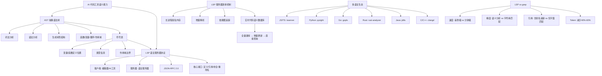

## 📋 文章信息

- **来源**: 微信公众号 - 技术文章
- **作者**: 未明确标注（发布时间 2026年5月21日）
- **发布时间**: 2026年5月21日
- **阅读链接**: https://mp.weixin.qq.com/s/PwibmnwBUOO9avblTJQOZA

---

## 🎯 核心摘要

本文系统讲解了 AST（抽象语法树）和 LSP（语言服务器协议）两个核心技术，解释了为什么 Cursor、Claude Code、OpenCode 等 AI 代码工具都依赖 LSP 来实现精准的代码语义分析。文章从基础概念出发，通过 JS 代码实战演示了"源代码→AST→符号表→LSP 请求→语义结果"的完整链路，对比了 LSP 与 grep 在找定义、查引用等场景下的碾压级差距（速度从分钟级到毫秒级、Token 消耗减少 40%-60%），并深入解析了 LSP 服务器的三大效率机制（长进程常驻内存、增量解析、依赖图追踪）。文章还覆盖了多语言支持、生态全景、Cursor/Claude Code/OpenCode 的具体配置方法，以及实用工具推荐。

## 📊 核心观点

### 1. AST：代码的"结构化骨架"，让机器从"读文本"升级到"读结构"

**背景/现状**：
- 纯文本代码对机器来说只是"一串字符"，无法理解逻辑关系
- AI 代码工具需要理解代码语义，而非简单匹配字符串

**核心论述**：
- AST 经过"词法分析→语法分析"生成，把代码拆成有逻辑关系的"零件"：函数、变量、循环、参数、返回值、嵌套关系、作用域边界
- AST 是底层数据结构，是代码静态分析的"原材料"
- 但 AST 太"原始"——需要手动遍历分析才能用，直接使用成本极高
- 例子：`function add(a, b) { return a + b; }` 会生成包含 FunctionDeclaration、Identifier、BinaryExpression 等节点的树形结构

### 2. LSP：代码语义的"标准化接口"，AST 的上层封装

**背景/现状**：
- 微软 2016 年随 VS Code 推出 LSP，作为开放标准解决"N 个编辑器 × M 种语言"的重复开发痛点
- 基于 JSON-RPC 2.0 协议，定义了 textDocument/definition、textDocument/references 等核心接口

**核心论述**：
- LSP 是"客户端-服务器"通信协议：客户端是编辑器/AI工具，服务器是语言服务器（tsserver、pyright 等）
- 精准类比：AST 是"食材"，语言服务器是"厨师"（把食材做成菜），LSP 是"菜单"（标准化的点菜方式）
- AI 工具不用自己解析 AST、遍历树，直接发 LSP 请求就能拿到精准的语义结果
- 核心接口：找定义（textDocument/definition）、查引用（textDocument/references）、代码补全、重命名、语法报错

### 3. AST 与 LSP 的层级关系：地基与高速路

**背景/现状**：
- 两者关系容易被混淆，需要清晰界定

**核心论述**：
- **AST 是底层依赖，LSP 是上层封装**，一句话讲透
- 三个关键步骤：
  1. 语言服务器先解析 AST，基于 AST 构建符号表（记录变量/函数的定义位置、类型、作用域）
  2. LSP 把"找定义、查引用"等操作包装成标准化接口
  3. AI 工具直接调用 LSP，不碰底层 AST
- 关键区别：AST 是数据结构（原材料），LSP 是通信协议（成品服务）；AST 难用（手动遍历），LSP 易用（直接调用接口）

### 4. LSP vs grep：碾压级差距来自语义理解

**背景/现状**：
- 早期工具依赖 grep 做文本搜索，误报多、漏报多、速度慢

**核心论述**：
- **速度**：grep 千文件分钟级 vs LSP 毫秒级（内存查表，O(1) 时间复杂度）
- **精度**：grep 只做字符串匹配（误报注释/变量名），LSP 基于 AST + 符号表精准定位
- **引用追踪**：grep 找不到间接调用和别名导入（`export const calcAdd = add; import { calcAdd as sum }`），LSP 能识别别名关系
- **Token 消耗**：LSP 减少 40%-60%（不读大量无关文件）

### 5. LSP 服务器快的秘密：三大效率机制

**背景/现状**：
- 每次请求都解析 AST？不——LSP 服务器是"实时更新的代码语义数据库"

**核心论述**：
- **长进程 + 常驻内存**：服务器启动后一直运行，AST 和符号表永远在内存中，请求只做查表
- **增量解析**：代码修改时只重新解析修改的文件，而非全项目
- **依赖图追踪**：建立文件间依赖关系（import/require），B 修改时只更新 A 中受影响的符号
- 工作流程：启动时"全量建库"→ 修改时"增量更新"→ 请求时"直接查询"

### 6. 多语言支持：一门语言一个服务器

**背景/现状**：
- 不同语言语法、类型系统、编译规则差异极大

**核心论述**：
- LSP 是"语言专属"的，每种语言有独立的 LSP 服务器
- 主流语言由官方主导：JS/TS 用 tsserver（微软）、Python 用 pyright（微软）、Go 用 gopls（Google）、Rust 用 rust-analyzer（社区）
- 多语言项目：工具自动识别文件类型，并行启动多个服务器，按项目隔离，按需启停
- 统一标准保证兼容性：无论谁实现服务器，都遵循 LSP 协议，Cursor/Claude Code/OpenCode 通用

## 🧠 概念图谱



## 🏗️ 技术架构

### 完整语义检索链路

```
源代码 → 词法分析 → 语法分析 → AST → 符号表 → LSP 服务器 → LSP 协议 → AI 工具
```

### LSP 请求-响应流程

| 步骤 | 动作 | 说明 |
|------|------|------|
| 1 | 源代码解析 | 语言服务器读取代码，生成 AST |
| 2 | 符号表构建 | 遍历 AST，记录定义位置、类型、作用域 |
| 3 | LSP 请求 | AI 工具发 `textDocument/definition` 请求 |
| 4 | 符号表查询 | 服务器直接查表，O(1) 返回结果 |
| 5 | 响应返回 | 精准位置（文件 + 行 + 列） |

### LSP 服务器生命周期

| 阶段 | 行为 | 性能特征 |
|------|------|----------|
| 启动 | 全量解析项目代码，构建 AST + 符号表 | 一次性成本 |
| 运行 | 常驻内存，监听文件变更 | 零成本 |
| 代码变更 | 增量解析修改文件 + 依赖图更新受影响文件 | 极低成本 |
| 请求处理 | 查符号表返回结果 | O(1) |
| 项目关闭 | 自动退出，释放资源 | — |

### 多语言 LSP 服务器生态

| 语言 | 服务器 | 实现方 | 特点 |
|------|--------|--------|------|
| JS/TS | tsserver | 微软 TypeScript 官方 | 原生支持 TS，兼容性最好 |
| Python | pyright | 微软 | 静态类型检查 + LSP 一体化 |
| Go | gopls | Google Go 官方 | 原生支持 Go 模块，性能优异 |
| Rust | rust-analyzer | Rust 社区 | 增量编译 + 精准语义分析 |
| Java | jdtls | Eclipse 基金会 | 基于 Eclipse JDT，功能全面 |
| C/C++ | clangd | LLVM 社区 | 基于 Clang，支持 C++20+ |

## 🔑 关键洞察

### 1. LSP 解决的不只是编辑器问题，更是 AI 工具的效率基础设施

**分析**：
- 文章以 AI 代码工具的视角展开，揭示了一个常被忽视的事实：LSP 最初为编辑器设计，但最大的受益者可能是 AI 工具
- grep 搜索的 Token 消耗比 LSP 高 40%-60%，在大规模代码库中这个差距是数量级的
- 这意味着：LSP 不是"锦上添花"而是"必需品"——没有 LSP 的 AI 代码工具在中大型项目上成本不可控

### 2. AST 到 LSP 的封装模式是软件工程的经典范式

**分析**：
- "原始数据结构→标准化接口"的模式在软件工程中反复出现：汇编→高级语言、TCP→HTTP、原始 AST→LSP
- LSP 之于 AST，就像 HTTP 之于 TCP：你不关心底层如何传输，按标准接口调用即可
- 这个模式的启示：当你发现一个底层数据结构很有用但太原始时，正确的做法不是直接暴露它，而是在上面建一层标准化抽象

### 3. "实时代码语义数据库"是理解 LSP 服务器效率的最佳心智模型

**分析**：
- 文章将 LSP 服务器类比为数据库（全量建库→增量更新→直接查询），这个类比比传统的"客户端-服务器"更能解释为什么它快
- 与传统数据库不同的是，LSP 的"数据"是代码语义，"索引"是符号表，"查询语言"是 LSP 协议
- 这个心智模型可以帮助理解为什么 LSP 服务器需要常驻内存、为什么增量解析如此重要

### 4. 多语言支持的设计哲学：标准统一、实现分散

**分析**：
- LSP 生态的核心设计决策：微软定标准，各语言官方/社区做实现
- 这个模式解决了"N×M"问题（N 个编辑器 × M 种语言），用 O(N+M) 的复杂度替代了 O(N×M)
- 类似模式在业界多次成功：USB 标准、HTTP 协议、Docker 容器运行时——标准统一保证互操作性，实现分散鼓励竞争和创新

### 5. 文章带有明显的产品推广痕迹，技术深度有限

**分析**：
- 文章大量引用 OpenCode 的配置细节，疑似 OpenCode 的产品推广文
- 技术讲解停留在概念层面，缺乏深入实现细节（如增量解析的具体算法、符号表的内存结构等）
- 对 AST 的介绍较为基础，适合入门但难以满足有经验的开发者
- 尽管如此，作为 AST 和 LSP 的入门科普文章，结构清晰、类比到位、覆盖全面

## 🚧 不足与局限

### 1. 技术深度不足
- AST 部分仅用简单 JS 函数做例子，没有涉及复杂场景（异步代码、装饰器、类型系统）
- 增量解析"只重新解析修改的文件"的说法过于简化——实际上涉及更细粒度的树diff算法

### 2. 产品推广痕迹明显
- 大篇幅引用 OpenCode 的配置方法，Claude Code 的配置描述也不够准确（如 `/plugin` 指令和 `/goto-def` 指令并非标准功能）
- 对 Cursor 的描述过于简略，未提及 VS Code 扩展体系的 LSP 集成

### 3. 缺少性能基准数据
- "Token 消耗减少 40%-60%"没有给出具体实验条件和数据来源
- grep vs LSP 的速度对比只有"分钟级 vs 毫秒级"的定性描述

### 4. 作者信息缺失
- 文章未标注作者署名，仅有发布时间

## 🔮 延伸思考

### 1. LSP 之外的代码智能方案
- Tree-sitter 作为轻量级增量解析器，正在被越来越多的编辑器和工具采用
- 相比 LSP 服务器（重、需要进程管理），Tree-sitter（轻、库级集成）可能更适合某些场景
- 两者不是竞争关系，而是互补：Tree-sitter 做语法高亮和快速解析，LSP 做深度语义分析

### 2. AI 工具对 LSP 的依赖是否会催生新的协议标准
- 当前 LSP 为人类编辑器设计，AI 工具可能需要不同的接口（如批量查询、上下文相关的语义查询）
- 是否会出现 "LSP for AI" 的扩展协议或全新标准？

### 3. AST 在 AI 训练中的应用
- AST 不仅用于代码工具，也被用于代码理解和生成模型的训练
- 将 AST 结构作为模型输入的辅助特征，能显著提升代码生成和补全的质量

## 💡 实践启示

### 1. 如果你在开发 AI 代码工具

**要点**：
- 一定要集成 LSP 支持，不要用 grep 替代语义搜索
- 利用 LSP 减少 Token 消耗：精准查定义/引用比读整个文件省得多
- 利用增量更新机制：只让 AI 看变更相关的代码上下文，而非整个项目

### 2. 如果你在使用 AI 代码工具

**要点**：
- 确保项目正确配置了对应的语言服务器
- 大型项目中启用 LSP 可以显著提升 AI 工具的代码理解和修改准确率
- 学会使用 AST Explorer (https://astexplorer.net/) 调试语法分析问题

### 3. 如果你在学习编译原理

**要点**：
- AST 是编译器的核心数据结构，理解 AST 是理解编译的第一步
- LSP 是 AST 在工程实践中的成功应用案例，可以作为编译原理课程的实际项目参考

## 📝 关键金句

> "AST 是'食材'，语言服务器是'厨师'，LSP 是'菜单'——你不用管厨师怎么处理食材，按菜单点就能吃到菜。"

> "LSP 服务器本质是一个'实时更新的代码语义数据库'——启动时'全量建库'，修改时'增量更新'，请求时'直接查询'。"

> "AST 负责'拆解代码'，LSP 负责'精准回答'——AI 工具不用碰底层的 AST，只通过 LSP 就能拿到'懂语义'的结果。"

## 🏷️ 标签

AST、LSP、AI代码工具、Cursor、Claude Code、代码分析、编译原理、语义检索、编程工具

---

## 🔗 相关资源

- **AST Explorer**: https://astexplorer.net/
- **LSP 官方仓库**: https://github.com/microsoft/language-server-protocol
- **OpenCode LSP 文档**: https://opencode.ai/docs/zh-cn/lsp/
