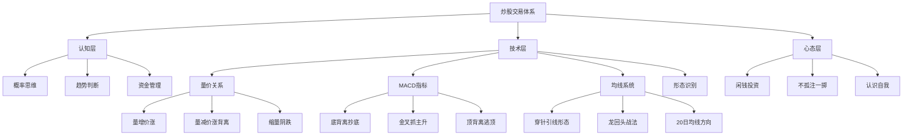

## 📋 文章信息

- **来源**: 知乎 - 问答
- **作者**: 斗战胜佛
- **发布时间**: 2026年4月17日
- **阅读链接**: https://www.zhihu.com/question/6017079690/answer/2028479160402681920

---

## 🎯 核心摘要

本文是一位自称17年股海经历的投资者"斗战胜佛"在知乎的回答，自称从30万本金赚到5100万，以炒股养家。文章核心围绕三个层面展开：第一，为什么高手不愿意带新人——本质上是因为教学太耗精力，且多数人缺乏学习的主动性；第二，炒股的9条铁律，涵盖概率思维、趋势判断、资金管理等基本面认知；第三，具体的技术战法，包括量价关系六法则、MACD三板斧（抄底/抓主升/逃顶）、穿针引线选股法等实战技巧。文章语言通俗，案例丰富，但需注意其中包含大量主观经验和未经验证的投资结论。

## 📊 核心观点

### 1. 为什么高手不愿带人

**背景/现状**：
- 知乎高赞回答（1251赞同），引发广泛讨论
- 许多散户渴望得到"高手"指导

**核心论述**：
- 带人需要极大精力投入，高手自身还有实盘交易要做
- 真正的"带"不是推荐股票，而是传授方法论，但多数人只想得到代码
- 学习态度决定一切——爱学习的人刚接触就能感觉得到，不爱学习的人无法被改变
- 作者的观点是"看缘分"，遇到愿意学习的人才会多交流几句

### 2. 炒股的9条铁律

**背景/现状**：
- 散户普遍缺乏系统化的交易框架
- 多数亏损源于认知缺失而非技术不足

**核心论述**：
- **概率思维**：炒股本质是概率游戏，专攻一点建立自己的盈利模式，比什么都学更有效
- **顺势而为**：所有亏损的根源可归结为"逆势而为"，通过均线系统判断趋势方向
- **不纠结投资vs投机**：投资是长期投机，投机是短期投资，关键是每次进场前弄清楚自己在做什么
- **不满仓单只**：永远不要孤注一掷，认知总有局限，未来充满不确定性
- **做中期波段**：A股最适合中期波段，20日均线上行斜率30-45度的个股是最佳选择
- **不追龙头**：龙头股千军万马过独木桥，不如找板块跟涨强势股或等龙回头
- **不抄底**：底部是自己走出来的不是抄出来的，只做已走出底部结构的股票
- **闲钱炒股**：心态是核心竞争力，借钱炒股会扭曲决策
- **量价为核心**：所有技术指标都衍生自量价，量价是先行指标

### 3. 量价关系六法则

**背景/现状**：
- 量价关系是技术分析的基础，但多数散户只知道"放量涨、缩量跌"

**核心论述**：
| 形态 | 含义 | 操作建议 |
|------|------|----------|
| 量增价涨 | 量价齐升，良性上涨 | 入场或加仓 |
| 量增价平 | 高位变盘信号，低位建仓信号 | 高位出场，低位关注 |
| 量增价跌 | 放量下跌，空方强势 | 及时离场 |
| 量减价涨 | 量价背离，主力诱多 | 准备出局 |
| 量减价平 | 变盘前兆，主力出货 | 把握最后离场机会 |
| 量减价跌 | 缩量阴跌，人气涣散 | 观望，不抄底 |

### 4. MACD三板斧

**背景/现状**：
- MACD是最普及的技术指标之一，但多数人使用方式不正确
- 作者提出"前大后小，背离就搞；前大后小，背离就跑"的简化口诀

**核心论述**：
- **第一板斧——抄底术**：股价创新低 + MACD的DIF线不创新低 → 底背离确认金叉买入
- **第二板斧——抓主升**：调整不破前低 + MACD在略高于0轴位置金叉出中阳线 → 买入
- **第三板斧——逃顶术**：股价创新高 + MACD的DIF线不创新高 → 顶背离确认死叉卖出
- 关键改良：增加均线金叉条件过滤假信号，5/10/20日均线三线金叉后再介入

## 🧠 概念图谱

## 🔑 关键洞察

### 1. "做减法"才是进阶之道

**分析**：
- 作者17年经验的核心感悟是"将交易技术做减法，化繁为简"
- 新手倾向于不断学习新方法，高手则精炼少数有效方法反复执行
- 这与各领域专家的"一万小时定律"不谋而合——深度优于广度
- 一个简单但能严格执行的系统，远胜于复杂但执行不了的系统

### 2. 输赢的本质是"对错"而非盈亏

**分析**：
- 作者在文末提出深刻的哲学思考：不要纠结输赢，要专注对错
- 一笔及时止损的交易虽然"亏"了钱，但执行了正确的策略，长远来看是"赢"的
- 交易者最大的对手不是市场，而是自己的贪婪和恐惧
- "胜者"本质是"剩者"——活下来的人

### 3. 技术指标的本质认知

**分析**：
- 所有技术指标都是量价的衍生品（后行指标），量价本身才是先行指标
- 这意味着与其追求数十种指标，不如深入理解量价关系
- 每种技术都有适用场景和局限，"合则其乐融融，不合则互相伤害"

## 🚧 不足与局限

### 1. 缺乏可验证性
- 作者自称"17年30万到5100万"，但无法独立验证
- 知乎上类似"股神"回答泛滥，多数为引流手段，需保持警惕

### 2. 幸存者偏差严重
- 文章呈现的是成功后的经验总结，忽略了大量使用同样方法仍然亏损的案例
- "9条铁律"更像是事后的归因，而非事前的预测工具

### 3. 过度简化风险
- "穿针引线""MACD三板斧"等战法听起来确定性很强，但实际市场中没有100%有效的技术形态
- 任何战法的成功都依赖仓位管理、止损执行等配套体系，单靠信号本身远远不够

### 4. 潜在的营销导向
- 文末"带人看缘分"的表述暗示可能存在付费社群或咨询服务
- 大量图片笔记（量价关系手写笔记等）是典型的知识博主引流套路

## 🔮 延伸思考

### 方向1：技术分析的适用边界
- 量价关系和MACD等技术在A股的有效性如何？需要用历史数据回测验证
- 在不同市场环境（牛市/熊市/震荡市）中，这些技术的胜率是否有显著差异？

### 方向2：交易系统的构建方法论
- 如何科学地构建和验证自己的交易系统？统计学方法（如蒙特卡洛模拟）可能是比"经验总结"更可靠的方式
- 文章提到的"4个框架"（趋势判断、进场条件、止损目标、资金管理）是合理的起点

### 方向3：投资教育的信任问题
- 如何区分真正的经验分享和营销引流？核心看是否提供了可证伪的、可回测的具体方法
- "因为淋过雨所以想撑伞"是经典的情感营销话术，需要理性审视

## 💡 实践启示

### 1. 建立概率思维框架

**要点**：
- 接受每笔交易都有亏损的可能，将注意力从"这笔能不能赚"转移到"这套方法的长期期望值是否为正"
- 用"盈亏比 × 胜率"来评估任何交易方法，而非单次盈亏结果

### 2. 从量价关系入门技术分析

**要点**：
- 如果只学一个技术分析领域，量价关系是最值得投入时间的基础
- 建议用回测工具（如通达信、Python）对六种量价形态在历史数据上的表现进行统计验证

### 3. 交易系统简化原则

**要点**：
- 好的交易系统特征：规则明确、易于执行、长期期望值为正
- 与其学10种战法每种都浅尝辄止，不如深入掌握1-2种并严格执行
- 记录每笔交易的逻辑和结果，定期复盘，持续优化

### 4. 保持理性怀疑

**要点**：
- 面对任何"股神"分享，首先要求可验证的证据（交易记录、回测报告）
- 任何声称"从未失手"的方法都不可信，市场的本质是不确定性

## 📝 关键金句

> "与其纠结于本身就没有标准的输和赢，不如专注于对和错，你可以看淡或者有不同理解输和赢，但是你骗不了自己什么是对和错。"

> "投资成功的核心不是去抓更多的机会，而是耐心等待，把某一个机会用好，把一个品种做精，当机会来临，用极大的意志力把交易机会用到极致。"

> "没有谁可以战胜市场，所谓胜者不过是在大浪淘沙过后懂得了该什么收敛个性顺应市场，学会了怎么生存的人。"

> "炒股就是炒心态。心态不好，无论用哪种方式都是亏钱，心态好了，吃不到肉也能喝到汤。"

## 🏷️ 标签

炒股、量价关系、MACD、交易系统、投资心态、技术分析、A股

---

## 🔗 相关资源

- **拓展阅读**：《股票大作手回忆录》—— 关于交易心理和"剩者"哲学的经典著作
- **拓展阅读**：《通向财务自由之路》—— 系统化构建交易体系的经典方法论
- **拓展阅读**：量价分析的经典理论——威科夫量价关系、建仓出货模型
