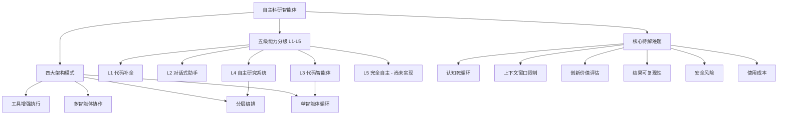

## 📋 文章信息

- **来源**: 微信公众号 - 智东西
- **作者**: 程茜
- **发布时间**: 2026年5月27日
- **阅读链接**: https://mp.weixin.qq.com/s/I2BYFoJi6VpnyuEjTi0s7w

---

## 🎯 核心摘要

DeepSeek资深研究员陈德里（Deli Chen）联合DeepSeek-V4-Pro和GPT-Image2，通过其搭建的DeliAutoResearch系统，自主产出了一篇45页的AI科研综述论文。论文99%内容由CodeAgent撰写，初稿仅耗时76分钟，6天迭代6次后完成全文。论文提出了一套自主研究智能体的五级能力分级体系（L1-L5），梳理了四大主流架构模式，并基于六维特征矩阵分析了17款主流系统，最终得出"当前前沿系统普遍处于L4，L5仍是目标构想阶段"的核心结论。

## 📊 核心观点

### 1. AI已能自主完成科研论文撰写

**背景/现状**：
- 传统科研论文从构思到成稿通常需要一个月以上
- AI辅助科研工具（Copilot级别）已广泛应用，但仅限于辅助角色

**核心论述**：
- 陈德里仅投入不到2小时的"CPU运转时长"，AI完成了99%的撰写工作
- 系统累计运行约108轮，消耗Token约64.8万，生成LaTeX代码2234行
- 最终产出45页论文，包含7个图表、4个表格，文件大小538KB
- 证明了AI从"工具"进化为"科研同事"的可行性

### 2. 五级自主能力分级体系（L1-L5）

**背景/现状**：
- 缺乏统一的智能体能力评估标准
- 各类系统命名混乱，难以横向比较

**核心论述**：
- **L1 - 代码补全**：GitHub Copilot为代表，单token/单行文本预测，人类完全主导
- **L2 - 对话式助手**：带插件的ChatGPT为代表，可拆解任务但每步需人工审批
- **L3 - 代码智能体**：可自主执行10-100个连续动作，仅在检查点请求人工审核
- **L4 - 自主研究系统**：AI Scientist、Devin为代表，可自主运行数小时至数天，独立产出完整研究
- **L5 - 完全自主**：自主选择研究问题、分配资源、基于过往成果持续迭代，目前尚无系统达到

### 3. 四大主流架构模式适配不同层级

**背景/现状**：
- 智能体架构百花齐放，缺乏系统化梳理
- 架构选择直接影响系统可扩展性和稳定性

**核心论述**：
- **单智能体循环（ReAct/Reflexion）**：最简单的基础架构，是L3-L4系统的核心骨架
- **多智能体协作（MetaGPT/AutoGen）**：通过专业化分工和智能体间通信完成复杂任务
- **分层编排（Supervisor-Worker）**：高层监督者拆解任务、分配子任务、监控进度，适合L4级系统
- **工具增强执行（CodeAct）**：将语言模型从文本生成器转变为工作流参与者，能力上限最高

### 4. 三大关键发现：专用优于通用，代码智能体最成熟

**背景/现状**：
- 行业对通用AI智能体寄予厚望
- 开源与闭源系统的能力差距一直存在争议

**核心论述**：
- **领域专用 > 通用**：SWE-Agent、Coscientist等通过收缩应用范围实现稳定输出，AutoGPT等通用智能体始终无法稳定运行
- **代码智能体最成熟**：受益于自动化评测体系、成熟工具环境和大规模基准测试
- **开闭源差距收窄**：OpenHands性能已接近Devin等闭源系统

## 🧠 概念图谱

## 🏗️ 技术架构（技术类文章适用）

### 架构概述

DeliAutoResearch是一个多AI协作的科研智能体系统，由DeepSeek-V4-Pro负责论文核心撰写（CodeAgent），GPT-Image2负责图表生成，人类研究者仅负责设定研究目标和最终审核。

### 核心组件

| 组件 | 职责 | 关键技术 |
|------|------|----------|
| DeliAutoResearch | 统一科研自动化框架 | 多Agent协作编排 |
| CodeAgent (DeepSeek-V4-Pro) | 论文撰写、文献综述、逻辑组织 | LLM长文本生成 |
| GPT-Image2 | 图表和可视化内容生成 | 多模态模型 |
| 迭代优化循环 | 6次迭代优化论文质量 | 反馈驱动的改进机制 |

## 🔑 关键洞察

### 1. L5的实现瓶颈不在模型能力而在系统设计

**分析**：
- 论文指出L5的核心瓶颈是长效知识沉淀、可靠的自我评估能力、以及具备理论支撑的智能体架构规模化方案
- 这意味着单纯提升模型参数量和训练数据无法直接达到L5
- 需要在智能体架构层面实现突破，如自重组的图结构架构、持久的记忆系统、以及科学合理的自我评估指标

### 2. "双AI协作"模式揭示了分工的价值

**分析**：
- DeepSeek-V4-Pro负责文字、GPT-Image2负责图表，各取所长
- 这种分工模式比单一模型试图"全包"更高效
- 未来AI系统的发展趋势很可能是多个专业化Agent协同工作，而非一个万能Agent

### 3. 科研智能体最关键的差距在"原创性评判"

**分析**：
- 智能体可以高效地整合、重述、结构化现有知识（论文99%内容是AI写的）
- 但缺乏可靠的自动化指标来衡量科研成果的质量与原创性
- 这是AI从"综述者"走向"发现者"的关键门槛

## 🚧 不足与局限

### 1. 论文类型局限
- 本次实验产出的是综述论文，而非原创性研究论文
- 综述的核心工作（文献整理、归纳总结）恰好是LLM最擅长的任务
- 对于需要新实验、新数据的原创研究，AI的自主能力仍有很大差距

### 2. 陈德里的"光环效应"
- 作者本身就是DeepSeek的核心开发者，对系统有深度理解和精细调试能力
- 这种实验的可复现性对普通研究者存疑

### 3. 99%的"AI执笔"需要谨慎解读
- 99%指的是文字撰写，而非整个科研过程
- 研究框架设计、验证标准、迭代方向的判断仍然由人类主导

## 🔮 延伸思考

### 方向1：科研智能体的"判断力"问题
- 当前AI智能体最大的短板不是执行能力，而是判断力——何时坚持、何时转向、何时放弃
- "认知死循环"问题本质上是缺乏元认知能力
- 未来可能需要引入独立的"评判者Agent"来打破死循环

### 方向2：从L4到L5的路径
- L4在限定领域内可自主执行，L5需要跨领域自主规划
- Voyager（自主生成递增任务学习课程）和FunSearch（基于过往成功迭代发现新数学构造）已展现L5的部分特征
- 突破可能来自：更好的记忆系统、更科学的自我评估框架、以及跨任务的迁移学习能力

## 💡 实践启示

### 1. 对于AI从业者：聚焦领域专用智能体

**要点**：
- 论文明确指出领域专用智能体全面超越通用智能体
- 在构建AI应用时，优先考虑深耕特定领域，而非追求万能系统
- 代码智能体赛道最成熟，可以作为Agent开发的切入点

### 2. 对于科研工作者：善用AI做"苦力活"

**要点**：
- 综述论文的文献整理、归纳总结等工作已可高度自动化
- 可以将AI视为"科研同事"，分配标准化的研究任务
- 但核心的创新方向选择和结果评判仍需人类把关

### 3. 对于技术选型：关注开源Agent框架的演进

**要点**：
- 开闭源差距正在收窄，开源系统OpenHands已接近Devin水平
- 分层编排架构（Supervisor-Worker）是L4级系统的主流选择
- 长流程执行能力是关键差异点——不只是单次任务完成率

## 📝 关键金句

> "论文共迭代6次，耗时6天搞定，而初稿仅用了76分钟。期间智能体累计运行约108轮、消耗Token约64.8万、LaTeX代码共2234行。"

> "同样的工作以前至少需要一个月才能完成，而这次他本人的'CPU运转时长'不到2小时。"

> "实现L5级自主能力的核心瓶颈并非模型基础性能，而是在于长效知识沉淀、可靠的自我评估能力，以及具备理论支撑的智能体架构规模化方案三大难点。"

## 🏷️ 标签

AI、Agent、自主科研、智能体、DeepSeek、LLM、论文写作、多Agent协作、能力分级

---

## 🔗 相关资源

- **拓展阅读**：自主科研智能体（Autonomous Research Agents）领域，AI Scientist、Devin、SWE-Agent、MetaGPT、AutoGen等系统
- **论文链接**：https://victorchen96.github.io/auto_research_survey.pdf
