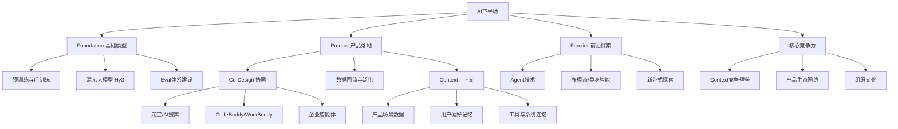

## 📋 文章信息

- **来源**: 微信公众号 - 腾讯研究院
- **作者**: 腾讯研究院（现场实录）
- **发布时间**: 2025年（2026腾讯云AI产业应用大会）
- **阅读链接**: https://mp.weixin.qq.com/s/QFwQz-Kqh9t_zssBU_a6Mg

---

## 🎯 核心摘要

这是一场腾讯集团高级执行副总裁汤道生与腾讯AI首席科学家姚顺雨在2026腾讯云AI产业应用大会上的深度对谈。姚顺雨认为AI下半场的关键已从"发明方法"转向"寻找好问题"，腾讯丰富的产品场景和上下文数据构成了核心竞争力。双方围绕模型与产品的Co-Design协同、Agent技术演进方向、Token效率优化、以及AI原生产品的组织形态变革等话题展开讨论，最终由汤道生发布效率智能体工具集及AI共创营二期计划。

## 📊 核心观点

### 1. AI下半场：从万能锤子到寻找好问题

**背景/现状**：
- 预训练和后训练让模型成为"万能锤子"，可以解决各种问题
- 方法学已经成熟，反而寻找好问题变得更困难
- 过去做AI是为特定任务造专用模型，现在通用模型反而需要找到正确应用场景

**核心论述**：
- AI下半场的核心是**Context（上下文）**：模型越来越擅长把复杂输入变成输出，竞争壁垒在于你有没有最原始的输入——知道用户在干什么、企业的各种信息
- 腾讯的核心优势在于**丰富的产品场景、交互数据和生态连接**，能提供高质量上下文
- 姚顺雨选择腾讯的三大原因：好问题（产品场景）、好的环境（Context）、**最关键的是文化**——坦诚、基于信任而非指标运转、low ego、长期主义
- AI下半场最重要的目标是构建一个**均衡的三角形组织**：Foundation（基础模型）、Product（产品落地）、Frontier（前沿探索）

### 2. Co-Design：模型与产品的深度协同

**背景/现状**：
- 腾讯有丰富的AI产品矩阵：元宝（聊天机器人）、AI搜索、智能客服、智能营销、CodeBuddy、WorkBuddy等
- 不同产品对模型能力的需求差异大，需要紧密协同

**核心论述**：
- Co-Design的三个层次：
  1. **Foundation先行**：预训练做好可以泛化到所有下游任务，后训练需要设立正确的Eval（评估），反对单纯刷榜
  2. **建立互信**：模型团队与产品团队需要换位思考，理解彼此目标的align与不align之处
  3. **数据泛化网络**：LLM时代与过去AI的本质区别是**泛化性**——做好Coding Agent需要的不只是代码数据，还需要聊天、搜索、推理等复合数据taxonomy，产品体系化形成数据网络优势
- 汤道生的核心观点：Co-Design最难的是**对齐**——数据标注颗粒度、奖励与惩罚机制、评测标准需要在项目组内达成一致，否则产品行为不可预测
- 关键案例：模型团队派后训练最强骨干支援元宝，即使预训练尚未就绪，这种"为产品着想"的信任建立为后续Hy3 preview在元宝成功上线奠定基础

### 3. Agent演进：从ReAct到产业落地

**背景/现状**：
- 姚顺雨是ReAct架构提出者（2019年博士论文开始研究语言智能体）
- 2022年7月首次将LLM与互联网连接做多轮交互，预感到Agent将改变世界
- Agent技术最重要的两个方向：Web Agent和Coding Agent

**核心论述**：
- Agent和Coding Agent是**不得不做的基础能力**，像图灵完备一样，能控制file system和container后就是一个完整的系统
- 腾讯做Agent的三个差异化策略：
  1. **体系全面化**：不只关注Coding，强调复合数据taxonomy（聊天、推理等泛化能力）
  2. **产品数据回流**：利用线上反馈优化模型，Co-Design经验变得关键
  3. **探索性工作**：保持对技术演进、产品演进、新范式的不确定性探索
- Token效率优化的核心观点：**Performance first**——用更强的模型反而更省钱（更快做对、省人力），其次是robustness（一次把简单任务做对），最后才是模型架构和成本优化

### 4. AI原生产品的组织变革

**背景/现状**：
- AI时代产品范式发生根本变化：从"预制菜"式功能菜单到开放式自然语言交互
- 工程师角色从写代码转向设计架构、指导AI生成代码
- WorkBuddy等产品口碑不错，背后是组织形态的创新

**核心论述**：
- 产品范式的变化：
  - 过去：想清楚功能，用户通过菜单选择（"预制菜"模式）
  - AI时代：开放式交互，产品方不知道用户会问什么，需要模型理解需求 + 工具调用 + 上下文记忆
- AI原生组织的关键变化：
  1. **扁平化小团队**：3-5人围绕特定领域攻坚，大量试验、包容试错
  2. **角色融合**：工程师更像"有想法的leader"，驱动多个Coding Agent
  3. **测试前置**：评测、对齐工作左移，在设计阶段就要想清楚Eval和alignment

## 🧠 概念图谱

## 🔑 关键洞察

### 1. Context成为AI时代的竞争壁垒

**分析**：
- 姚顺雨明确提出"Context is King"——模型能力越来越同质化，真正的竞争壁垒在于你拥有什么样的原始输入数据
- 腾讯多年积累的社交、内容、办公、游戏等产品场景数据，构成了不可复制的Context优势
- 这也是为什么姚顺雨认为"AI下半场可能不是完了，而是刚刚开始"——有了更好的模型工具，谁拥有更多独特场景和数据，谁就能创造更大价值
- 这个洞察对企业AI应用的启示：与其追逐模型能力，不如深耕自己的业务场景和上下文数据

### 2. Co-Design的本质是信任与对齐

**分析**：
- 技术层面（数据标注、Eval设计、架构优化）只是Co-Design的表象
- 更深层的是**建立组织信任**：模型团队愿意为产品牺牲短期利益（派最强骨干支援元宝），产品团队愿意分享数据和真实反馈
- 对齐的核心挑战：在开放式、非确定性的AI产品中，如何让不同角色对"什么是好的"达成一致
- 这对其他企业的启示：AI落地的瓶颈往往不是技术，而是组织协同和信任建设

### 3. 小团队+AI工具的AI原生组织形态

**分析**：
- WorkBuddy的3-5人扁平小团队能快速迭代，是AI时代组织的新范式
- 工程师角色从"执行者"变为"指挥官"——设计架构、驱动多个Coding Agent
- 大量试验和包容试错成为必须，因为AI产品的不确定性远高于传统产品
- 这预示着未来组织的趋势：更少的人力、更高的AI杠杆、更强的小团队作战能力

## 🚧 不足与局限

### 1. 对技术细节披露有限
- 关于混元Hy3的具体架构、训练数据规模、性能指标等技术细节基本没有涉及
- 对Agent的Token效率优化只有方向性讨论，缺乏具体方案和数据支撑

### 2. 竞争视角缺失
- 对谈中基本没有正面回应与OpenAI、Anthropic、DeepSeek等竞争对手的差异化和比较
- "腾讯慢"的问题虽然被提及，但回应偏向"长期主义"，缺乏具体追赶策略

### 3. 产业落地案例不足
- 虽然提到了效率智能体工具集和AI共创营，但缺乏具体的企业客户成功案例和ROI数据

## 🔮 延伸思考

### 方向1：Context经济学
- 如果Context是竞争壁垒，那么"Context的市场价值"如何定价？企业是否会因为共享Context而获得更好的AI效果，还是会因为丧失壁垒而受损？
- 这可能催生一种新的商业模式：Context交易平台或数据联盟

### 方向2：Co-Design的组织能力
- 随着AI模型能力越来越强，产品团队需要的"模型知识"和模型团队需要的"产品sense"之间的差距会缩小还是扩大？
- 未来可能出现一种新角色：既懂模型又懂产品的"AI产品架构师"

### 方向3：Agent的终局形态
- 当Agent能力足够强时，是否还需要"产品"这个中间层？模型直接与用户交互可能成为常态
- 腾讯提出的"场景连接+工程驾驭+模型驱动"三件套，可能只是过渡形态

## 💡 实践启示

### 1. 企业AI落地的正确姿势

**要点**：
- 不要追求模型能力，先深耕自己的场景Context——问自己：我有什么独特的数据和场景是别人没有的？
- 建立模型团队与业务团队的深度协作机制，核心是信任而非流程
- 用真实产品数据做Eval，而非追求公开榜单排名
- 容忍小团队试错，AI产品的形态需要通过大量试验才能找到

### 2. AI产品经理的新能力模型

**要点**：
- 从"设计功能"转向"设计交互边界"——定义模型能做什么、不能做什么
- 重视评测和对齐的设计能力，这是AI产品质量的核心保障
- 理解模型的基本原理和数据需求，才能与模型团队有效Co-Design

### 3. Token成本管理的务实策略

**要点**：
- Performance first：用更强的模型可能反而更省钱
- 重点提升robustness：一次做对比反复试错更省Token
- 小模型+高ROI任务优于大模型+泛泛应用

## 📝 关键金句

> "AI下半场，寻找好问题比发明好方法更困难。"

> "模型越来越擅长把复杂输入变成输出，你的竞争壁垒在于有没有最原始的输入。"

> "用OPUS这样的模型比用更差的模型更省钱，因为更快把事情做对了，也省得人的精力。"

> "我们是一个基于trust，而不是基于metric去运转的公司。"

> "AI是一个长期游戏，下半场才刚刚开始。"

## 🏷️ 标签

AI、LLM、Agent、腾讯、Co-Design、混元大模型、智能体、产业AI、Context

---

## 🔗 相关资源

- **拓展阅读**：腾讯混元大模型系列、ReAct论文（Yao et al., 2022）、SWE-bench代码Agent评测基准
- **相关产品**：腾讯元宝、WorkBuddy、CodeBuddy
