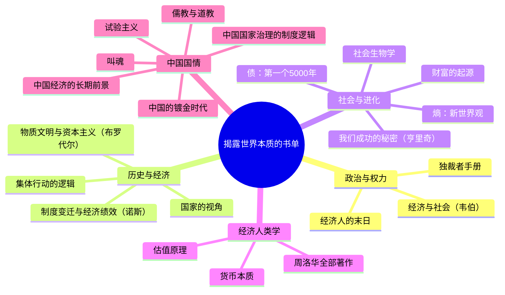

## 📋 文章信息

- **来源**：知乎问答
- **作者**：林先生
- **原文链接**：[各位大佬能否推荐几本揭露世界本质的书？](https://www.zhihu.com/question/519021060/answer/1962630383230230816)
- **收藏日期**：2026年6月22日

---

## 🎯 内容摘要

作者从社科视角出发，推荐了18本帮助理解世界本质的经典著作，涵盖政治权力运作、经济制度逻辑、社会行为演化、历史深层动力以及中国国情分析五大板块，从布罗代尔的长时段史观到韦伯的制度分析，构成一套理解人类社会的知识框架。

---

## 🗺️ 思维导图

---

## 📄 原文内容

题主问这个问题，大概是想要问人类的政治，经济，历史的本质，而不是宇宙本质。因为如果推荐给你量子力学，相对论，估计你也没有兴趣。

那么这些著作，大概植根于社科类著作。请注意不是人文类著作，人文著作主要是文学与哲学，这些东西理想主义比较浓厚。

下面是可以推荐的著作

**1、《独裁者手册》**，是一本摒弃意识形态内容，阐明民主和独裁国家都要实行的权力运作模式。

**2、《15至18世纪的物质文明、经济和资本主义》**，作为年鉴学派的代表人物，布罗代尔将历史分为三个层次：底层的"长时段"（longue durée，地理、气候、心态等几乎不变的结构）、中层的"中时段"（经济周期、社会结构）和表层的"短时段"（政治、军事事件）。他认为，真正驱动历史的是底层和中层的缓慢力量，而非帝王将相的个人意志。

**3、《国家的视角》**，现代国家为了治理，有一种将复杂的、地方性的、非正式的社会现实"简单化"和"清晰化"的强烈冲动（例如标准化的地籍测量、统一的语言、永久的姓氏）。然而，这种出自良好意愿的"极端现代主义"规划，在忽视了地方性"默会知识"（Mētis）后，往往会导致灾难性的后果（如苏联的集体农庄、巴西的巴西利亚规划）。

**4、《集体行动的逻辑》**：拥有共同利益的群体会自然而然地为实现这个利益而行动。奥尔森指出，在大集团中，"搭便车"才是理性的选择。

**5、《制度、制度变迁与经济绩效》**：诺斯（诺贝尔奖得主）将"制度"定义为"游戏规则"，包括正式规则（法律、产权）和非正式约束（规范、习俗、意识形态）。他认为，一个国家长期经济发展的关键，不在于技术或资本，而在于其制度框架是否能够有效降低交易成本，并激励生产性活动而非掠夺性活动。

**6、《社会生物学》**：直接宣告了社会生物学学科的出现，其核心内容则在于，人类的一切社会行为，都在动物中存在，人类的社会行为只不过是动物行为的放大和衍生。

**7、我们成功的秘密：文化如何驱动人类进化、塑造我们的物种**：亨里奇提出，人类真正的"秘密武器"是累积性文化进化。我们擅长通过社会学习（模仿、请教）来获取并不断改进上一代积累的知识、技能和规范，而无需自己重新发明一切。这种"集体大脑"的能力，使得人类能够创造出任何个体都无法单独理解的复杂工具和制度

**8、财富的起源：经济学的演化、复杂性与彻底重塑**：它认为，经济并非一个趋向均衡的、可预测的"机器"，而是一个不断演化的、远离均衡的"生态系统"。财富的增长本质上是热力学第二定律下的一个局部熵减过程，即通过"设计"和"信息"创造出新的秩序。

**9、熵：一种新的世界观**：有点民科，把熵增定律泛化了，但是读来也有一种刷新三观之感

**10、债：第一个5000年**：货币的本质是债务。

**11、周洛华的全部著作**：《货币本质》、《市场起源》、《估值原理》、《时间游戏》、《比特本位》，利用人类学探讨人类经济。

**12、《经济人的末日》**：经济人想象是现代社会的根基，经济人的灭亡，意味着极权主义的到来。

**13、经济与社会**：韦伯的集大成之作，必读。

当然处于中国，也应该读读揭露出中国本质的著作，只不过这部分内容意识形态参杂

**1、中国国家治理的制度逻辑**：中央为了维持统一和控制，需要建立一套"一统体制"；但广袤的疆域和复杂的现实又要求地方有"自主性"以应对各种问题。这本书通过大量案例，揭示了运动式治理、官僚制度的"逆向软预算约束"等现象背后的组织逻辑

**2、儒教与道教**：韦伯在书中探讨了"为什么资本主义没有在中国内生发展出来"这一经典问题。他分析了儒家伦理、科举制度、家产官僚制和宗族结构等因素，如何共同塑造了一个极其稳定但缺乏内在突破动力的社会形态

**3、中国经济的长期前景**：佩蒂斯是常驻中国的经济学家，他的分析完全基于会计恒等式和经济学原理，剥离了所有政治色彩。他指出，中国经济增长模式的核心是，通过系统性地将收入从家庭部门（压低消费）转移到生产部门（推高投资），从而实现高速增长。这种模式在早期卓有成效，但必然会导致投资过剩、债务高企和消费不振的结构性失衡。

**4、叫魂：1768年中国妖术大恐慌**：主要是政治运动，权力的运行，运动型治理，可以与周雪光的著作来一起看。

**5、中国的镀金时代**：腐败丛生，为何能创造经济奇迹？洪源远提出了一个极具解释力的分析框架。

**6、试验主义：中国如何走向现代化**：一种自下而上的"试验主义"（Experimentalism）。中央设定模糊的大方向，允许地方进行各种"政策试验"（如深圳特区、家庭联产承包责任制），然后选择成功的模式加以推广。
